# C 基础错题

宏定义可以传递参数类型，而函数无法实现


union {

int a;

char b[10];

double c;

} U;

sizeof(U) = 16


最后一个else与最近的 没有else的if匹配


switch 语句中是否把某一个分支提炼成函数与该跟踪的语句数量/代码行数无关，如果分支过多可以改为表驱动方式


malloc后需要判断成功才能使用


```
int a=14;
int b=sizeof(a++);
printf("%d,%d\n",a,b);//a还是14，因为sizeof不对表达式a++求值
```


头文件禁止包含   本头文件不需要  但包含本头文件的.c文件需要的头文件


RISC

CISC

EPIC显式并行指令集

VLIW超长指令字指令集


《代码整洁之道》

单一职责从康威定律演化而来

建议if for do-while while等语句嵌套深度不大于3层


```
int main(void)
{
    float f = 100000000.1f;
    int i1 = (int)f;
    int i2 = (int)((f - i1) * 10);//i2=0,因为float存储很大且待小时的浮点时存在精度丢失
    printf("%d.%d\n", i1, i2);
    return 0;
}
```


在编码的过程中，有些功能的实现只要定义一个类即可。但是，也应该考虑是否可以先定义一个接口，然后定义一个类来实现这个接口。因为这个功能可能有多种实现方式。 知识来源：《重构》Ch3.1


```
以下最终X=2
int x=0; int a=1, b=3, c=5, d=4;   
if (a<b) 
    if (c < d) x = 1; 
    else if (a < c) 
            if (b < d) x = 2; 
            else x = 3; 
         else x = 6; 
else x = 7;


if (a<b) 
    if (c < d) 
        x = 1; 
    else if (a < c) 
            if (b < d) 
                x = 2; 
            else 
                x = 3; 
         else 
            x = 6; 
else 
	x = 7;
```


由内层if(最下面的if)往开始往外层if(最上面的if)解析，if匹配(消耗掉)最近的else

 

算法一般由顺序、选择、循环三种控制结构组合而成，递归不是级别控制结构语言


使用strncpy拷贝字符串时也要娱乐空间存储\0


串中任意个连续字符组成的子序列叫做子串


关于Gratuitous ARP（Gratuitous “免费/无意义/无缘无故/诱导物/满足愉悦的说法，正确的是
免费ARP指的是一种自己请求自己的ARP请求报文，即报文的源IP地址和目的IP地址都是当前主机的。
免费ARP的作用用于主动通知当前局域网内的其他主机自己的MAC信息。
在启用免费ARP的时候，当网口的MAC地址变化、网口变为启用状态等都会触发免费ARP报文的发送。
免费ARP的发送可以通过/proc/sys/net/ipv4/conf/{dev}/arp_notify启用和禁用
免费ARP的主要作用为用于刷新当前局域网中的ARP信息，比如当前网口的MAC地址发生了变化，那么其他主机是感知不到的，直到ARP老化后才能获取到正确的MAC信息，这期间将会影响正常的网络通信。通过免费ARP可以避免这一问题，MAC地址或者网口状态发生变化后都会发送免费ARP广播，刷新当前局域网中的ARP缓存。 以上选项中都是对的。


C99    _Bool类型  struct {int a;int b[]}


浮点数表示法


# 算法复杂度


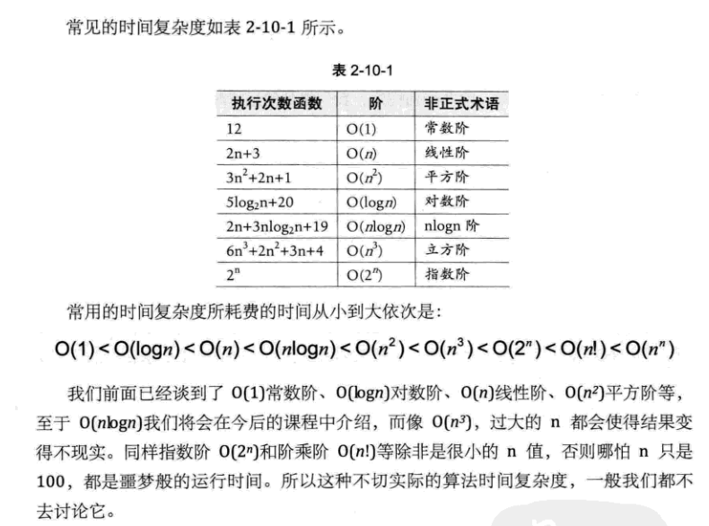


* 对数阶 O(logn)

```
int count = 1;
while(count < n) {
	count = count * 2;
}
```

count = 2            执行第一次
count = 2\*2        执行第二次
count = 2\*2\*2   执行第三次
count = ....
count = 2^x^           执行第x次

如果第x执行后大于n则终止循环

令  2^x^ = n ,有 x=log~2~n，因此时间复杂度为O(log~2~n)


* 平方阶 

  以下算法复杂度为O(n^2^ )    

```
for(int i = 0;i < n; ++i) {
	for(int j = 0;j < n; ++j) {
	
	}
}
```

​       以下算法复杂度为O(n x m )    

```
for(int i = 0;i < n; ++i) {
	for(int j = 0;j < m; ++j) {
	
	}
}
```

​      以下复杂度为O(n^2^) 

```
for(int i = 0;i < n; ++i) {
	for(int j = i;j < m; ++j) {//j = i而不是j=0
	
	}
}
```

i=0时内层循环执行0次

i=1时内层循环执行1次

...

i=n时内层循环执行n次

$$
总共执行次数 = 1+2+...+n = \frac{n(n+1)}{2} = \frac{n^2}{2} + \frac{n}{2}
$$

# 线性表

**线性表是一种有序序列**

## 线性表顺序存储结构

  实现方案：数组（连续存储空间） +   元素按顺序放入，利用空间上的顺序表示序列本身的顺序

  插入/删除元素操作的复杂度均为O(n)

  随机查找/读写/访问某个元素的复杂度为O(1)

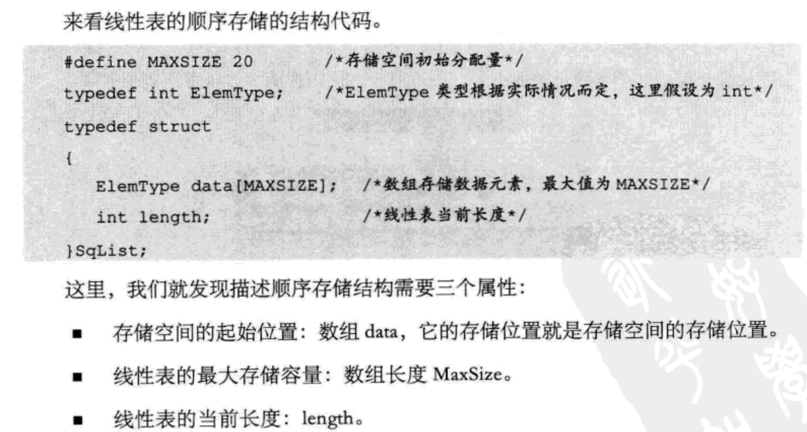


## 线性表链式存储结构

  一个链式存储结构**同时**具有如下三个属性，组合起来有2^3^ = 8种不同实现：

1. 为动态链表还是静态链表。动态链表使用malloc申请节点放在堆上（非连续存储空间），通过节点中的prior和next（二者是指针）指向前后节点。静态链表将节点放在数组里面（连续存储空间），通过节点中的prior和next（二者是指针或数组下标索引）指向前后节点。
2. 为单向链表还是双向链表。单向链表只能根据前一个节点找到后一个节点，节点中只有prior。双向链表从前往后与从后往前都行，节点中既有prior又有next。通过prior又有next表示序列本身的顺序
3. 是否为循环链表。链表头尾是否相连。

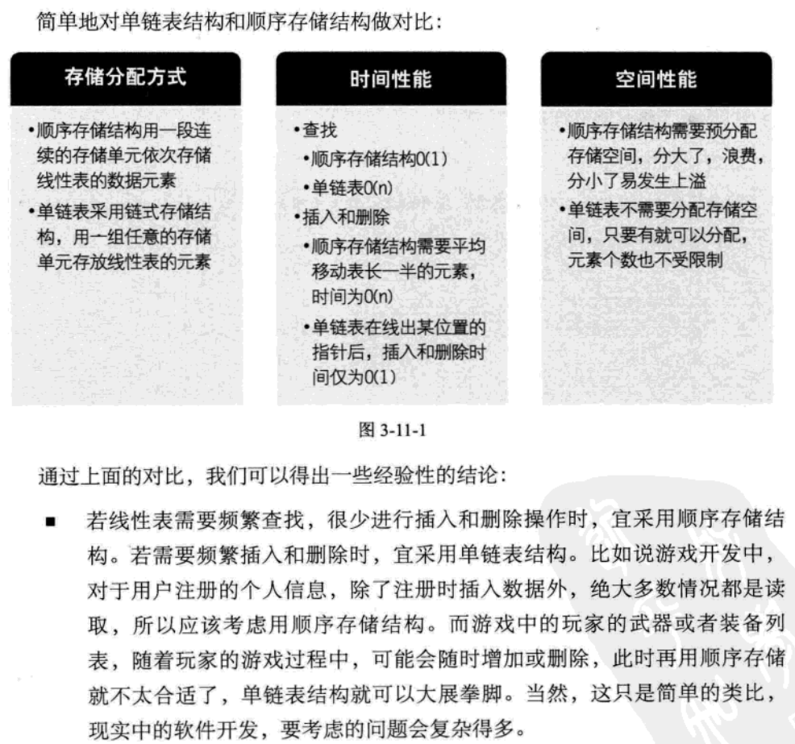


# 栈

栈是一种特殊的线性表，它只能在栈顶(线性表末尾)插入删除，是线性表意味着它的节点之间是有序的

## 栈顺序存储结构

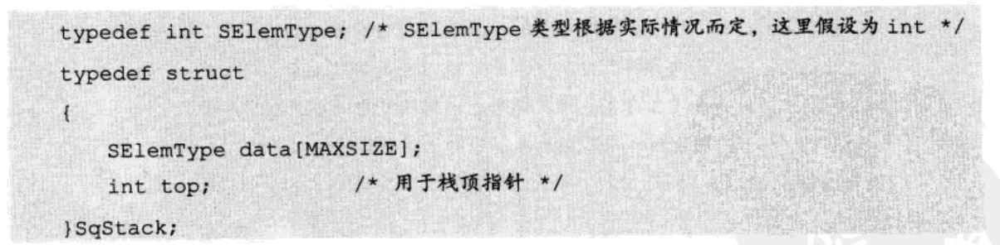

使用空间位置表示序列的顺序，data[0]为栈底，data[top]为栈顶


## 栈链式存储结构

栈的链式存储结构具有如下属性：

1. 为动态链表还是静态链表。动态链表使用malloc申请节点放在堆上（非连续存储空间），通过节点中的prior和next（二者是指针）指向前后节点。静态链表将节点放在数组里面（连续存储空间），通过节点中的prior和next（二者是指针或数组下标索引）指向前后节点。

2. 为单向链表还是双向链表。单向链表只能根据前一个节点找到后一个节点，节点中只有prior。双向链表从前往后与从后往前都行，节点中既有prior又有next。一般也只需要prior就行，没必要同时拥有prior和next。除非有通过栈中下面的节点找栈中上一个节点的需求，栈一般只需要保证能够通过栈上面的节点找到栈下面的节点就行。

   

   栈节点的链表头尾没必要相连。

   

   以下是动态单向不循环的线性表，当只从线性表末尾插入删除时它就是一个栈：

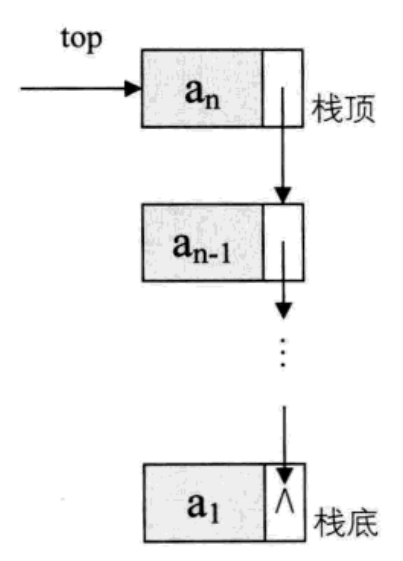


## 卡特兰数

https://zhuanlan.zhihu.com/p/97619085

条件：对于每个 -1 前面都有一个 +1 相对应(+1 的总数量 **等于** -1 的总数量)。出栈序列的 **所有前缀和** 必然大于等于 0，那么合法的序列个数为

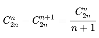

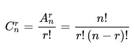

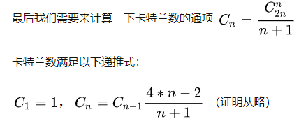

* n 个元素进栈序列为：1，2，3，4，...，n，则有多少种出栈序列。

* n 对括号，则有多少种 “括号匹配” 的括号序列

* n + 1 个叶子节点能够构成多少种形状不同的（国际）满二叉树（国际）满二叉树定义：如果一棵二叉树的结点要么是叶子结点，要么它有两个子结点，这样的树就是满二叉树。

* 电影票一张 50 coin，且售票厅没有 coin。m 个人各自持有 50 coin，n 个人各自持有 100 coin。则有多少种排队方式，可以让每个人都买到电影票。
* 8 个高矮不同的人需要排成两队，每队 4 个人。其中，每排都是从低到高排列，且第二排的第 i 个人比第一排中第 i 个人高，则有多少种排队方式。


判断有多少种

判断某个出栈序列是否为某个入栈对于的出栈序列的一种

列出所有可能的出栈序列


## 数学四则运算

  逆波兰表达式(后缀表达式)，普通数学加减乘除括号的表达式(中缀表达式)

0. 如果涉及小数点、负数、非个位数的操作数，还需要预先对输入的四则运算表达式字符串进行分片以区分数字和操作符。

1. 将中缀表达式转化成后缀表达式（栈用来进出运算的符号）

   * 遇到数字直接输出

   * 遇到左括号直接压入栈顶中不进行其他任何操作

   * 遇到+-*/ 四则运算符，需要先从栈顶往栈底开始遍历，如果栈顶是左括号或栈顶运算符优先级小于本运算符的优先级则什么都不做并停止遍历，如果栈顶运算符优先级大于等于本运算符的优先级则将栈顶运算符弹出并输出接着继续遍历。以上遍历操作做完后最终再将本运算符压入栈顶。这一步弹出栈的只能是四则运算符，没有括号。

   * 遇到右括号时把栈中运算符依次弹出，直到弹出的符号是左括号(左括号不需要输出)，右括号不需要压栈也不需要输出。

   

2. 将后缀表达式进行运算得到结果（栈用来进出运算的数字）

   * 遇到数字直接压栈
   * 遇到+-*/ 四则运算符时从栈顶弹栈2次，再拿这两次弹出的两个数字进行该运算符的运算，最后把结果压栈。


# 队列

队列是一种特殊的线性表，它只能在线性表末尾插入，线性表头部删除，是线性表意味着它的节点之间是有序的

## 队列顺序存储结构

  顺序存储结构中使用数组来实现时如果不使用循环队列那前面删除后的空间将无法使用(除非将数组单元中额外存入prior、next指针/数组下标,这中本质上是链式存储)。队列中的序列顺序涉及2方面，一方面是data[]中的位置关系，另一方面是front、rear以及是否循环

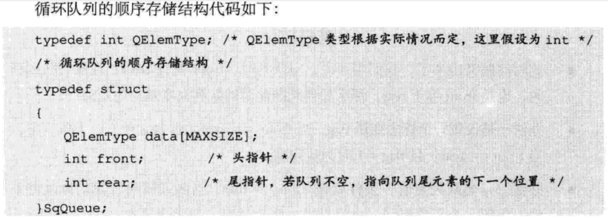


队列中已有元素个数的计算方法：

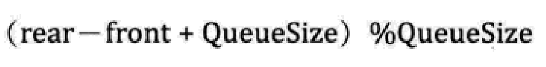

如果判断循环队列为空还是为满？


如果使用办法一，可以把flag加在SqQueue结构体中。如果使用办法二，则队列满的条件是

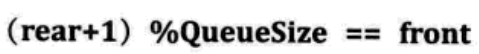


## 队列链式存储结构

  如果使用malloc分配节点则不存在队列满的情况

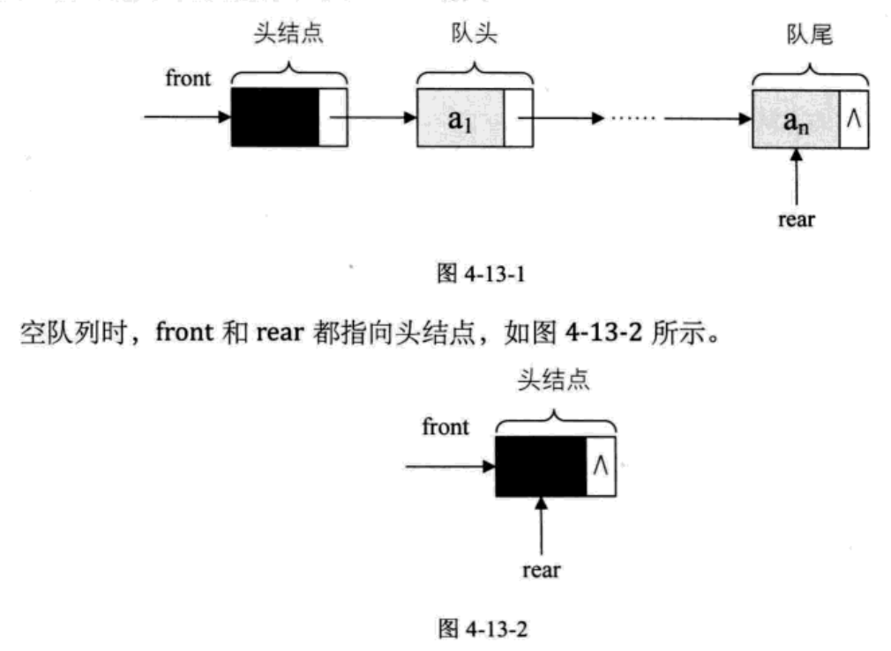


# 串


# 树

二叉树

二分查找表必须有序且只能以顺序方式存储

前序中序后序


哈希表


树遍历的本质是将非线性结构线性化

二叉树的深度优先遍历，分为如下三种：（先左后右）

1.先序遍历，访问根结点，先序遍历左子树，先序遍历右子树，上图遍历结果为：0134256

2.中序遍历，中序遍历左子树，访问根结点，中序遍历右子树，遍历结果为：3140526

3.后序遍历，后序遍历左子树，后续遍历右子树，访问根结点，遍历结果：3415620

二叉树广度优先遍历
与深度优先遍历不同的是，广度优先遍历是先搜索所有兄弟和堂兄弟结点再搜索子孙结点。而深度优先遍历则是先搜索一个结点的所有子孙结点，再去搜索这个结点的兄弟结点。广度优先遍历，不需要使用递归，借助队列来实现


# 递归


```
当n=0, 1的时候, 结果正确.
假设函数对于n-1是正确的, 函数对n结果也正确.
如果这两点是成立的，我们知道这个函数对于所有可能的n都是正确的。
```


catalan


hanoi


factorial


费波那契数列（Fibonacci sequence），又译为费波拿契数、*斐波那契数列*、费氏数列、黄金分割数列


