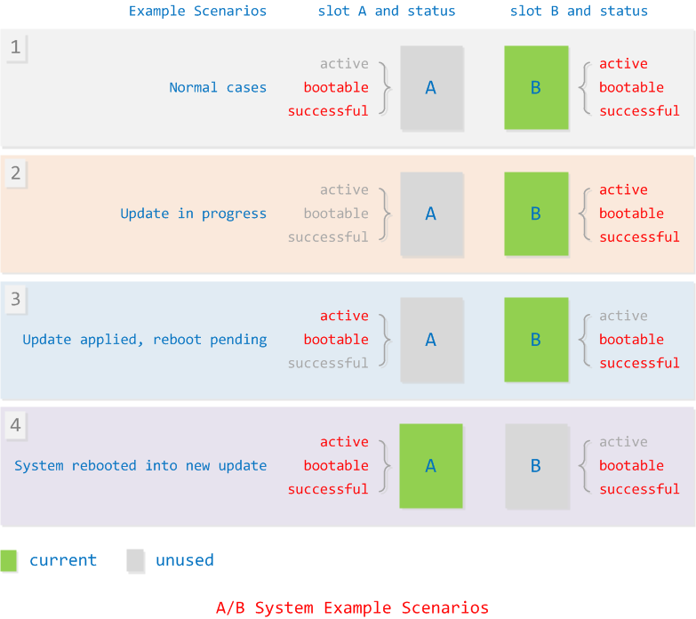

## **与传统OTA方式相比，A/B系统的变化主要有：**

\1. 系统的分区设置

传统方式只有一套分区

A/B系统有两套分区，称为slot A和slot B

\2. 跟bootloader沟通的方式

传统方式bootloader通过读取misc分区信息来决定是进入Android主系统还是Recovery系统

A/B系统的bootloader通过特定的分区信息来决定从slot A还是slot B启动

\3. 系统的编译过程

传统方式在编译时会生成boot.img和recovery.img分别用于Android主系统和Recovery系统的ramdisk

A/B系统只有boot.img，而不再生成单独的recovery.img

\4. OTA更新包的生成方式

A/B系统生成OTA包的工具和命令跟传统方式一样，但是生成内容的格式不一样了

\5. 镜像启动方式差异：

传统OTA方式下：

boot.img内有一个boot ramdisk，用于系统启动时加载system.img；

recovery.img内有一个recovery ramdisk，作为recovery系统运行的ramdisk；

system.img只包含android系统的应用程序和库文件；

A/B系统下：

system.img除了包含android系统的应用程序和库文件还，另外含有boot ramdisk，相当于传统OTA下boot.img内的ramdisk存放到system.img内了；

boot.img内包含的是recovery ramdisk，而不是boot ramdisk。Android系统启动时不再加载boot.img内的ramdisk，而是通过device mapper机制选择system.img内的ramdisk进行加载；

没有recovery.img文件

## A/B 升级包含哪些内容，存放在AB_OTA_PARTITIONS中：

Z:\mt8195\mtk8195\device\mediatek\vendor\common\BoardConfig.mk

\# A/B System updates # A/B OTA partitions

AB_OTA_PARTITIONS := \

boot \

system \

lk

Z:\mt8195\mtk8195\device\zte\xt501v2_64_bsp\ProjectConfig.mk

MTK_AB_OTA_UPDATER = yes

## A/B分区升级切换标志位：

Y:\mt8195\mtk8195\out\target\product\xt501v2_64_bsp\obj\PACKAGING\target_files_intermediates\full_xt501v2_64_bsp-target_files-mp6V135\OTA

\1. partition_table_emmc_ab.csv

logo_a,Raw data,8192,,EMMC_USER,UFS_LU2,,N,Y,logo.bin,Y,Y,Y,N,Y,N,AUTO

logo_b,Raw data,8192,,EMMC_USER,UFS_LU2,,N,N,NONE,Y,N,Y,N,Y,N,AUTO

\2. build_lk.mk

\#ifdef VENDOR_EIDT

\#//luo.wen3@zte.com.cn, add for ab OTA upgrade

\#INSTALLED_LOGO$(LK_MODE)_TARGET := $(PRODUCT_OUT)/logo$(call to-lower,$(LK_MODE)).bin

INSTALLED_LOGO$(LK_MODE)_TARGET := $(PRODUCT_OUT)/logo$(call to-lower,$(LK_MODE)).img

\#endif

IMAGE_LIST_TXT :vendor/mediatek/proprietary/custom/mt8195/security/cert_config/img_list.txt

[single_bin]

\#logo.bin=logo  

logo.img=logo  

boot.img=boot

[/mtk8195_android_R/vendor/mediatek/proprietary/external/boot_logo_updater/](http://10.234.22.197:6015/source/xref/mtk8195_android_R/vendor/mediatek/proprietary/external/boot_logo_updater/) second logo update