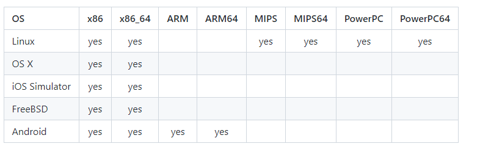
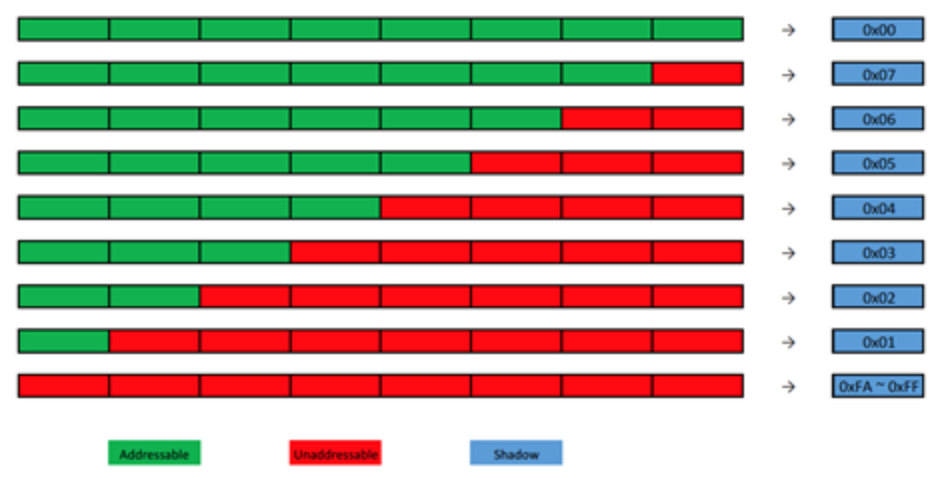
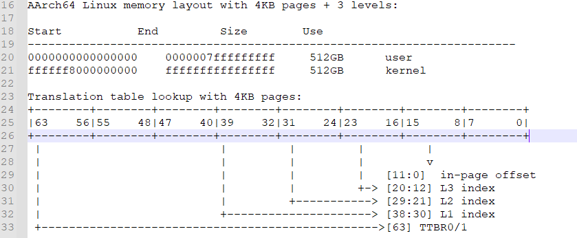

# Native 内存异常种类

\1. 申请后多次释放 (double free)

\2. 释放后重新使用 (used after free)

\3. 使用越界 (比如申请了50节内存，结果在使用时多用了8字节的内存，这样就把后面的内存的内容踩坏，引起堆结构异常)

\4. 释放时传给free()的地址不是malloc()申请的地址，比如：p = malloc(10); free(p + 5);

\5. 内存泄露：申请内存后，忘记释放或某些释放代码路径没有走到


前面4种内存异常归根到底是使用了非法地址的内存， 可以归纳为内存踩踏， 综上可以把内存异常定义为2类：

\1. 内存踩踏

\2. 内存泄漏

##  

# Native 内存踩踏


Native：SIGSEGV/sig 11

Kernel: NULL pointer/ level x translation fault /Unhandled fault at 0x

这不管是应用开发还是内核开发，没有经历过上面几种异常的折磨都不是成熟的开发； 发现如上问题通过就是内存问题，内存被踩踏， 内存在释放后被重新使用.....

## 概念

**如何定义内存踩踏？**

对**不属于你的内存进行读写或者对没有相应权限的内存地址执行操作**就是踩内存；

**如何解决？**

解决踩内存的方法就是

1. 找出哪个地方的代码踩了内存。
2. 然后检查代码逻辑修复问题。

第1点很难，通常踩内存和程序崩溃没有任何关系，这也导致了踩内存很难调试，我们必须要深入了解踩内存的原理才能更好的解决它。

从时间轴看踩内存：

S:程序/系统开始执行时间点

P: 内存开始发送异常(Poisoned)时间点

C:程序/系统crash/panic时间点

​		S					P																C

​		|					|																|

​		|					|																|

-------------------------------------------------------------------------------------------------------------------------------------------------------> t

​		|					|<------------------------------------------------>|程序/系统奔溃

​		|					|					Everything is possible     |


在发生踩内存时，不一定马上崩溃，如果是马上崩溃，那好解决，可以跳过第1步，直接进入第2步解决问题。麻烦点在于崩溃的点是之后的某个时间里，P和C没有关系。

如何从C推导出P是解决踩内存的关键，我们先要研究C当下内存踩坏的情况来判断可能的原因。


### 1. native AddressSanitizer

https://github.com/google/sanitizers/wiki/AddressSanitizer

AddressSanitizer (ASan) 是一种基于编译器的快速检测工具，用于检测原生代码中的内存错误。

ASan 可以检测以下问题：

```
堆栈和堆缓冲区上溢/下溢
释放之后的堆使用情况
超出范围的堆栈使用情况
重复释放/错误释放
```

ASan 可在 32 位和 64 位 ARM 以及 x86 和 x86-64 上运行。ASan 的 CPU 开销约为 2 倍，代码大小开销在一半到 2 倍之间，并且内存开销很大（具体取决于您的分配模式，但约为 2 倍）。AddressSanitizer z主要包含两部分：一个编译器插桩(instrumentation)模块和一个动态运行时库(malloc()/free()替代项)。从gcc 4.8开始，AddressSanitizer成为gcc编译器一部分；

目前能正常支持的平台：



**原理：**

**内存映射**：

AddressSanitizer保护的主要原理是对程序中的虚拟内存提供粗粒度的影子内存(每8个字节的内存对应一个字节的影子内存)，为了减少overhead，采用了直接内存映射策略，所采用的具体策略如下：Shadow=(Mem >> 3) + offset。每8个字节的内存对应一个字节的影子内存，影子内存中每个字节存取一个数字k,如果k=0，则表示该影子内存对应的8个字节的内存都能访问，如果0<k<7,表示前k个字节可以访问，如果k为负数，不同的数字表示不同的错误（e.g. Stack buffer overflow, Heap buffer overflow)。




具体k为负数代表含义可以在运行时库头文件中找到定义：

/[w600](http://10.234.22.197:6015/source/xref/w600/)/[src](http://10.234.22.197:6015/source/xref/w600/src/)/[mt8185_sdk](http://10.234.22.197:6015/source/xref/w600/src/mt8185_sdk/)/[external](http://10.234.22.197:6015/source/xref/w600/src/mt8185_sdk/external/)/[compiler-rt](http://10.234.22.197:6015/source/xref/w600/src/mt8185_sdk/external/compiler-rt/)/[lib](http://10.234.22.197:6015/source/xref/w600/src/mt8185_sdk/external/compiler-rt/lib/)/[asan](http://10.234.22.197:6015/source/xref/w600/src/mt8185_sdk/external/compiler-rt/lib/asan/)/[asan_internal.h](http://10.234.22.197:6015/source/xref/w600/src/mt8185_sdk/external/compiler-rt/lib/asan/asan_internal.h)

```
// These magic values are written to shadow for better error reporting.
const int kAsanHeapLeftRedzoneMagic = 0xfa;
const int kAsanHeapRightRedzoneMagic = 0xfb;
const int kAsanHeapFreeMagic = 0xfd;
const int kAsanStackLeftRedzoneMagic = 0xf1;
const int kAsanStackMidRedzoneMagic = 0xf2;
const int kAsanStackRightRedzoneMagic = 0xf3;
const int kAsanStackPartialRedzoneMagic = 0xf4;
const int kAsanStackAfterReturnMagic = 0xf5;
const int kAsanInitializationOrderMagic = 0xf6;
const int kAsanUserPoisonedMemoryMagic = 0xf7;
const int kAsanContiguousContainerOOBMagic = 0xfc;
const int kAsanStackUseAfterScopeMagic = 0xf8;
const int kAsanGlobalRedzoneMagic = 0xf9;
const int kAsanInternalHeapMagic = 0xfe;
const int kAsanArrayCookieMagic = 0xac;
const int kAsanIntraObjectRedzone = 0xbb;
const int kAsanAllocaLeftMagic = 0xca;
const int kAsanAllocaRightMagic = 0xcb;
```


**插桩：**

伪代码如下：

没开ASan:

```
*address = writesomething; // or: readsomethong = *address;
```

开了ASan 两次访问内存:

```
shadow_address = MemToShadow(address);
if (ShadowIsPoisoned(shadow_address)) {
     ReportError(address, kAccessSize, kIsWrite);
}
*address = writesomething; // or: readsomethong = *address;
```

MemToShadow：

```
shadow_address = (address>> 3) + offset;
```

### Example: stack buffer overflow

原始伪代码：

```
void foo() {
  char a[8];
  a[8] = 'x';
  ...
  return;
}
```

通过asan 映射和插桩后代码：

```
void foo() {
  char redzone1[32];  // 32-byte aligned
  char a[8];          // 32-byte aligned
  char redzone2[24];
  char redzone3[32];  // 32-byte aligned
  int  *shadow_base = MemToShadow(redzone1);
  shadow_base[0] = 0xffffffff;  // poison redzone1
  shadow_base[1] = 0xffffff00;  // poison redzone2, unpoison 'a' ， only 8 byte can acess
  shadow_base[2] = 0xffffffff;  // poison redzone3
  
  byte *shadow_address = MemToShadow(a[8]_address);   //shadow_address 为poison redzone2 第二个byte
  byte shadow_value = *shadow_address;                //*shadow_address 为ff, 不可访问
  if (shadow_value) {                                 //shadow_value 不为0 继续判断
      if (SlowPathCheck(shadow_value, a[8]_address, Access_Size)) {     //根据a[8]_address和Access_Size：1 可以推导shadow_value应该为0-7 才可以访问， 当前shadow_value 为ff
          ReportError(address, kAccessSize, kIsWrite);                  //当前shadow_value 为ff, report error;
      }
  }
  
  ...
  shadow_base[0] = shadow_base[1] = shadow_base[2] = 0; // unpoison all , 函数返回时，清理栈标记；
  return;
}
```

### xt5案例：

```
==8993==ERROR: AddressSanitizer: heap-buffer-overflow on address 0x8478de40 at pc 0xafbc2fd8 bp 0x6a1ead50 sp 0x6a1ea920


READ of size 300 at 0x8478de40 thread T142
    #0 0xafbc2fd7  (/system/lib/libclang_rt.asan-arm-android.so+0x82fd7)

    #1 0x6b0ccb4b  (/vendor/lib/libvcsp.so+0x2cbb4b)          

    #2 0x895d3de5  (/vendor/lib/liboss.so+0x6de5)             //middleware\platform\code\pub\oss\source\oss_sche.c

    #3 0x895d3a7f  (/vendor/lib/liboss.so+0x6a7f)

    #4 0x895d543b  (/vendor/lib/liboss.so+0x843b)

    #5 0x86578f7b  (/vendor/lib/libv2pthreads.so+0x3f7b)

    #6 0xb0c63c15  (/system/lib/libc.so+0x63c15)

    #7 0xb0c1e065  (/system/lib/libc.so+0x1e065)

uid=1000(system) Thread-2 identical 1 line

0x8478de40 is located 0 bytes to the right of 3520-byte region [0x8478d080,0x8478de40)

allocated by thread T138 (Thread-2) here:

    #0 0xafbf014b  (/system/lib/libclang_rt.asan-arm-android.so+0xb014b)

    #1 0x895d724f  (/vendor/lib/liboss.so+0xa24f)            //middleware\platform\code\pub\oss\source\oss_msgque.c

uid=1000(system) Thread-2 identical 1 line

Thread T142 created by T138 (Thread-2) here:

    #0 0xafbd7a7f  (/system/lib/libclang_rt.asan-arm-android.so+0x97a7f)

    #1 0x86579537  (/vendor/lib/libv2pthreads.so+0x4537)

uid=1000(system) Thread-2 identical 1 line

Thread T138 (Thread-2) created by T0 (m.zte.videoconf) here:

    #0 0xafbd7a7f  (/system/lib/libclang_rt.asan-arm-android.so+0x97a7f)

    #1 0xaadf315f  (/system/lib/libart.so+0x37415f)

    #2 0x71db3c03  (/system/framework/arm/boot.oat+0x78fc03)

uid=1000(system) Thread-2 identical 1 line

SUMMARY: AddressSanitizer: heap-buffer-overflow (/system/lib/libclang_rt.asan-arm-android.so+0x82fd7) 

Shadow bytes around the buggy address:
  0x9f9d1b70: 00 00 00 00 00 00 00 00 00 00 00 00 00 00 00 00
  0x9f9d1b80: 00 00 00 00 00 00 00 00 00 00 00 00 00 00 00 00
  0x9f9d1b90: 00 00 00 00 00 00 00 00 00 00 00 00 00 00 00 00
  0x9f9d1ba0: 00 00 00 00 00 00 00 00 00 00 00 00 00 00 00 00
  0x9f9d1bb0: 00 00 00 00 00 00 00 00 00 00 00 00 00 00 00 00
=>0x9f9d1bc0: 00 00 00 00 00 00 00 00[fa]fa fa fa fa fa fa fa
  0x9f9d1bd0: fa fa fa fa fa fa fa fa fa fa fa fa fa fa fa fa
  0x9f9d1be0: fa fa fa fa fa fa fa fa fa fa fa fa fa fa fa fa
  0x9f9d1bf0: fa fa fa fa fa fa fa fa fa fa fa fa fa fa fa fa
  0x9f9d1c00: fa fa fa fa fa fa fa fa fa fa fa fa fa fa fa fa
  0x9f9d1c10: fa fa fa fa fa fa fa fa fa fa fa fa fa fa fa fa
Shadow byte legend (one shadow byte represents 8 application bytes):
  Addressable:           00
  Partially addressable: 01 02 03 04 05 06 07 
  Heap left redzone:       fa
```


**如何使能native AddressSanitizer：**

要求：

Android版本>=JB

只能在userdebug版本打开native asan

动态链接（因为需要libclang_rt.asan-arm-android.so）

需要用clang，LOCAL_CLANG:=true

不能显式关闭sanitizer，比如：LOCAL_SANITIZE:=false


整个android 打开ASAN：

从Android N开始支持，整个Android打开asan， 需要编译2次， 第二次SANITIZE_TARGET=address 编译后，/data/asan/lib/和/data/asan/lib64为开了ASan的库，system/bin/和vendor/bin/等程序则覆盖掉第1次编译的。

```
make -j24  
make SANITIZE_TARGET=address -j24
```

xt5 中需要打包OTA包升级， 在设置 SANITIZE_TARGET=address 后make otapackage 会编译失败 ， 线刷全开asan版本无法开机；


运行时配置：

ASAN_OPTIONS

ASan开始工作时会吃环境变量ASAN_OPTIONS，在/init.environ.rc有定义（SANITIZE_TARGET定义为address时）：

export ASAN_OPTIONS="include=/system/asan.options"

对应codebase：system/core/rootdir/asan.options

```
allow_user_segv_handler=1
detect_odr_violation=0
alloc_dealloc_mismatch=0
allocator_may_return_null=1
detect_container_overflow=0
abort_on_error=1
detect_leaks=0
quarantine_size_mb=0
include_if_exists=/system/asan.options.%b
```


模块单开ASAN:

如果用的是Android.mk，要打开则在对应的Android.mk里添加（关闭就设定为LOCAL_SANITIZE := false）

```
LOCAL_CLANG := true
LOCAL_SANITIZE := address
```

如果用的是Android.bp，要打开则在对应的Android.bp里添加（关闭就设定为address: false）

```
sanitize: {
    address: true,
},
clang: true,
```

打开ASan后，Android编译系统会自动添加libclang_rt.asan-arm-android.so或libclang_rt.asan-aarch64-android.so, 可以通过cat /proc/pid/maps | grep libclang_rt  确认是否打开

以上只能确保对应模块二进制使能asan check, 别的相关关的so库还是原生路径下的，这些库并不包含检测踩踏的check代码 ，需要替换原生库才能加强检测，操作如下：

在模块单开ASAN 基础上，可以通过make SANITIZE_TARGET=address -j24 编译后/data/asan/lib/和/data/asan/lib64 目录下生成的开了ASan的库， 打包push 到终端data目录下， 再重启生效；


### 2. native HWAddressSanitizer


Google 材料介绍和工具设计文档：

https://source.android.com/devices/tech/debug/hwasan  - <HWAddressSanitizer>

http://clang.llvm.org/docs/HardwareAssistedAddressSanitizerDesign.html  - <Hardware-assisted AddressSanitizer Design Documentation>


HWAddressSanitizer是Android Q才引入的工具，该工具是检查内存踩踏的又一个利器。和Asan相比各有千秋，弥补互相的不足。硬件辅助的 AddressSanitizer (HWASan) 是一款类似于 AddressSanitizer 的内存错误检测工具。与 ASan 相比，HWASan 使用的内存少得多，因而更适合用于整个系统的清理。HWASan 仅适用于 Android 10 及更高版本，且只能用于 AArch64 硬件。


虽然 HWASan 主要适用于 C/C++ 代码，但也有助于调试导致用于实现 Java 接口的 C/C++ 代码崩溃的 Java 代码。HWASan 在这种情况下很有用，因为它能捕获到发生的内存错误，并直接将您带到导致问题发生的代码。

与传统的 ASan 相比，HWASan 具有如下特征：

- 类似的 CPU 开销（约为 2 倍）
- 类似的代码大小开销 (40 - 50%)
- 更小的 RAM 开销 (10% - 35%)

HWASan 能检测到 ASan 所能检测到的同一系列错误：

- 堆栈和堆缓冲区上溢/下溢

- 释放之后的堆使用情况

- 超出范围的堆栈使用情况

- 重复释放/错误释放

  


**原理实现差异：**

**AddressSanitizer:**

每8个字节需要程序使用1个字节tag进行标记（影子内存)，还需要添加redzone等隔离区域用于查找缓冲区溢出（out of bound），需要添加隔离区域查找user after free问题。红色区域、隔离区和影子内存再很大程度上增加了软件内存开销。


**HWAddressSanitizer:** 

AArch64有地址标记(或top- bytes -ignore, TBI)，这是一个硬件特性，允许软件使用一个64位指针的8个最有效位作为标记。HWASAN就是使用自身地址高位来标记实现内存安全检测工具（AddressSanitizer是额外申请影子内存），所以内存开销更小，也能提供更准确保护；


eg: VA_BIT 39 地址空间， 有24 bit 用于填充：

[【stability】Android异常机制和分析-KE](https://i.zte.com.cn/#/space/5281ec5b761f4c19b7ef3868290cbbe1/wiki/page/7a1e236bec0e48b787e30c90091aec7c/view)

分析KE之前 需要了解kernel 内存布局，才能知道哪些地址是用来做什么的， 这些地址在哪个范围，可能会是什么问题？ 了解内存布局之前先要了解地址页表转换：

```
ARM64可以使用多达48bit物理、虚拟地址（扩充成64bit，高位全为1或0）。对linux kernel来讲，目前配置为39bit的kernel空间，三级寻址：
CONFIG_ARM64_VA_BITS_39=y
CONFIG_ARM64_VA_BITS=39
CONFIG_ARM64_4K_PAGES=y
```




 \1. HwAsan Google还在优化，建议后续工具HwAsan和Asan互补查踩踏问题。

 \2. HwAsan限制多，但是针对类似User-After-Free等案例有明显优势。


如何打开：（不需要编译2次）

source build/envsetup.sh
lunch xxxxx-userdebug
make SANITIZE_TARGET=hwaddress


ps -A -T -O RTPRIO | grep media
pidof surfaceflinger
cpustats
mpstat -P ALL  查看各个核心cpu使用率
dumpsys SurfaceFlinger
make -j 64 && make SANITIZE_TARGET=address SANITIZE_LITE=true -j64  2>&1 | tee build.log &&  make SANITIZE_LITE=true  otapackage  -j64  2>&1 | tee build.log
put  /data/asan to device /data/asan
chmod 0777 -R /data/asan