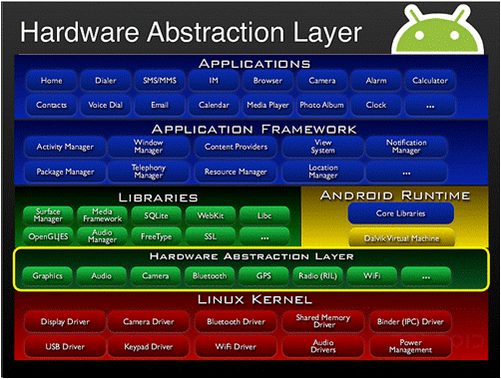
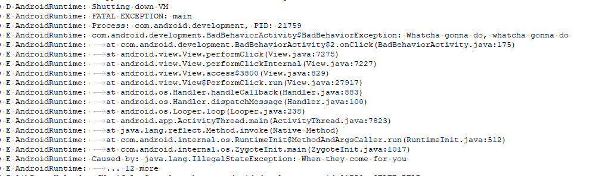
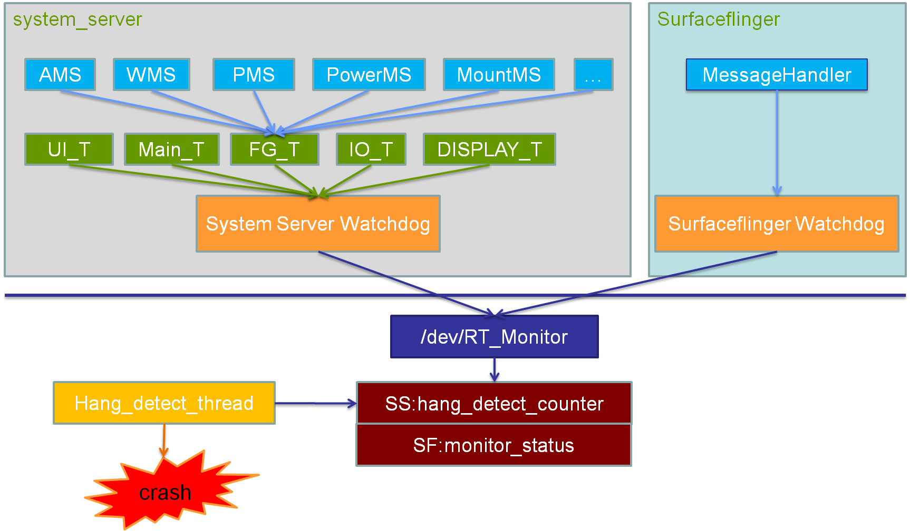
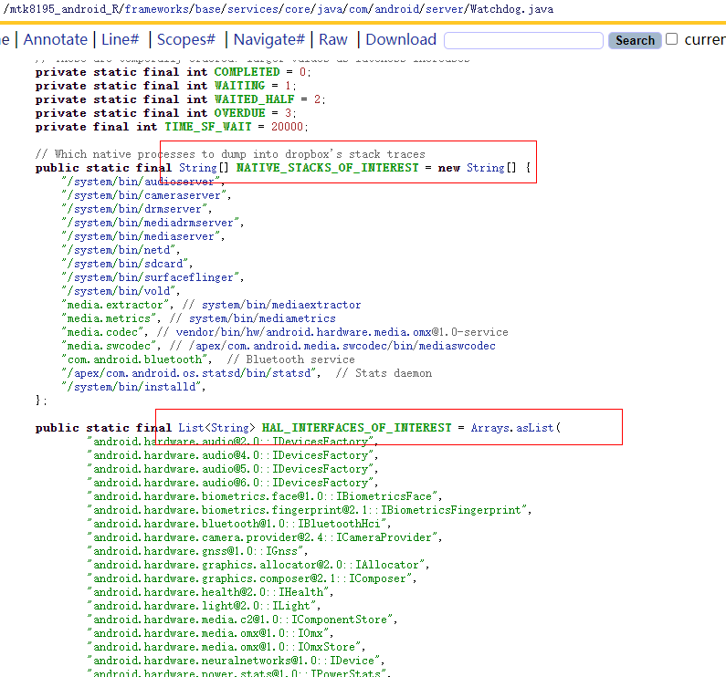

  任何软件都可能存在BUG，调试和修复BUG工作伴随着整个软件开发流程，因此异常分析变得非常重要，决定软件质量及项目问题的收敛，异常分析是一门需要大量基础知识堆积的学问。因为调试需要对底层运行机制了如指掌，才能找到问题点。

  Android系统里，软件是一层层叠加起来的，称为软件栈（software stack）；异常可以发生在任何一层，我们简单将android分为三层异常【与ARMv8架构的异常等级是不同的概念，后续可分享】：

- java层(frameworks)异常，简称为JE（java exception），此外Android framwork层的异常还有应用的ANR和system_server Watchdog异常（简称SWT），这两种异常是应用或者系统长时间无响应时触发；
- native层发生异常，native运行于linux系统之上，android基于linux开发native程序本质上也是一个linux小程序，native异常简称为NE（native exception）
- kernel层发生异常，通常大家说的kernel panic 和oops ，简称为KE（kernel exception)

## **Java Exception：**

  简介：java中有try-catch的异常捕获机制，一份健壮的代码应该在设计和实现时考虑到各种可能遇到的exception异常，捕获并做相应的处理。**但并非所有的异常都是可被预知的，没有捕获到的异常，会被一层层的往上抛，最终由虚拟机的默认异常处理机制来处理**。这里会打印出异常的堆栈信息，同时程序将停止运行，也就是我们常见的程序崩溃。

Debug版本上，程序崩溃会弹框提示“xx程序停止运行”。正式用户版本上，各厂商通常都修改为直接退出应用，移除了弹框提示。

  异常抓取：Java的Thread类提供了一份Java的Thread类中有一个UncaughtExceptionHandler接口，该接口的作用主要是为了当Thread因未捕获的异常而突然终止时，调用处理程序处理异常。

//UncaughtExceptionHandler接口唯一的回调函数

void uncaughtException(Thread t, Throwable e);

//设置当前线程的异常处理器

Thread.setUncaughtExceptionHandler

//设置所有线程的默认异常处理器

Thread.setDefaultUncaughtExceptionHandler

//设置所有线程的默认异常预处理器

Thread.setUncaughtExceptionPreHandler

Android中也同样利用了这种机制。虚拟机在遇到线程没有捕获的异常时，会调用thread的dispatchUncaughtException分发到当前线程中 有preHandler和Handler两个uncaughtExceptionHandler参考处理，分别执行各自的unCaughtException方法【具体流程不做详细分析】

  异常分析：JE产生后会在logcat中打印一系列信息，例如：“FATAL EXCEPTION”和“***FATAL EXCEPTION IN SYSTEM PROCESS”, 通常可以以FATAL关键字定位， JE格式如下：

  此外会在data/system/dropbox目录下生成一份txt异常日志，根据crash的进程的不同，前缀可能是“system_app_crash”、“data_app_crash”、“system_server_crash”中的一种， 在mtk平台中有通过aee包装，aee 机制会将JE异常信息和当前系统其他信息打包在/data/aee_exp 目录下 形成db.0x.JE.dbg 文件夹；

## SWT：

  android framework异常分析system_server Watchdog问题类型是很重要的问题，简称SWT，System Server进程是Android的一个核心进程，里面为APP运行提供了核心的服务。如果System Server的一些核心服务和重要线程卡住，就会导致相应的功能异常；如Android发生hang机，输入无响应，无法启动APP等一些不正常的情况。而且，如果没有一种机制，让这些服务复位的话，那么将持续hang机无法响应严重影响客户体验。

  所以有必要在核心服务和核心线程卡住的时候，让系统有自动复位的机会。于是，google引入了Sytem Server watchdog机制。这个机制来监控核心服务和核心线程是否卡住。

MTK平台 SWT机制原理设计框架: 代码位置：/[mtk8195_android_R](http://10.234.22.197:6015/source/xref/mtk8195_android_R/)/[frameworks](http://10.234.22.197:6015/source/xref/mtk8195_android_R/frameworks/)/[base](http://10.234.22.197:6015/source/xref/mtk8195_android_R/frameworks/base/)/[services](http://10.234.22.197:6015/source/xref/mtk8195_android_R/frameworks/base/services/)/[core](http://10.234.22.197:6015/source/xref/mtk8195_android_R/frameworks/base/services/core/)/[java](http://10.234.22.197:6015/source/xref/mtk8195_android_R/frameworks/base/services/core/java/)/[com](http://10.234.22.197:6015/source/xref/mtk8195_android_R/frameworks/base/services/core/java/com/)/[android](http://10.234.22.197:6015/source/xref/mtk8195_android_R/frameworks/base/services/core/java/com/android/)/[server](http://10.234.22.197:6015/source/xref/mtk8195_android_R/frameworks/base/services/core/java/com/android/server/)/[Watchdog.java](http://10.234.22.197:6015/source/xref/mtk8195_android_R/frameworks/base/services/core/java/com/android/server/Watchdog.java)

  如果系统发生SWT android上层会重启，在/data/aee_exp/目录下生成fatal.db.**.swt.dbg 异常数据包， 分析此类异常需要/data/debuglogger/mobilelog 和/data/aee_exp/ 下的swt db分析， swt过程中会有两次dumpbacktrace操作；

​      两次Dump对应的Real-Dump是在db解压出来的SWT_JBT_TRACES文件中， 分析可以在文件中定位查找：

​      ----- pid 1209 at 2021-09-04 04:38:57 -----

​      Cmd line: system_server

​      ……

​      ----- pid 1209 at 2021-09-04 04:39:33 -----

​      Cmd line: system_server

在分析swt时候会发现导致systemserver block的进程是binder线程的对端进程，可能db中没有没有打印相关进程的backtrace，可以在NATIVE_STACKS_OF_INTEREST或者HAL_INTERFACES_OF_INTEREST添加：

