# 一.概述

任何软件都可能存在BUG，调试和修复BUG工作伴随着整个软件开发流程，因此异常分析变得非常重要，决定软件质量及项目问题的收敛，异常分析是一门需要大量基础知识堆积的学问。因为调试需要对底层运行机制了如指掌，才能找到问题点。

  Android系统里，软件是一层层叠加起来的，称为软件栈（software stack）；异常可以发生在任何一层，我们简单将android分为三层异常【与ARMv8架构的异常等级是不同的概念，后续可分享】：


- java层(frameworks)异常，简称为JE（java exception），此外Android framwork层的异常还有应用的ANR和system_server Watchdog异常（简称SWT），这两种异常是应用或者系统长时间无响应时触发；
- native层发生异常，native运行于linux系统之上，android基于linux开发native程序本质上也是一个linux小程序，native异常简称为NE（native exception）
- kernel层发生异常，通常大家说的kernel panic 和oops ，简称为KE（kernel exception)

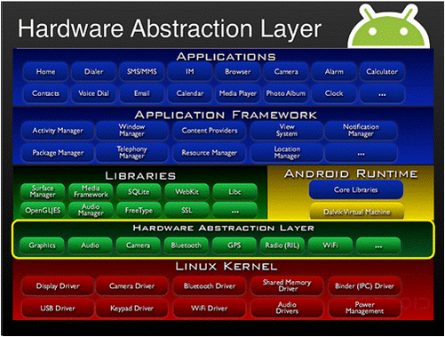

- oops (类似assert，有机会恢复)

oops是美国人比较常有的口语。就是有点意外，吃惊，或突然的意思。内核行为表现为通知感兴趣模块，打印各种信息，如寄存器值，堆栈信息…

当出现oops时，我们就可以根据寄存器等信息调试并解决问题, 其实通常oops触发后是恢复不了的；

/proc/sys/kernel/panic_on_oops为1时导致panic。mtk默认设置为1，即oops会发生panic; et302默认没有打开CONFIG_PANIC_ON_OOPS_VALUE=0


- panic

Panic – 困惑，恐慌，它表示Linux kernel遇到了一个不知道该怎么继续的情况。内核行为表现为通知感兴趣模块，死机或者重启。

在kernel代码里，有些代码加了错误检查，发现错误可能直接调用了panic()，并输出信息提供调试。

其实不管分类几种，都表示kernel出现故障，需要修复。那如何调试呢？就要看在发生异常时留了哪些信息帮我们定位问题了...


# 二.kernel 地址空间布局

分析KE之前 需要了解kernel 内存布局，才能知道哪些地址是用来做什么的， 这些地址在哪个范围，可能会是什么问题？ 了解内存布局之前先要了解地址页表转换：

```
ARM64可以使用多达48bit物理、虚拟地址（扩充成64bit，高位全为1或0）。对linux kernel来讲，目前配置为39bit的kernel空间，三级寻址：
CONFIG_ARM64_VA_BITS_39=y
CONFIG_ARM64_VA_BITS=39
CONFIG_ARM64_4K_PAGES=y
```

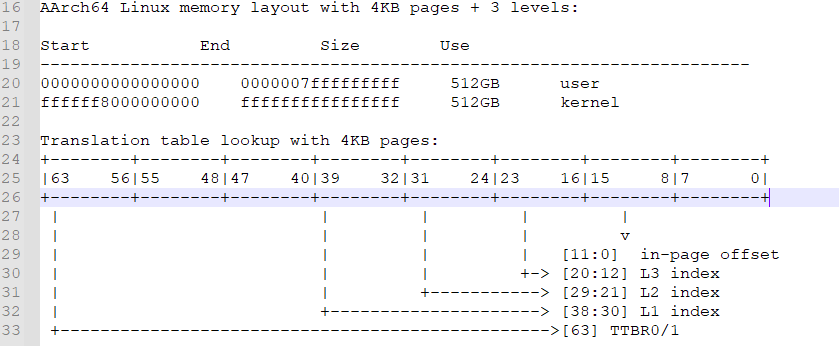

  在内核空间中存在如下重要的段，还有其他段小的段没有列出来，可能根据不同的版本而差别：

- vmlinux代码/数据段：任何程序都有TEXT（可执行代码）,RW（数据段）,ZI段（未初始化数据段），kernel也有，对应的是.text,.data,.bss

- module区域：kernel可以支持ko（模块），因此需要一段空间用于存储代码和数据段。

- vmalloc区域：kernel除了可以申请连续物理地址的内存外，还可以申请不连续的内存（虚拟地址是连续的），可以避免内存碎片化而申请不到内存。

- io map区域：留给io寄存器映射的区域，有些版本没有io map区域而是直接用vmalloc区域了。

- memmap：kernel是通过page结构体描述内存的，每一个页框都有对应的page结构体，而memmap就是page结构体数组。

  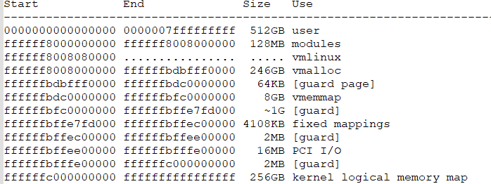

  memory layout 在不同的版本中会有稍许差异，log在开机mem_init中会打印出来，可以在开机log 中查看（搜Virtual kernel memory layout）：

  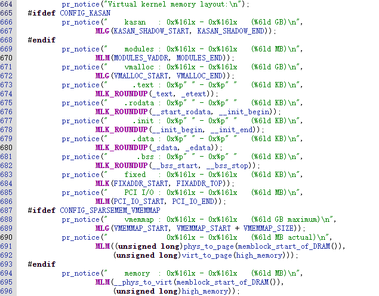


   

1111 1111 1111 1111    1111 1111 1111 1111   1111 1111 1111 1111    1111 1111 1111 1111 


#define VA_BITS                 (CONFIG_ARM64_VA_BITS)
#define VA_START                (UL(0xffffffffffffffff) - (UL(1) << VA_BITS) + 1)
#define PAGE_OFFSET             (UL(0xffffffffffffffff) - (UL(1) << (VA_BITS - 1)) + 1)  

#define KIMAGE_VADDR            (MODULES_END)
#define MODULES_END             (MODULES_VADDR + MODULES_VSIZE)
#define MODULES_VADDR           (VA_START + KASAN_SHADOW_SIZE)
#define MODULES_VSIZE           (SZ_128M)
#define VMEMMAP_START           (PAGE_OFFSET - VMEMMAP_SIZE)
#define PCI_IO_END              (VMEMMAP_START - SZ_2M)
#define PCI_IO_START            (PCI_IO_END - PCI_IO_SIZE)
#define FIXADDR_TOP             (PCI_IO_START - SZ_2M)

#define KERNEL_START      _text
#define KERNEL_END        _end


ffff ff80 0000 0000        ffffffffffffffff         512GB          kernel


ffff ffff ffff ffff
0000 0040 0000 0000
0000 0080 0000 0000

ffff ffbf ffff ffff
ffff ffc0 0000 0000


ffff ff7f ffff ffff
ffff ff80 0000 0000


ffff ffff ffff ffff


ffff ffc0 0000 0000   PAGE_OFFSET  128G


                      KASAN 64GB

ffff ff80 0000 0000   VA_START


VA_BITS=39


线性映射区             0xffff ffff ffff ffff 
                       PAGE_OFFSET = 0xffff ffff ffff ffff << (VA_BITS-1)   ffff 8000 0000 0000
VMEMMAP区
                       VMEMMAP_START = PAGE_OFFSET - VMEMMAP_SIZE

2MB间隙

PCI_IO区(16MB)         PCI_IO_END = (VMEMMAP_START - SZ_2M)
                       PCI_IO_START  = (PCI_IO_END - PCI_IO_SIZE)   其中PCI_IO_SIZE=16MB
2MB间隙


ffff 0000 0000 0000   VA_START    = 0xffff ffff ffff ffff <<  VA_BITS


内核虚拟地址空间布局：

线性映射区   PAGE
VMEMMAP区    VMEMMAP
2MB间隙
PCI_IO区     PCI_IO
2MB间隙
固定映射区   FIXADDR
间隙
vmalloc区    vmalloc区包含 间隙+内核镜像+间隙  对应不连续的物理内存页
内核模块区
KASAN影子区


#  三. 内核死机流程 

​        panic:

​        die(oops to panic):

​        	--if (in_interrupt())

​        		panic("Fatal exception in interrupt");

​        	--if (panic_on_oops)   //后续项目建议配置默认打开

​        		panic("Fatal exception");

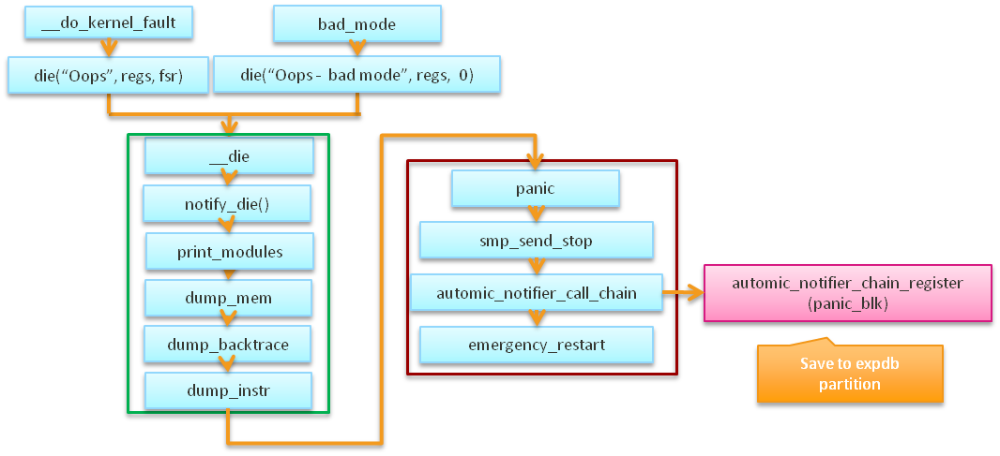

附：上面图中举例的异常类型是通过esr 寄存器路由：

 bad_mode: 通常为 bad_stack, undf inv; 

__do_kernel_faul: 通常为do_page_fault后地址异常， bad erea 地址空间异常；

内核死机流程和ArmV8异常处理框架是个大课题，后续有机会在补充；

# 四.死机异常分析 

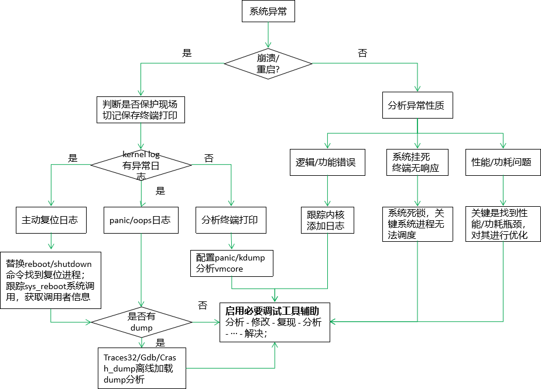


# **五.普通调试分析方法**  

## proc filesystem

Linux proc文件系统的意义就在于给用户一个与内核沟通的方式

-   包含很多内核运行信息和调试信息
-   查看或者配置内核参数
-   以下是部分例子：

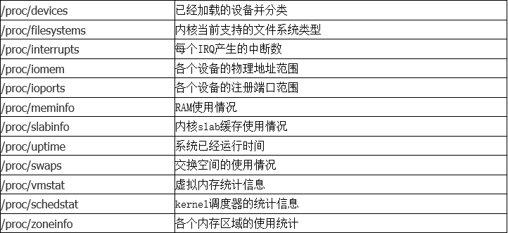

## sysrq

- SysRq魔术键功能

​    /proc/sys/kernel/sysrq控制开启或关闭哪些魔术键功能

​    需要打开内核编译选项CONFIG_MAGIC_SYSRQ

- /proc/sysrq-trigger

​    替代魔术键实现所有魔术功能，在所有架构平台都适用

​    不受/proc/sys/kernel/sysrq控制，功能全开启

​    例如：echo l > /proc/sysrq-trigger

```
'b'  - Will immediately reboot the system without syncing or unmounting your disks.
'c'  - Will perform a system crash by a NULL pointer dereference. A crashdump will be taken if configured.
'd'  - Shows all locks that are held.
'e'   - Send a SIGTERM to all processes, except for init.
'f'  - Will call oom_kill to kill a memory hog process.
'i'   - Send a SIGKILL to all processes, except for init.
'l'   - Shows a stack backtrace for all active CPUs.
'm'  - Will dump current memory info to your console.
'p'   - Will dump the current registers and flags to your console.
'q'   - Will dump per CPU lists of all armed hrtimers and detailed information about all clockevent devices.
't'  - Will dump a list of current tasks and their information to your console.
'u'  - Will attempt to remount all mounted filesystems read-only.
'0'-'9'  - Sets the console log level, controlling which kernel messages will be printed to your console. ('0', for example would make it so that only emergency messages like PANICs or OOPSes would make it to your console.)
```

## printk/dmesg

- printk是内核最常用的调试手段，通过分析源码将调试信息打印到控制台或日志

​    优点：迅速得到开发者最想看到的信息；源码级调试，不受上下文限制

​    缺点：需要理解、修改源代码并重编

- printk打印级别

​    只有小于控制台打印级别的printk信息才能被直接打印到控制台

​    /proc/sys/kernel/printk可以查询和配置控制台记录级

```
#define KERN_EMERG  KERN_SOH "0"	/* system is unusable */                              级别值越小，紧急程度越高
#define KERN_ALERT	KERN_SOH "1"	/* action must be taken immediately */
#define KERN_CRIT	KERN_SOH "2"	/* critical conditions */
#define KERN_ERR	KERN_SOH "3"	/* error conditions */
#define KERN_WARNING  KERN_SOH "4"	/* warning conditions */
#define KERN_NOTICE  KERN_SOH "5"	/* normal but significant condition */
#define KERN_INFO	KERN_SOH "6"	/* informational */
#define KERN_DEBUG  KERN_SOH "7"	/* debug-level messages */


更方便的定义
#define pr_debug(fmt,arg...) printk(KERN_DEBUG fmt,##arg)
#define pr_info(fmt,arg...) printk(KERN_INFO fmt,##arg) 
eg:
https://gerrit.zte.com.cn/#/c/9642992/6/kernel-4.19/drivers/soc/zte_stability/kboot_log/kboot_log.c
#define pr_fmt(fmt) "["KBUILD_MODNAME"]" fmt
```

#### printk一定会输出到串口吗？ ==》 

```
#echo 8 > /proc/sys/kernel/printk   使所有打印都能在控制台输出
```

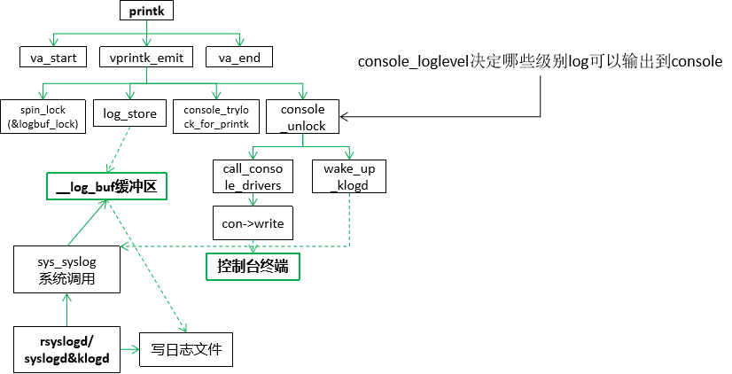

#### Linux 原生内核log显示不友好，无cpu id ，进程 pin ，进程comm：

可以丰富log_store 保存格式：参考 国雄提交： https://gerrit.zte.com.cn/#/c/9779893/1/kernel/kernel/printk/printk.c

```
[    0.000000]  (0)[0:swapper]Booting Linux on physical CPU 0x0
[    0.000000]  (0)[0:swapper]Initializing cgroup subsys cpu
[    0.000000]  (0)[0:swapper]Initializing cgroup subsys cpuacct
[    0.000000]  (0)[0:swapper]Linux version 4.1.18 (lzy@user-R5300-G3) (gcc version 4.9.3 (GCC) ) #5 SMP PREEMPT Fri Sep 10 18:00:46 CST 2021
```

## Ftrace

ftrace通常比较适合分析流程问题：

Linux是一个复杂宏内核架构，插入了很多模块，逻辑也比较复杂，系统功能异常时还不清楚内核在哪个流程出错，这时可以用ftrace跟踪执行流程—-systrace也是利用了ftrace功能：

```
1.查看系统有哪些tracer可以使用, android Linux使用了tracer功能的模块远不止如下几种：
root@:/sys/kernel/debug/tracing# cat available_tracers 
blk mmiotrace function_graph wakeup_rt wakeup function nop

2.设置function为当前tracer
# cat current_tracer 
nop
# echo function > current_tracer

3.启动跟踪
# echo 1 > tracing_on

4.跟踪若干时间后关闭，防止缓存信息被覆盖
# echo 0 > tracing_on

5.查看跟踪信息，通常信息较多，输出到文件并过滤出关心的进程
#cat trace
# tracer: function
#
# entries-in-buffer/entries-written: 30801/30801   #P:4
#
#                              _-----=> irqs-off
#                             / _----=> need-resched
#                            | / _---=> hardirq/softirq
#                            || / _--=> preempt-depth
#                            ||| /     delay
#           TASK-PID   CPU#  ||||    TIMESTAMP  FUNCTION
#              | |       |   ||||       |         |
            bash-4851  [000] .... 62818.627184: mutex_unlock <-rb_simple_write
            bash-4851  [000] .... 62818.627185: __fsnotify_parent <-vfs_write
            bash-4851  [000] .... 62818.627185: fsnotify <-vfs_write
            bash-4851  [000] .... 62818.627186: __srcu_read_lock <-fsnotify
            bash-4851  [000] .... 62818.627186: __srcu_read_unlock <-fsnotify
            bash-4851  [000] .... 62818.627186: __sb_end_write <-vfs_write
            bash-4851  [000] .... 62818.627187: context_tracking_user_enter <-syscall_trace_leave
            bash-4851  [000] d... 62818.627188: vtime_user_enter <-context_tracking_user_enter
            bash-4851  [000] d... 62818.627188: _raw_spin_lock <-vtime_user_enter
            bash-4851  [000] d... 62818.627188: __vtime_account_system <-vtime_user_enter
```

## oops/panic信息分析

这个没啥好说的 ，是具体流程可以参考 三. 内核死机流程

Oops不一定导致系统挂起，但oops之后的系统处于不可信状态，如果忽略通常当时不会异常，由于linux是宏内核但是会把异常抛给其他模块，引起其他模块异常，建议reboot， 需要配置echo 1 > /proc/sys/kernel/panic_on_oops 系统会直接重启


panic add info
t show task states
	show_state();
	show_workqueue_state();
w show blocked tasks
	show_state_filter(TASK_UNINTERRUPTIBLE);
l show all active cpus
sysrq_handle_showallcpus
m show memory usage
	show_mem(0);
q show all timers
	sysrq_timer_list_show();
d show all locks
	debug_show_all_locks();


## dump/T32

参考：[【stability】Trace32 debug环境/GtoTool debug环境](https://i.zte.com.cn/#/space/5281ec5b761f4c19b7ef3868290cbbe1/wiki/page/0a348123119e49d4ba2abf621ac05f1a/view)


## 二进制文件分析工具

file

  识别文件类型，也可用来辨别一些文件的编码格式

readelf

  读取ELF格式文件的特定信息，例如ELF头、符号表、某个section等

nm

  列出目标文件的符号清单，包括导出符号和未导出符号

objdump

  分析目标文件信息，例如文件头、某个section等，另外还具有反汇编功能

strings

  列出文件中可打印的字符串，例如ELF文件中的符号、字符常量等

gdb

  常用来反汇编ELF文件，包括内核模块

addr2line

  通常从地址到symbol 分析大家用的最多的方式；

trace32 

  除了可以用来在线/离线分析， 还用单纯用来分析二进制elf ，直观便捷；


## 内核事件追踪

如果遇到需要追踪系统调用/ 信号发送接收/数据异常访问/指令被异常访问 推荐使用事件追踪方式分析， 如下几种追踪方式可以覆盖android 上下层：

- strace

用来跟踪进程执行时的系统调用和所接收的信号，针对android native 进程起不来，进程状态异常分析有效；

- kprobe

内核**动态插桩工具**，可以在任意指令插入执行代码，类似的还有jprobe和kretprobe；非常重要的调试工具，在没有目标源码的情况下输出相关信息； --推荐

- hw_breakpoint

硬件断点，当某个地址的数据或指令被访问时，引发用户注册的异常处理函数；不适用：因为在触发断点后，寄存器不会情况，会在断点位置循环触发； 只适合在线模拟使用触发后手动情况断点信息；

- ftrace

使用某种跟踪器跟踪内核某些事件，默认跟踪器包括function、irqsoff、wakeup等；--推荐

- tracepoints (复杂模块建议都需要写对应的tracepoint 用来debug分析问题)

在内核某些代码自定义跟踪点，执行用户定义的函数

内核默认包含的tracepoints作为events提供给用户，可以直接通过debugfs使用

Kprobe_events，可用于kprobe的符号都可以通过debugfs定义成events使用


# 六.内存踩踏分析 

Native：SIGSEGV/sig 11

Kernel: NULL pointer/ level x translation fault /Unhandled fault at 0x

这不管是应用开发还是内核开发，没有经历过上面几种异常的折磨都不是成熟的开发； 发现如上问题通过就是内存问题，内存被踩踏， 内存在释放后被重新使用.....

## 概念

**如何定义内存踩踏？**

对***\*不属于\**你的内存进行读写**就是踩内存；

**如何解决？**

解决踩内存的方法就是

1. 找出哪个地方的代码踩了内存。

2. 然后检查代码逻辑修复问题。

   

第1点很难，通常踩内存和程序崩溃没有任何关系，这也导致了踩内存很难调试，我们必须要深入了解踩内存的原理才能更好的解决它。

从时间轴看踩内存：

S:程序/系统开始执行时间点

P: 内存开始发送异常(Poisoned)时间点

C:程序/系统crash/panic时间点

​		S					P																C

​		|					|																|

​		|					|																|

-------------------------------------------------------------------------------------------------------------------------------------------------------> t

​		|					|<----------------------------------------------------------------------------------->|程序/系统奔溃

​		|					|					Everything is possible						    |


在发生踩内存时，不一定马上崩溃，如果是马上崩溃，那好解决，可以跳过第1步，直接进入第2步解决问题。麻烦点在于崩溃的点是之后的某个时间里，P和C没有关系。

如何从C推导出P是解决踩内存的关键，我们先要研究C当下内存踩坏的情况来判断可能的原因。


## 5.1 分析调试思路

#### 分析内存问题，先了解下kernel内存种类，才知道如何针对分析；kernel内存分类如下：

- 全局变量

​    这个最直接，直接在驱动里定义全局变量就可以拿来使用，不过要注意互斥访问。

​    内存是分配在.data/.bss段的。

-  局部变量

​    定义在函数内部的变量，分配在栈帧内的。由于kernel对栈大小有限制，ARM32位是8K，ARM64位是16K，因此不能定义太大的变量，否则容易造成栈溢出。

-  buddy system分配的内存

​    除了全局定义变量外，剩下的空间【不包含reserved memory】基本归buddy system管理，buddy system是按页（4K大小）管理，可以通过__get_free_page()获取空闲内存。

-  slub分配的内存

​    buddy system粒度不够细，slub将buddy system获取的内存进一步分割为obj，可以拿到更小的内存块。可以通过kmalloc()等函数获取空闲内存。

-  vmalloc分配的内存

​    通过buddy/slub分配的内存都是地址物理连续的，系统运行一段时间不可避免存在内存碎片问题，可能无法拿到大块的内存，vmalloc通过MMU将不同的物理页映射到连续的虚拟地址上，一定程度避免了页外内存碎片化。而且虚拟地址前后都隔着不可读写的页面，有效的防止了overflow、underflow。缺点也很明显就是是分配效率低（每次都要操作MMU转换）。

#### 对应的调试方法

踩内存的类型无非就上面几种类型，下面来讨论如何调试：

- 全局/局部变量

  可以用kernel address sanitizer来拦截问题也就是KASAN debug

- buddy system分配的内存

  kernel原生有CONFIG_DEBUG_PAGEALLOC来调试，（需要到kernel-4.6才支持），原理就是对分配释放页进行读写属性设置达到隔离效果

- slub分配的内存

  slub分配器本身自带调试功能，只要打开config开关（CONFIG_SLUB_DEBUG、CONFIG_SLUB_DEBUG_ON）即可排查出部分踩内存问题 具体可以参考doc/Documentation/vm/slub.txt

- vmalloc分配的内存

  本身前后就有4K不可读写的页面保护，容易抓到underflow、overflow的情况，但是对vmalloc 区域内存的user after free无效，参考[【MT8185】合入mtk wlan7661patch后，系统reboot 重启过程中死机重启](https://i.zte.com.cn/#/space/5281ec5b761f4c19b7ef3868290cbbe1/wiki/page/d9cc271baa2047d0a44dceaba21ad0ae/view)

​    

## 5.2 分析手段 

  内核分析手段随着版本发展越来越丰富，越来越便利(slub_debug/kasan_debug/page_owner/debug_pagealloc/kmemleak) , 针对不同的问题如何精确使用debug方案需要对这些debug手段原理有充分的了解；对这些debug原理的掌握程度很多时候决定了你对问题能分析解决的程度， 下面主要介绍几种常用的手段：

###  slub_debug原理和使用 

####  1.使用方式： 

​    CONFIG_SLUB=y
​    CONFIG_SLUB_DEBUG=y
​    CONFIG_SLUB_DEBUG_ON=y

####  2.基本原理：

SLUB DEBUG可以检测内存越界（out-of-bounds）和访问已经释放的内存（use-after-free）等问题；


配置kernel选项CONFIG_SLUB_DEBUG_ON后，在创建kmem_cache的时候会传递很多flags（SLAB_CONSISTENCY_CHECKS、SLAB_RED_ZONE、SLAB_POISON、SLAB_STORE_USER）。针对这些flags，SLUB allocator管理的object对象的format将会发生变化。如下图所示。

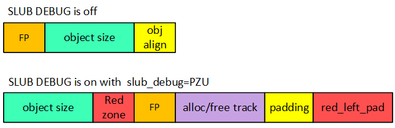

SLUBU DEBUG关闭的情况下，free pointer是内嵌在object之中的，但是SLUB DEBUG打开之后，free pointer是在object之外，并且多了很多其他的内存，例如red zone、trace和red_left_pad等。这里之所以将FP后移就是因为为了检测use-after-free问题,当free object时会在将object填充magic num(0x6b)。如果不后移的话，岂不是破坏了object之间的单链表关系。


\1. Red zone有什么用

从图中我们可以看到在object后面紧接着就是Red zone区域，那么Red zone有什么作用呢?既然紧随其后，自然是检测右边界越界访问（right out-of-bounds access）。原理很简单，在Red zone区域填充magic num，检查Red zone区域数据是否被修改即可知道是否发生right oob。

可能你会想到如果越过Red zone，直接改写了FP，岂不是检测不到oob了，并且链表结构也被破坏了。其实在check_object()函数中会调用check_valid_pointer()来检查FP是否valid，如果invalid，同样会print error kernel log。

\2. padding有什么用

padding是sizeof(void *) bytes的填充区域，在分配slab缓存池时，会将所有的内存填充0x5a。同样在free/alloc object的时候作为检测的一种途径。如果padding区域的数据不是0x5a，就代表发生了“Object padding overwritten”问题。这也是有可能，越界跨度很大。

\3. red_left_pad有什么用

red_left_pad和Red zone的作用一致。都是为了检测oob。区别就是Red zone检测right oob，而red_left_pad是检测left oob。如果仅仅看到上面图片中object layout。你可能会好奇，如果发生left oob，那么应该是前一个object的red_left_pad区域被改写，而不是当前object的red_left_pad。如果你注意到这个问题，还是很机智的，这都被你发现了。为了避免这种情况的发生，SLUB allocator在初始化slab缓存池的时候会做一个转换。

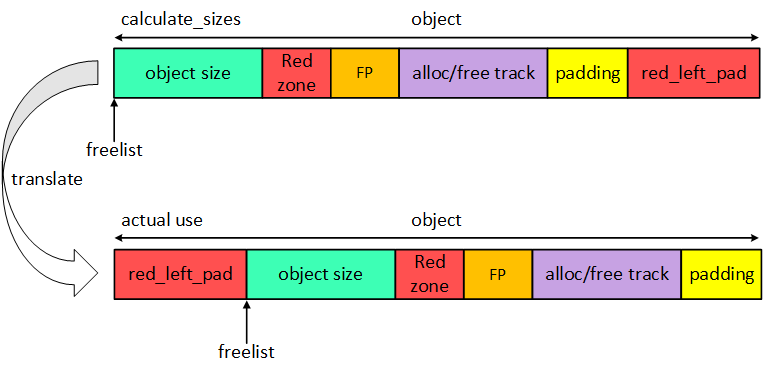

\4. slub cache object申请和释放layout

free object layout

刚分配slab缓存池和free object之后，系统都会通过调用init_object()函数初始化object各个区域，主要是填充magic num。free object layout如下图所示。

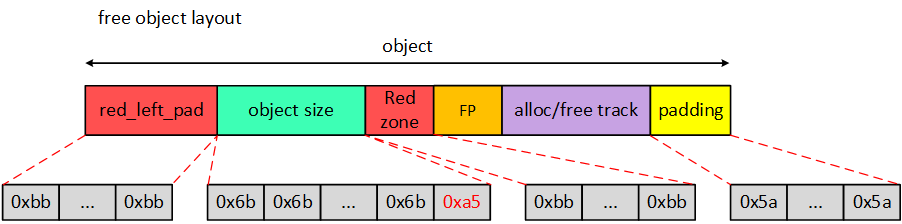

alloc object layout

当从SLUB allocator申请一个object时，系统同样会调用init_object()初始化成想要的模样。alloc object layout如下图所示。

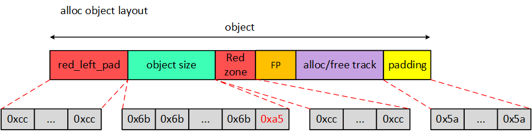


\1) red_left_pad和Red zone填充了SLUB_RED_ACTIVE（0xcc）；

\2) object填充了POISON_FREE（0x6b），但是最后一个byte填充POISON_END（0xa5）；

\3) padding在allocate_slab的时候就已经被填充POISON_INUSE（0x5a），如果程序意外改变，当检测到padding被改变的时候，会output error syslog并继续填充0x5a。

alloc object layout和free object layout相比较而言，也仅仅是red_left_pad和Red zone的不同。


###  3. slub_debug example

  **1. out-of-bounds bugs detect**

```
void right_oob(void)
{
    char *p = kmalloc(32, GFP_KERNEL);
    if (!p)
        return;
    p[32] = 0x88;
    kfree(p);
}
行后的object layout如下图所示:
```

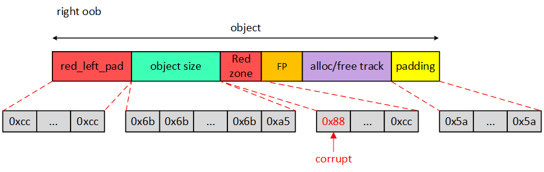

在free(p)时候会做object检测： Red zone区域的值全是0xcc就是valid，因此这里会检测0x88不是0xcc，进而输出error syslog。kfree()最终会调用free_consistency_checks()检测object；


  **2 . use-after-free bugs detect**

```
void use_after_free(void)
{
    char *p = kmalloc(32, GFP_KERNEL);
    if (!p)
        return;
    
    kfree(p);
    memset(p, 0x88, 32);
}
运行之后object layout如下图所示：
```

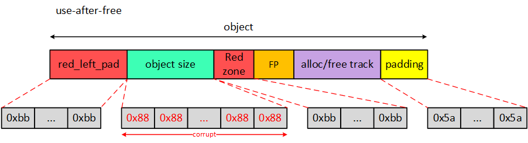

slubdebug 是被动的，只有在alloc 和free时候会做obj检测， 在kfree后做memset踩坏系统在重新分配之前是不会检测到的， 当这款内存被重新分配时候做alloc_consistency_checks 或者使用slabinfo 工具对已经释放的obj做检测，检查object区域是否全是0x6b（最后一个字节oxa5）即可，如果不是的话，就是use-after-free；

附： slabinfo 工具在：/[mtk8195_android_R](http://10.234.22.197:6015/source/xref/mtk8195_android_R/)/[kernel-4.19](http://10.234.22.197:6015/source/xref/mtk8195_android_R/kernel-4.19/)/[tools](http://10.234.22.197:6015/source/xref/mtk8195_android_R/kernel-4.19/tools/)/[vm](http://10.234.22.197:6015/source/xref/mtk8195_android_R/kernel-4.19/tools/vm/)/[slabinfo.c](http://10.234.22.197:6015/source/xref/mtk8195_android_R/kernel-4.19/tools/vm/slabinfo.c) 


### kasan_debug原理和使用 

####  1.使用方式：

​    CONFIG_KASAN=y

​    CONFIG_KASAN_INLINE=y

​    CONFIG_RANDOMIZE_BASE=y

​    CONFIG_FRAME_WARN=0

 \2. 基本**原理：**

   KASAN利用额外的内存标记可用内存的状态，这部分额外的内存被称作shadow memory（影子区），KASAN将1/8的内存用作shadow memory。使用特殊的magic num填充shadow memory，在每一次load/store内存的时候检测对应的shadow memory确定操作是否valid。连续8 bytes内存（8 bytes align）使用1 byte shadow memory标记。

如果8 bytes内存都可以访问，则shadow memory的值为0；如果连续N(1 =< N <= 7) bytes可以访问，则shadow memory的值为N；如果8 bytes内存访问都是invalid，则shadow memory的值为负数。

**shadow memory标记含义**

| 值   | 0             | 1~7             | 负值                            |
| ---- | ------------- | --------------- | ------------------------------- |
| 含义 | 8字节全可访问 | 前n个字节可访问 | 8字节全部不可访问，且有特别意义 |

负值特别意义如下（kernel/mm/kasan/kasan.h）

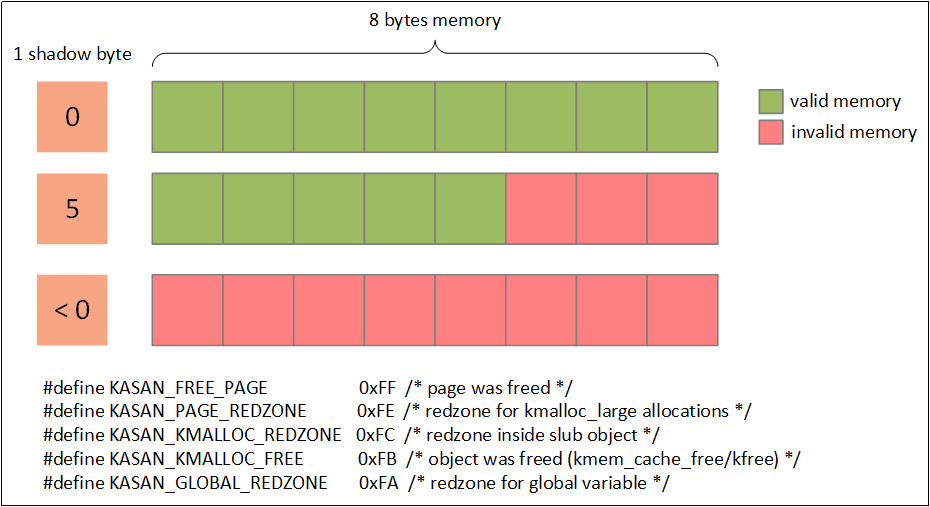

  shadow memory检测原理的实现主要就是__asan_load##size()和__asan_store##size()函数的实现, 在打开kasan的时候编译器会在对被shadow隐射的内存操作时候自动插装(GCC 版本大于5.0 功能完整)；如内核如何根据shadow memory的值判断内存访问操作是否valid？

举个例子伪代码如下：Disable kasan:long *addr = (long *)0xffffffC000123456*addr = 0; Enable kasan:long *addr = (long *)0xffffffC000123456char *shadow = (char *)(((unsigned long)addr >>3) + KASAN_SHADOW_OFFSET);if(*shadow)  //地址为8个字节对应shadow为0；如果*shadow 不为0表示访问非法，report_bug	report_bug();*addr = 0;

​    

####   3. kasan debug example

[【MT8195】recovery硬恢复开发过程中，发现GPU DRM驱动中死机](https://i.zte.com.cn/#/space/5281ec5b761f4c19b7ef3868290cbbe1/wiki/page/24772bbb157d48c694234f23d4a7ed66/view)

####  

#### --------------------------------------------------------------------------------------------------------------------------------------------------------------------------------------------------------------

####  伙伴系统分配的内存的shadow memory值如何填充？

​        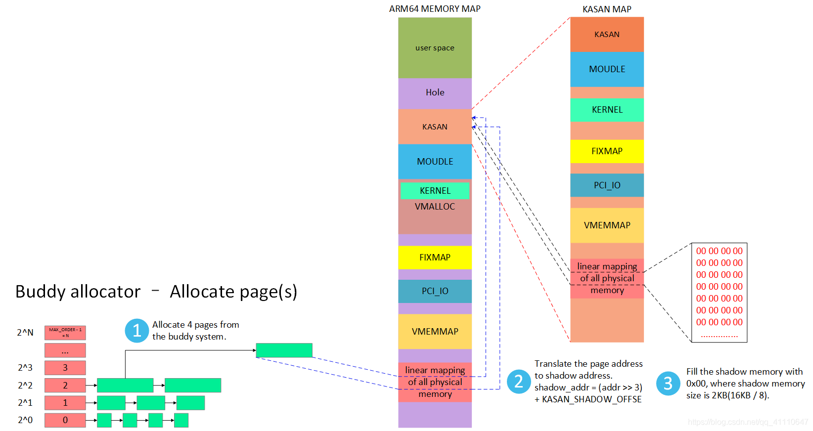

​        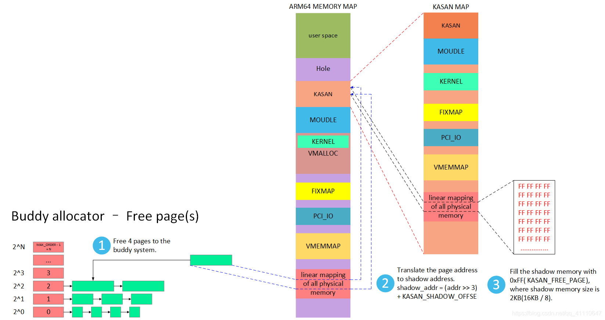

####   SLUB分配对象的内存的shadow memory值如何填充？           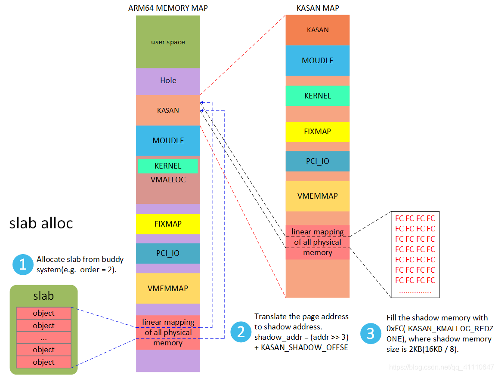

​          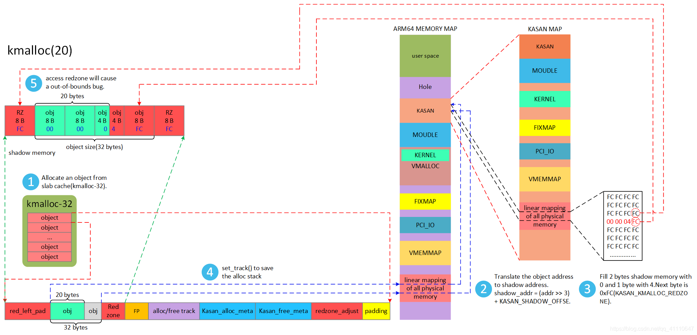

​        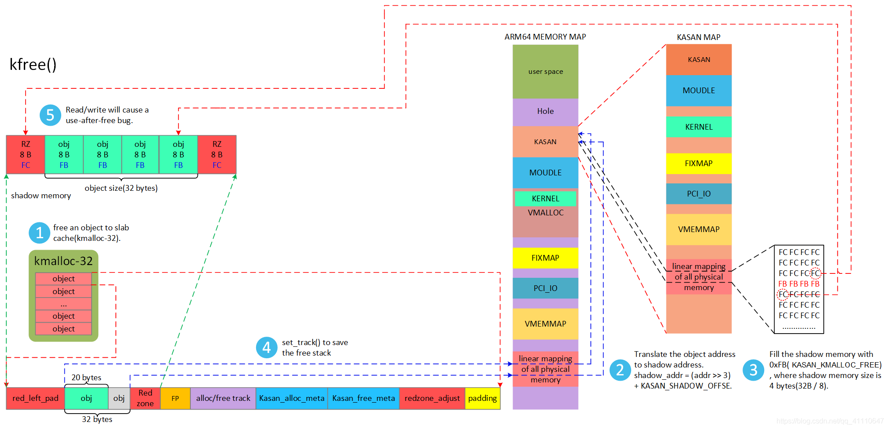

# 七. 内存泄漏分析 

####  kmemleak原理和使用:

