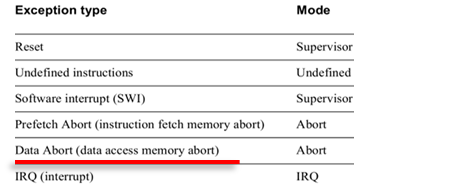

    Native属于linux再上一层，可以直接运行于linux的那一层，用于区别java层。native层是由各种lib/binary组成。同样这一层也会出现这种异常，我们称为NE。NE的全称是native exception。

对于应用程序的调试，我们可以online调试也可以offline调试。不过一般我们用的是offline调试，通过coredump借助gdb或trace32来调试。当然在讲coredump前，**要先熟悉下linux信号和ptrace机制**，coredump是通过信号触发生成的。coredump是进程空间保存到文件系统的镜像，因此能看到异常时刻的所有变量值，就可以知道问题出在哪里。

   Android是基于linux的，发生异常时，Android扩展了调试机制，这个机制是debuggerd机制。在没有coredump下，debuggerd以log/tombstone的方式输出异常信息，以便后面调试。

###   一. 地址空间：

​    native程序是运行在linux之上的，因此程序如何被linux加载起来，如何发生/捕获/处理异常都需要了解的清清楚楚，这样才能系统的分析NE，我们先从user space layout入手，地址空间是每个应用程序独有和互不干扰，这样的布局是由MMU帮忙实现的。

应用程序内容：

​    主要可以分为3个部分：只读的代码段和数据段，可读写的数据段，bss未初始化数据段。

  程序的3个部分会被加载到用户空间，同时会分配一个栈给程序，如果程序运行过程中调用malloc()等堆内存分配函数，则会将堆映射到用户空间；如果调用mmap()，则会将文件映射到用户空间。

  32bit应用程序地址空间：

​    

  64bit应该程序地址空间：图中128TB是采用48为VA地址空间2^48=128TB, 当前mt8195平台采用的是39bit VA， 有效地址空间为2^39 = 512GB

​    CONFIG_ARM64_VA_BITS_39=y

​    CONFIG_ARM64_VA_BITS=39


  虚拟地址空间maps文件解读：

​    如果需要更好的观察进程地址空间可以通过adb shell cat /proc/$PID/maps或者adb shell pmap -x $PID可获取进程的虚拟地址空间映射文件，从文件中映射关系可以更直观：

​    每一项都对应一个vm_area_struct结构体：

```
57f969c000-57f969e000 r--p 00000000 fd:02 1599                           /system/bin/surfaceflinger
57f969e000-57f969f000 r-xp 00002000 fd:02 1599                           /system/bin/surfaceflinger
57f969f000-57f96a0000 r--p 00003000 fd:02 1599                           /system/bin/surfaceflinger
6f56f04000-6f56f05000 r--p 00002000 fd:02 3467                           /system/lib64/libdisp_dejitter.so
6f3c5a7000-6f3e607000 rw-s 00000000 00:08 87763                          /dmabuf:
6f4a655000-6f4af61000 rw-s 00000000 00:08 70383                          /dmabuf:
.....
7fc16f4000-7fc1715000 rw-p 00000000 00:00 0                              [stack]
```

## 二 .系统异常处理流程

 当进程发生崩溃时 kernel会以信号的方式通知进程，每个信号伴随着动作，比如产生coredump，或终止程序，具体定义就看是什么信号了,kernel可以传递更多信号相关的信息给native层，通过ptrace或waitid函数可以获取信号详细信息， 先来简单了解下信号和ptrace

###   1 信号： 

/[mtk8195_android_R](http://10.234.22.197:6015/source/xref/mtk8195_android_R/)/[bionic](http://10.234.22.197:6015/source/xref/mtk8195_android_R/bionic/)/[libc](http://10.234.22.197:6015/source/xref/mtk8195_android_R/bionic/libc/)/[kernel](http://10.234.22.197:6015/source/xref/mtk8195_android_R/bionic/libc/kernel/)/[uapi](http://10.234.22.197:6015/source/xref/mtk8195_android_R/bionic/libc/kernel/uapi/)/[asm-generic](http://10.234.22.197:6015/source/xref/mtk8195_android_R/bionic/libc/kernel/uapi/asm-generic/)/[signal.h](http://10.234.22.197:6015/source/xref/mtk8195_android_R/bionic/libc/kernel/uapi/asm-generic/signal.h)


  信息保存在siginfo结构体，如下 信号No. 错误码，基于信号的额外信息：


  下表是native exception最常见的SIGSEGV信号(sig 11)的si_code值，由SUS(Single UNIX Specification:是POSIX.1标准的超集)定义：

  SIGSEGV的代码和原因：

| 代码           | 原因                                         |
| -------------- | -------------------------------------------- |
| SEGV_MAPERR: 1 | 地址没有映射到对象（大部分的异常是这种类型） |
| SEGV_ACCERR: 2 | 映射的对象的无效权限                         |

###   2 ptrace (process trace)/   strace 

​    ptrace()是个系统调用，提供了一种父进程可以控制子进程运行，并可以检查和改变它的核心image (用于实现断点调试，代码分析)，修改被跟踪进程的空间(内存或寄存器)，

任何传递给被跟踪进程的信号(除了SIGKILL)都会使得这个进程进入暂停状态，这时跟踪进程通过wait()得知相关的状态并做相应的修改。【问：不能跟踪进程init。不能跟踪ptrace自己， why？？】

ptrace功能参考：/mtk8195_android_R/kernel-4.19/include/uapi/linux/ptrace.h

  PTRACE_TRACEME

​    本进程被其父进程所跟踪。其父进程应该希望跟踪子进程，用于debugger。

  PTRACE_ATTACH

​    跟踪指定pid 进程,成为pid的父进程,并停止pid进程。

  PTRACE_DETACH

​    结束跟踪。

  PTRACE_PEEKTEXT, PTRACE_PEEKDATA和PTRACE_POKETEXT, PTRACE_POKEDATA

​    读取/修改被跟踪进程的user space里的内存。

  PTRACE_GETREGS, PTRACE_SETREGS、PTRACES_GETFPREGS, PTRACE_SETFPREGS、PTRACE_GETVFPREGS, PTRACE_SETVFPREGS

​    读取/修改被跟踪进程的通用/浮点寄存器值。

  PTRACE_SYSCALL, PTRACE_CONT

​    重新运行，(PTRACE_SYSCALL会使每次系统调用暂停)。

  PTRACE_SINGLESTEP

​    设置单步执行标志。

  PTRACE_KILL

​    杀掉子进程，使它退出


strace ls  #创建一个新进程用于执行ls命令，并查看进程执行过程中执行了哪些系统调用。
ptrace()是个系统调用，提供了一种父进程可以控制子进程运行，并可以检查和改变它的核心image (用于实现断点调试，代码分析)，修改被跟踪进程的空间(内存或寄存器)，

任何传递给被跟踪进程的信号(除了SIGKILL)都会使得这个进程进入暂停状态，这时跟踪进程通过wait()得知相关的状态并做相应的修改。不能跟踪进程init。

ptrace功能参考：kernel-4.19/include/uapi/linux/ptrace.h


###    3 异常处理流程：  

  Native异常发生的时候，CPU通过中断的形式触发异常处理流程。Linux kernel将会处理中断，统一成信号发送，应用进程注册和处理信号。所有的so都需要通过linker加载，Android上，linker会默认注册信号处理函数，代码位置在bionic/linker/linker_main.cpp，实现的地方在debuggerd_init()中。通过sigaction方法，注册接收的信号有：SIGABRT，SIGBUS，SIGFPE，SIGILL，SIGSEGV，SIGSTKFLT，SIGSYS，SIGTRAP，DEBUGGER_SIGNAL，共计9个信号：

```
debuggerd_init =》 debuggerd_register_handlers(&action);
```


系统开机时候， init.rc会将debuggerd拉起来，具体代码请查看/[mtk8195_android_R](http://10.234.22.197:6015/source/xref/mtk8195_android_R/)/[system](http://10.234.22.197:6015/source/xref/mtk8195_android_R/system/)/[core](http://10.234.22.197:6015/source/xref/mtk8195_android_R/system/core/)/[debuggerd](http://10.234.22.197:6015/source/xref/mtk8195_android_R/system/core/debuggerd/)/目录。debuggerd起来后会创建1个socket，然后监听，等待别人通过socket请求服务，服务可以是生成tombstone或调用栈, debuggerd通过socket拿到tid等信息后，使用ptrace attach到目标进程，之后通过ptrace访问目标进程空间，然后打印一些NE相关的寄存器/调用栈等信息；

  1） 异常进程发生异常【例如给0地址赋值】；由于0地址属于非法地址，访问时会被MMU（内存保护单元）拦截，并发送abort信号给CPU, 此时从用户态EL0切换到内核态EL1将当前前的上下文保存并记录异常的地址和类型，内核处理完成后在返回用户态，由于0地址不在进程空间内，因此会转调arm_notify_die()，最后发出信号给自己返回用户空间，进程在收到信号时会做出相应的处理；



  2） 前面进程link阶段已经有将sig 11注册信号处理函数，处理函数 ptrace异常进程的所有线程(不包含伪线程)， 所有线程都会attach上防止有线程提前退出或者死掉（sig stop）， ARM cpu根据异常向量表响应对应异常[访问0地址对应的是data abort]


  3）ptrace cont

​    attach之后还不能直接访问目标进程，因为异常进程进程还处于信号处理函数里面，我们需要让它恢复到异常现场，因此需要用ptrace cont其继续执行，恢复

  4）waitpid

​    异常进程会接着往下跑，必然会再次发生异常，kernel会再次发出异常信号，由于进程被ptrace了[debugerd相当于异常进程的父进程]，信号会发送给debuggerd；到此目标进程已经收到2次同样信号

  \5) tombstone

​    debuggerd收到信号后，**就可以生成tombstone了。**

  \6) ptrace detach

​    完成工作后，需要detach ptrace，然后发送sig 18让其继续奔跑。如果是访问空指针等错误，程序会再次发生异常，**由于在信号处理函数里已经将对应信号恢复默认，因此会产生coredump**。

【Android R 已经没有了debuggerd进程 多了tombstoned进程；并将debuggerd功能整合到debuggerd_signal_handler和crash_dump中，原理上一致】


###    4 Coredump产生：

  当native程序崩溃时，系统会将该进程的的地址空间保存起来，然后通过工具(GDB,trace32)离线调试；通常内存异常问题仅仅通过backtrace是无法直接定位问题的 (指针错误，访问无效内存，内存被踩坏，函数参数错误)。
  coredump默认是关闭的，并且有些参数可以设置它，如下：

  \1. /proc/sys/kernel/core_pattern

​    这个参数用于设置coredump文件的名称，支持的参数有

​      %p: 添加pid                  %u: 添加当前uid

​      %g: 添加当前gid               %s: 添加导致产生core的信号

​      %t: 添加core文件生成时的unix时间 %h: 添加主机名

​      %e: 添加命令名

​    在mtk平台中在aed起来时会对其做初始化

​      eng/userdebug build: |/system/bin/aee_core_forwarder /data/aee_exp/ %p %s UID=%u GID=%g

​      user build: /bad_core_pattern

​    在amlogic 平台中没有设置core_pattern 设置可以在init.rc 中on init 阶段添加设置，将coredump导入到/data/coredump 目录下

```
write /proc/sys/kernel/core_pattern "/data/coredump/core.%e.%p"
```


  \2.  ulimit -a

​    查看/设置coredump文件的大小，默认为0，也就是不抓coredump

​    可以用ulimit -c <filesize>(KB)改变大小， 在当前shell环境中执行只有当前sh拉起来的进程可以生效，如果要系统生效需要在rc中设置：

​     在amlogic 平台中没有设置core， 系统默认不抓coredump；

```
# ulimit -a
        -t: time(cpu-seconds)     unlimited
        -f: file(blocks)          unlimited
        -c: coredump(blocks)      0
        -d: data(KiB)             unlimited
        -s: stack(KiB)            8192
        -l: lockedmem(KiB)        8192
        -n: nofiles(descriptors)  32768
        -p: processes             23120
        -i: sigpending            23120
        -q: msgqueue(bytes)       819200
        -e: maxnice               40
        -r: maxrtprio             0
        -m: resident-set(KiB)     unlimited
        -v: address-space(KiB)    unlimited
```

​     amlogic平台同样可以在rc 的on init阶段添加如下设置：

```
setrlimit core -1 -1
```

​     针对三方apk 没有特权进程，art虚拟机有disable coredump 做完上面动作，vt100 还是不能抓到coredump， 需要修改art/runtime/native/dalvik_system_ZygoteHooks.cc 进行如下改动：

```
static void EnableDebugger() {
#if defined(__linux__)
  // To let a non-privileged gdbserver attach to this
  // process, we must set our dumpable flag.
  if (prctl(PR_SET_DUMPABLE, 1, 0, 0, 0) == -1) {
    PLOG(ERROR) << "prctl(PR_SET_DUMPABLE) failed for pid " << getpid();
  }

  // Even if Yama is on a non-privileged native debugger should
  // be able to attach to the debuggable app.
  if (prctl(PR_SET_PTRACER, PR_SET_PTRACER_ANY, 0, 0, 0) == -1) {
    // if Yama is off prctl(PR_SET_PTRACER) returns EINVAL - don't log in this
    // case since it's expected behaviour.
    if (errno != EINVAL) {
      PLOG(ERROR) << "prctl(PR_SET_PTRACER, PR_SET_PTRACER_ANY) failed for pid " << getpid();
    }
  }
#endif
  // We don't want core dumps, though, so set the core dump size to 0.
  rlimit rl;
  rl.rlim_cur = 0;
  rl.rlim_max = RLIM_INFINITY;

+  char name_buf[100] = {};
+  int rc = pthread_getname_np(pthread_self(), name_buf, 100);
+  std::string proc_name;
+  if (rc == 0) {
+    // On success use the pthread name.
+    proc_name = name_buf;
+  }
+  if (proc_name.empty() || proc_name == "system_server" || proc_name == "com.zte.vt100") {
+       rl.rlim_cur = RLIM_INFINITY;
+       PLOG(ERROR) << "setrlimit(RLIMIT_CORE) try to get coredump " << getpid();
+  }

  if (setrlimit(RLIMIT_CORE, &rl) == -1) {
    PLOG(ERROR) << "setrlimit(RLIMIT_CORE) failed for pid " << getpid();
  }
```


  \3. /proc/$pid/coredump_filter

​    coredump是抓取进程空间内的内存并保存到文件上，并不是所有内存都需要保存的，你可以通过该参数过滤，只抓取部分内存。

​    该参数是一个值，每个bit位都有对应的含义，用来表示是否抓取这部分内存。

​      bit0: 私有匿名           bit1: 共享匿名

​      bit2: 有底层文件的私有映射  bit3: 有底层文件共享映射

​      bit4: ELF头             bit5: 私有大尺寸页

​      bit6: 共享大尺寸页

​    当前默认值是0x23，也就是只会抓取：私有匿名/共享匿名/私有大尺寸页


备注： mtk平台中，/proc/sys/kernel/core_pattern被设置为*|/system/bin/aee_core_forwarder /data/core/ %p %s UID=%u GID=%g*，也就是说进程内存数据会导向aee_core_forwarder这个程序， aee_core_forwarder会向aee询问要保存到哪里，aee会提供db所在路径，然后倒入该路径，最后由aee统一压缩为db；


##  三 异常分析

​    mtk平台可以从/data/aee_exp(其他平台路径参考/proc/sys/kernel/core_pattern)获取到db后通过QAAT解压工具从如下链接获取：[【stability】Trace32 debug环境/GtoTool debug环境](https://i.zte.com.cn/#/space/5281ec5b761f4c19b7ef3868290cbbe1/wiki/page/0a348123119e49d4ba2abf621ac05f1a/view)；

​    1个完整的NE的db，里面除了process_coredump还有很多其他文件，这些文件绝大部分是通过aee机制保存起来的：


​    基本分析：参考文件_exp_detail.txt 这个是上面异常流程中tombstone文件信息内容：


文件内容从上到下依次是fingerprint、revision、ABI信息、主线程的详细信息（singal、tid、processname、寄存器信息、backtrace、stack，以及memory、maps信息）。另外，如果进程有子线程的话，还会打印各个子线程的详细信息；

通常情况下，如果能从堆栈的栈顶直接看到出现异常的函数名，基本上都可以直接定位解决问题。有些时候，堆栈无法看到函数调用信息，这种情况下，需要找到对应版本带符号的so，用最上层出错的pc指针，再用addr2line去解析定位出错的函数


​    进阶分析：通常内存异常问题需要利用process_coredump 可以配合symbols文件使用gdb或者trace32进行分析：


symbols文件是指带符号的so或者binary，如果开发者是系统工程编译的话，一般位于out/target/product/**/symbols/ system/lib下面。如果是基于Android Studio单独开发的应用，一般位于app\src\main\obj\local\<ABI>\下面，通常带符号的so会比不带的so大很多，可以使用 file <filename>查看如果有not strippted表示带有符号表：


附：

Native Exception ： 

  1 userspace memory layout

  2 Signal/Ptrace

  3 ELF&&Coredump结构

  4 ELF loader（核心内容linker:load_elf_binary）

  5 ptherad/Jemalloc

  6 arm栈回溯机制

  7 arm异常模型 --参考Arm Architecture Reference Manual Armv8, for A-profile architecture：https://developer.arm.com/documentation/ddi0487/gb 

