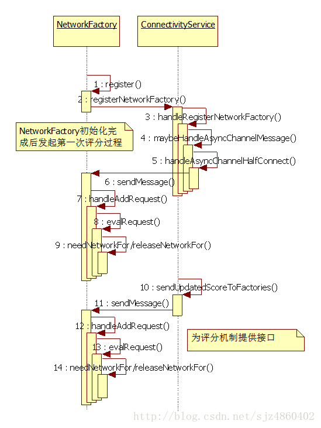

ConnectivityManager主要管理和网络连接相关的操作


主要职责，官方说明：

```
Monitor network connections (Wi-Fi, GPRS, UMTS, etc.)
Send broadcast intents when network connectivity changes
Attempt to “fail over” to another network when connectivity to a network is lost
Provide an API that allows applications to query the coarse-grained or fine-grained state of the available networks
Provide an API that allows applications to request and select networks for their data traffic
监控网络连接(Wi-Fi, GPRS, UMTS, etc.)；
当网络连接改变时发送Intent；
当连接到一个网络失败时，尝试用其他网络补救；
提供API给应用查询有效网络粗略或者精确的状态；
提供API给应用为它们的数据传输请求和选择网络；
```


需要权限 ：

```
  AndroidManifest.xml
  <uses-permission android:name="android.permission.ACCESS_NETWORK_STATE" />
```


Activity getSystemService 获取cn服务

```
    ConnectivityManager connectivityManager =
        (ConnectivityManager) context.getSystemService(Context.CONNECTIVITY_SERVICE);
```


针对xt501 eth0 和wifi 共存问题数据流量通道选择有两个方案：

1， 设置系统首选项，固定某种网络类型优先；

2， app 通过bindProcessToNetwork 设置数据流量通道；


API :

```
setNetworkPreference
```

设置网络首选项：

```
    /**
     * Specifies the preferred network type.  When the device has more
     * than one type available the preferred network type will be used.
     *
     * @param preference the network type to prefer over all others.  It is
     *         unspecified what happens to the old preferred network in the
     *         overall ordering.
     * @deprecated Functionality has been removed as it no longer makes sense,
     *             with many more than two networks - we'd need an array to express
     *             preference.  Instead we use dynamic network properties of
     *             the networks to describe their precedence.
     */
    @Deprecated    
    public void setNetworkPreference(int preference) {    }
```


```
bindProcessToNetwork
```

多网络链接时指定网络链接

```
   /**
     * Binds the current process to {@code network}.  All Sockets created in the future
     * (and not explicitly bound via a bound SocketFactory from
     * {@link Network#getSocketFactory() Network.getSocketFactory()}) will be bound to
     * {@code network}.  All host name resolutions will be limited to {@code network} as well.
     * Note that if {@code network} ever disconnects, all Sockets created in this way will cease to
     * work and all host name resolutions will fail.  This is by design so an application doesn't
     * accidentally use Sockets it thinks are still bound to a particular {@link Network}.
     * To clear binding pass {@code null} for {@code network}.  Using individually bound
     * Sockets created by Network.getSocketFactory().createSocket() and
     * performing network-specific host name resolutions via
     * {@link Network#getAllByName Network.getAllByName} is preferred to calling
     * {@code bindProcessToNetwork}.
     *
     * @param network The {@link Network} to bind the current process to, or {@code null} to clear
     *                the current binding.
     * @return {@code true} on success, {@code false} if the {@link Network} is no longer valid.
     */    
     public boolean bindProcessToNetwork(@Nullable Network network) {        
         // Forcing callers to call through non-static function ensures ConnectivityManager
         // instantiated.
        return setProcessDefaultNetwork(network);
    }
```


```
    // Sort out current Network objects (NetId -> Network)
    private SparseArray<Network> mNetworks = new SparseArray<Network>();
    
    public void bindToNetwork(int netId) {
           Network network = mNetworks.get(netId);
           if (network == null) {
                    return;
           }
           Network def = mConnectivityManager.getBoundNetworkForProcess();
           if (def != null && def.netId != netId) {
                    mConnectivityManager.bindProcessToNetwork(null);
                    showToast("Clear process default network");
           }       
           mConnectivityManager.bindProcessToNetwork(network);
           showToast("Set process default network " + netId);
    }
```


# ConnectivityService框架初识


Android中提供的数据业务方式有几种：移动数据网络，WIFI，热点，网线等。这些数据业务本身可以独立使用，但是同一时刻，只能使用其中的一种数据业务方式。管理这些数据业务方式的使用由ConnectivityService，NetworkFactory，NetworkAgent，NetworkMonitor等来完成，ConnectivityService处于核心调度位置。


ConnectivityService框架主要有四个方面组成：


一 . 网络有效性检测（NetworkMonitor）

二 . 网络评分机制（NetworkFactory）

三 . 路由配置信息的获取（NetworkAgent）

四 . 网络物理端口的设置（Netd）


其大体框架图如下：


ConnectivityService的工作总结起来就是：通过wifi，mobile data，Tethering，VPN 等方式来获取路由配置信息。无论通过哪种方式，获取到路由配置信息后，需要交给ConnectivityService来处理，ConnectivityService通过ping网络来检查网络的有效性，进而影响到各个数据业务方式的评分值，ConnectivityService通过这些评分值来决定以哪个数据业务方式连接网络。决定好数据业务方式后，把这些路由配置信息设置到网络物理设备中。这样我们的手机就可以正常上网了。


初始化：

ConnectivityService属于系统服务，在SystemServer中被启动。

SystemServer启动的服务：

```
NetworkManagementService networkManagement = null;
NetworkStatsService networkStats = null;
NetworkPolicyManagerService networkPolicy = null;
ConnectivityService connectivity = null;
NetworkScoreService networkScore = null;
```

**一 . ConnectivityService初始化**

1. 获取其他服务的接口
2. 注册其他必要的监听和广播，以便接收变化信息和通知变化信息。


二 . NetworkFactory的初始化


NetworkFactory负责了网络评分机制的功能，为了在手机开机后可以及时依靠网络评分机制来选择网络。ConnectivityService服务起来后，在各个模块的初始化过程中，NetworkFactory必须要启动起来。以下的时序图只画了mobile data和wifi模块的NetworkFactory启动流程：


NetworkFactory在register()之后通过AsyncChannel与ConnectivityService建立起了连接，这一块的逻辑流程，如果看不太懂，那么需要去看看：[AsyncChannel的工作机制](http://blog.csdn.net/sjz4860402/article/details/78524091)

三 . NetworkAgent的初始化


NetworkAgent是一个网络代理，它里面保存了一些路由的配置信息，比如NetworkInfo，LinkProperties，NetworkCapabilities等。NetworkAgent的初始化都是在路由配置信息获取成功之后。比如打开数据开关，打开wifi开关等操作之后。


注：

NetworkInfo 描述一个给定类型的网络接口的状态方面的信息，包括网络连接状态、网络类型、网络可连接性、是否漫游等信息

LinkProperties 描述一个网络连接属性信息（包含网络地址、网关、DNS、HTTP代理等属性信息

NetworkCapabilities 描述一个网络连接能力方面的信息，包括带宽、延迟等


四 . NetworkMonitor的初始化


NetworkMonitor主要是检测网络有效性的，通过Http封装类去ping一个网站，根据ping网站的结果来影响评分值。因此，它的初始化是在NetworkAgent初始化之后，必须要获取到路由配置信息NetworkAgent后才会去初始化。


一 . 网络有效性检测（NetworkMonitor）

NetworkMonitor是一个状态机。负责检测网络有效性，也就是ping网络的过程。ping网络过程中产生的几种状态如下：


DefaultState 默认状态

EvaluatingState 验证状态

ValidatedState 验证通过状态

LingeringState 休闲状态，表示网络的验证位是真实的，并且曾经是满足特定NetworkRequest的最高得分网络，但是此时另一个网络满足了NetworkRequest的更高分数，在断开连接前的一段时间前，该网络被“固定”为休闲状态。

CaptivePortalState 强制门户状态

MaybeNotifyState 可能通知状态，表示用户可能已被通知需要登录。 在退出该状态时，应该小心清除通知。


NetworkMonitor中各个状态之间的关系：


以正常的ping网站过程为例，DefaultState为默认状态，NetworkMonitor接收到CMD_NETWORK_CONNECTED事件消息后，先由DefaultState状态处理，然后由EvaluatingState处理，最后交给ValidatedState处理。这一块的逻辑流程，如果看不太懂，那么需要去看看StateMachine状态机的使用：StateMachine状态机初识


从NetworkMonitor的初始化，到ping网站的过程，到ping网站的结果影响评分值。这个过程的时序图如下


接下来将按照时序图中的三大步骤去结合代码分析。

**1 . NetworkMonitor的初始化（以mobile data为例）**

DataConnection从modem中获取到了代理信息，并把此代理信息保存到了NetworkAgent中：

```
mNetworkAgent = new DcNetworkAgent(getHandler().getLooper(), mPhone.getContext(),
        "DcNetworkAgent", mNetworkInfo, makeNetworkCapabilities(), mLinkProperties,
        50, misc);
```

在NetworkAgent的构造函数中，把它自己注册到了ConnectivityService中，

```
ConnectivityManager cm = (ConnectivityManager)mContext.getSystemService(
        Context.CONNECTIVITY_SERVICE);
netId = cm.registerNetworkAgent(new Messenger(this), new NetworkInfo(ni),
        new LinkProperties(lp), new NetworkCapabilities(nc), score, misc);
```

接下来的流程就如时序图所示了，意味着每产生一个代理信息NetworkAgent的对象，就会有自己相应的NetworkMonitor状态机来处理ping网站的过程。


2 . ping网站的过程

NetworkMonitor状态机运行起来后，接收到sendMessage的消息就可以做相应的处理。这里比较重要的就是CMD_NETWORK_LINGER和CMD_NETWORK_CONNECTED消息，分别由ConnectivityService的linger()和unlinger()方法封装发送的操作。

linger():

封装了CMD_NETWORK_LINGER消息的发送操作，让NetworkMonitor进入到休闲状态：

CMD_NETWORK_LINGER消息首先进入到DefaultState.processMessage()处理：

```
case CMD_NETWORK_LINGER:
    transitionTo(mLingeringState);
```


CMD_NETWORK_LINGER消息切换到LingeringState处理，enter()做一个CMD_LINGER_EXPIRED消息延迟发送：

```
public void enter() {
    mEvaluationTimer.reset();
    final String cmdName = ACTION_LINGER_EXPIRED + "." + mNetId;
mWakeupMessage = makeWakeupMessage(mContext, getHandler(), cmdName, CMD_LINGER_EXPIRED);
    long wakeupTime = SystemClock.elapsedRealtime() + mLingerDelayMs;
    mWakeupMessage.schedule(wakeupTime);
    }
```

LingeringState.processMessage()中对延迟消息CMD_LINGER_EXPIRED做处理：

```
case CMD_LINGER_EXPIRED:
    mConnectivityServiceHandler.sendMessage(
            obtainMessage(EVENT_NETWORK_LINGER_COMPLETE, mNetworkAgentInfo));
    return HANDLED;
```


ConnectivityService中处理EVENT_NETWORK_LINGER_COMPLETE消息：

```
case NetworkMonitor.EVENT_NETWORK_LINGER_COMPLETE: {
    NetworkAgentInfo nai = (NetworkAgentInfo)msg.obj;
    if (isLiveNetworkAgent(nai, msg.what)) {
        handleLingerComplete(nai);
    }
    break;
}
private void handleLingerComplete(NetworkAgentInfo oldNetwork) {
    teardownUnneededNetwork(oldNetwork);
}
private void teardownUnneededNetwork(NetworkAgentInfo nai) {
    for (int i = 0; i < nai.networkRequests.size(); i++) {
        NetworkRequest nr = nai.networkRequests.valueAt(i);
if (!isRequest(nr)) continue;
        break;
    }
    nai.asyncChannel.disconnect();
}
```

综上，CMD_NETWORK_LINGER消息的处理就是让NetworkMonitor进入空闲状态，NetworkMonitor处于空闲状态说明此网络不再需要，可以释放掉ConnectivityService和NetworkAgent的连接。

unlinger()：

封装了CMD_NETWORK_CONNECTED消息的发送操作，让NetworkMonitor进入到非休闲状态：

CMD_NETWORK_CONNECTED消息首先进入到DefaultState.processMessage()处理：

```
case CMD_NETWORK_CONNECTED:
    transitionTo(mEvaluatingState);
    return HANDLED;
```

CMD_NETWORK_LINGER消息切换到EvaluatingState处理，enter()方法发送CMD_REEVALUATE消息：

```
public void enter() {
sendMessage(CMD_REEVALUATE, ++mReevaluateToken, 0);
}
```

CMD_REEVALUATE消息由EvaluatingState.processMessage()处理：

Ping网络的关键地方：

CaptivePortalProbeResult probeResult = isCaptivePortal();

isCaptivePortal()通过HttpURLConnection类去ping一个网站，android原生给的网站在中国由于墙的存在，是ping不通的，因此就会出现wifi和信号格旁边有一个感叹号。芯片厂商一般会对这个网站进行客制化：

```
private static String getCaptivePortalServerUrl(Context context, boolean isHttps) {
    String server = Settings.Global.getString(context.getContentResolver(),
            Settings.Global.CAPTIVE_PORTAL_SERVER);
if (server == null) server = DEFAULT_SERVER_SECONDARY;
    return (isHttps ? "https" : "http") + "://" + server + "/generate_204";
}
```

在log中可以找到当前ping的网站是哪一个:

3 . 根据ping网站的结果影响评分值

```
if (probeResult.isSuccessful()) {
    transitionTo(mValidatedState);
} else if (probeResult.isPortal()) {
transitionTo(mCaptivePortalState);
} else {
final Message msg = obtainMessage(CMD_REEVALUATE, ++mReevaluateToken, 0);
sendMessageDelayed(msg, mReevaluateDelayMs);
mReevaluateDelayMs *= 2;
if (mReevaluateDelayMs > MAX_REEVALUATE_DELAY_MS) {
    mReevaluateDelayMs = MAX_REEVALUATE_DELAY_MS;
}
}
boolean isSuccessful() { return mHttpResponseCode == 204; }
boolean isPortal() {
    return !isSuccessful() && mHttpResponseCode >= 200 && mHttpResponseCode <= 399;
}
```

根据ping网络的结果来执行不同的操作：

一．如果ping网络成功，网络返回204，切换到ValidatedState状态处理。

二．如果ping网络失败，网络返回200~399，转到CaptivePortalState状态处理。

三．如果ping网络失败，不是204，也不是200~399，则发送CMD_REEVALUATE消息，重新触发ping网络的动作。第一次失败，8s后重新ping网络，第二次失败，16s后重新ping网络，时间依次倍增，最长的时间间隔为10分钟。

重点关注ping网络成功后，ValidatedState状态的处理：ValidatedState.enter()

```
mConnectivityServiceHandler.sendMessage(obtainMessage(EVENT_NETWORK_TESTED,
        NETWORK_TEST_RESULT_VALID, mNetworkAgentInfo.network.netId, null));
```

ConnectivityService中处理EVENT_NETWORK_TESTED消息，把ping成功的状态保存到NetworkAgentInfo中，并通知NetworkFactory评分值已变，需要重新评估。

```
if (valid != nai.lastValidated) {
    final int oldScore = nai.getCurrentScore();
    nai.lastValidated = valid;
    nai.everValidated |= valid;
    updateCapabilities(nai, nai.networkCapabilities);
    // If score has changed, rebroadcast to NetworkFactories. b/17726566
    if (oldScore != nai.getCurrentScore()) sendUpdatedScoreToFactories(nai);
}
```

这里需要说明一下，ping网络的状态会保存到NetworkAgentInfo中，而后续所有的评分值都会调用NetworkAgentInfo的getCurrentScore()方法来获取，getCurrentScore()方法会根据当前ping网络的状态重新计算评分值：

```
private int getCurrentScore(boolean pretendValidated) {
if (networkMisc.explicitlySelected && (networkMisc.acceptUnvalidated || pretendValidated)) {
        return MAXIMUM_NETWORK_SCORE;
    }
    int score = currentScore;
    if (!networkCapabilities.hasCapability(NET_CAPABILITY_VALIDATED) && !pretendValidated) {
        score -= UNVALIDATED_SCORE_PENALTY;
    }
    if (score < 0) score = 0;
    return score;
}
```

如果是用户指定的联网方式，评分值设置为100，如果ping网络失败，评分值-40，如果ping网络成功，则评分值不变。

二 . 网络评分机制（NetworkFactory）

NetworkFactory的存在意义就是为了帮助ConnectivityService进行评分的管理。一般在NetworkFactory在初始化时，设置固定的评分值，作为评判的标准。

NetworkAgent作为一个代理信息的抽象，在其初始化时，也设置了固定的评分值，不过，这个评分值会根据当前的网络情况的不同而变化，其最后的评分值会和NetworkFactory中的固定评分值进行比较，从而筛选出最优网络。

NetworkFactory和NetworkAgent的评分初始化：

TelephonyNetworkFactory：

```
private final static int TELEPHONY_NETWORK_SCORE = 50;
setCapabilityFilter(makeNetworkFilter(subscriptionController, phoneId));
setScoreFilter(TELEPHONY_NETWORK_SCmNetworkAgent = new
```

DataConnection（NetworkAgent子类）：

```
DcNetworkAgent(getHandler().getLooper(), mPhone.getContext(),
        "DcNetworkAgent", mNetworkInfo, makeNetworkCapabilities(), mLinkProperties,
        50, misc);
ORE);
```

以上只列出了TelephonyNetwork的评分初始化情况。以下是各个网络类型的评分初始化和变化情况：


各种数据业务类型的评分标准，除了其基础评分值不同之外，其他的评判标准都一样。其评分值的变化，主要有以下几种情况：

一．代理信息获取结束后，会参与ping网络的过程，如果ping网络成功，那么NetworkAgent中的评分值不变。如果ping网络失败，那么NetworkAgent中的评分值-40。如果用户指定了某种网络类型作为连接方式，那么NetworkAgent重的评分值+100。

二．如果NetworkAgent和ConnectivityService的AsyncChannel通道断开，需要设置其评分值为0，好让其他的评分高的网络类型连接




ConnectivityService的工作总结起来就是：通过wifi，mobile data，Tethering，VPN 等方式来获取路由配置信息。无论通过哪种方式，获取到路由配置信息后，需要交给ConnectivityService来处理，ConnectivityService通过ping网络来检查网络的有效性，进而影响到各个数据业务方式的评分值，ConnectivityService通过这些评分值来决定以哪个数据业务方式连接网络。决定好数据业务方式后，把这些路由配置信息设置到网络物理设备中。这样我们的终端就可以正常上网了