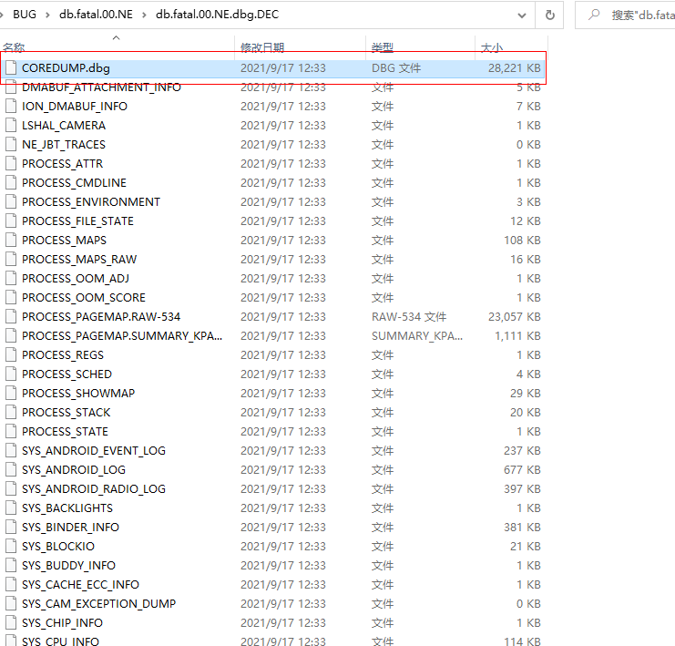
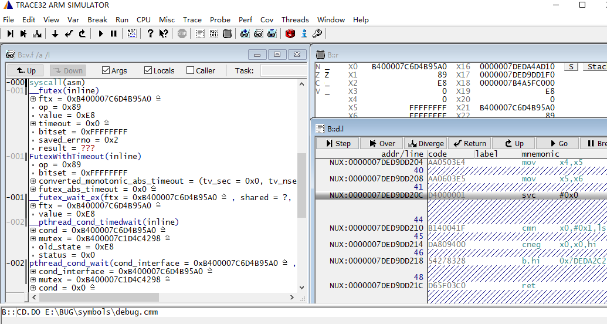
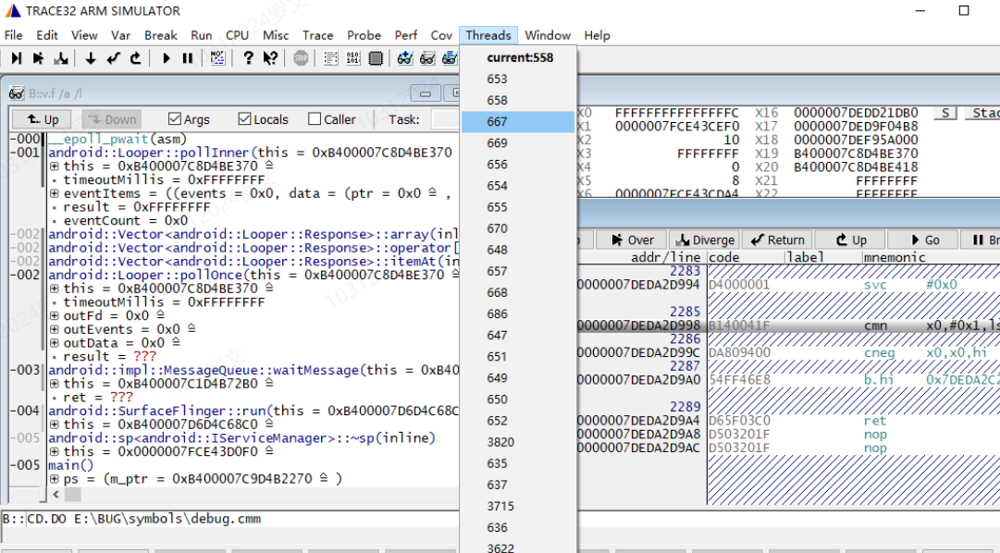

QAAT_Standard_Package_cust_2.8.7z

simarm64.7z

GtoTtool.7z

TRACE32作为一种真正集成化、通用性系统仿真器可以组合成多种方案，可以支持网络方案、实验室单机方案、异地光纤方案等，它具有全模块化、积木式结构、可支持JTAG及BDM接口和所有CPU，能够提供软件分析、端口分析、波形分析以及软件测试等强大功能。

TRACE32是由德国Lauterbach公司研制开发的一款仿真测试工具。TRACE32作为一种真正集成化、通用性系统仿真器可以组合成多种方案，可以支持网络方案、实验室单机方案、异地光纤方案等，它具有全模块化、积木式结构、可支持JTAG及BDM接口和所有CPU，能够提供软件分析、端口分析、波形分析以及软件测试等强大功能。

Trace32：官网：http://www.lauterbach.com/

我们主要用于离线分析，比如linux ramdump， process coredump分析等， 不需要购买完整版Trace32 ， Trace32 for arm64 试用版本下载链接https://www2.lauterbach.com/download/simarm64.zip， 下载后只能是试用版小时， 保留binary和配置文件把其他文件删除可以继续作为离线分析使用；可以直接下载附件simarm64.7z（按照信息安全要求，附件无法复制粘贴）

 MT8195/mt8195 用使用aee机制异常和异常环境系统信息就行打包， 异常包获取位置为/data/aee_exp或者 /data/vendor/aee_exp 具体参考   mtklog 介绍使用、mtk异常分类 和  Android异常机制和分析-JE&&SWT 了解； 解包工具可以使用MTK 的GAT工具或者 附近中QAAT_Standard_Package_cust_2.8.7z（按照信息安全要求，附件无法复制粘贴） 解包（安装后右键）QAAT-check解包， QAAT使用需要jdk环境，jdk安装包可以从197服务器的\opengrok-1.3.16\Common_tools目录下载；

针对NE 异常产生的coredump使用QAAT解包后Core文件是COREDUMP.dbg，这还是一个压缩的coredump文件，点击这个文件继续右键QAAT-check二次解包；coredump：PROCESS_COREDUMP生成在COREDUMP.dbg.DEC目录下

[]

拿到coredump 加上对应编译版本的symbols 可以使用GDB分析或者 mtk GAT分析（同样是使用gdb）， 也可以使用trace32分析； GDB 使用可以参考百度， 也可以使用附件中GtoTtool 工具安装后点击异常带符号的二进制文件右键GtoTtool 分析生成试用版本Trace32能直接加载的脚本；【GtoTtool 需要本地安装gdb 和python3 】

  1 打开trace32 直接把debug.cmm 拖到cmd 输入窗口enter加载]
  2 点击导航上Threads 可以切换当前线程， 带current 标记的为异常产生coredump的线程

**点击thread 可以看到异常进程的所有线程，可以点击切换：**

ulimit -c unlimited
echo /data/coredump/core.%e.%p> /proc/sys/kernel/core_pattern

1. 将coredump文件重命名为PROCESS_COREDUMP， 带符号的二进制执行文件， 和库放相同目录下；
2. 点击带符号的二进制执行文件右键QtoTtool 运行，当前目录下产生debug.cmm
3. 打开trace32 ，将debug.cmm 拖到cmd里面执行

1.离线
离线调试需要如下材料：

* coredump，打开限制崩溃后生成
   ulimit -a
   ulimit -c unlimited
   echo /data/coredump/core.%e.%p> /proc/sys/kernel/core_pattern
   %e和%p会被替换成程序文件名以及进程ID

* 带debug调试符号的可执行elf
   安卓 lunch xxx-userdebug后编译出的native elf在如下路径
   out/target/product/tb8185p2_64/obj/EXECUTABLES/wpa_cli_intermediates/LINKED/wpa_cli，这个elf文件默认带有使用-g选项编译出的debug_xxx段，但out/target/product/tb8185p2_64/obj/EXECUTABLES/wpa_cli_intermediates/wpa_cli
   文件被strip了，导致实际上打包进镜像的没有debug_xxx段和符号表。
   mk编译模块时默认进行了strip，加入如下可以取消strip：
   LOCAL_STRIP_MODULE := false

* 依赖的带debug调试符号的so库
与可执行elf文件类似，例如如下文件就含有debug_xxx段out/target/product/tb8185p2_64/obj/SHARED_LIBRARIES/libCamera_s5khm2spmipiraw_Scene_Capture_intermediates/LINKED/libCamera_s5khm2spmipiraw_Scene_Capture.so
如果是prebuild类型的so库则out/target/product/tb8185p2_64/obj/SHARED_LIBRARIES/xxx/下就没有.o文件等，如果该prebuild so本身包含debug_xxx段则有，没有则无

T32使用-常用命令
list 0xXXXX /symbol ：查看0xXXXX所在处的代码
d.dump 0xXXXX:查看0xXXXX位置的内存数据
d.save file.txt 0xXXX+0xXXX:保存特定地址特定长度的内存数据到file.txt中
d.load datafile:加载数据文件，一般用来加载内存数据
d.load.elf elffile:加载elf文件
sys.m.a :attach cpu
y.spath.srd [path]:加载源码文件
v.v 、v.f:查看某变量，和查看调用栈

编译：
CFLAGS += -Og 
EXTRA_LDFLAGS += --strip-debug， 会移除debug 行

:: -w                 Use the GUI interface.
aarch64-linux-android-gdb.exe  -x C:\GtoTtool\init.gdb   --args Y:\project\coredump\PROCESS_COREDUMP    -q -nw   >nul 2>nul

(gdb) 
set architecture aarch64
set osabi GNU/Linux
set auto-solib-add on
set print thread-events off
set print pretty on
core PROCESS_COREDUMP
set sysroot symbols
set solib-search-path ./;symbols;symbols/system/lib64
source C:/GtoTtool/main.py
quit

pthread for native debug
set osabi GNU/Linux

show osabi

set auto-solib-add off
set print thread-events off
set print pretty on
dir src
set solib-search-path symbols;symbols/system/lib64
set sysroot symbols
file symbols/surfaceflinger
core PROCESS_COREDUMP
info proc mappings    ==> show maps
sharedlibrary libc.so
sharedlibrary libc++.so
sharedlibrary libsurfaceflinger.so
sharedlibrary libutils.so
sharedlibrary libhidlbase.so
sharedlibrary libbinder.so
sharedlibrary surfaceflinger
sharedlibrary linker64
info sharedlibrary ==> show which syms already
info reg  =>show register
info all-reg      ==> include dsh
source script   ==>read, execute GDB commands from file script

