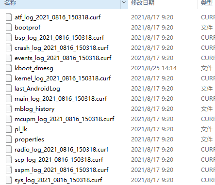

mtklog 机制中有mobile_log_d进程第一次开机会根据system/etc/mtklog-config.prop 配置解析，解析后生成配置/data/misc/mblog/mblog_config 后续开机mobile_log_d参考mblog_config配置抓对应log

https://gerrit.zte.com.cn/#/c/9618631/

https://gerrit.zte.com.cn/#/c/9642992/

其他都是废话直接关注如何使用，合入如上代码后， mobile_log_d 开机会默认开始抓log 

系统开机后会拉起mobile_log_d服务在/data/debuglogger/mobilelog目录下生成AP_log目录， 整个mobilelog目录有大小限制的循环机制，如果目录超过限制或删除最老的APLog：

eg:  /data/debuglogger/mobilelog/APLog_2021_0816_150317__1：

1. kernel_log: proc/kmsg
2. Android 四种log类型（main, events, crash, radio, sys）: logcat -b main/events/crash/radio
3. pl_lk: 开机的preloader 和lk log， proc/pl_lk
4. last_kmsg: 上次重启前log(关机后开机不会产生)
5. kboot_dmesg: 开机的kernel log(从0s 开始到当前开机dump时间)，从proc/kboot_dmesg获取， 开机后可以随时获取
6. properties： 系统属性

系统异常后或者问题浮现后，需要准备哪些东西分析：

1.  获取log： adb pull /data/debuglogger/mobilelog/  
2.  Userspace异常（JE/NE/ANR）:  adb pull /data/aee_exp  【如果是Native exception ,需要备份对应进程和lib库的symbols 文件去还原dump现场 】
3.  Kernel 异常（KE，HWT，HW-reboot）: adb pull /data/vendor/aee_exp  【Kernel Exception ，需要备份对应版本的vmlinux】

注： 如有疑问或者相关感兴趣问题，可以私下与我沟通添加介绍

\---------------------------------------------------------------------------------------------

附录：

mtklog 默认配置说明和mtklogUI使用：

codebase 配置文件路径

device/mediatek/system/common/mtklog/mtklog-config-basic-user.prop 

文件会编译到

system/etc/mtklog-config.prop

开机会从system/etc/mtklog-config.prop解析配置生成mblog_config文件：

/data/misc/mblog/mblog_config

ZTE 更改默认配置， 开机默认启动Android log 和kernel log录制：

\# mtk log path can be set as system_data or device_storage or portable_storage

mtklog_path = system_data

com.mediatek.log.mobile.customer = MTK_Internal

com.mediatek.log.mobile.AllMode = true

\#ifdef VENDOR_EIDT

\#luo.wen@zte.com.cn，2021/8/17， config detail mobile sub log

com.mediatek.log.mobile.enabled = true

\#endif

com.mediatek.log.modem.enabled = false

com.mediatek.log.net.enabled = false

com.mediatek.log.connsysfw.enabled = false

com.mediatek.log.gpshost.enabled = false

com.mediatek.log.bthost.enabled = false

com.mediatek.log.mobile.maxsize = 500

com.mediatek.log.mobile.totalmaxsize = 1000

com.mediatek.log.modem.maxsize = 2000

com.mediatek.log.net.maxsize =600

com.mediatek.log.connsysfw.maxsize = 2000

com.mediatek.log.bthost.maxsize = 2000

\#ifdef VENDOR_EIDT

\#luo.wen@zte.com.cn，2021/8/17， config detail mobile sub log

com.mediatek.log.mobile.AndroidLog = true

com.mediatek.log.mobile.KernelLog = true

com.mediatek.log.mobile.BSPLog = true

com.mediatek.log.mobile.SCPLog = false

com.mediatek.log.mobile.ATFLog = false

com.mediatek.log.mobile.MmediaLog = false

com.mediatek.log.mobile.SSPMLog = false

com.mediatek.log.mobile.ADSPLog = false

\#endif

使能mobile log相关：

am broadcast -a com.debug.loggerui.ADB_CMD -e cmd_name ***start*** --ei cmd_target ***1\*** -n com.debug.loggerui/.framework.LogReceiver

am broadcast -a com.debug.loggerui.ADB_CMD -e cmd_name ***stop*** --ei cmd_target ***1\*** -n com.debug.loggerui/.framework.LogReceiver

配置mobile log 相关子项：

命令格式: 
adb shell am broadcast -a com.debug.loggerui.ADB_CMD -e cmd_name set_sublog_***type1_type2_... typen***_***value*** --ei cmd_target ***1*** -n com.debug.loggerui/.framework.LogReceiver
**value** = 1/0 (enable/disabled)
***type1_type2_...typen*** = 1_2_..._8
UB_LOG_TYPE_ANDROID = 1
UB_LOG_TYPE_KERNEL = 2;
UB_LOG_TYPE_SCP = 3; 
UB_LOG_TYPE_ATF = 4;
UB_LOG_TYPE_BSP = 5;
UB_LOG_TYPE_MMEDIA = 6;
UB_LOG_TYPE_SSPM = 7; 
UB_LOG_TYPE_ADSP =8

**例:** 开启 Android Log & Kernel Log命令:

adb shell am broadcast -a com.debug.loggerui.ADB_CMD -e cmd_name set_sublog_1_2_1 --ei cmd_target 1 -n com.debug.loggerui/.framework.LogReceiver

am broadcast -a com.debug.loggerui.ADB_CMD -e cmd_name start  --ei cmd_target 1 -n com.debug.loggerui/.framework.LogReceiver
am broadcast -a com.debug.loggerui.ADB_CMD -e cmd_name stop  --ei cmd_target 1 -n com.debug.loggerui/.framework.LogReceiver
配置mobile log 相关子项：

命令格式: 
adb shell am broadcast -a com.debug.loggerui.ADB_CMD -e cmd_name set_sublog_type1_type2_... typen_value --ei cmd_target 1 -n com.debug.loggerui/.framework.LogReceiver
value = 1/0 (enable/disabled)
type1_type2_...typen = 1_2_..._8
UB_LOG_TYPE_ANDROID = 1
UB_LOG_TYPE_KERNEL = 2;
UB_LOG_TYPE_SCP = 3; 
UB_LOG_TYPE_ATF = 4;
UB_LOG_TYPE_BSP = 5;
UB_LOG_TYPE_MMEDIA = 6;
UB_LOG_TYPE_SSPM = 7; 
UB_LOG_TYPE_ADSP =8

例: 开启 Android Log & Kernel Log命令:
adb shell am broadcast -a com.debug.loggerui.ADB_CMD -e cmd_name set_sublog_1_2_1 --ei cmd_target 1 -n com.debug.loggerui/.framework.LogReceiver

  adb pull /data/debuglogger/mobilelog/       获取log：
  adb pull /data/aee_exp                     Userspace异常（JE/NE/ANR）【如果是Native exception ,需要备份对应进程和lib库的symbols 文件去还原dump现场 】
  adb pull /data/vendor/aee_exp               Kernel 异常（KE，HWT，HW-reboot）:    【Kernel Exception ，需要备份对应版本的vmlinux】