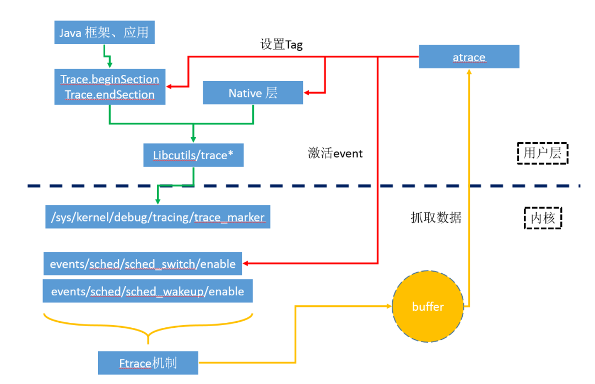
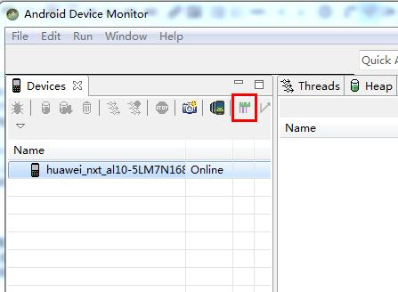
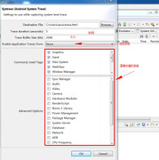
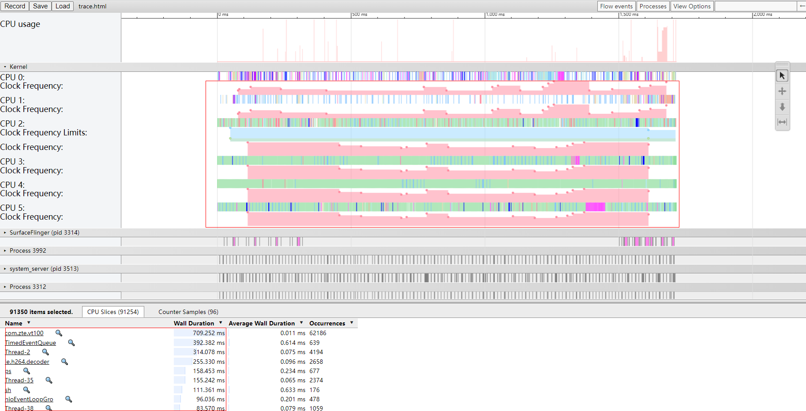
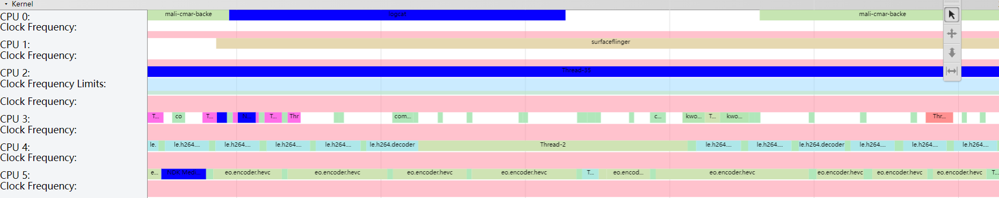

## 一. Systrace 简介

Systrace 允许你收集和检查设备上运行的所有进程的计时信息。 它包括Androidkernel的一些数据（例如`CPU调度`程序，IO和APP Thread），并且会生成HTML报告，方便用户查看分析trace内容。

## 二. Systrace 作用和原理

### **1. systrace作用** 

分析`Android`系统或者某个`app`的卡顿性能或者渲染问题，这时候Systrace 就非常有用。
首先我们需要抓取`Systrace`文件，然后分析并找出引起系统卡顿，或者`app反应慢`的原因，最好在源码上解决引起卡顿、响应慢的问题

### **2. systrace原理**

systrace抓取的trace数据，总体上可以分为两类，一类是Java和Native在用户层发生的函数调用，一类是内核态的事件信息。用户层的函数调用，其实最终事件记录都是同一个文件节点/sys/kernel/debug/tracing/trace_marker。此节点允许用户层写入字符串，ftrace会记录该写入操作时的时间戳，当用户在上层调用不同函数时，写入不同的调用信息，比如函数进入和退出分别写入，那么ftrace就可以记录跟踪函数的运行时间。atrace在处理用户层的多种trace类别时，仅仅是激活不同的TAG，如用户选择了Input类别，则激活ATRACE_TAG_INPUT；选中Graphics则激活ATRACE_TAG_GRAPHICS，记录调用的流程都是一样的，最终都是记录到trace_marker。内核态的事件信息，则不是统一的，需要激活各自对应的事件节点，让ftrace记录下不同事件的tracepoint。例如激活进程调度信息记录，需要激活如下相关节点：

events/sched/sched_switch/enable

events/sched/sched_wakeup/enable

内核在运行时，根据节点的使能状态，会往ftrace缓冲中打点记录事件。最终，上述两类事件记录都汇集到同一缓冲中，然后atrace工具会回读抓取，保存下来就是原始的systrace信息

## 三. 抓取Systrace 方法

要想分析卡顿现场，必须先获取到卡顿现场的Systrace文件，获取Systrace文件的方式有两种，一种是通过AndroidSDK/tools目录下，通过monitor.bat用Android Device Monitor可视化工具得到，一种是通过python脚本获取，我本人更喜欢通过脚本获取，因为更方便一点。

### **1.通过Android Device Monitor获取**

 1连接终端，adb可用状态，打开`Android Device Monitor`，选择要分析的进程(比如`com.google.process.gapps`)，点击绿色按钮启动Systrace

2. 选择抓取Systrace的配置文件

3 点击OK开始抓取

### **2. 通过python脚本抓取（推荐）**

装python2.X版本，Systrace脚本不支持3.X版本， 安装python2 需要pywin32 支持， 安装pywin32，需要先安装pip 【pip pywin32 six】

python.exe pip-18.1\setup.py install

setuptool

pip.exe install pywin32-224-cp27-cp27m-win_amd64.whl

pip.exe install six-1.12.0-py2.py3-none-any.whl

通过python脚本执行AndroidSDK\platform-tools\systrace\目录下的systrace.py文件

可以配置一些参数，类似于通过Android Device Monitor抓取时步骤2配置的显示信息，若不选择则默认全部抓取

配置参数:

 -o： 指定文件输出位置和文件名

 -t： 抓取systrace的时间长度

-a： 指定特殊进程包名（自己加Label时必须加上）

## 四. 目标文件trace.html分析

### 1. Chrome 浏览器

地址栏输入`chrome://tracing`命令，然后将生成的`trace.html`文件拖进来，或者通过`load`按钮导入

eg： 示例图片中，小核心cpu基本跑满，但是大核心cpu使用率还是比较低， cpu使用top：vt100(前台app), EventQueue(调整过优先级), Thread-2, h264-decoder ， 问题是视频跟不是音频，视频解码慢

h264-decoder 解码慢，但是都是跑在小核心上面 而且小核心跑满， 需要把h264-decoder 移到大核心

### **2. 常用快捷键**

- `W`: 放大横轴，用于查看耗时方法细节；
- `S`: 缩小横轴，用于查看整体情况；
- `A`： 将面板左移；
- `D`: 将面板右移；
- `M`: 高亮某一段耗时内容。

工具：SDK platform-tools、python2、systrace所需要的python2版本插件pywin32/six/pip/setuptool

