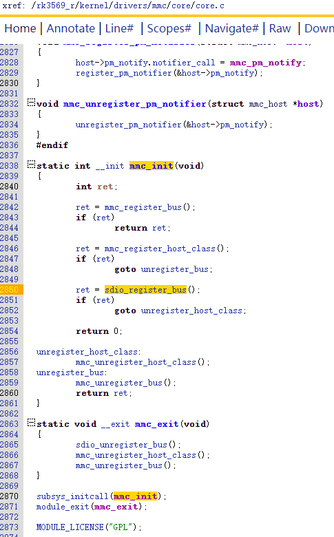

## 1 模组适配

### android-hardware-wifi@1.0-service

frameworks/opt/net/wifi/libwifi_hal/Android.mk

```
BOARD_WLAN_DEVICE           :=  MediaTek

ifeq ($(BOARD_WLAN_DEVICE), MediaTek)
103   # support MTK WIFI HAL
104   LIB_WIFI_HAL := libwifi-hal-mt66xx
......
114 include $(CLEAR_VARS)
115 LOCAL_MODULE := libwifi-hal
116 LOCAL_PROPRIETARY_MODULE := true
117 LOCAL_CFLAGS := $(wifi_hal_cflags)
118 LOCAL_C_INCLUDES := $(LOCAL_PATH)/include
119 LOCAL_EXPORT_C_INCLUDE_DIRS := \
120     $(LOCAL_PATH)/include
121 LOCAL_EXPORT_HEADER_LIBRARY_HEADERS := libhardware_legacy_headers
122 LOCAL_HEADER_LIBRARIES := libhardware_legacy_headers
123 LOCAL_SHARED_LIBRARIES := \
124     libbase \
125     libcutils \
126     liblog \
127     libnl \
128     libutils \
129     librkwifi-ctrl \
130     $(VENDOR_LOCAL_SHARED_LIBRARIES)
131 LOCAL_SRC_FILES := \
132     driver_tool.cpp \
133     hal_tool.cpp
134 LOCAL_WHOLE_STATIC_LIBRARIES := $(LIB_WIFI_HAL) libwifi-hal-common
135 include $(BUILD_SHARED_LIBRARY)
```

 libwifi-hal.so由 libwifi-hal-mt66xx.a(模组厂商的)和libwifi-hal-common.a构成

android-hardware-wifi@1.x-service 使用 libwifi-hal.so


wifi_hal/Android.mk

```
LOCAL_PATH := $(call my-dir)

# Make the HAL library
# ============================================================
include $(CLEAR_VARS)

LOCAL_REQUIRED_MODULES :=

LOCAL_CFLAGS += -Wno-unused-parameter -Wno-int-to-pointer-cast
LOCAL_CFLAGS += -Wno-maybe-uninitialized -Wno-parentheses
LOCAL_CPPFLAGS += -Wno-conversion-null

ifneq ($(TARGET_BUILD_VARIANT), user)
LOCAL_CFLAGS += -DCONFIG_DEBUG_VER
endif

LOCAL_C_INCLUDES += \
	external/libnl/include \
	$(call include-path-for, libhardware_legacy)/hardware_legacy \
	external/wpa_supplicant_8/src/drivers

LOCAL_SRC_FILES := \
	wifi_hal.cpp \
	common.cpp \
	cpp_bindings.cpp \
	wifi_logger.cpp \
	wifi_offload.cpp

LOCAL_SHARED_LIBRARIES += libutils liblog
LOCAL_MODULE := libwifi-hal-mt66xx
LOCAL_PROPRIETARY_MODULE := true
LOCAL_MODULE_OWNER := mtk

include $(BUILD_STATIC_LIBRARY)
```


### wpa_supplicant 


```
WPA_SUPPLICANT_VERSION      := VER_0_8_X

BOARD_HOSTAPD_DRIVER        := NL80211

BOARD_WPA_SUPPLICANT_DRIVER := NL80211

BOARD_WPA_SUPPLICANT_PRIVATE_LIB := lib_driver_cmd_mt66xx

BOARD_HOSTAPD_PRIVATE_LIB   := lib_driver_cmd_mt66xx
```

lib_driver_cmd_mt66xx是静态库

wpa_supplicant 在构建时需要BOARD_WPA_SUPPLICANT_PRIVATE_LIB指定的静态库模块

 


/vendor/etc/wifi/目录下

wpa-supplicant.conf

wpa-supplicant-overlay.conf

p2p-supplicant-overlay.conf


### 固件及驱动配置文件

/vendor/firmware/目录下

firmware.bin（eg: mt7663_patch_e2_hdr.bin  WIFI_RAM_CODE_MT7663.bin）

driver_config_file(eg:   TxPwrLimit_MT76x3.dat  wifi_mt7661.cfg  )


### wifi driver

dts

sdio bus

sdio device

sdio drive


### framework

WifiNative.java

安卓系统打开wifi时中先调用setupInterfaceForClientInScanMode进入扫描状态，然后调用switchClientInterfaceToConnectivityMode进入模连接状态。通常情况下wpa_supplicant在switchClientInterfaceToConnectivityMode时才启动，mtk平台对二者进行了一些修改，让wpa_supplicant在setupInterfaceForClientInScanMode阶段就启动了。


## 2 扫卡及sdio device注册(rk平台)


device_add

```
int device_add(struct device *dev) {

1、dev->parent   //parent必须不为空，用于在/sys/devices/${dev->parent}下面创建子设备

2、dev->class   //class可以为空，如果不为空则调用device_add_class_symlinks(dev)在/sys/class/${dev->class}下创建符号连接并指向在/sys/devices/${dev->parent}下创建的子设备。

3、dev->bus    //bus可以为空，如果不为空则调用bus_add_device(dev)在/sys/bus/${dev->bus}/devices/下创建符号连接并指向在/sys/devices/${dev->parent}下创建的子设备，并调用.match函数指针去匹配dev->bus上的driver如果匹配则调用driver的probe。

}
```


int platform_device_register(struct platform_device *pdev)                                                                                                            //1 (2) 3

struct device *device_create(struct class *class, struct device *parent,dev_t devt, void *drvdata, const char *fmt, ...)       //1 2

int mmc_add_host(struct mmc_host *host)                                                                                                                                       //1 2

int mmc_add_card(struct mmc_card *card)                                                                                                                                      //1 (2) 3


### platform_device

根据/rk3569_r/kernel/drivers/mmc/host/Kconfig和/rk3569_r/kernel/drivers/mmc/host/Makefile

分别定义了如下config，并且对应在/rk3569_r/kernel/drivers/mmc/host/下要编译进内核的驱动模块文件有：

CONFIG_MMC_SDHCI=y
obj-y + = sdhci.o                                  

CONFIG_MMC_SDHCI_PLTFM=y
obj-y + = sdhci-pltfm.o
CONFIG_MMC_SDHCI_OF_ARASAN=y
obj-y + = sdhci-of-arasan.o

CONFIG_MMC_SDHCI_OF_DWCMSHC=y
obj-y + = sdhci-of-dwcmshc.o

CONFIG_MMC_DW=y
obj-y + = dw_mmc.o                                  

CONFIG_MMC_DW_PLTFM=y
obj-y + = dw_mmc-pltfm.o

CONFIG_MMC_DW_ROCKCHIP=y
obj-y + = dw_mmc-rockchip.o
obj-y + = rk_sdmmc_ops.o

CONFIG_MMC_CQHCI=y
obj-y + = cqhci.o


kernel/arch/arm64/boot/dts/rockchip/rk3568.dtsi

```
2122 	sdmmc2: dwmmc@fe000000 {
2123 		compatible = "rockchip,rk3568-dw-mshc",
2124 			     "rockchip,rk3288-dw-mshc";
2125 		reg = <0x0 0xfe000000 0x0 0x4000>;
2126 		interrupts = <GIC_SPI 100 IRQ_TYPE_LEVEL_HIGH>;
2127 		max-frequency = <150000000>;
2128 		clocks = <&cru HCLK_SDMMC2>, <&cru CLK_SDMMC2>,
2129 			 <&cru SCLK_SDMMC2_DRV>, <&cru SCLK_SDMMC2_SAMPLE>;
2130 		clock-names = "biu", "ciu", "ciu-drive", "ciu-sample";
2131 		fifo-depth = <0x100>;
2132 		resets = <&cru SRST_SDMMC2>;
2133 		reset-names = "reset";
2134 		status = "disabled";
2135 	};
......
2420 	sdmmc0: dwmmc@fe2b0000 {
2421 		compatible = "rockchip,rk3568-dw-mshc",
2422 			     "rockchip,rk3288-dw-mshc";
2423 		reg = <0x0 0xfe2b0000 0x0 0x4000>;
2424 		interrupts = <GIC_SPI 98 IRQ_TYPE_LEVEL_HIGH>;
2425 		max-frequency = <150000000>;
2426 		clocks = <&cru HCLK_SDMMC0>, <&cru CLK_SDMMC0>,
2427 			 <&cru SCLK_SDMMC0_DRV>, <&cru SCLK_SDMMC0_SAMPLE>;
2428 		clock-names = "biu", "ciu", "ciu-drive", "ciu-sample";
2429 		fifo-depth = <0x100>;
2430 		resets = <&cru SRST_SDMMC0>;
2431 		reset-names = "reset";
2432 		status = "disabled";
2433 	};
2434 
2435 	sdmmc1: dwmmc@fe2c0000 {
2436 		compatible = "rockchip,rk3568-dw-mshc",
2437 			     "rockchip,rk3288-dw-mshc";
2438 		reg = <0x0 0xfe2c0000 0x0 0x4000>;
2439 		interrupts = <GIC_SPI 99 IRQ_TYPE_LEVEL_HIGH>;
2440 		max-frequency = <150000000>;
2441 		clocks = <&cru HCLK_SDMMC1>, <&cru CLK_SDMMC1>,
2442 			 <&cru SCLK_SDMMC1_DRV>, <&cru SCLK_SDMMC1_SAMPLE>;
2443 		clock-names = "biu", "ciu", "ciu-drive", "ciu-sample";
2444 		fifo-depth = <0x100>;
2445 		resets = <&cru SRST_SDMMC1>;
2446 		reset-names = "reset";
2447 		status = "disabled";
2448 	};
```

设备树被解析后生成三个平台设备，对应

/sys/devices/platform/fe000000

/sys/devices/platform/fe2b0000

/sys/devices/platform/fe2c0000

三个平台设备compatible有一项为"rockchip,rk3288-dw-mshc"，与如下驱动匹配(调三次probe，每次调用时传入的struct platform_device *pdev指向不同的平台设备)：

kernel/drivers/mmc/host/dw_mmc-rockchip.c

```
392  static const struct of_device_id dw_mci_rockchip_match[] = {
393  	{ .compatible = "rockchip,rk2928-dw-mshc",
394  		.data = &rk2928_drv_data },
395  	{ .compatible = "rockchip,rk3288-dw-mshc",
396  		.data = &rk3288_drv_data },
397  	{},
398  };
......
464  static struct platform_driver dw_mci_rockchip_pltfm_driver = {
465  	.probe		= dw_mci_rockchip_probe,
466  	.remove		= dw_mci_rockchip_remove,
467  	.driver		= {
468  		.name		= "dwmmc_rockchip",
469  		.of_match_table	= dw_mci_rockchip_match,
470  		.pm		= &dw_mci_rockchip_dev_pm_ops,
471  	},
472  };
473  
474  module_platform_driver(dw_mci_rockchip_pltfm_driver);
......
```


在dw_mmc-rockchip驱动模块装载时调用到dw_mci_rockchip_probe

kernel/drivers/mmc/host/dw_mmc-rockchip.c


在dw_mci_rockchip_probe函数中调用到dw_mci_pltfm_register。dw_mci_pltfm_register是dw_mmc-pltfm驱动模块导出的函数符号，dw_mci_rockchip_probe和dw_mci_pltfm_register负责解析设备树中的部分信息并放入struct dw_mci结构体host。


dw_mci_pltfm_register最后调用到了dw_mci_probe，dw_mci_probe是dw_mmc驱动模块导出的符号：

/rk3569_r/kernel/drivers/mmc/host/dw_mmc.c

```
3305  int dw_mci_probe(struct dw_mci *host)
3306  {
......
3502  	/* We need at least one slot to succeed */
3503  	ret = dw_mci_init_slot(host);
......
3528  }
3529  EXPORT_SYMBOL(dw_mci_probe);
```

dw_mci_probe调用到了dw_mci_init_slot。


###  mmc_host

平台驱动把host子设备注册到平台设备之下，一个sdio/sd/mmc控制器对应一个host子设备。


/rk3569_r/kernel/drivers/mmc/host/dw_mmc.c

```
2902  static int dw_mci_init_slot(struct dw_mci *host)
2903  {
2904  	struct mmc_host *mmc;
2905  	struct dw_mci_slot *slot;
2906  	int ret;
2907  
2908  	mmc = mmc_alloc_host(sizeof(struct dw_mci_slot), host->dev);
2909  	if (!mmc)
2910  		return -ENOMEM;
2911  
2912  	slot = mmc_priv(mmc);
2913  	slot->id = 0;
2914  	slot->sdio_id = host->sdio_id0 + slot->id;
2915  	slot->mmc = mmc;
2916  	slot->host = host;
2917  	host->slot = slot;
2918  
2919  	mmc->ops = &dw_mci_ops;
......
2968  	ret = mmc_add_host(mmc);
......
2981  }
```


dw_mci_init_slot调用mmc_alloc_host分配一个mmc_host结构体mmc，并把mmc->private赋给struct dw_mci_slot *slot后进行初始化，mmc->ops指向了一个mmc_host_ops结构体。mmc_host_ops结构体中存放着大量mmc子系统core与host直接的操作接口函数，这些函数具体实现是操作SD/SDIO/MMC控制器的寄存器。这里的控制器使用的是

```
Rockchip specific extensions for Synopsys DW Memory Card Interface
```

即该控制器由Synopsys设计，Rockchip对其进行了一些定制化。


mmc_alloc_host在kernel/drivers/mmc/core/host.c定义：


mmc_alloc_host函数关键部分在

```
422  	host->class_dev.parent = dev;
423  	host->class_dev.class = &mmc_host_class;
......
434  	INIT_DELAYED_WORK(&host->detect, mmc_rescan);
435  	INIT_DELAYED_WORK(&host->sdio_irq_work, sdio_irq_work);
```

dev和class_dev是struct device结构体

**dev是前面dw_mmc-rockchip驱动匹配的那个平台设备的dev(即pdev->dev)，该设备由与驱动compatible匹配的设备树节点解析生成，在/sys/devices下对应节点/sys/devices/platform/fe2c0000，在/sys/class下没有对应节点，在/sys/bus下对应节点 /sys/bus/platform/devices/fe2c0000。**

mmc_host_class定义在kernel/drivers/mmc/core/host.c：


**返回到dw_mci_init_slot函数中，后续调用在mmc_add_host函数，在mmc_add_host函数中调用device_add函数时就会在/sys/devices/platform/fe2c0000/下创建${class_dev.name}节点，对应dev的子设备。此外还会在/sys/class/下创建${mmc_host_class.name}节点。且没有在/sys/bus下创建节点，因为class_dev.bus没有指定。**


mmc_add_host函数调完device_add后再调mmc_start_host函数：


mmc_start_host函数调用_mmc_detect_change函数：


_mmc_detect_change函数调用mmc_schedule_delayed_work函数：


mmc_schedule_delayed_work函数调用queue_delayed_work函数将host->detect加入system_freezable_wq队列。host->detect先前在mmc_alloc_host函数中进行了初始化，指定处理函数为mmc_rescan：

kernel/drivers/mmc/core/host.c

```
434  	INIT_DELAYED_WORK(&host->detect, mmc_rescan);
```

调用queue_delayed_work后，一方面一路返回到平台驱动程序的dw_mci_rockchip_probe执行完毕，另一方面负责处理system_freezable_wq队列中任务的内核kwoker线程就会取出host->detect，并将其作为参数调用里面的mmc_rescan函数。mmc_rescan如下：

/rk3569_r/kernel/drivers/mmc/core/core.c


mmc_rescan涉及如下函数：

mmc_claim_host(host);//尝试获得host子设备的使用全权
mmc_release_host(host);//释放host子设备
host->ops->xxx(yyy);//调用host子设备中的函数指针来配置硬件控制器的寄存器以实现某些功能。函数指针指向厂家实现的函数。

在for循环中以四个不同的频率作为参数调用mmc_rescan_try_freq函数，依次尝试几个给定频率扫卡，直至检测到mmc card的存在。


经实测，在RK平台上由于host->f_min的限制mmc_rescan_try_freq执行了两次，传入的第二个参数(频率)分别为400000,300000


mmc_rescan_try_freq函数十分关键，首先调用mmc_power_up扫卡初始化，随后按顺序判断卡是sdio/sd/mmc那种，然后再调用对应的mmc_attach_xxx函数进行处理：


mmc_power_up     控制SD/SDIO卡的复位管脚进行复位

mmc_go_idle           发送CMD0

mmc_send_if_cond   发送CMD8

sdio_reset                发送CMD52


/rk3569_r/kernel/drivers/mmc/core/core.c


###  mmc_card&&sdio_func

mmc_attach_sdio依次调用：

```
mmc_attach_bus
mmc_sdio_init_card
sdio_init_func
mmc_add_card
sdio_add_func
```


/rk3569_r/kernel/drivers/mmc/core/sdio.c


**mmc_attach_bus(host, &mmc_sdio_ops);**

负责注册回调函数集合到host->bus_ops


**mmc_sdio_init_card(host, rocr, NULL, 0);**

创建一个card设备，指定父设备为host，指定card设备的bus是mmc_bus_type总线。

/rk3569_r/kernel/drivers/mmc/core/sdio.c

```
566  static int mmc_sdio_init_card(struct mmc_host *host, u32 ocr,
567  			      struct mmc_card *oldcard, int powered_resume)
568  {
......
622  	card = mmc_alloc_card(host, NULL);
......
838  }
```


**sdio_init_func(host->card, i + 1);**

sdio_init_func函数很关键，它负责分配一个sdio_func结构体用于描述sdio设备，并对其进行初始化，主要函数如下：

```
sdio_alloc_func
sdio_read_fbr
sdio_read_func_cis
```


sdio_alloc_func负责分配一个sdio_func结构体并对func->dev.parent和func->dev.bus进行初始化


sdio_read_fbr负责读卡并初始化func->class


sdio_read_func_cis负责读卡并初始化func->vendor和func->device


**mmc_add_card(host->card);**

让前面指定的父设备、总线生效，即在/sys/devices/platform/fe2c0000/mmc_host/下创建对应card节点

/rk3569_r/kernel/drivers/mmc/core/bus.c

```
287  int mmc_add_card(struct mmc_card *card)
288  {
......
358  	ret = device_add(&card->dev);
......
365  }
```


**sdio_add_func(host->card->sdio_func[i]);**

/rk3569_r/kernel/drivers/mmc/core/sdio_bus.c


###  关系拓扑图


### sdio bus


**sdio bus 注册:**





**sdio bus 匹配sdio驱动和sdio设备:**


sdio驱动和sdio设备在sdio总线上匹配的规则是：

1、sdio驱动可以包含多个sdio_device_id结构体，只要任意一个sdio_device_id结构体能够与sdio设备的sdio_func结构体匹配则驱动与设备匹配。

2、sdio_device_id结构体与sdio_func结构体中的class、vendor、device都匹配才算匹配。

3、如果sdio_device_id结构体的class、vendor、device为SDIO_ANY_ID则无论sdio_func结构体对应的那项属性是什么，该项属性必然匹配，否则就需要sdio_device_id结构体与sdio_func结构体的class、vendor、device对应相等则匹配。


### 