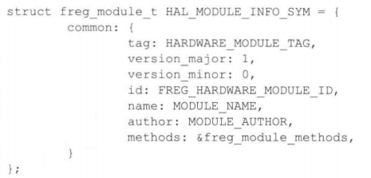

## 1

system_server

1、编写hal层hw库  hal_Freg.cpp下层使用open read write等接口与驱动交互，上层实现hw_module_t   hw_module_methods_t   hw_device_t和自定义结构体等，并导出HMI符号，HAL_INFO_SYM就是定义HMI并用arttubute进行导出的宏

2、添加com_android_server_FregService.cpp   调用hw_get_module函数通过模块ID找到并加载对应hw的so库，并输出module信息

接着根据module信息调用module中的open函数指针并传入设备ID，以此来得到模块中的某一个具体device的信息：

com_android_server_FregService.cpp中的包装函数根据device信息调用真正的函数，最后实现注册包装函数到JNI本地方法的函数register_android_serverFregService

3、修改onload.cpp，调用注册JNI方法的函数register_android_serverFregService，onLoad.cpp和com_android_server_FregService.cpp被编译成了libandroid_servers.so，hal层各种hw的so库被libandroid_servers.so加载，libandroid_servers.so被system_server这个framework层服务加载。

   

4、实现FregService.java，其中使用到了register_android_serverFregService注册的本地JNI方法

5、修改SystemServer.java   ，new FregService 并  add ledService

servicemanager

app

通过AIDL实现IFregService.java，给APP使用

