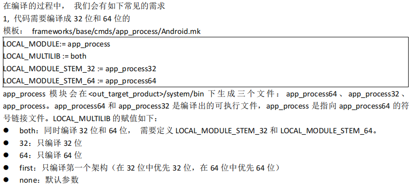
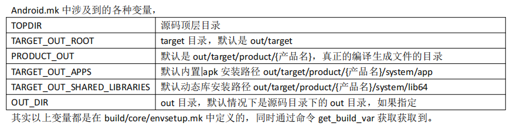
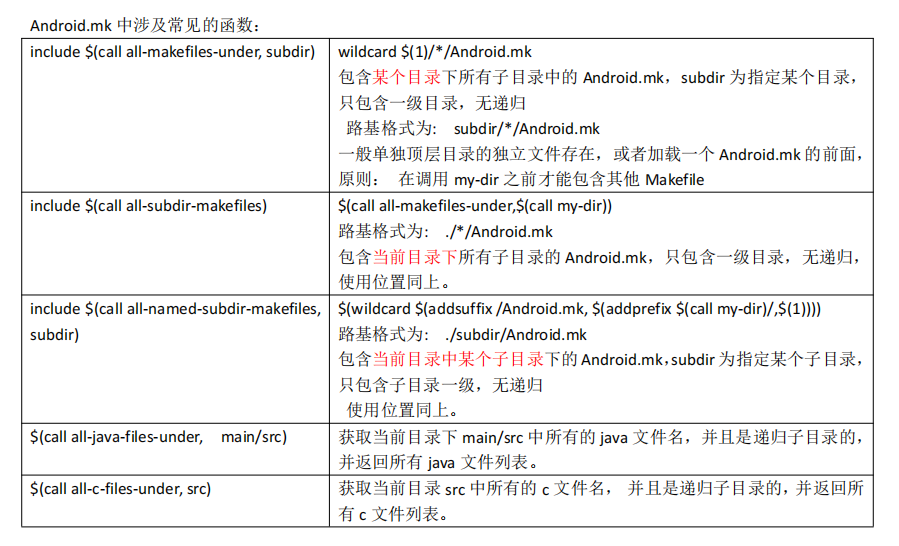
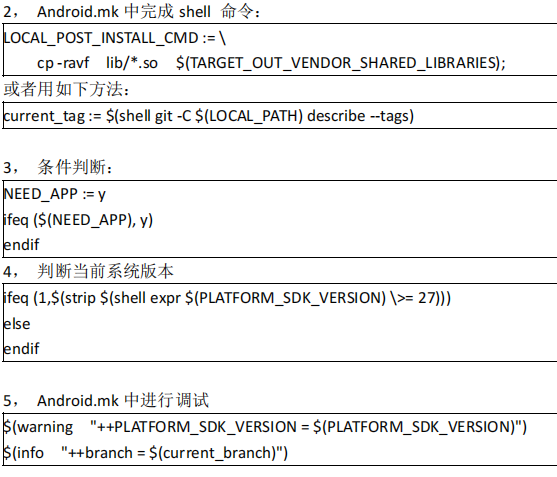
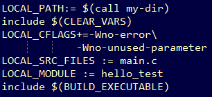
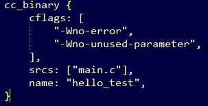

## 1、编译命令

### a、指定编译

. build/envsetup.sh

lunch xxxxxx

根据dir目录下的Android.mk或Android.bp文件编译单个模块：

任意目录执行 mmm   dir

根据dir目录下的Android.mk或Android.bp文件编译单个模块及其依赖模块：

任意目录执行  mmma dir

编译某个Android.mk或Android.bp文件中定义的模块，其模块名为LOCAL_MODULE  

AOSP顶层目录执行  make LOCAL_MODULE  -j50


查看编译过程中详细执行的命令，编译完成后执行：

```
gzip -cd out/verbose.log.gz | less -R
```


### b、全编译

. build/envsetup.sh

lunch xxxxxx

make -jxxxx

涉及两个重要变量,主要是在 device/公司名/产品名/产品名.mk 或者 build/target/product/产品名.mk 等文件,不能写在Android.mk文件

PRODUCT_COPY_FILES  定制全编译时需要拷贝的文件。

PRODUCT_PACKAGES    定制所有Android.mk中哪些模块被编译。


## 2、中间文件路径


64位程序的编译中间文件在out/target/product/xxxx/obj/

32位程序的编译中间文件在out/target/product/xxxx/obj_arm/


64位程序的编译中间文件在out/target/product/xxxx/obj/下如下子目录：

EXECUTABLES存放编译成C/C++二进制可执行文件模块的中间文件

SHARED_LIBRARIES存放编译成C/C++二进制动态库模块的中间文件

STATIC_LIBRARIES存放编译成C/C++二进制静态库模块的中间文件

JAVA_LIBRARIES存放编译成.jar模块的中间文件

APPS存放编译成apk模块的中间文件


EXECUTABLES 、SHARED_LIBRARIES、STATIC_LIBRARIES、JAVA_LIBRARIES目录中模块的目录名字为$(LOCAL_MODULE)_intermediates/

APPS目录中模块名字为$(LOCAL_PACKAGE_NAME)_intermediates/


## 3、模块最终安装路径

### a、vendor or system

模块默认安装到out/target/product/xxxx/system分区，如果Android.mk文件中定义了LOCAL_PROPERTY_MODULE := true    或LOCAL_VENDOR_MODULE := true，编译后将安装在out/target/product/xxxx/vendor/分区下。模块编译中间文件out/target/product/xxxx/obj/EXECUTABLES/$(LOCAL_MODULE)_intermediates/link_type文件中的值如果为native::vendor则说明模块属于厂商，将被安装在vendor/下。如果为native::platform则说明模块属于系统，将被安装在system/下。

### b、根据模块类型默认的安装路径

对于动态库、可执行、jar库、apk，都是根据模块最后include$(BUILD_XXX)来选择默认安装路径

动态库include $(BUILD_SHARED_LIBRARY)

32位C/C++动态库安装到out/target/product/xxxx/system/lib/$(LOCAL_MODULE).so

64位C/C++动态库安装到out/target/product/xxxx/system/lib64/$(LOCAL_MODULE).so


静态库不需要安装


jar库include $(BUILD_JAVA_LIBRARY)

安装在out/target/product/xxxx/system/framework/$(LOCAL_MODULE).jar


C/C++二进制可执行文件include $(BUILD_EXECUTABLE)

安装在在out/target/product/xxxx/system/framework/$(LOCAL_MODULE)


apk   include $(BUILD_PACKAGE)

安装在out/target/target/product/xxx/system/app/$(LOCAL_PACKAGE_NAME)/$(LOCAL_PACKAGE_NAME).apk


对于prebuild预编译模块，include $(BUILD_PREBUILT)，但具体是什么类型通过LOCAL_MODULE_CLASS 进行配置

LOCAL_MODULE_CLASS := EXECUTABLES则默认安装在out/target/target/product/xxx/system/bin

LOCAL_MODULE_CLASS := ETC则默认安装在out/target/target/product/xxx/system/etc

LOCAL_MODULE_CLASS := SHARED_LIBRARIES  则根据LOCAL_MULTILIB默认安装在out/target/target/product/xxx/system/lib或out/target/target/product/xxx/system/lib64

## 4、32、64位控制



## 5、部分变量/函数

| LOCAL_PATH:= $(call my-dir)      | 用来指定当前源码所在的目录，它不会被 CLEAR_VARS 清除，一般第一步就是定义该变量 |
| :------------------------------- | ------------------------------------------------------------ |
| include $(CLEAR_VARS)            | CLEAR_VARS 清除很多除 LOCAL_PATH 外的变量。因为所有的 Makefile 都是在同一个编译环境在执行的，变量的定义理论上都是全局的，所以每个模块编译开始前进行清理工作是非常必要的。写法也很固定 |
| LOCAL_SRC_FILES                  | 此变量包含构建系统用于生成模块的源文件列表，可使用相对路径或绝对路径，但为了移植性应尽量选择使用相对路径 |
| LOCAL_MODULE                     | 模块名，整个编译系统中唯一存在，命名时中间不能有空格，针对编译动态库和静态库， 系统会帮你添加诸如 “lib” 前缀和 “.a” 或 “.so” 后缀等 |
| LOCAL_PACKAGE_NAME               | 在编译 内置 app 源码的 时候，通过该 变量来设置 apk 的文件 名， 和LOCAL_MODULE 作用一样。 |
| LOCAL_MODULE_PATH                | 指定模块的输出路径绝对路径                                   |
| LOCAL_RELATIVE_PATH              | 指定模块的输出路径绝对路径                                   |
| LOCAL_MODULE_RELATIVE_PATH       | LOCAL_MODULE_RELATIVE_PATH := hw， 相对安装路径， 一般目标文件有默认的安装路径， 比如动态库安装路径为 out/target/product/xx/system/lib, 加上 := hw 就表示相对 out/target/product/xx/system/lib 这个路径，加上 hw，完整路径为： out/target/product/xx/system/lib/hw |
| LOCAL_MODULE_TAGS                | 模块的一些标签，标签之间使用空格隔开,可以是 optional, tests, debug, user ,eng<br/>user: 指该模块只在user版本下才进入编译候选<br/>debug: 批该模块只在userdebug版本下才进入编译候选<br/>eng: 指该模块只在eng版本下才进入编译候选<br/>tests: 指该模块只在tests版本下才进入编译候选<br/>optional:指该模块在所有版本下都进入编译候选<br/> |
| LOCAL_C_INCLUDES                 | 指定引用头文件所在路径，类似 gcc -I xx                       |
| LOCAL_EXPORT_C_INCLUDES          | 导出当前模块的头文件路径，这样其他依赖当前模块的时候， 直接也自动拥有了当前模块指定的各种头文件路径。模板：external/libtextclassifier/Android.mk |
| LOCAL_PROPRIETARY_MODULE         | 和 LOCAL_VENDOR_MODULE 一样， 设置为 true 就表示会编译到 vendor 分区 |
| LOCAL_INIT_RC                    | 编译可执行程序时，同时定义开机启动脚本， 一般放到/system/etc/init/或者/vendor/etc/init |
| LOCAL_CFLAGS                     | 此可选变量为构建系统设置在构建 C 和 C++ 源文件时要传递的编译器标志。此功能对于指定额外的宏定义或编译选项可能很有用, 如<br/>-D -I -L -Werror  -g -O2  -Wall  -Wno-unused-parameter <br/>-Wno-implicit-function-declaration   -Wno-unused-function <br/>-Wno-unused-variable   -Wno-format -Wno-error   -Wno-date-time  -Wno-incompatible-pointer-types-discards-qualifiers |
| LOCAL_CPPFLAGS（LOCAL_CXXFLAGS） | 仅当构建 C++ 源文件时才会传递一组可选的编译器标志。它们将出现在编译器命令行中的 LOCAL_CFLAGS 后面 |
| LOCAL_STATIC_LIBRARIES           | 编译所需的静态库列表， 只加载静态库中用到的函数              |
| LOCAL_WHOLE_STATIC_LIBRARIES     | 在连接静态连接库的时候不会移除"daed code"，何谓 dead code 呢，就是调用者模块永远都不会用到的代码段和变量 |
| LOCAL_SHARED_LIBRARIES           | 指定 c/c++代码链接所需要的动态库                             |
| LOCAL_JAVA_LIBRARIES             | 指定 java 代码链接所需要的动态库， 表示引用的外部 Java 库在编译时可以找到相关的东西，但并不打包到本模块，在 runtime 时需要从别的地方查找 |
| LOCAL_LDLIBS                     | 编译所需的其他链接器标志列表。它可让您使用 -l 前缀传递特定系统库的名称。例如，以下示例指示链接器生成在加载时链接到 /system/lib/libz.so 的模块：LOCAL_LDLIBS := -lz |
| BUILD_XXX                        | 一般以 include $(BUILD_XXX)存在， 表示用什么规则来编译BUILD_HOST_STATIC_LIBRARY<br/>BUILD_HOST_SHARED_LIBRARY<br/>BUILD_HOST_EXECUTABLE<br/>BUILD_STATIC_LIBRARY<br/>BUILD_EXECUTABLE<br/>BUILD_SHARED_LIBRARY<br/>BUILD_EXECUTABLE<br/>BUILD_PREBUILT<br/>BUILD_MULTI_PREBUILT |
| LOCAL_MODULE_CLASS               | prebuild模块指定具体的类型，EXECUTABLES、ETC、SHARED_LIBRARIES |







## 6、C/C++动态库编译

涉及到程序的验证，需要将程序放入到 android 设备中运行， 如果启动 emulator 的话，
需要加参数： -writable-system， 如：
emulator -no-snapshot -verbose -show-kernel -writable-system -cores 4
这样才能使用 adb remount
模板： system/extras/su/Android.mk
例子：

```
LOCAL_PATH:= $(call my-dir)
include $(CLEAR_VARS)

LOCAL_SRC_FILES:= \
        my_math.c

LOCAL_MODULE:= libmymath

LOCAL_MULTILIB := 64

	
LOCAL_MODULE_TAGS := optional

include $(BUILD_SHARED_LIBRARY)
```

## 7、C/C++静态库编译

模板参考： system/core/healthd/Android.mk

例子：

```

LOCAL_PATH:= $(call my-dir)
include $(CLEAR_VARS)

LOCAL_SRC_FILES:= \
    cJSON.c \

LOCAL_MODULE:= libmycjson
LOCAL_MULTILIB := 64

include $(BUILD_STATIC_LIBRARY)
```

## 8、可执行文件编译

```
LOCAL_PATH:= $(call my-dir)

include $(CLEAR_VARS)

LOCAL_SRC_FILES:= \
		main.c

LOCAL_C_INCLUDES += \
		$(LOCAL_PATH)/../libcjson \
		$(LOCAL_PATH)/../libmath

LOCAL_SHARED_LIBRARIES += \
	libmymath 

LOCAL_STATIC_LIBRARIES += \
	libmycjson 

LOCAL_CFLAGS += \
		-Wno-error \
		-Wno-unused-parameter

LOCAL_MODULE:= cjson_test

LOCAL_MODULE_TAGS := optional

LOCAL_MULTILIB := 64

include $(BUILD_EXECUTABLE)
```

## 9、jar库编译

模板参考frameworks/base/cmds/svc/ 或者 external/caliper/Android.mk

例子：

```
LOCAL_PATH:= $(call my-dir)
include $(CLEAR_VARS)
LOCAL_SRC_FILES := $(call all-subdir-java-files)
LOCAL_MODULE := libmytriangle
include $(BUILD_JAVA_LIBRARY)
```

```
LOCAL_PATH:= $(call my-dir)
include $(CLEAR_VARS)

LOCAL_JAVA_LIBRARIES := libmytriangle

LOCAL_SRC_FILES := $(call all-subdir-java-files)
LOCAL_MODULE := TriangleDemo
include $(BUILD_JAVA_LIBRARY)
```

include $(BUILD_STATIC_JAVA_LIBRARY)

## 10、app编译

AOSP中apk源文件与eclipse中的安卓apk源文件布局一样，AndroidManifest.xml文件位于apk源码树顶层，此时能不在Android.mk中指定AndroidManifest.xml文件，参考mtk8195/packages/apps/Messaging/Android.mk：

```
LOCAL_PATH:= $(call my-dir)

include $(CLEAR_VARS)

LOCAL_MODULE_TAGS := optional

#指定所有的.java源文件

LOCAL_SRC_FILES := $(call all-java-files-under, src)

#指定app的资源目录

LOCAL_RESOURCE_DIR := $(LOCAL_PATH)/res

#打开将资源目录编译成R.java的工具

LOCAL_USE_AAPT2 := true

#指定用到的系统的JAVA库

LOCAL_STATIC_ANDROID_LIBRARIES := \
    androidx.core_core \
    androidx.media_media \
    androidx.legacy_legacy-support-core-utils \
    androidx.legacy_legacy-support-core-ui \
    androidx.fragment_fragment \
    androidx.appcompat_appcompat \
    androidx.palette_palette \
    androidx.recyclerview_recyclerview \
    androidx.legacy_legacy-support-v13 \
    colorpicker \
    libchips \
    libphotoviewer

#指定第三方或特定的JAVA库

LOCAL_STATIC_JAVA_LIBRARIES := \
    androidx.annotation_annotation \
    android-common \
    android-common-framesequence \
    com.android.vcard \
    guava \
    libphonenumber

#指定版本号

include $(LOCAL_PATH)/version.mk

LOCAL_AAPT_FLAGS += --version-name "$(version_name_package)"
LOCAL_AAPT_FLAGS += --version-code $(version_code_package)

#指定JNI库,之所以要ifdef开关是因为在编译APP前其他第三方JNI库需要先编译

ifdef TARGET_BUILD_APPS
    LOCAL_JNI_SHARED_LIBRARIES := libframesequence libgiftranscode
else
    LOCAL_REQUIRED_MODULES:= libframesequence libgiftranscode
endif

#防止反编译

LOCAL_PROGUARD_ENABLED := obfuscation optimization

#配置app测试版还是release版,如果lunch工具版则将APP编译成测试版本

LOCAL_PROGUARD_FLAG_FILES := proguard.flags
ifeq (eng,$(TARGET_BUILD_VARIANT))
    LOCAL_PROGUARD_FLAG_FILES += proguard-test.flags
else
    LOCAL_PROGUARD_FLAG_FILES += proguard-release.flags
endif

#指定模块名，不是包名，类似于LOCAL_MODULE,但编译APP是使用LOCAL_PACKAGE_NAME 

LOCAL_PACKAGE_NAME := messaging

#指定签名，release版本需要签名，如果下次升级时签名不同则任务不是同一个APK，这里使用系统签名

LOCAL_CERTIFICATE := platform

#指定SDK版本，即api level

LOCAL_SDK_VERSION := current


LOCAL_PRODUCT_MODULE := true

LOCAL_MODULE_PATH := $(TARGET_OUT_PRODUCT_APPS)

LOCAL_COMPATIBILITY_SUITE := general-tests


#指定编译成APK

include $(BUILD_PACKAGE)

#包含当前Android.mk所在目录的所有子目录中的Android.mk

include $(call all-makefiles-under, $(LOCAL_PATH))
```


关于LOCAL_SHARED_LIBRARIES  LOCAL_JNI_SHARED_LIBRARIES   LOCAL_LDLIBS

```

如果第三方so库定义如下：
LOCAL_MODULE := $(call my-dir)
include $(CLEAR_VARS)
LOCAL_MODULE := libhello  
LOCAL_SRC_FILES := e.c h.c
include $(BUILD_SHARED_LIBRARY)


JNI so库 libtest.so依赖于 libhello .so 和系统库libpthread.so  liblog.so libEGL.so libGLESv2.so，定义如下：
LOCAL_MODULE := $(call my-dir)
include $(CLEAR_VARS)
LOCAL_MODULE := libtest  
LOCAL_SRC_FILES := a.c b.c c.c
LOCAL_SHARED_LIBRARIES := libhello
LOCAL_LDLIBS := -lpthread  -llog -lEGL -lGLESv2
include $(BUILD_SHARED_LIBRARY)

apk在构建时依赖于libtest.so
LOCAL_MODULE := $(call my-dir)
include $(CLEAR_VARS)
......
ifdef TARGET_BUILD_APPS  #指定JNI库,之所以要ifdef开关是因为在编译APP前其他第三方JNI库需要先编译
    LOCAL_JNI_SHARED_LIBRARIES := libtest
else
    LOCAL_REQUIRED_MODULES:= libtest
endif
......
include $(BUILD_PACKAGE)
```


如果要将Android Studio中的apk项目源码拿到AOSP源码树下进行编译：

```
LOCAL_PATH:= $(call my-dir)
include $(CLEAR_VARS)

LOCAL_MODULE_TAGS := optional

LOCAL_SRC_FILES := $(call all-java-files-under,  app/src/main/java)

LOCAL_PACKAGE_NAME := StorageTest

LOCAL_SDK_VERSION := current

#LOCAL_PROGUARD_FLAG_FILES := proguard.flags
LOCAL_CERTIFICATE := platform

LOCAL_USE_AAPT2 := true


# 指定Manifest文件
LOCAL_MANIFEST_FILE := app/src/main/AndroidManifest.xml

LOCAL_RESOURCE_DIR := \
	$(addprefix $(LOCAL_PATH)/, app/src/main/res) 


# 重复资源自动覆盖
LOCAL_AAPT_FLAGS += \
     --auto-add-overlay \
     --extra-packages androidx.appcompat.app \
     --extra-packages androidx.recyclerview.widget \


# constraint-layout和activity需要的jar
LOCAL_STATIC_JAVA_LIBRARIES := \
	androidx.appcompat_appcompat  \
	androidx.recyclerview_recyclerview \


include $(BUILD_PACKAGE)

# Use the folloing include to make our test apk.
include $(call all-makefiles-under,$(LOCAL_PATH))

```

## 11、prebuild预编译


### a、单模块prebuild

例子：

executable:

```
LOCAL_PATH := $(call my-dir)
include $(CLEAR_VARS)
LOCAL_SRC_FILES := busybox_aarch64
LOCAL_MODULE := busybox_aarch64
LOCAL_MODULE_CLASS := EXECUTABLES
LOCAL_MODULE_TAGS := optional
include $(BUILD_PREBUILT)
```

config:

```
LOCAL_PATH := $(call my-dir)
include $(CLEAR_VARS)
LOCAL_MODULE_TAGS := optional
LOCAL_MODULE := Vendor_5135_Product_0005.idc
LOCAL_SRC_FILES := Vendor_5135_Product_0005.idc
LOCAL_MODULE_CLASS := ETC
LOCAL_MODULE_PATH := $(TARGET_OUT)/usr/idc
include $(BUILD_PREBUILT)
```

libxxx.so:

```
LOCAL_PATH := $(call my-dir)
include $(CLEAR_VARS)
LOCAL_MODULE_TAGS := optional
#LOCAL_SRC_FILES := arm64/libmycjson.so
LOCAL_SRC_FILES := arm64/libmycjson.so
LOCAL_MODULE_SUFFIX := .so
LOCAL_MODULE := libmycjson.so
LOCAL_MODULE_CLASS := SHARED_LIBRARIES
LOCAL_MULTILIB := 64
include $(BUILD_PREBUILT)
```

```
LOCAL_PATH := $(call my-dir)
include $(CLEAR_VARS)
LOCAL_MODULE_TAGS := optional
LOCAL_SRC_FILES := arm64/libmycjson.so
LOCAL_MODULE := libmycjson.so
LOCAL_MODULE_CLASS := SHARED_LIBRARIES 
LOCAL_MULTILIB := 64
include $(BUILD_PREBUILT)
```

### b、多模块prebuild

#### b.1 安装到system分区

使用include $(BUILD_MULTI_PREBUILT)，该方法只能根据类型安装到system下，LOCAL_PROPERTY_MODULE和LOCAL_VENDOR_MODULE失效。

```
LOCAL_PATH := $(call my-dir)
include $(CLEAR_VARS)
#指定JAVA模块名和源文件路径
LOCAL_PREBUILT_STATIC_JAVA_LIBRARIES := chico:libs/chico.jar
#指定C/C++动态库的模块名和源文件路径
LOCAL_PREBUILT_LIBS := libchico:libs/libchico.so
include $(BUILD_MULTI_PREBUILT)
```

```
LOCAL_PATH=$(call my-dir)
include $(CLEAR_VARS)
LOCAL_MODULE_TAGS := optional
LOCAL_PREBUILT_STATIC_JAVA_LIBRARIES := baiduARLicense:jar/baiduARLicense.jar
#LOCAL_PREBUILT_LIBS := libiconv:arm64-v8a/libiconv.so
LOCAL_PREBUILT_LIBS := libiconv:x86_64/libiconv.so
LOCAL_MULTILIB := 64
include $(BUILD_MULTI_PREBUILT)
```

#### b.1 安装到任意分区

使用foreach+eval循环

```
LOCAL_PATH := $(call my-dir)
#multi prebuilt for vendor lib
LOCAL_PREBUILT_AGENTD_LIBS := $(subst $(LOCAL_PATH)/,,$(wildcard $(LOCAL_PATH)/*.so))
$(foreach t,$(LOCAL_PREBUILT_AGENTD_LIBS), \
$(eval include $(CLEAR_VARS)) \
$(eval LOCAL_PROPRIETARY_MODULE := true) \
$(eval LOCAL_MODULE_CLASS := SHARED_LIBRARIES) \
$(eval LOCAL_MODULE_SUFFIX :=.so) \
$(eval LOCAL_MULTILIB := 32) \
$(eval LOCAL_MODULE_TAGS := optional) \
$(eval LOCAL_SRC_FILES := $(t)) \
$(eval LOCAL_MODULE := $(t:.so=)) \
$(eval LOCAL_STRIP_MODULE := false) \
$(eval $(warning "t=$(t)")) \
$(eval $(warning "LOCAL_SRC_FILES=$(LOCAL_SRC_FILES)")) \
$(eval $(warning "LOCAL_MODULE=$(LOCAL_MODULE)")) \
$(eval include $(BUILD_PREBUILT)) \
)
```

参考system/core/rootdir/Android.mk，LOCAL_POST_INSTALL_CMD变量中的命令在编译后打包前执行，用来打包某个模块所依赖的相关配置文件文件。

```
LOCAL_PATH:= $(call my-dir)
include $(CLEAR_VARS)

LOCAL_SRC_FILES:= main.c

LOCAL_CFLAGS += \
                -Wno-error \
                -Wno-unused-parameter


LOCAL_MODULE:= tcp_srv_test
LOCAL_MULTILIB := both
LOCAL_MODULE_STEM_32 := tcp_srv_test32
LOCAL_MODULE_STEM_64 := tcp_srv_test64

LOCAL_POST_INSTALL_CMD := \
    cp -ravf $(LOCAL_PATH)/nofile.xml  $(TARGET_OUT_VENDOR)/usr  ;\
    cp -ravf $(LOCAL_PATH)/a.config    $(PRODUCT_OUT)/vendor/bin ;\
    cp -ravf $(LOCAL_PATH)/libs/*.so   $(TARGET_OUT_VENDOR_SHARED_LIBRARIES)

LOCAL_PROPRIETARY_MODULE := true
	
LOCAL_MODULE_TAGS := optional

include $(BUILD_EXECUTABLE)
```

## 12、Android.bp

​        由于 make 在编译时表现出效率不够高、增量编译速度慢等问题，Google 在 android 7.0 版本引进了编译速度更快的 soong 来替代make。最开始，Ninja 是用于 Chromium 浏览器中，Ninja 其实就是一个编译系统，类似make ，使用 Ninja 主要目的就是因为其编译速度快。Android 7.0 之后希望用 Android.bp 替换 Android.mk，bp 简单的配置更方便 Ninja 文件的产生，而 Blueprint和 Soong 就此产生。Soong 则是专为 Android 编译而设计的工具，Blueprint 只是解析文件的形式，而 Soong 则解释内容的含义，最终将 Android.bp 转换成 Ninja 文件。 Blueprint 和 Soong 都是由 Golang 写的项目。 从 Android Nougat 开始，prebuilts/go/目录下新增了 Golang 所需的运行环境，在编译时使用。Android.mk 可以引用 Android.bp 中的模块，反之 Android.bp 不能引用 Android.mk 中的模块, 以下显示为各个工具的关系图：






关键词对应关系参考  ***build/soong/androidmk/androidmk/android.go***


在编译可执行文件时指定rc启动文件

mk:    LOCAL_INIT_RC := foo.rc

bp:     init_rc: ["foo.rc"],


在编译hal层服务可执行文件时指定manifest.xml服务属性描述文件

mk:     LOCAL_VINTF_FRAGMENTS := manifest_foo.xml

bp:     vintf_fragments: ["manifest_foo.xml"],


## 13、debug

