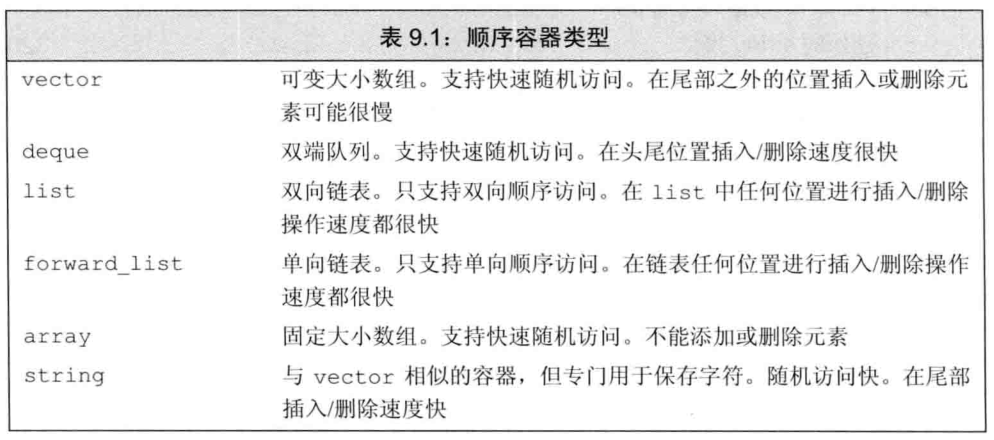

cin   默认分隔符是空格/回车/tab


将分隔后的元素使用>>赋给需要输入的变量后返回cin对象，如果需要输入的对象不能够成功赋值(例如给int变量赋值时输入了字符串)或者检测到EOF(文件尾或CTRL+D)，则后续cin对象转换成bool时返回false，否则返回true。


cin对象当作bool来使用时会调用相关方法返回一个bool值，该值代表上一次执行>>操作时是否成功，初始时也返回成功


# cin   >> int

```
#include<iostream>
#include<vector>
using namespace std;
vector<int> info;
int main(int argc,char **argv)
{
    while(cin) {
        cout << "wait for input"<<endl;
        int s;
        cin >> s;
        info.push_back(s);
    }
    for(auto s: info)
        cout << s << '\n';
    return 0;
}
```

```
wait for input
2 3 4                 //输入2 3 4 
wait for input
wait for input
wait for input
3                    //输入3
wait for input
asf                    //输入asf，赋值失败，while(cin)不再满足跳出循环开始后续打印。
2
3
4
3
0
```


# cin   >> string

由于cin默认以空格/tab分隔，直接cin   >> stringOBJ无法将带有空格的字符串赋给string,

可以使用getline(cin, stringOBJ)将完整的一行字符串(其中可以包含空格和tab)赋给stringOBJ,  getline返回cin对象，可以直接放入bool上下文中用以判断是否输入成功。


顺序表vector，双向链表list，队列queue，栈stack，双向队列deque，关联容器set, multiset, map, multimap（一般用红黑树氦紶份咳莓纠逢穴抚膜实现的），还有一个priority_queue 用堆实现（顺序存储）


```
#include <math.h>


double sin(double __x);
double asin(double __x);

double cos(double __x)
double acos(double __x)

double tan(double __x);
double atan(double __x);

double sqrt(double __x)
double pow(double __x, double __y) //计算x的y次幂。
double exp(double __x)

#define PI acos(-1)
#define PI 4*atan(1)
```





queue  是单端队列，只能在front使用q.pop()删除，在back使用q.push(s)插入

deque  是双端队列，可以在front使用dq.pop_front()删除，也能在在back使用dq.pop_back()删除。可以在front使用dq.push_front()插入，也能在在back使用dq.push_back()插入。

queue  和 deque  都能在front使用front()方法返回队列头元素，在back使用back()方法返回队列尾元素。都能使用empty()方法判断队列是否为空，都能使用size()方法返回队列中元素个数。


