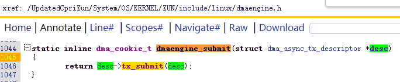

https://blog.csdn.net/weixin_29763641/article/details/116889811

https://zhuanlan.zhihu.com/p/496060255


http://www.wowotech.net/linux_kenrel/dma_engine_overview.html

http://www.wowotech.net/linux_kenrel/dma_engine_api.html

http://www.wowotech.net/linux_kenrel/dma_controller_driver.html


```
u64   *               =  dev->dma_mask


struct dma_map_ops *  =  dev->dma_ops


ifdef CONFIG_DMA_OPS 
dma_map_page_attrs


```


IOMMU   struct dma_map_ops    https://blog.csdn.net/tiantao2012/article/details/59480719


# 启动DMA的主要流程

## 获取DMA软件通道


dma_request_channel


dma_request_slave_channel

dma_request_chan


dma_release_channel


## 设置从设备和控制器指定参数


dmaengine_slave_config

chan->device->device_config


## 映射DMA设备地址

#include <linux/dma-mapping.h>

### 一致映射

dma_alloc_coherent

dma_free_coherent

### 流映射

dma_map_single

dma_unmap_single


dma_map_sg

dma_unmap_sg


## 获得事务描述符，并填充完成时回调函数

·chan->device->device_prep_dma_memcpy()：准备memcpy操作。
·chan->device->device_prep_dma_sg()：准备分散/聚集memcpy操作。

·chan->device->device_prep_dma_xor()：对于异或操作。
·chan->device->device_prep_dma_xor_val()：准备异或验证操作。

·chan->device->device_prep_dma_pq()：准备pq操作。
·chan->device->device_prep_dma_pq_val()：准备pqzero_sum操作。

·chan->device->device_prep_dma_memset()：准备memset操作。
·chan->device->device_prep_dma_memset_sg()：用于分散列表上的memset操作。

·chan->device->device_prep_slave_sg()：准备从设备DMA操作。
·chan->device->device_prep_interleaved_dma()：以通用方式传输表达式。


| chan->device->device_prep_xxx | dmaengine封装                                                |
| ----------------------------- | ------------------------------------------------------------ |
| device_prep_dma_memcpy        | dmaengine_prep_dma_memcpy                                    |
| device_prep_dma_sg            | dmaengine_prep_dma_sg                                        |
| device_prep_dma_memset        | dmaengine_prep_dma_memset                                    |
| device_prep_slave_sg          | dmaengine_prep_rio_sg、dmaengine_prep_slave_sg、dmaengine_prep_slave_single |
| device_prep_dma_cyclic        | dmaengine_prep_dma_cyclic                                    |
| device_prep_interleaved_dma   | dmaengine_prep_interleaved_dma                               |


```
struct dma_async_tx_descriptor * tx_descriptor = dmaengine_prep_xxx()
tx_descriptor ->callback = dma_callback;
```


## 提交事务





## 发布待处理DMA请求
dma_async_issue_pending

chan->device->device_issue_pending


## 等待完成事件

wait_for_completion


# 完成时回调函数


## 取消流映射DMA设备地址

dma_unmap_single

dma_unmap_sg


## 处理数据


## 发送完成事件

complete


# 查询待处理DMA请求的状态

