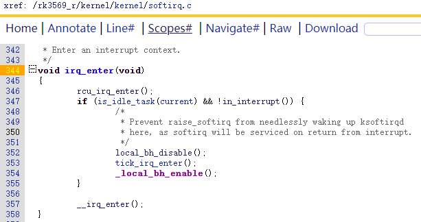
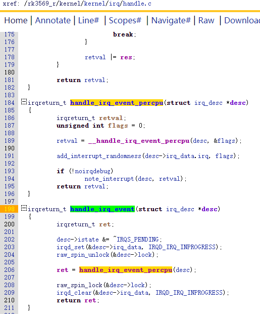

## linux中断处理

### 1.源码跟踪

#### 1.1中断上半部


SMP系统的CPU进入中断后硬件会自动关闭当前CPU的所有中断，之后再跳转到异常向量表


接着跳转到vector_rst向量表，判断当前发生中断时处于内核态还是用户态如果是内核态跳转到\_\_irq_svc执行，如果是用户态跳转到 \_\_irq_user执行。


\_\_irq_svc 和 \_\_irq_user 的区别在于保存现场的方式不同，保存完现场后都执行irq_handler。


irq_hander最终调用handle_arch_irq函数指针。


handle_arch_irq函数指针在gic驱动程序的probe函数中通过调用

```
set_handle_irq(gic_handle_irq);
```


将其指向了gic_handle_irq函数。gic驱动程序还定义了一系列gic处理函数并将其放到gic中断控制器的irq_domain结构体中。


gic_handle_irq函数读取gic寄存器得到gic的硬件中断号hwirq(也就是irqnr)，对于每个hwirq都调用一次handle_domain_irq函数。


gic寄存器相关操作详细参考https://blog.csdn.net/yhb1047818384/article/details/99706106

https://blog.csdn.net/yhb1047818384/article/details/87561438


handle_domain_irq函数调用到了\_\_handle_domain_irq，在\_\_handle_domain_irq中首先调用irq_enter()，再调用irq_find_mapping和generic_handle_irq函数处理中断上半部硬件中断，最后调用irq_exit()处理中断下半部的软件中断。


**irq_enter可以禁止当前被中断的线程被其他线程抢占(该线程被中断时可能处于用户态也可能处于内核态)。**

https://blog.csdn.net/yiyeguzhou100/article/details/49887975

preempt_count是进程调度时用到的.也就是系统会根据preempt_count的值来判断是否可以调度以及抢占。只有当preempt_count为0时才可以调度或抢占。 这样的话在do_IRQ执行期间（并且在irq_exit执行preempt_count-1之前），是不允许内核抢占以及调度到其他进程的，这样不论是在irq_enter或者irq_exit函数执行过程中，current宏得到的都是同一个进程，获取的都是同一个进程的preempt_count，即中断前运行的进程。当调用preempt_disable或add_preempt_count函数时都不可以进行调度，因为都会改变preempt_count的值为非0。所以irq_enter就是告诉系统，现在正在处理中断的上半部分工作,不可以进行调度。你可能会奇怪，既然此时的irq中断都是都是被禁止的，为何还要禁止抢占？这是因为要考虑中断嵌套的问题，一旦驱动程序主动通过local_irq_enable打开了IRQ（其实在handle_IRQ_event中就打开了IRQ），而此时该中断还没处理完成，新的irq请求到达，这时代码会再次进入irq_enter，在本次嵌套中断返回时，内核不希望进行抢占调度，而是要等到最外层的中断处理完成后才做出调度动作，所以才有了禁止抢占这一处理。



irq_enter调用到\_\_irq_enter(),后者又调用到了preemt_count_add(HARDIRQ_OFFSET)将preemt_count++。


调完irq_enter()返回到\_\_handle_domain_irq函数后继续调用irq_find_mapping函数从gic中断控制器的irq_domain中找到hwirq对应的虚拟中断号irq，在generic_handle_irq函数中根据irq在irq_desc链表找到对应的中irq_desc结构体节点，再调用generic_handle_irq_desc函数。


generic_handle_irq_desc函数直接调用irq_desc结构体节点中的handle_irq函数指针。


handle_irq函数指针分为两种情况：


**情况1：指向gic子中断控制器的分发函数，例如GPIO控制器的分发函数**

GPIO控制器的分发函数负责读取GPIO控制器的寄存器确定GPIO中断的hwirq,再调用handle_domain_irq函数。接着开始套娃，handle_domain_irq函数根据gpio的hirq在gpio控制器的irq_domain中找到对应的虚拟irq，再根据虚拟irq在irq_desc链表中找到对应的irq_desc结构体节点，然后再调用irq_desc结构体节点中的handle_irq函数指针。这些函数由GPIO控制器驱动提供。


**情况2：指向通用分发函数**

系统内建了一些handle_irq通用分发函数，分为：

- handle_simple_irq()　　简单处理情况处理函数
- handle_level_irq()  　 电平触发方式情况处理函数
- handle_edge_irq()     边沿触发方式情况处理函数
- handle_fasteoi_irq()   用于需要EOI回应的中断控制器
- handle_percpu_irq()   此中断只需要单一CPU响应的处理函数
- handle_nested_irq()   用于处理使用线程的嵌套中断

在初始化阶段，中断描述符的handle_irq指针大多指向了handle_edge_irq函数或handle_level_irq函数。二者大致相似，都会调用irq_may_run判断一下别的CPU是不是正在处理当前的虚拟中断，如果是则设置irq_desc结构体节点中的中断标志为IRQS_PENDNG挂起并直接返回。最后真正处理时调用handle_irq_event函数。


handle_edge_irq函数和handle_level_irq函数**不同点：**

**二者最大的不同在于对中断线屏蔽的处理以及对handle_irq_event函数的调用次数。handle_edge_irq调用handle_irq_event函数时irq_desc结构体节点对应的该中断线处于未屏蔽状态，在一个do while循环中不断调handle_irq_event函数，只要中断线被屏蔽未屏蔽且irq_desc结构体节点未处于IRQS_PENDING状态(处于该状态意味着在处理中断时该中断又发生了一次)就一直调。而handle_level_irq在调用handle_irq_event之前就已经调用了mask_ack_irq()函数屏蔽了中断线，只调一次handle_irq_event，且调完了再调cond_unmask_irq来开启中断线。**


irq_may_run根据当前irq_desc结构体节点中的istate是否有IRQD_IRQ_INPROGRESS标志来判断是否有其他CPU正在响应当前irq_desc结构体节点对应的虚拟中断号。


**handle_irq_event**函数设置中断描述符的状态为IRQD_IRQ_INPROGRESS，在SMP系统中，同一个中断信号有可能发往多个CPU，但是中断处理只应该处理一次，所以设置状态为IRQD_IRQ_INPROGRESS，其他CPU执行此中断时都会先检查此状态




接着执行handle_irq_event_percpu函数，handle_irq_event_percpu函数调用\_\_handle_irq_event_percpu函数，\_\_handle_irq_event_percpu函数找到当前irq_desc结构体节点中的action链表，并对action链表中的action链表中的每个结构体节点调用action结构体节点中的handler函数指针。如果handler函数指针返回IRQ_WAKE_THREAD，则启动中断线程，停止继续调用下一个action结构体节点的handler函数指针并返回，如果handler函数指针返回IRQ_HANDLED则直接停止继续调用下一个action结构体节点的handler函数指针并返回。其他情况比如IRQ_NONE则继续调用下一个action结构体的handler函数指针，直到对所有的action结构体都调用了handler函数指针才返回。


#### 1.2中断下半部


中断上半部处理完了最终返回到\_\_handle_domain_irq函数中继续调用irq_exit函数来处理中断下半部。


\__ARCH_IRQ_EXIT_IRQS_DISABLED宏在arm和arm64中都被定义成了1，不需要再次关当前CPU中断。接着调用preempt_count_sub(HARDIRQ_OFFSET)让preemt_count--，然后调用in_interrupt根据preemt_count判断一下是否有软件中断被硬件中断打断，以及是否有软件中断要处理。如果没有软件中断被打断且有软件中断要处理，则调用invoke_softirq来处理软件中断。invoke_softirq调用__do_softirq来处理。


\_\_do_softirq调用\_\_local_bh_disable_ip(\_RET_IP_, SOFTIRQ_OFFSET)让preempt_count++，然后调用local_irq_enable();开启当前CPU的中断，接着去while循环处理软件中断，处理完了再调用local_irq_disable();关当前CPU的中断，接着再调用\_\_local_bh_enable(SOFTIRQ_OFFSET);让preempt_count--。


### 2.中断处理模型
整个中断处理模型如下：


a. 硬件中断A处理过程中，没有其他中断发生：

一开始，preempt_count = 0；

上述流程图①～⑨依次执行，上半部、下半部的代码各执行一次。

 

b. 硬件中断A处理过程中，又再次发生了中断A：

一开始，preempt_count = 0；

**执行到第⑥时，一开中断后，中断A又再次使得CPU跳到中断向量表。**

***\*注意\****：这时preempt_count等于1，并且中断下半部的代码并未执行。

CPU又从①开始再次执行中断A的上半部代码：

在第①步preempt_count等于2；

在第③步preempt_count等于1；

在第④步发现preempt_count等于1，所以直接结束当前第2次中断的处理；

***\*注意\****：重点来了，第2次中断发生后，打断了第一次中断的第⑦步处理。当第2次中断处理完毕，CPU会继续去执行第⑦步。

可以看到，发生2次硬件中断A时，它的上半部代码执行了2次，但是下半部代码只执行了一次。

所以，同一个中断的上半部、下半部，在执行时是多对一的关系。

 

c. 硬件中断A处理过程中，又再次发生了中断B：

一开始，preempt_count = 0；

执行到第⑥时，一开中断后，中断B又再次使得CPU跳到中断向量表。

***\*注意\****：这时preempt_count等于1，并且中断A下半部的代码并未执行。

CPU又从①开始再次执行中断B的上半部代码：

在第①步preempt_count等于2；

在第③步preempt_count等于1；

在第④步发现preempt_count等于1，所以直接结束当前第2次中断的处理；

***\*注意\****：重点来了，第2次中断发生后，打断了第一次中断A的第⑦步处理。当第2次中断B处理完毕，CPU会继续去执行第⑦步。

在第⑦步里，它会去执行中断A的下半部，也会去执行中断B的下半部。

所以，多个中断的下半部，是汇集在一起处理的。


### 3. 重要数据结构


### 4.注册中断上半部中断处理函数


irq_desc结构体中的name是虚拟中断名称。

当调用request_irq、request_threaded_irq注册中断处理函数时，内核就会构造一个irqaction结构体用来描述挂载在某一虚拟中断下的具体设备。在里面保存name(为挂在某个虚拟中断上的设备的名字)、dev_id(属于私有设备，即使同一个irq_desc下不同irqaction中的dev_id需要指向不同的地址)等，最重要的是handler、thread_fn、thread。

handler是中断处理的上半部函数，用来处理紧急的事情。

thread_fn对应一个内核线程thread，当handler执行完毕，Linux内核会唤醒对应的内核线程。在内核线程里，会调用thread_fn函数。

可以提供handler而不提供thread_fn，就退化为一般的request_irq函数。

可以不提供handler只提供thread_fn，完全由内核线程来处理中断。

也可以既提供handler也提供thread_fn，这就是中断上半部、下半部。

 

**在reqeust_irq时可以传入dev_id，为何需要dev_id？作用有2：**

**① 中断处理函数执行时，可以使用dev_id**

**② 卸载中断时要传入dev_id，这样才能在action链表中根据dev_id找到对应项**

**所以在共享中断中必须提供dev_id，非共享中断可以不提供。**

request_irq

request_threaded_irq

具体用法参考《linux设备驱动开发  马厄迪 pdf》148页。

### 4.软件中断之softirq与tasklet

tasklet使用softirq来实现，都是注册中断下半部的软件中断具体的处理函数。

一般不直接用softirq的API，直接使用tasklet：

tasklet_init  

tasklet_schedule  

具体用法参考《linux设备驱动开发  马厄迪 pdf》156页。

### 5.工作队列kworker

创建结构体，填充数据，并将该结构体交给kworker内核线程来处理。

DECLARE_WORK

INIT_WORK  

schedule_work

具体用法参考《linux设备驱动开发  马厄迪 pdf》157页。


内核几个缺省的kworker工作队列：${KERNEL_ROOT_DIR}/include/linux/workqueue.h

```
391  extern struct workqueue_struct *system_wq;
392  extern struct workqueue_struct *system_highpri_wq;
393  extern struct workqueue_struct *system_long_wq;
394  extern struct workqueue_struct *system_unbound_wq;
395  extern struct workqueue_struct *system_freezable_wq;
396  extern struct workqueue_struct *system_power_efficient_wq;
397  extern struct workqueue_struct *system_freezable_power_efficient_wq;
```

这些工作队列不同的是背后对应的kworker处理线程属性不同，freezable队列中的每一项任务可以阻塞，阻塞后处理该任务的kwoker线程并没有阻塞而是去处理同队列的下一项任务，不影响同队列的下一项任务执行。不带freezable队列中的前一项任务阻塞后kwoker线程就阻塞了，下一项任务在前一项任务完成之前得不到执行。


#### 5.1一般工作队列

处理函数原型：

void handler_func(struct work_struct *work) {

//do something

}

#### 5.1.1 定义与初始化

//定义与初始化分开
struct work_struct  work;
INIT_WORK(&work, handler_func);

//定义与初始化合二为一
//DECLARE_WORK(work, handler_func);

#### 5.1.2 加入内核线程进行处理(调用handler_func)

//调用schedule_work把work加入内核kwoker线程工作队列,直接使用内核中每个CPU对应的一个 缺省工作者线程envents/n（n代表CPU的序号，从0开始）

schedule_work(work);


此外还可以自己创建一个专用的kwoker线程,只需要调用：
struct workqueue_struct *create_workqueue(const char *name);

调度时使用如下函数将work加入专用kworker线程的工作队列：
int queue_work(struct workqueue_struct *wq, struct work_struct *work);


schedule_work其实就是queue_work函数的一个封装：${KERNEL_ROOT_DIR}/include/linux/workqueue.h

```
574  static inline bool schedule_work(struct work_struct *work)
575  {
576  	return queue_work(system_wq, work);
577  }
```


#### 5.2 延迟工作队列

处理函数原型：

void handler_func(struct delayed_work *work) {

//do something

}

##### 5.2.1 定义与初始化

定义与初始化分开
struct delayed_work work;//声明一个队列
INIT_DELAYED_WORK(&work, handler_func);//初始化这个队列

//定义与初始化合二为一
DECLARE_DELAYED_WORK(work, handler_func);

##### 5.2.2 加入内核线程进行处理

//调用schedule_work把work加入内核kwoker线程工作队列，直接使用内核中每个CPU对应的一个 缺省工作者线程
schedule_delayed_work(work,  delay);


此外还可以自己创建一个专用的kwoker线程,只需要调用：
struct workqueue_struct *create_workqueue(const char *name);

调度时使用如下函数将work加入专用kworker线程的工作队列：
int queue_delayed_work(struct workqueue_struct *wq, struct work_struct *work, unsigned long delay);

delay是unsigned long 类型，代表着内核时钟节拍数，一般是微秒。

schedule_delayed_work其实就是queue_delayed_work函数的一个封装:  ${KERNEL_ROOT_DIR}/include/linux/workqueue.h

```
631  static inline bool schedule_delayed_work(struct delayed_work *dwork,
632  					 unsigned long delay)
633  {
634  	return queue_delayed_work(system_wq, dwork, delay);
635  }
```


### 6.中断线程化

以前用work来线程化地处理中断，一个worker线程只能由一个CPU执行，多个中断的work都由同一个worker线程来处理，在单CPU系统中也只能忍着了。但是在SMP系统中，明明有那么多CPU空着，你偏偏让多个中断挤在这个CPU上？新技术threaded irq，为每一个中断都创建一个内核线程；多个中断的内核线程可以分配到多个CPU上执行，这提高了效率。

request_threaded_irq

