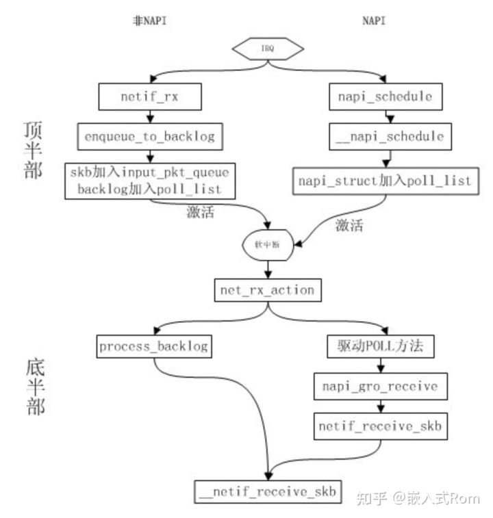

参考

 https://gitee.com/ghjiee/ldd3_dev/blob/master/src/snull/snull.c

https://zhuanlan.zhihu.com/p/488083066


以太网DM9000 , NIC网卡， drivers/net/ethernet/davicom/dm9000.c


对于NIC，在中断上半部处理函数中，需要读取硬件接收的内容，构造skb_buff后再将其作为参数调用netif_rx()，netif_rx会pending softirq, 软中断在处理时间接调用process_backlog，process_backlog再调用\_\_netif_receive_skb将数据包放入网络协议栈


对于NAPI，中断上半部不需要构建skb_buff，只需调用禁止硬件接收中断，然后调用如下函数来pending softirq

```
450  static inline void napi_schedule(struct napi_struct *n)
451  {
452  	if (napi_schedule_prep(n))
453  		__napi_schedule(n);
454  }
```

软中断进行处理时回调网卡驱动注册poll函数，在poll函数中





无线MAC80211 台湾realtek公司的rtl8180/8187芯片驱动最为简单。我还专门淘到了一些古老的基于rtl8180/8187芯片的网卡，在Linux下通过学习和修改rtl8180/8187驱动学习真正的Wi-Fi网卡是如何工作的。参照这些芯片驱动，并结合Xilinx给的DMA驱动代码，成功实现了openwifi的mac80211子系统兼容驱动。


drivers/net/wireless/mediatek/mt76/   和  drivers/net/wireless/realtek/rtl818x/rtl8180/dev.c    

实现RF硬件操作函数，并调用mac80211提供的API向mac80211子系统注册这些硬件函数，调用mac80211提供的API向网络子系统注册struct net_device，并向cfg80211子系统注册struct wiphy，net/mac80211/iface.c 中实现了struct net_device中的struct net_dev_ops，net/mac80211/cfg.c中实现了struct wiphy中的struct  cfg80211_ops，但mac80211未提供netif_napi_add来设置NAPI，在通过ieee80211_register_hw来register_netdev得到struct net_device之后调下netif_napi_add函数来设置poll处理函数s。

https://www.kernel.org/doc/html/v4.9/80211/mac80211.html#c.ieee80211_opss

```
ieee80211_alloc_hw
		ieee80211_alloc_hw_nm
			wiphy_new_nm(wiphy_new)


ieee80211_register_hw
		wiphy_register
		ieee80211_if_add
				alloc_netdev_mqs(alloc_netdev)
				register_netdevice(register_netdev)
```


