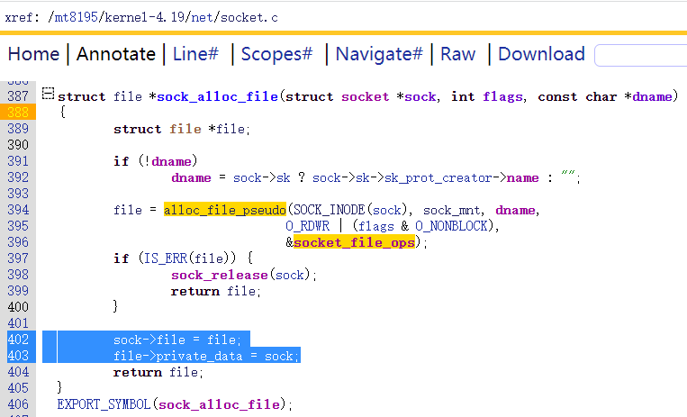
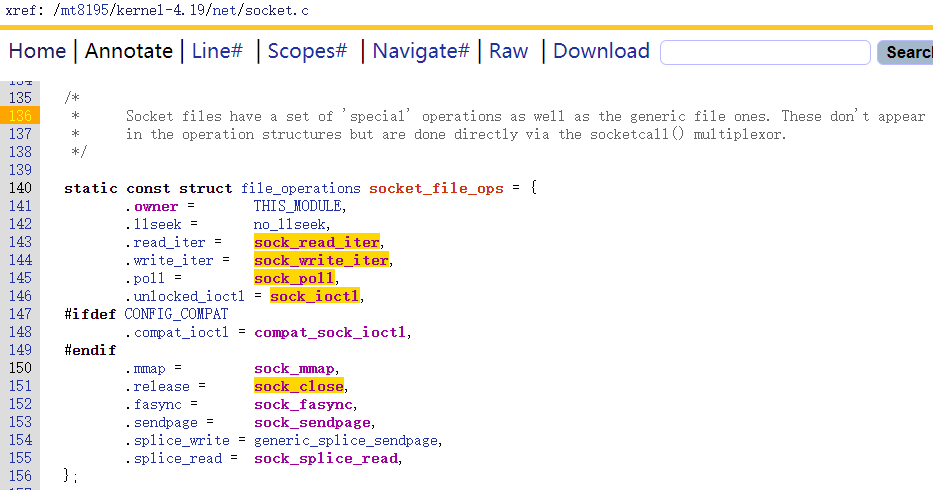
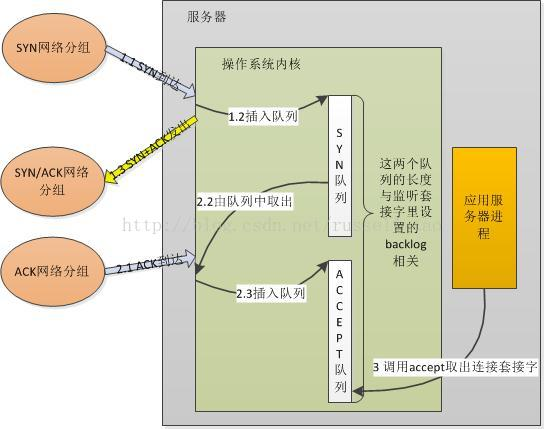
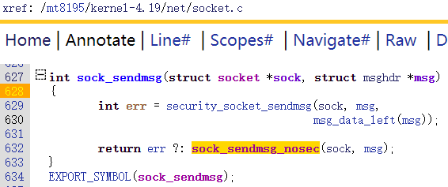

# 概念


参考

 https://gitee.com/ghjiee/ldd3_dev/blob/master/src/snull/snull.c

https://zhuanlan.zhihu.com/p/488083066


以太网DM9000 , NIC网卡， drivers/net/ethernet/davicom/dm9000.c


刚分配时head==data==tail < end

skb_reserve只允许在刚分配后使用，把data和tail同时往end方向移动一定距离  head< data==tail <= end


对于NIC，在中断上半部处理函数中，需要读取硬件接收的内容，构造sk_buff后再将其作为参数调用netif_rx()，netif_rx会pending softirq, 软中断在处理时间接调用process_backlog，process_backlog再调用\_\_netif_receive_skb将数据包放入网络协议栈


TCP层进行分段，分好后在IP层不用再分片，得到的每个IP包中都有TCP的header。接收方收到后在IP层不重组，交给TCP协议后由TCP协议去重组成一个大的TCP段。


UDP/ICMP/RAW不分段，靠IP层分片。如果是UDP/ICMP，得到的每个IP包中只有第一个IP包中有UDP/ICMP的header，其他的包中没有header，接收方接收后在IP层重组成一个超大IP包然后交给上层UDP/ICMP/RAW这些具体协议。


TSO(TCP Segmentation Offload): 是一种利用网卡来对大数据包进行自动分段，降低CPU负载的技术。 其主要是延迟分段。

GSO(Generic Segmentation Offload): GSO是协议栈是否推迟分段，在发送到网卡之前判断网卡是否支持TSO，如果网卡支持TSO则让网卡分段，否则协议栈分完段再交给驱动。 **如果TSO开启，GSO会自动开启。**

以下是TSO和GSO的组合关系：

l GSO开启， TSO开启: 协议栈推迟分段，并直接传递大数据包到网卡，让网卡自动分段

l GSO开启， TSO关闭: 协议栈推迟分段，在最后发送到网卡前才执行分段

l GSO关闭， TSO开启: 同GSO开启， TSO开启

l GSO关闭， TSO关闭: 不推迟分段，在tcp_sendmsg中直接发送MSS大小的数据包

开启GSO/TSO

驱动程序在注册网卡设备的时候默认开启GSO: NETIF_F_GSO

驱动程序会根据网卡硬件是否支持来设置TSO: NETIF_F_TSO


https://blog.csdn.net/Rong_Toa/article/details/108748689


| **Offload** | **传输段还是接收端** | **针对的协议** | **Offloading 的位置**                        | **ethtool 命令输出中的项目** | **ethtool 命令中的 option** | **网卡/Linux 内核支持情况**                                  |
| ----------- | -------------------- | -------------- | -------------------------------------------- | ---------------------------- | --------------------------- | ------------------------------------------------------------ |
| TSO         | 传输段               | TCP            | 网卡硬件                                     | tcp-segmentation-offload     | tso                         | Linux 内核从 [2.5.33](http://kernelnewbies.org/LinuxVersions) 引入 （2002）网卡普遍支持，推荐使用 |
| UFO         | 传输段               | UDP            | 网卡硬件                                     | udp-fragmentation-offload    | ufo                         | linux [2.6.15](http://kernelnewbies.org/Linux_2_6_15) 引入 （2006）**网卡普遍不支持** |
| GSO         | 传输段               | TCP/UDP        | 网卡硬件或者 进入网卡驱动(调用即xmit)之前    | generic-segmentation-offload | gso                         | GSO/TCP: Linux [2.6.18](http://kernelnewbies.org/Linux_2_6_18) 中引入（2006）GSO/UDP: [linux 3.16](http://kernelnewbies.org/Linux_3.16) (2014)，推荐使用 |
|             |                      |                |                                              |                              |                             |                                                              |
| LRO         | 接收段               | TCP            | 网卡硬件                                     | large-receive-offload        | lro                         | Linux 内核 [2.6.24](http://kernelnewbies.org/Linux_2_6_24#head-c24461fecdf79d8181a118cafcb1657a32ff7831) 引入（2008）网卡普遍支持，不推荐使用。 |
| GRO         | 接收段               | TCP            | 网卡硬件 或者 离开网卡驱动进入网络协议栈之前 | generic-receive-offload      | gro                         | Linux 内核 [2.6.18](http://kernelnewbies.org/Linux_2_6_18) 引入(2006)网卡普遍支持，推荐使用。 |


https://my.oschina.net/xinxingegeya/blog/485643


# [TCP Nagle 算法 && 延迟确认机制](https://my.oschina.net/xinxingegeya/blog/485643)

https://www.oschina.net/group/backend)

TCP Nagle 算法 && 延迟确认机制


# TCP Nagle 算法

[http://baike.baidu.com/view/2468335.htm](https://www.oschina.net/action/GoToLink?url=http%3A%2F%2Fbaike.baidu.com%2Fview%2F2468335.htm)

百度百科：TCP/IP 协议中，无论发送多少数据，总是要在数据前面加上协议头，同时，对方接收到数据，也需要发送 ACK 表示确认。为了尽可能的利用网络带宽，TCP 总是希望尽可能的发送足够大的数据。***（一个连接会设置 MSS 参数，因此，TCP/IP 希望每次都能够以 MSS 尺寸的数据块来发送数据）。******Nagle 算法就是为了尽可能发送大块数据，避免网络中充斥着许多小数据块。（减少大量小包的发送）***

> ***Nagle 算法的基本定义是任意时刻，最多只能有一个未被确认的小段。所谓 “小段”，指的是小于 MSS 尺寸的数据块，所谓 “未被确认”，是指一个数据块发送出去后，没有收到对方发送的 ACK 确认该数据已收到。***

> Nagle 算法的规则（可参考 tcp_output.c 文件里 tcp_nagle_check 函数注释）：
>
> （1）如果包长度达到 MSS，则允许发送；
>
> （2）如果该包含有 FIN，则允许发送；
>
> （3）设置了 TCP_NODELAY 选项，则允许发送；
>
> （4）未设置 TCP_CORK 选项时，***若所有发出去的小数据包（包长度小于 MSS）均被确认，则允许发送；***
>
> （5）上述条件都未满足，但发生了超时（一般为 200ms），则立即发送。

***Nagle 算法只允许一个未被 ACK 的包存在于网络，它并不管包的大小，因此它事实上就是一个扩展的停 - 等协议（停止等待 ARQ 协议），只不过它是基于包停 - 等的，而不是基于字节停 - 等的。Nagle 算法完全由 TCP 协议的 ACK 机制决定，这会带来一些问题，比如如果对端 ACK 回复很快的话，Nagle 事实上不会拼接太多的数据包，虽然避免了网络拥塞，网络总体的利用率依然很低。***


# Nagle 算法的应用场景

在 Nagle 算法的 Wiki 主页，有这么一段话：

> In general, since Nagle's algorithm is only a defense against careless applications, it will not benefit a carefully written application that takes proper care of buffering; the algorithm has either no effect, or negative effect on the application.

可见编程模型对 “减少网络上小包数量” 的影响，言外之意，***Nagle 算法是个有针对性的优化 - 针对交互式应用，不是放之四海而皆准的标准，要想有一个比较好的方案，别指望它了，还是应用程序自己搞定才是正解！******要想 Nagle 算法真的能够减少网络上小包数量而又不引入明显延迟，对 TCP 数据的产生方式是有要求的，交互式应用是其初始针对的对象，，Nagle 算法要求数据必须是 “乒乓型” 的，也就是说，数据流有明确的边界且一来一回，类似人机交互的那种，比如 telnet 这种远程终端登录程序，数据是人从键盘敲入的，边界基本上就是击键，一来一回就是输入回显和处理回显。***Nagle 算法在上面的场景中保证了下一个小包发送之前，所有发出的包已经得到了确认，再次我们看到，Nagle 算法并没有阻止发送小包，它只是阻止了发送大量的小包。

换句话说，所谓的 “乒乓型” 模式就是 “write-read-write-read” 模式 - 人机交互模式，但是对于 Wiki 中指出的 “write-write-read”(很多的 request/response 模式 C/S 服务就是这样的，比如 HTTP)- 程序交互模式，Nagle 算法和延迟 ACK（延迟确认机制）拔河的恶果就会被放大。

有一篇很好的文章 [http://baus.net/on-tcp_cork/](https://www.oschina.net/action/GoToLink?url=http%3A%2F%2Fbaus.net%2Fon-tcp_cork%2F)《TCP_CORK: More than you ever wanted to know》，文章说，Nagle 算法对于数据来自于 user input 的那种应用是有效的，但是对于数据 generated  by applications using stream oriented protocols，Nagle 算法纯粹引入了延迟，这个观点我非常赞同，因为对于人而言，TCP 登录俄远程计算机就是一个处理机，人希望自己的操作马上展示结果，***其模式就是 write-read-write-read 的，***但是对于程序而言，其数据产生逻辑就不像人机交互那么固定，因此你就不能假定程序依照任何序列进行网络 IO，而 Nagle 算法是和数据 IO 的序列相关的。实际上就算接收端没有启用延迟 ACK，Nagle 算法应用于 write-write-read 序列也是有问题的，作者的意思是，平白无故地引入了额外的延迟。

难道真的有这么复杂吗？作者没有提出如何靠编程把问题解决，但是 Nagle 算法的 Wiki 页面上提到了” 尽量编写好的代码而不要依赖 TCP 内置的所谓的算法 “来优化 TCP 的行为。


# TCP_NODELAY 套接字选项

默认情况下，发送数据采用 Negle 算法。这样虽然提高了网络吞吐量，但是实时性却降低了，在一些交互性很强的应用程序来说是不允许的，

***使用 TCP_NODELAY 选项可以禁止 Negale 算法。*** 


## [TCP_NODELAY 和 TCP_CORK主要区别](https://www.cnblogs.com/biyeymyhjob/p/4670502.html)

一句话总结：

tcp_nodelay：禁止nagle算法，有需要发送的就立即发送，比较常见

tcp_cork：它是一种加强的nagle算法，过程和nagle算法类似，都是累计数据然后发送。但它没有 nagle中1的限制，所以，在设置cork后，即使所有ack都已经收到，但我还是不想发送数据，我还想继续等待应用层更多的数据，所以它的效果比nagle更好。效率上与Nagle算法相比，Nagle算法主要避免网络因为太多的小包(协议头的比例非常之大)而拥塞，而CORK算法则是为了提高网络的利用率，使得总体上协议头占用的比例尽可能的小

 

```
tcp_cork使用方法

int on = 1; 
setsockopt (fd, SOL_TCP, TCP_CORK, &on, sizeof (on)); /* 设置cork */ 
write (fd, …); //传输文件元数据
...
sendfile (fd, …); //传输文件本体
… 
on = 0; 
setsockopt (fd, SOL_TCP, TCP_CORK, &on, sizeof (on)); /* 拔去塞子 ，发送数据*/ 
```


```
Nagle 算法的规则（可参考 tcp_output.c 文件里 tcp_nagle_check 函数注释）：

（1）如果包长度达到 MSS，则允许发送；

（2）如果该包含有 FIN，则允许发送；

（3）设置了 TCP_NODELAY 选项，则允许发送，相当于禁止了Nagle 算法；

（4）未设置 TCP_CORK 选项时，若所有发出去的小数据包（包长度小于 MSS）均被确认，则允许发送；

（5）上述条件都未满足，但发生了超时（一般为 200ms），则立即发送。
```


TCP_NODELAY=0   TCP_CORK=0    //默认情况，标准的negale算法。

一次send大于mss的数据流，将数据流分为  至少一个等于mss的sk_buff  和 一个小于mss的sk_buff

一次send小于等于mss的数据流，将数据流放入一个小于等于mss的sk_buff

等于mss的sk_buff立即进入滑动窗口排队发送。

**小于mss的sk_buff只有收到上次的ACK  或  超时**  才能进入滑动窗口排队发送。

在等待过程中小于mss的sk_buff可以待下次send时累积增长成等于mss的sk_buff然后触发发送事件。


TCP_NODELAY=0   TCP_CORK=1    //加强版的negale算法。

一次send大于mss的数据流，将数据流分为至少一个等于mss的sk_buff和一个小于mss的sk_buff

一次send小于等于mss的数据流，将数据流放入一个小于等于mss的sk_buff

等于mss的sk_buff立即进入滑动窗口排队发送。

**小于mss即使收到ACK也不发送，只有  超时**  才能进入滑动窗口排队发送。

在等待过程中小于mss的sk_buff可以待下次send时累积增长成等于mss的sk_buff然后触发发送事件。


TCP_NODELAY=1   TCP_CORK=无效  //相当于禁止negale算法

一次send大于mss的数据流，将数据流分为至少一个等于mss的sk_buff和一个小于mss的sk_buff

一次send小于等于mss的数据流，将数据流放入一个小于等于mss的sk_buff

把所有的sk_buff立即送入滑动窗口排队发送，无论是否小于mss


注，无论是否启用negale，跟后续发送窗口拥塞窗口控制、流水线时发送接收、延迟确认机制都没有直接关系

只要没有达到   min(拥塞窗口，发送窗口)  的限制，


TCP Offload(即同时支持TSO和gso)    &&   negale  &&  window


struct tcp_sock.gso_segs==1   说明不支持gso

struct tcp_sock.gso_segs>1     说明支持gso, 尺寸为mss的gso_segs倍


# 延迟确认机制（TCP delayed acknowledgment） 

wiki 的解释 [https://en.wikipedia.org/wiki/TCP_delayed_acknowledgment](https://www.oschina.net/action/GoToLink?url=https%3A%2F%2Fen.wikipedia.org%2Fwiki%2FTCP_delayed_acknowledgment)

1989 RFC 1122 定义，全名 Delayed Acknowledgment，简称延迟 ACK，翻译为***延迟确认。*** 

与 Nagle 算法一样，延迟 ACK 的目的也是为了减少网络中传输大量的小报文数，但该报文数是针对 ACK 报文的。 

一个来自发送端的报文到达接收端，TCP 会延迟 ACK 的发送，希望应用程序会对刚刚收到的数据进行应答，这样就可以用新数据将 ACK 捎带过去。


# 当 Nagle 算法遇到 Delayed ACK

在一个有数据传输的 TCP 连接中，如果只有数据发送方启用 Nagle 算法，在其连续发送多个小报文时，Nagle 算法机制会减少网络中的小报文数量。这就意味着，同样传输相同大小的应用数据，在网络上的报文个数却不同。 

举个例子，发送端需要连续发送 5 个写操作（应用程序将数据写入到缓冲池的动作）的小报文，***首先发送第一个，由于 Nagle 算法的作用，在未收到第一个报文确认前，发送端在等待写操作的同时进行读操作，接收端并未启用延迟确认（视 TCP delay ACK 时间为 0），尽管刚收到该报文就发出确认，但由于网络延时的原因，在收集齐另外 4 个小报文后，发送方才收到了第一个报文的 ACK，则后面的 4 个报文会一起发送出去（大小未超过 MSS），接收端再次 ACK。***


在上述发送 5 个小报文的过程中，只用了 4 个报文就实现了。但如果发送端未启用 Nagle 算法，完成整个过程则至少需要 8 个报文或 10 个报文才能实现，这里接收端未启用延迟确认，如下图所示。启用 Nagle 算法和未启用 Nagle 算法的场景中，从完成数据发送的时间来看，未启用 Nagle 算法的方式花费的时间会更长一些，如下图所示。这里基本看到了 Nagle 算法的好处了。


还是上述数据传输场景，***发送端未启用 Nagle 算法，但接收端延迟确认默认时间为 200ms，来看看这时的情况。 RFC 1122 规定，Delayed ACK 对单个的小报文可以延长确认的时间，但不允许有两个连续的小报文不被确认。所以，当发送端连续发送两个报文后，接收端必须给予确认。***这时的数据传输情况如下图，只有当第 5 个报文到达后，接收端由于延迟确认机制，会导致 200ms 的延时存在。


***接下来看看，当 Nagle 算法遇到 Delayed ACK 时会是什么情况。按照常理推断，两种深思熟虑的功能设计，应该是 1+1>2 的效果。具体如何，还是请事实说话。***

先继续看上面的假设场景，该场景要求发送端向接收端发送 5 个连续的写操作数据，但网络延时较大，同时发送端启用 Nagle 算法，接收端 Delayed ACK 默认为 200ms。 

发送方先发出一个小报文，接收端收到后，由于延迟确认的机制，等待发送方的下一个报文到达。而发送方由于 Nagle 算法机制，在未接收到第一个报文的确认前，不会发送已读取到的报文。  在这种场景下，暂不考虑应用处理时间，完成整个数据传输所需时间为 2RTT+400ms，貌似情况不是特别糟糕。


如果上述其他条件不变，发送方应用写操作延时稍微变大，或发送端的应用操作延时稍大，我们再看看，完成这个操作的延时情况。 

发送方先发出一个小报文，接收端收到后，由于延迟确认的机制，等待发送方的下一个报文到达。由于发送方应用数据写操作延时较大，在经过 RTT+200ms 后，读取到了下一个需要发送的内容，此时接收到了第一个报文的确认，而网络中未有没被确认的报文，发送方需要再将第二个小报文发送出去，以此类推，直到最后一个小报文被发送，且接收到该报文的确认，此时整个数据传输过程完成。 

在这种情景下，完成整个数据传输所需时间则为 5RTT+5*200ms，明显增大了不少。如果相同情境下，有成千上万的小报文发送，则整体使用时间相当可观了。


在实际情况下，如果发送方程序做了一系列的写、写、读操作的现象，这样的操作都会触发 Nagle 和延迟 ACK 算法之间的交互作用，应该尽量避免。


https://my.oschina.net/xinxingegeya/blog/485650


# NIC

## 接收
### 代码实现

#### 中断上半部

#### 中断下半部

## 发送
### 代码实现

#### 中断上半部

#### 中断下半部


# NAPI

## 接收

### 流程原理

参考stm32 ethernet DMA机制

DMA描述符中的Control/Status是flag,Buffer Count是DMA控制器传输的目标内存块尺寸，Buffer Address指针指向了DMA控制器传输的目标内存首地址，DMA控制器可以根据这些flag标记判断是否有空节点。


ringbuffer = DMA描述符链表 + DMA描述符中Buffer Address指向的内存块。

当网卡收到数据后触发接收事件，DMA控制器处理网卡接收事件时，首先遍历在ringbuffer中的DMA描述符，找到一个空的，然后将数据传输到空的DMA描述符的Buffer Address指针指向的内存地址。

可能DMA控制器处理一次网卡接收事件时会用掉好几个空的DMA描述符，数据放到了好几块非连续的内存块。

DMA控制器处理完网卡接收事件后向中断控制器发送中断请求，然后中断控制器打断CPU让其去处理DMA接收完成硬件中断，硬件中断唤醒软中断，软中断调用poll。

poll函数记录下指向接收数据的旧的Buffer Address，然后开辟一块新的内存并把DMA描述符中Buffer Address指向新开辟的内存，修改flag标记为空且将归属权交给DMA控制器，判断一下如果DMA停止了且网卡还有接收的数据需要传输则重新启动DMA。接着创建sk_buff,使用指向接收数据的旧的Buffer Addres来初始化sk_buff里面的一些指针字段，掐掉数据链路层的头部后调用\_\_netif_receive_skb把sk_buff丢到网络协议栈。

当网络协议栈处理完sk_buff后释放时顺带释放指向接收数据的旧的Buffer Address。

整个流程避免了使用CPU从网卡拷贝接收数据到内存。


注意，一个sk_buff中传输的数据可以由多块不连续的内存块组成。一次poll函数可以调用多次\_\_netif_receive_skb往网络协议栈丢入sk_buff，\_\_netif_receive_skb每次只处理一个sk_buff，即该sk_buff代表一个ip数据包。


### 代码实现
#### 中断上半部

对于NAPI，中断上半部不需要构建sk_buff，首先保存先前的中断状态并禁止当前单个处理器的所有硬件中断，接着调用\_\_\_\_napi_schedule把struct napi_struct结构体放入当前CPU私有数据链表中，然后调用\_\_raise_softirq_irqoff通知当前CPU的ksoftirq线程可以处理软中断了，通知完成后(不需要等ksoftirq线程处理完成)一路返回并恢复先前的中断状态。


local_irq_save(flags);//保存先前中断状态，并禁止当前单个处理器的所有中断

local_irq_restore(flags);//恢复当前单个处理器的中断状态


#### 中断下半部

前面在中断上半部\_\_\_\_napi_schedule中调用\_\_raise_softirq_irqoff(NET_RX_SOFTIRQ)来唤醒ksoftirq进行处理，接下来看它是如何处理的，在内核启动时调用了net_dev_init，在这个里面注册了net_rx_action处理函数：

kernel-4.19/net/core/dev.c

```c
9817  static int __init net_dev_init(void)
9818  {
......
9883  	open_softirq(NET_TX_SOFTIRQ, net_tx_action);
9884  	open_softirq(NET_RX_SOFTIRQ, net_rx_action);
......
9892  }
```


- SEC  秒
- PER  每
- NSEC 纳秒
- MSEC 毫秒
- USEC 微秒

```cpp
#define NSEC_PER_SEC 1000000000ull     多少纳秒 = 1秒            1秒 = 10亿纳秒              
#define NSEC_PER_MSEC 1000000ull       多少纳秒 = 1毫秒          1毫秒 = 100万纳秒
#define USEC_PER_SEC 1000000ull        多少微秒 = 1秒            1秒 = 100万微秒   
#define NSEC_PER_USEC 1000ull          多少纳秒 = 1微秒           1微秒 = 1000 纳秒
```


kernel-4.19/net/core/dev.c

```c
3936  int netdev_budget __read_mostly = 300; //一次接收软中断最多处理300个数据包
3937  /* Must be at least 2 jiffes to guarantee 1 jiffy timeout */   // 一次接收软中断最多持续 200万个 1/HZ 时间
3938  unsigned int __read_mostly netdev_budget_usecs = 2 * USEC_PER_SEC / HZ;

......
 
6272  static int napi_poll(struct napi_struct *n, struct list_head *repoll)
6273  {
6274  	void *have;
6275  	int work, weight;
6276  
6277  	list_del_init(&n->poll_list);
6278  
6279  	have = netpoll_poll_lock(n);
6280  
6281  	weight = n->weight;//weight在netif_napi_add初始化napi_struct时指定，即一次最大能处理多少个数据包
6282  
6283  	/* This NAPI_STATE_SCHED test is for avoiding a race
6284  	 * with netpoll's poll_napi().  Only the entity which
6285  	 * obtains the lock and sees NAPI_STATE_SCHED set will
6286  	 * actually make the ->poll() call.  Therefore we avoid
6287  	 * accidentally calling ->poll() when NAPI is not scheduled.
6288  	 */
6289  	work = 0;
6290  	if (test_bit(NAPI_STATE_SCHED, &n->state)) {
6291  		struct softnet_data *sd = this_cpu_ptr(&softnet_data);
6292  
6293  		sd->current_napi = n;
6294  		work = n->poll(n, weight);//回调struct napi_struct中的poll函数指针来进行处理，poll返回处理了多少个数据包
6295  		trace_napi_poll(n, work, weight);
6296  	}
6297  
6298  	WARN_ON_ONCE(work > weight);
6299  
6300  	if (likely(work < weight))       
6301  		goto out_unlock;//收包数量小于配额，全部读完了就退出
6302    //接下来的代码处理超过weight后还需要继续poll的情况
6303  	/* Drivers must not modify the NAPI state if they
6304  	 * consume the entire weight.  In such cases this code
6305  	 * still "owns" the NAPI instance and therefore can
6306  	 * move the instance around on the list at-will.
6307  	 */
6308  	if (unlikely(napi_disable_pending(n))) {
6309  		napi_complete(n);
6310  		goto out_unlock;
6311  	}
6312  
6313  	if (n->gro_bitmask) {
6314  		/* flush too old packets
6315  		 * If HZ < 1000, flush all packets.
6316  		 */
6317  		napi_gro_flush(n, HZ >= 1000);
6318  	}
6319  
6320  	/* Some drivers may have called napi_schedule
6321  	 * prior to exhausting their budget.
6322  	 */
6323  	if (unlikely(!list_empty(&n->poll_list))) {
6324  		pr_warn_once("%s: Budget exhausted after napi rescheduled\n",
6325  			     n->dev ? n->dev->name : "backlog");
6326  		goto out_unlock;
6327  	}
6328  
6329  	list_add_tail(&n->poll_list, repoll);      //将超过weight后还需要继续poll的napi_struct挂到 repoll 链表上
6330  
6331  out_unlock:
6332  	netpoll_poll_unlock(have);
6333  
6334  	return work;
6335  }
6336  //open_softirq(NET_RX_SOFTIRQ, net_rx_action)注册的软中断接收处理函数
6337  static __latent_entropy void net_rx_action(struct softirq_action *h)
6338  {
6339  	struct softnet_data *sd = this_cpu_ptr(&softnet_data);
6340  	unsigned long time_limit = jiffies +
6341  		usecs_to_jiffies(netdev_budget_usecs);  //记录超时时候的 jiffies
6342  	int budget = netdev_budget;//记录本次软中断还能处理多少个包
6343  	LIST_HEAD(list);//创建并初始化一个list链表头
6344  	LIST_HEAD(repoll);
6345  
6346  	local_irq_disable();
6347  	list_splice_init(&sd->poll_list, &list);//将当前cpu的待处理的napi_struct转移到list
6348  	local_irq_enable();
6349  
6350  	for (;;) {//循环处理 list 中的每个节点，每个节点对应一次硬件接收中断，一次软中断可以会处理多次硬中断请求
6351  		struct napi_struct *n;
6352  
6353  		if (list_empty(&list)) {
6354  			if (!sd_has_rps_ipi_waiting(sd) && list_empty(&repoll))
6355  				goto out;
6356  			break;
6357  		}
6358        //从 list 中取出一个节点，节点的类型是struct napi_struct，在链表中的container_of是poll_list
6359  		n = list_first_entry(&list, struct napi_struct, poll_list);    //采用的是fifo调度算法
6360  		budget -= napi_poll(n, &repoll);//使用napi_poll处理
6361  
6362  		/* If softirq window is exhausted then punt.
6363  		 * Allow this to run for 2 jiffies since which will allow
6364  		 * an average latency of 1.5/HZ.
6365  		 */
6366  		if (unlikely(budget <= 0 ||
6367  			     time_after_eq(jiffies, time_limit))) {//检查是否超时
6368  			sd->time_squeeze++;
6369  			break;
6370  		}
6371  	}//至此本次软中断处理完了一轮硬件接收中断请
6372    //如果repoll不为空即仍需继续处理，将repoll中的napi_struct放入当前CPU的私有链表，并触发下一次软中断进行处理
6373  	local_irq_disable();
6374    
6375  	list_splice_tail_init(&sd->poll_list, &list);
6376  	list_splice_tail(&repoll, &list);
6377  	list_splice(&list, &sd->poll_list);
6378  	if (!list_empty(&sd->poll_list))
6379  		__raise_softirq_irqoff(NET_RX_SOFTIRQ);
6380  
6381  	net_rps_action_and_irq_enable(sd);
6382  out:
6383  	__kfree_skb_flush();
6384  }
```


poll函数实现可以参考https://gitee.com/ghjiee/ldd3_dev/blob/master/src/snull/snull.c#L288

在 poll函数中最终调用\_\_netif_receive_skb把sk_buffer丢进网络协议栈

```
napi_gro_receive->napi_skb_finish->netif_receive_skb_internal->__netif_receive_skb

                        netif_receive_skb->netif_receive_skb_internal->__netif_receive_skb

                                                                process_backlog->__netif_receive_skb
```

丢完所有sk_buffer后再调用napi_complete通知一下网络协议栈。


### 优化方向

1.优化poll函数本身实现，例如借助DMA减少拷贝

2.可根据实际情况修改如下三个参数进行优化以提高网卡性能：
netdev_budget                 一次接收软中断最多处理多少个数据包
netdev_budget_usecs       一次接收软中断最多持续多少时间
struct napi_struct.weight   一次poll操作最多处理多少个数据包。

一次软接收中断在net_rx_action中的for循环中可以调用多次poll进行处理

weight小于等于网卡的某个ringbuf所能保存的最大数据包个数


## 发送


# 网络协议栈


系统调用

```
kernel-4.19/net/compat.c line 845
COMPAT_SYSCALL_DEFINE2(socketcall, int, call, u32 __user *, args)//when 64bit cpu run 32bit elf,  use this


kernel-4.19/net/socket.c line 2506
SYSCALL_DEFINE2(socketcall, int, call, unsigned long __user *, args) //other cases ,use this
```

SYSCALL_DEFINE2   socketcall   这个系统调用中根据参数调用\_\_sys\_XXX进行不同的处理，XXX分别是socket bind listen accept4 sendto recvfrom  sendmsg recvmsg sendmmsg recvmmsg  getsockname  getpeername  setsockopt socketpair shutdown，与应用层glibc/bionic库提供的网络编程API对应。


​    


## 创建套接字


IPPROTO_IP  = 0      /* dummy for IP */ 


//只能填充TCP包的payload，answer =& inetsw_array[0]

int fd = socket(AF_INET，SOCK_STREAM，IPPROTO_TCP) 

int fd = socket(AF_INET，SOCK_STREAM，0  /  IPPROTO_IP)


//只能填充UDP包的payload，answer = &inetsw_array[1]

int fd = socket(AF_INET，SOCK_DGRAM，IPPROTO_UDP)

int fd = socket(AF_INET，SOCK_DGRAM，0  /  IPPROTO_IP)


//只能填充ICMP包的payload，answer = &inetsw_array[2]

int fd = socket(AF_INET，SOCK_DGRAM，IPPROTO_ICMP)


原始套接字   answer = &inetsw_array[3]


//默认未打开了IP_HDRINCL选项，只能填充IP包的payload，且IP包payload中上层协议头和上层协议payload都要自己构建，

int fd = socket(AF_INET，SOCK_RAW，IPPROTO_TCP)    

int fd = socket(AF_INET，SOCK_RAW，IPPROTO_UDP)

int fd = socket(AF_INET，SOCK_RAW，IPPROTO_ICMP)


//默认打开了IP_HDRINCL选项，IP包的 部分header 和 IP包的payload需要自己构造，且IP包payload中上层协议头和上层协议payload都要自己构建，，

int fd = socket(AF_INET，SOCK_RAW，IPPROTO_RAW)


对于原始套接字如果没有设置IP_HDRINCL选项时，只能填充ip包payload部分，内核将自动创建IP首部。如果设置了IP_HDRINCL选项，则包内要填充的内容为IP数据包和部分header。内核只负责填充header的下面两个域：如果将IP数据包的标识域设置为0，内核将设置这个域。内核总是计算和填充IP数据包首部的校验和。


也可以使用setsockopt让IPPROTO_TCP/IPPROTO_UDP/IPPROTO_ICMP变成IPPROTO_RAW：

　　int on = 1；if（setsockopt（sockfd， IPPROTO_IP， IP_HDRINCL， &on， sizeof（on）） < 0）

　　{ fprintf（stderr， "setsockopt IP_HDRINCL ERROR！ /n"）；exit（1）；}


https://www.cnblogs.com/xiehuichina/p/12069380.html


### 协议簇/协议


kernel-4.19/net/socket.c

```
1205  int __sock_create(struct net *net, int family, int type, int protocol,
1206  			 struct socket **res, int kern)
1207  {
1208  	int err;
1209  	struct socket *sock;
1210  	const struct net_proto_family *pf;
......
1240  	sock = sock_alloc();
......
1247  	sock->type = type;
......
1261  	pf = rcu_dereference(net_families[family]);
......
//根据协议簇和协议簇中的具体协议，调用该具体协议的create函数指针，如果是IPPROTO_TCP则对应inet_create函数。
1276  	err = pf->create(net, sock, protocol, kern);
......
1295  	*res = sock;
1296  
1297  	return 0;
......
1311  }
```


以协议簇编号为索引从net_families中得到net_proto_family结构体指针，然后调用net_proto_family结构体中的create函数指针，如果协议簇是  AF_INET ，则net_proto_family如下：


内核启动时调用inet_init，inet_init中调用sock_register把inet_family_ops注册到了net_families数组中。


接下来看下inet_create的实现：

kernel-4.19/net/ipv4/af_inet.c

```c
129  static struct list_head inetsw[SOCK_MAX];

247  static int inet_create(struct net *net, struct socket *sock, int protocol,
248  		       int kern)
249  {
250  	struct sock *sk;
251  	struct inet_protosw *answer;
252  	struct inet_sock *inet;
253  	struct proto *answer_prot;
254  	unsigned char answer_flags;
255  	int try_loading_module = 0;
256  	int err;
257  
258  	if (protocol < 0 || protocol >= IPPROTO_MAX)
259  		return -EINVAL;
260  
261  	sock->state = SS_UNCONNECTED;/*socket的状态初始化为SS_UNCONNECTED*/
262  
263  	/* Look for the requested type/protocol pair. */
/*
inetsw[sock->type],type=SOCK_STREAM,      &inetsw_array[0]
inetsw[sock->type],type=SOCK_DGRAM,       &inetsw_array[1]   &inetsw_array[2]
inetsw[sock->type],type=SOCK_RAW,         &inetsw_array[3]


SOCK_STREAM
answer->protocol   protocol(in)    result
IPPROTO_TCP        IPPROTO_TCP     answer=&inetsw_array[0] protocol = IPPROTO_TCP

IPPROTO_TCP        0/IPPROTO_IP    answer=&inetsw_array[0] protocol = IPPROTO_TCP

IPPROTO_TCP        IPPROTO_UDP     err = -EPROTONOSUPPORT

IPPROTO_TCP        IPPROTO_ICMP    err = -EPROTONOSUPPORT

IPPROTO_TCP        others          err = -EPROTONOSUPPORT


SOCK_DGRAM
answer->protocol   protocol(in)    result
IPPROTO_UDP        IPPROTO_TCP     err = -EPROTONOSUPPORT
IPPROTO_ICMP       IPPROTO_TCP     err = -EPROTONOSUPPORT

IPPROTO_UDP        0/IPPROTO_IP    answer=&inetsw_array[1] protocol = IPPROTO_UDP

IPPROTO_UDP        IPPROTO_UDP     answer=&inetsw_array[1] protocol = IPPROTO_UDP

IPPROTO_UDP        IPPROTO_ICMP    err = -EPROTONOSUPPORT
IPPROTO_ICMP       IPPROTO_ICMP    answer=&inetsw_array[2] protocol = IPPROTO_ICMP

IPPROTO_UDP        others          err = -EPROTONOSUPPORT
IPPROTO_ICMP       others          err = -EPROTONOSUPPORT


SOCK_RAW
answer->protocol   protocol(in)    result
IPPROTO_IP         0/IPPROTO_IP    err = -EPROTONOSUPPORT
IPPROTO_IP         others          answer=&inetsw_array[3]   protocol=others  */

264  lookup_protocol:
265  	err = -ESOCKTNOSUPPORT;
266  	rcu_read_lock();
267  	list_for_each_entry_rcu(answer, &inetsw[sock->type], list) {
268  
269  		err = 0;
270  		/* Check the non-wild match. */
271  		if (protocol == answer->protocol) {
272  			if (protocol != IPPROTO_IP)
273  				break;
274  		} else {
275  			/* Check for the two wild cases. */
276  			if (IPPROTO_IP == protocol) {   //如果传入的protocol是0,
277  				protocol = answer->protocol;//则将其换成该type的默认protocol
278  				break;
279  			}
280  			if (IPPROTO_IP == answer->protocol)
281  				break;
282  		}
283  		err = -EPROTONOSUPPORT;
284  	}
285     
286  	if (unlikely(err)) {
/*未能找到匹配的inet_protosw结构的实例，则需加载对应的模块，再返回到lookup_protocol进行处理。尝试加载次数不超过两次，第一次要求加载的模块和PF_INET, protocol, sock->type这三个参数完全对应，第二次要求加载的模块和PF_INET, protocol两个参数对应即可。*/
287  		if (try_loading_module < 2) {
288  			rcu_read_unlock();
289  			/*
290  			 * Be more specific, e.g. net-pf-2-proto-132-type-1
291  			 * (net-pf-PF_INET-proto-IPPROTO_SCTP-type-SOCK_STREAM)
292  			 */
293  			if (++try_loading_module == 1)
294  				request_module("net-pf-%d-proto-%d-type-%d",
295  					       PF_INET, protocol, sock->type);
296  			/*
297  			 * Fall back to generic, e.g. net-pf-2-proto-132
298  			 * (net-pf-PF_INET-proto-IPPROTO_SCTP)
299  			 */
300  			else
301  				request_module("net-pf-%d-proto-%d",
302  					       PF_INET, protocol);
303  			goto lookup_protocol;
304  		} else
305  			goto out_rcu_unlock;
306  	}
307     
/*
执行到这里时根据传入 type 和 protocol 确定了inetsw_array数组中与对应那个数组项即answer
注意如果是原始套接字protocol与answer->protocol就不一定相等，执行到这里时protocol为系统调用传下的且适配过的protocol,适配过程在上面的line 277，即
如果socket(AF_INET,SOCK_STREAM,  0 / IPPROTO_IP),则此时 protocol=IPPROTO_TCP，
如果socket(AF_INET,SOCK_DGRAM,  0 / IPPROTO_IP),则此时protocol=IPPROTO_UDP
其他情况下传下的protocol是什么就是什么，并未适配修改。

TCP的type、protocol组合      answer = &inetsw_array[0],protocol=IPPROTO_TCP

UDP的type、protocol组合      answer = &inetsw_array[1],protocol=IPPROTO_UDP

ICMP的type、protocol组合     answer = &inetsw_array[2],protocol=传下来的未变，即IPPROTO_ICMP

原始套接字的type、protocol组合 answer = &inetsw_array[3],protocol=传下来的未变，除了0/IPPROTO_IP, 其他的IPPROTO_TCP/IPPROTO_TCP/IPPROTO_UDP/IPPROTO_RAW等都行
*/
    
308  	err = -EPERM;//检测用户是否用创建原始套接字的权利，只有root用户才能创建RAW SOCKET。
309  	if (sock->type == SOCK_RAW && !kern &&
310  	    !ns_capable(net->user_ns, CAP_NET_RAW))
311  		goto out_rcu_unlock; 
312     
/*
sock变量的类型是struct socket *    
socket.ops的类型是const struct proto_ops *
如果是socket type为stream则 socket->ops = &inet_stream_ops。不同的socket type会导致ops指向不同type的处理函数集合。同一种type下可能有多种具体协议，如果有多种协议，则ops指向函数集合中函数指针指向的函数 中通过调用sk->skc_prot将其交给具体协议来处理，具体的协议不同则skc_prot指向的函数处理集合也不同

sk的类型是struct sock *   
sk->skc_prot 类型为 struct proto *。
sk->skc_prot = answer_prot = &tcp_prot  //具体TCP协议，其处理函数集合为tcp_prot
tcp_prot中指向的函数有的仅在传输层处理，有的则调用网络层的函数将数据送入网络层进行处理。
*/
313  	sock->ops = answer->ops;//&inet_stream_ops
314  	answer_prot = answer->prot;//&tcp_prot
315  	answer_flags = answer->flags;
316  	rcu_read_unlock();
317  
318  	WARN_ON(!answer_prot->slab);
319  
320  	err = -ENOBUFS;
        /*传输控制块的派生关系：
  	struct sock                  //基类
  	struct inet_sock             //派生自struct sock
  	struct inet_connection_sock  //派生自struct inet_sock
  	struct tcp_sock              //派生自struct inet_connection_sock
    子类的第一成员就是其父类
  	
struct proto *    answer_prot,sk_prot;
answer_prot就是&tcp_prot，使用sk_alloc分配一个sizeof(struct tcp_sock)的空间, 然后初始化部分基类对象中的成员，将这块空间里的 sk_prot 指针指向传入的answer_prot，最后将这块空间首地址赋给sk基类指针
    */
321  	sk = sk_alloc(net, PF_INET, GFP_KERNEL, answer_prot, kern);
322  	if (!sk)
323  		goto out;
324  
325  	err = 0;
326  	if (INET_PROTOSW_REUSE & answer_flags)
327  		sk->sk_reuse = SK_CAN_REUSE;
328     
/*把struct sock *基类强制转换成struct inet_sock *子类指针后去初始化派生出的那部分成员*/
329  	inet = inet_sk(sk);
/*is_icsk表示是否为基于连接的传输控制块，即是否是基于inet_connection_sock结构的传输控制块，例如TCP的传输控制块*/
330  	inet->is_icsk = (INET_PROTOSW_ICSK & answer_flags) != 0;
331  
332  	inet->nodefrag = 0;
333  
/*如果套接字类型为原始套接字，则设置本地端口为协议号，并且如果协议为RAW协议，
    则设置inet_sock中的hdrincl，表示需要自己构建IP首部。*/
334  	if (SOCK_RAW == sock->type) {
335  		inet->inet_num = protocol;
336  		if (IPPROTO_RAW == protocol)
337  			inet->hdrincl = 1;
338  	}
339  
/*根据系统参数sysctl_ip_no_pmtu_disc设置创建的传输控制块是否支持PMTU。*/
340  	if (net->ipv4.sysctl_ip_no_pmtu_disc)
341  		inet->pmtudisc = IP_PMTUDISC_DONT;
342  	else
343  		inet->pmtudisc = IP_PMTUDISC_WANT;
344  
345  	inet->inet_id = 0;
346  
/*初始化sk参数。*/
347  	sock_init_data(sock, sk);
348  
/*初始化析构函数*/
349  	sk->sk_destruct	   = inet_sock_destruct;
/*设置协议类型,即传下来(如果为0则经过了转换)的protocol*/
350  	sk->sk_protocol	   = protocol;
/*设置传输控制块中的sk_backlog_rcv后备队列接收函数。*/
351  	sk->sk_backlog_rcv = sk->sk_prot->backlog_rcv;
352  
353  	inet->uc_ttl	= -1;
354  	inet->mc_loop	= 1;
355  	inet->mc_ttl	= 1;
356  	inet->mc_all	= 1;
357  	inet->mc_index	= 0;
358  	inet->mc_list	= NULL;
359  	inet->rcv_tos	= 0;
360  
361  	sk_refcnt_debug_inc(sk);
362  
363  	if (inet->inet_num) {
364  		/* It assumes that any protocol which allows
365  		 * the user to assign a number at socket
366  		 * creation time automatically
367  		 * shares.
368  		 */
/*如果传输控制块中的num设置了本地端口号，则设置inet的inet_sport参数*/
369  		inet->inet_sport = htons(inet->inet_num);
370  		/* Add to protocol hash chains. */
/*调用传输层接口hash，把传输控制块加入到散列表中。*/
371  		err = sk->sk_prot->hash(sk);
372  		if (err) {
373  			sk_common_release(sk);
374  			goto out;
375  		}
376  	}
377  
378  	if (sk->sk_prot->init) {
/*如果是TCP类型，调用TCP协议的初始化函数TCP为tcp_v4_init_sock来初始化struct tcp_sock派生出来的额外成员*/
379  		err = sk->sk_prot->init(sk);
380  		if (err) {
381  			sk_common_release(sk);
382  			goto out;
383  		}
384  	}
......
398  }//end of inet_create
......
1082  static struct inet_protosw inetsw_array[] =
1083  {
1084  	{
1085  		.type =       SOCK_STREAM,
1086  		.protocol =   IPPROTO_TCP,
1087  		.prot =       &tcp_prot,
1088  		.ops =        &inet_stream_ops,
1089  		.flags =      INET_PROTOSW_PERMANENT |
1090  			      INET_PROTOSW_ICSK,
1091  	},
1092  
1093  	{
1094  		.type =       SOCK_DGRAM,
1095  		.protocol =   IPPROTO_UDP,
1096  		.prot =       &udp_prot,
1097  		.ops =        &inet_dgram_ops,
1098  		.flags =      INET_PROTOSW_PERMANENT,
1099         },
1100  
1101         {
1102  		.type =       SOCK_DGRAM,
1103  		.protocol =   IPPROTO_ICMP,
1104  		.prot =       &ping_prot,
1105  		.ops =        &inet_sockraw_ops,
1106  		.flags =      INET_PROTOSW_REUSE,
1107         },
1108  
1109         {
1110  	       .type =       SOCK_RAW,
1111  	       .protocol =   IPPROTO_IP,	/* wild card */
1112  	       .prot =       &raw_prot,
1113  	       .ops =        &inet_sockraw_ops,
1114  	       .flags =      INET_PROTOSW_REUSE,
1115         }
1116  };
......
1890  static int __init inet_init(void)
1891  {
......
1918  	(void)sock_register(&inet_family_ops);//注册协议簇处理回调函数，其中有指针指向inet_create
......
1943  	for (q = inetsw_array; q < &inetsw_array[INETSW_ARRAY_LEN]; ++q)
1944  		inet_register_protosw(q);//把inetsw_array数组中的每个元素都加入inetsw链表
......
2011  }
```


### vfs及socket文件




line 394与line 395调用 alloc_file_pseudo创建struct file结构体并把file->f_op 指向socket_file_ops

line 402与line 403建立struct socket与struct file之间的关联


kernel-4.19/include/linux/net.h

```
111  struct socket {
112  	socket_state		state;
113  
114  	short			type;
115  
116  	unsigned long		flags;
117  
118  	struct socket_wq	*wq;
119  
120  	struct file		*file;
121  	struct sock		*sk;
122  	const struct proto_ops	*ops;
123  };
```

\_\_sys_socket主要创建了一个struct socket，

struct socket.file为使用struct socket结构体的inode创建的一个struct file结构体，并用fd与该struct file结构体关联，file结构体的file_operations是socket_file_ops。


socket_file_ops定义了我们平时使用套接字fd进行的一些sockscall系统调用未实现的常见操作，例如read/write/close/poll:




struct files_struct 中根据已打开文件fd序号值在fd_array数组中找到struct file结构体指针

具体的文件使用struct inode来描述例如普通文件设备文件套接字文件

打开具体的文件时生成了struct file，struct file中有文件偏移、标志例如FD_CLOEXEC/O_NONBLOCK/O_RDWR等、文件操作函数指针集合file_operrations、目录项struct dentry指针(目录项又能找到当初打开的那个文件的inode)


### 数据结构与回调函数总结

kernel-4.19/include/linux/net.h#111          struct socket
kernel-4.19/include/linux/fs.h#917             struct file
kernel-4.19/include/net/inet_sock.h#177  struct inet_sock 
kernel-4.19/include/net/sock.h#328          struct sock
kernel-4.19/include/linux/skbuff.h#664    struct sk_buff 

struct socket与struct file跟内核vfs框架相关
struct sock跟套接字创建时指定的协议簇有关，即AF_INET
struct inet_sock 跟套接字创建时指定的协议簇中的具体协议有关，即IPPROTO_TCP

在TCP套接字创建过程中并未单独创建struct sock，而是创建了一个struct inet_sock ，struct inet_sock 的第一个成员就是struct sock，可以用struct sock * 指向创建的这个struct inet_sock然后将其当作struct sock来用，面向对象思想就是struct inet_sock 继承/实现/拓展了struct sock。


回调函数：

pf是协议簇相关的，不同的协议簇pf就指向不同的结构体，这些结构体中都有create函数指针，如果是AF_INET则create函数指针指向inet_create， 调用inet_create时根据协议簇，调用该具体协议簇的create函数指针，并传入该协议簇中的具体协议。

pf->create(net, sock, protocol, kern) 


inet_create函数或inet_create调用的子函数    设置了如下回调函数指针：

socket->sk->sk_prot      = &tcp_prot
socket->ops                    =& inet_stream_ops


创建socket文件的file_operations后设置了如下回调函数指针

socket->file->f_op          = &socket_file_ops


## 绑定套接字地址
\_\_sys_bind


socket->ops->bind 指向了inet_bind


inet_bind调用\_\_inet_bind


## 监听套接字

\_\_sys_listen


socket->ops->listen指向了inet_listen：

```
kernel-4.19/net/ipv4/af_inet.c
195  int inet_listen(struct socket *sock, int backlog)
196  {
......
234  	sk->sk_max_ack_backlog = backlog;
......
240  }
```


## 建立连接


### 接收请求



```
1540  int __sys_accept4(int fd, struct sockaddr __user *upeer_sockaddr,
1541  		  int __user *upeer_addrlen, int flags)
1542  {
1543  	struct socket *sock, *newsock;
1544  	struct file *newfile;
......
1559  	newsock = sock_alloc();
......
1563  	newsock->type = sock->type;
1564  	newsock->ops = sock->ops;
......
1578  	newfile = sock_alloc_file(newsock, flags, sock->sk->sk_prot_creator->name);
......
1589  	err = sock->ops->accept(sock, newsock, sock->file->f_flags, false);
......
1608  	fd_install(newfd, newfile);
......
1619  }
```

socket->ops->accept指向了inet_accept


sock->sk_prot->accept指向了 inet_csk_accept


### 连接请求


socket->ops->connect指向了inet_stream_connect


```
kernel-4.19/net/ipv4/af_inet.c
603  int __inet_stream_connect(struct socket *sock, struct sockaddr *uaddr,
604  			  int addr_len, int flags, int is_sendmsg)
605  {
606  	struct sock *sk = sock->sk;
......
630  	switch (sock->state) {
631  	default:
......
634  	case SS_CONNECTED:
......
637  	case SS_CONNECTING:
......
644  	case SS_UNCONNECTED:
......
655  		err = sk->sk_prot->connect(sk, uaddr, addr_len);
......
670  	}

710  }
```

sk->sk_prot->connect指向了tcp_v4_connect                kernel-4.19/net/ipv4/tcp_ipv4.c

```c
201  /* This will initiate an outgoing connection. */
202  int tcp_v4_connect(struct sock *sk, struct sockaddr *uaddr, int addr_len)
203  {
204  	struct sockaddr_in *usin = (struct sockaddr_in *)uaddr;
205  	struct inet_sock *inet = inet_sk(sk);
206  	struct tcp_sock *tp = tcp_sk(sk);
207  	__be16 orig_sport, orig_dport;
208  	__be32 daddr, nexthop;
209  	struct flowi4 *fl4;
210  	struct rtable *rt;
211  	int err;
212  	struct ip_options_rcu *inet_opt;
213  	struct inet_timewait_death_row *tcp_death_row = &sock_net(sk)->ipv4.tcp_death_row;
214     //目标地址长度检查
215  	if (addr_len < sizeof(struct sockaddr_in))
216  		return -EINVAL;
217     //目标协议族检查
218  	if (usin->sin_family != AF_INET)
219  		return -EAFNOSUPPORT;
220     
221  	nexthop = daddr = usin->sin_addr.s_addr;
/*
是否设置源路由ip选项,一般未使用，inet_opt为NULL，源路由参考 
https://baike.baidu.com/item/%E6%BA%90%E8%B7%AF%E7%94%B1/1575884?fr=aladdin  
*/
222  	inet_opt = rcu_dereference_protected(inet->inet_opt,
223  					     lockdep_sock_is_held(sk));
224  	if (inet_opt && inet_opt->opt.srr) {
225  		if (!daddr)
226  			return -EINVAL;
227  		nexthop = inet_opt->opt.faddr;
228  	}
229     //路由决策，路由保存在rt->rt_dst中
230  	orig_sport = inet->inet_sport;
231  	orig_dport = usin->sin_port;
232  	fl4 = &inet->cork.fl.u.ip4;
233  	rt = ip_route_connect(fl4, nexthop, inet->inet_saddr,
234  			      RT_CONN_FLAGS(sk), sk->sk_bound_dev_if,
235  			      IPPROTO_TCP,
236  			      orig_sport, orig_dport, sk);
237  	if (IS_ERR(rt)) {
238  		err = PTR_ERR(rt);
239  		if (err == -ENETUNREACH)
240  			IP_INC_STATS(sock_net(sk), IPSTATS_MIB_OUTNOROUTES);
241  		return err;
242  	}
243     //组播地址、广播地址则返回错误
244  	if (rt->rt_flags & (RTCF_MULTICAST | RTCF_BROADCAST)) {
245  		ip_rt_put(rt);
246  		return -ENETUNREACH;
247  	}
248     
249  	if (!inet_opt || !inet_opt->opt.srr)
250  		daddr = fl4->daddr;
251     //如果没有设置源路由ip选项，就使用路由表寻址的路由来设置套接字源IP地址
252  	if (!inet->inet_saddr)
253  		inet->inet_saddr = fl4->saddr;
254  	sk_rcv_saddr_set(sk, inet->inet_saddr);
255  
256  	if (tp->rx_opt.ts_recent_stamp && inet->inet_daddr != daddr) {
257  		/* Reset inherited state */
258  		tp->rx_opt.ts_recent	   = 0;
259  		tp->rx_opt.ts_recent_stamp = 0;
260  		if (likely(!tp->repair))
261  			tp->write_seq	   = 0;
262  	}
263     //设置套接字目标IP地址
264  	inet->inet_dport = usin->sin_port;
265  	sk_daddr_set(sk, daddr);
266  
267  	inet_csk(sk)->icsk_ext_hdr_len = 0;
268  	if (inet_opt)
269  		inet_csk(sk)->icsk_ext_hdr_len = inet_opt->opt.optlen;
270  
271  	tp->rx_opt.mss_clamp = TCP_MSS_DEFAULT;
272  
273  	/* Socket identity is still unknown (sport may be zero).
274  	 * However we set state to SYN-SENT and not releasing socket
275  	 * lock select source port, enter ourselves into the hash tables and
276  	 * complete initialization after this.
277  	 */
278  	tcp_set_state(sk, TCP_SYN_SENT);//设置套接字状态为TCP_SYN_SENT
279  	err = inet_hash_connect(tcp_death_row, sk);//将套接字sk放入TCP连接管理哈希链表中
280  	if (err)
281  		goto failure;
282  
283  	sk_set_txhash(sk);
284     //为连接分配一个临时端口
285  	rt = ip_route_newports(fl4, rt, orig_sport, orig_dport,
286  			       inet->inet_sport, inet->inet_dport, sk);
287  	if (IS_ERR(rt)) {
288  		err = PTR_ERR(rt);
289  		rt = NULL;
290  		goto failure;
291  	}
292  	/* OK, now commit destination to socket.  */
293  	sk->sk_gso_type = SKB_GSO_TCPV4;
294  	sk_setup_caps(sk, &rt->dst);
295  	rt = NULL;
296  
297  	if (likely(!tp->repair)) {
298  		if (!tp->write_seq)//初始化TCP数据段序列号
299  			tp->write_seq = secure_tcp_seq(inet->inet_saddr,
300  						       inet->inet_daddr,
301  						       inet->inet_sport,
302  						       usin->sin_port);
303  		tp->tsoffset = secure_tcp_ts_off(sock_net(sk),
304  						 inet->inet_saddr,
305  						 inet->inet_daddr);
306  	}
307  
308  	inet->inet_id = prandom_u32();
309  
310  	if (tcp_fastopen_defer_connect(sk, &err))
311  		return err;
312  	if (err)
313  		goto failure;
314     //构建SYN包调用tcp_transmit_skb发送到IP层
315  	err = tcp_connect(sk);
316  
317  	if (err)
318  		goto failure;
319  
320  	return 0;
321  
322  failure:
323  	/*
324  	 * This unhashes the socket and releases the local port,
325  	 * if necessary.
326  	 */
327  	tcp_set_state(sk, TCP_CLOSE);
328  	ip_rt_put(rt);
329  	sk->sk_route_caps = 0;
330  	inet->inet_dport = 0;
331  	return err;
332  }
```


## 发送数据

### socket fs send
write, send，sendto以及sendmsg系统调用用于发送消息到另一个套接字。

write, send函数在套接字处于连接状态时方可使用，即TCP。

sendto和sendmsg在任何时候都可使用，即IP/UDP/ICMP。

先看相关数据结构

```
用户空间
bionic/libc/include/sys/socket.h
79  struct msghdr {
80    void* msg_name;
81    socklen_t msg_namelen;
82    struct iovec* msg_iov;
83    size_t msg_iovlen;
84    void* msg_control;
85    size_t msg_controllen;
86    int msg_flags;
87  };
88  
89  struct mmsghdr {
90    struct msghdr msg_hdr;
91    unsigned int msg_len;
92  };
bionic/libc/kernel/uapi/linux/uio.h
23  struct iovec {
24    void __user * iov_base;
25    __kernel_size_t iov_len;
26  }


内核空间
kernel-4.19/include/linux/socket.h
48  struct msghdr {
49  	void		*msg_name;	/* ptr to socket address structure */
50  	int		msg_namelen;	/* size of socket address structure */
51  	struct iov_iter	msg_iter;	/* data */
52  	void		*msg_control;	/* ancillary data */
53  	__kernel_size_t	msg_controllen;	/* ancillary data buffer length */
54  	unsigned int	msg_flags;	/* flags on received message */
55  	struct kiocb	*msg_iocb;	/* ptr to iocb for async requests */
56  };
57  
58  struct user_msghdr {
59  	void		__user *msg_name;	/* ptr to socket address structure */
60  	int		msg_namelen;		/* size of socket address structure */
61  	struct iovec	__user *msg_iov;	/* scatter/gather array */
62  	__kernel_size_t	msg_iovlen;		/* # elements in msg_iov */
63  	void		__user *msg_control;	/* ancillary data */
64  	__kernel_size_t	msg_controllen;		/* ancillary data buffer length */
65  	unsigned int	msg_flags;		/* flags on received message */
66  };
67  
68  /* For recvmmsg/sendmmsg */
69  struct mmsghdr {
70  	struct user_msghdr  msg_hdr;
71  	unsigned int        msg_len;
72  };
kernel-4.19/include/uapi/linux/uio.h
17  struct iovec
18  {
19  	void __user *iov_base;	/* BSD uses caddr_t (1003.1g requires void *) */
20  	__kernel_size_t iov_len; /* Must be size_t (1003.1g) */
21  };
kernel-4.19/include/linux/uio.h
31  struct iov_iter {
32  	int type;
 /*  type 成员中有 读写方向标志位，以及union中数据指针类型(例如ITER_IOVEC)标志位在最新的5.19.2版本的内核中已经把type去掉了，将其功能分开分别用不同的成员表示，即：
    u8 iter_type;//union中数据指针类型
    bool data_source;//读写方向标志位
    */
33  	size_t iov_offset;//记录当前在iov数组中的哪个iov上
34  	size_t count;//iov数组中所有iov的iov_len之和，即总字节数
35  	union {
36  		const struct iovec *iov;//iov数组指针
37  		const struct kvec *kvec;
38  		const struct bio_vec *bvec;
39  		struct pipe_inode_info *pipe;
40  	};
41  	union {
42  		unsigned long nr_segs;//iov数组的成员个数
43  		struct {
44  			int idx;
45  			int start_idx;
46  		};
47  	};
48  };


用户空间的struct msghdr与内核空间的struct user_msghdr相对应：
msg_name 为 struct sockaddr_xx 的首地址 即 用来描述目标通信地址
msg_namelen 为  struct sockaddr_xx 的长度
msg_iov为struct iovec数组的首地址
msg_iovlen为msg_iov中struct iovec的数量。
struct iovec.iov_base为数据块首地址，struct iovec.iov_len为数据块长度


用户空间的struct msghdr传到内核内核空间后一开始就是struct user_msghdr，但由于很多地址是用户空间的，为了方便后续处理先把它拷贝到内核(___sys_sendmsg函数中做的)，拷贝的数据放到内核空间的struct msghdr结构中，因此用户空间与内核空间的struct msghdr有所不同，内核空间的struct msghdr并未直接包含或指向struct iovec，而是通过struct iov_iter。

以下结构中一个该对象实例可以包含需要发送/接收的多个非连续的数据块的首地址/长度
用户空间的struct msghdr
内核内核空间struct user_msghdr
内核内核空间struct msghdr
内核内核空间struct iov_iter

一个用户空间的struct mmsghdr中有多个用户空间的struct msghdr
一个内核空间的struct mmsghdr中有多个内核空间的struct user_msghdr

sendmmsg相当于把多个sendmsg请求整合成了一个，如果这些发送请求是对同一个目标地址，那反而sendmmsg效率更低，倒不如直接使用struct msghdr的多个非连续数据块功能将数据进行批量发送，如果是需要同时发给很多不同目标地址的请求，那sendmmsg效率更高，因为可以减少很多次系统调用，因为对于每个目标地址sendmsg都要进行一次系统调用。
```


```
函数调用关系
                 __sys_sendto sock_sendmsg sock_sendmsg_nosec sock->ops->sendmsg
__sys_sendmsg  ___sys_sendmsg sock_sendmsg sock_sendmsg_nosec sock->ops->sendmsg
__sys_sendmmsg ___sys_sendmsg sock_sendmsg sock_sendmsg_nosec sock->ops->sendmsg
              sock_write_iter sock_sendmsg sock_sendmsg_nosec sock->ops->sendmsg
```


```
int __sys_sendto(int fd,
				 void __user *buff,
				 size_t len,
				 unsigned int flags,
                 struct sockaddr __user *addr,
                 int addr_len)
使用传用户空间传下来的发送数据块首地址和sockaddr构造一个内核空间的struct msghdr，然后将其作为参数调用一次sock_sendmsg
```


```
long __sys_sendmsg(int fd,
				   struct user_msghdr __user *msg,
				   unsigned int flags,
          		   bool forbid_cmsg_compat)
直接使用用户空间传下来的一个struct user_msghdr，将其作为参数调用一次___sys_sendmsg
```


```
int __sys_sendmmsg(int fd, struct mmsghdr __user *mmsg, unsigned int vlen,
  		           unsigned int flags, bool forbid_cmsg_compat)
struct mmsghdr中有很多个struct user_msghdr，对每个struct user_msghdr，将其作为参数调用一次___sys_sendmsg
```


```
static int ___sys_sendmsg(struct socket *sock,
						  struct user_msghdr __user *msg,
						  struct msghdr *msg_sys,
						  unsigned int flags,
						  struct used_address *used_address,
						  unsigned int allowed_msghdr_flags)

使用传入的一个struct user_msghdr构造一个内核里的struct msghdr，结果填入msg_sys，构造好了再将struct msghdr作为参数调用一次sock_sendmsg
```


```
static ssize_t sock_write_iter(struct kiocb *iocb, struct iov_iter *from)


文件file_operations的write方法和write_iter方法的区别是：write方法只能传入一个连续的缓冲区，write_iter方法可以传入多个分散的缓冲区。对套接字fd进行write操作时vfs调用到了file_operations结构体write函数指针，如果该指针为空则调用write_iter函数指针，前面创建 socket 的时候把socket fd的file_operations结构体设置成了 socket_file_ops，其中将write_iter指向了sock_write_iter函数，sock_write_iter函数使用用户空间传下来struct iov_iter构造一个struct msghdr，然后将其作为参数调用sock_sendmsg
```





socket->ops前面已经分析过就是answer->ops,也就是inetsw_array[x].ops  inetsw_array中的成员的ops分别指向了inet_stream_ops、inet_dgram_ops、inet_sockraw_ops，这三个结构体中的sendmsg都指向了inet_sendmsg


ethernet II MTU为1500

802.3          MTU为1492

MTU可以理解成留给网络层的最大报文总长，即网络层发往数据链路层数据包的最大长度

以太网MAC帧最长长度1518


sock->sk_port前面分析过就是answer->prot，inetsw_array[x].prot  inetsw_array中的成员的prot分别指向了tcp_prot、udp_prot、ping_prot、raw_prot，tcp_prot的sendmsg指向了tcp_sendmsg：


### tcp_sendmsg_locked

```c
1198  int tcp_sendmsg_locked(struct sock *sk, struct msghdr *msg, size_t size)
1199  {
1200  	struct tcp_sock *tp = tcp_sk(sk);
1201  	struct ubuf_info *uarg = NULL;
1202  	struct sk_buff *skb;
1203  	struct sockcm_cookie sockc;
1204  	int flags, err, copied = 0;
1205  	int mss_now = 0, size_goal, copied_syn = 0;
1206  	bool process_backlog = false;
1207  	bool zc = false;
1208  	long timeo;
1209  
1210  	flags = msg->msg_flags;
1211  
1212  	if (flags & MSG_ZEROCOPY && size && sock_flag(sk, SOCK_ZEROCOPY)) {
1213  		if ((1 << sk->sk_state) & ~(TCPF_ESTABLISHED | TCPF_CLOSE_WAIT)) {
1214  			err = -EINVAL;
1215  			goto out_err;
1216  		}
1217  
1218  		skb = tcp_write_queue_tail(sk);
1219  		uarg = sock_zerocopy_realloc(sk, size, skb_zcopy(skb));
1220  		if (!uarg) {
1221  			err = -ENOBUFS;
1222  			goto out_err;
1223  		}
1224  
1225  		zc = sk->sk_route_caps & NETIF_F_SG;
1226  		if (!zc)
1227  			uarg->zerocopy = 0;
1228  	}
1229  
1230  	if (unlikely(flags & MSG_FASTOPEN || inet_sk(sk)->defer_connect) &&
1231  	    !tp->repair) {
1232  		err = tcp_sendmsg_fastopen(sk, msg, &copied_syn, size);
1233  		if (err == -EINPROGRESS && copied_syn > 0)
1234  			goto out;
1235  		else if (err)
1236  			goto out_err;
1237  	}
1238  
/*当这个套接字是阻塞套接字时，timeo就是SO_SNDTIMEO选项指定的发送超时时间。如果这个套接字是非阻塞套接字， timeo变量就会是0*/
1239  	timeo = sock_sndtimeo(sk, flags & MSG_DONTWAIT);
1240  
1241  	tcp_rate_check_app_limited(sk);  /* is sending application-limited? */
1242  
1243  	/* Wait for a connection to finish. One exception is TCP Fast Open
1244  	 * (passive side) where data is allowed to be sent before a connection
1245  	 * is fully established.
1246  	 */
1247  	if (((1 << sk->sk_state) & ~(TCPF_ESTABLISHED | TCPF_CLOSE_WAIT)) &&
1248  	    !tcp_passive_fastopen(sk)) {
1249  		err = sk_stream_wait_connect(sk, &timeo);
1250  		if (err != 0)
1251  			goto do_error;
1252  	}
1253  
1254  	if (unlikely(tp->repair)) {
1255  		if (tp->repair_queue == TCP_RECV_QUEUE) {
1256  			copied = tcp_send_rcvq(sk, msg, size);
1257  			goto out_nopush;
1258  		}
1259  
1260  		err = -EINVAL;
1261  		if (tp->repair_queue == TCP_NO_QUEUE)
1262  			goto out_err;
1263  
1264  		/* 'common' sending to sendq */
1265  	}
1266  
1267  	sockcm_init(&sockc, sk);
1268  	if (msg->msg_controllen) {
1269  		err = sock_cmsg_send(sk, msg, &sockc);
1270  		if (unlikely(err)) {
1271  			err = -EINVAL;
1272  			goto out_err;
1273  		}
1274  	}
1275  
1276  	/* This should be in poll */
1277  	sk_clear_bit(SOCKWQ_ASYNC_NOSPACE, sk);
1278  
1279  	/* Ok commence sending. */
1280  	copied = 0;
1281 
/*
每个skb中填充的最大数据长度(即tcp报文中有效载荷的的最大长度)初始化到size_goal， size_goal表示GSO支持的大小，等于mss_now * gso_segs，不支持GSO时则和mss相等 。

MSS就是TCP数据包每次能够传输的最大数据分段。为了达到最佳的传输效能
TCP协议在建立连接的时候通常要协商双方的MSS值，这个值TCP协议在实现的
时候往往为MTU减去IP数据包包头的大小20Bytes和TCP数据段的
包头20Bytes，所以往往MSS为1460。通讯双方会根据双方提供的MSS值得最小
值确定为这次连接的最大MSS值。

此外连接建立时也确立了这个套接字跟哪个网卡关联，即可以知道网卡的 gso_segs

每个sk_buff的线性区分散聚合区所能存储的数据之和最多为size_goal个字节
*/
1282  restart:
1283  	mss_now = tcp_send_mss(sk, &size_goal, flags);
1284  
1285  	err = -EPIPE;
1286  	if (sk->sk_err || (sk->sk_shutdown & SEND_SHUTDOWN))
1287  		goto do_error;
1288  
1289  	while (msg_data_left(msg)) {
1290  		int copy = 0;//copy的意义是当前skb最多能容纳多少来自msghdr的数据
1291  
1292  		skb = tcp_write_queue_tail(sk);//获取获取sock->sk_buff_head发送队列中的最后一个skb
1293  		if (skb)//如果不为空则计算以下上一个skb里面还能放入多少byte
1294  			copy = size_goal - skb->len;
1295  
1296  		if (copy <= 0 || !tcp_skb_can_collapse_to(skb)) {
/*如果sock->sk_buff_head发送队列没有skb、或上一个skb已满、或出现错误则需在sk->sk_write_queue(struct sk_buff_head)尾部另开一个skb */
1297  			bool first_skb;
1298  			int linear;
1299  
1300  new_segment:
1301  			if (!sk_stream_memory_free(sk))
1302  				goto wait_for_sndbuf;
1303  
1304  			if (process_backlog && sk_flush_backlog(sk)) {
1305  				process_backlog = false;
1306  				goto restart;
1307  			}
1308  			first_skb = tcp_rtx_and_write_queues_empty(sk);
/*如果指定了zero copy则select_size返回0，否则先判断是否为sk->sk_write_queue(struct sk_buff_head)的首个sk_buff,如果是则返回预留的线性存储区长度,即  SKB_WITH_OVERHEAD(2048 - MAX_TCP_HEADER)，否则返回0*/
1309  			linear = select_size(first_skb, zc);
/* sk_stream_alloc_skb调用alloc_skb_fclone从skbuff_fclone_cache分配了一个主sk_buff和一个从sk_buff，主sk_buff的head指向的缓存长度为  sk->sk_prot->max_header  +  linear  + SKB_DATA_ALIGN(sizeof(struct skb_shared_info))，分配完后主sk_buff的head=data=tail < end,后续在把data和tail在head指向的缓存中预留MAX_TCP_HEADER，即head+MAX_TCP_HEADER,
=data=tail<=end
如果是tcp_proto，则sk->sk_prot->max_header为MAX_TCP_HEADER，忽略对齐的情况下大概如下：
如果未指定zero copy且是首个sk_buff，主sk_buff的head指向的缓存长度为2048+sizeof(struct skb_shared_info)，预留MAX_TCP_HEADER后data=tail<end。否则，主sk_buff的head指向的缓存长度为MAX_TCP_HEADER+sizeof(struct skb_shared_info)，预留MAX_TCP_HEADER后data=tail=end  */
1310  			skb = sk_stream_alloc_skb(sk, linear, sk->sk_allocation,
1311  						  first_skb);
1312  			if (!skb)
1313  				goto wait_for_memory;
1314  
1315  			process_backlog = true;
1316  			skb->ip_summed = CHECKSUM_PARTIAL;
1317  
1318  			skb_entail(sk, skb);//把skb挂载到sk->sk_write_queue(struct sk_buff_head)尾部
1319  			copy = size_goal;//因为刚分配了一个新的skb，因此当前skb能拷贝的为size_goal
1320  
1321  			/* All packets are restored as if they have
1322  			 * already been sent. skb_mstamp isn't set to
1323  			 * avoid wrong rtt estimation.
1324  			 */
1325  			if (tp->repair)
1326  				TCP_SKB_CB(skb)->sacked |= TCPCB_REPAIRED;
1327  		}
1328  
1329  		/* Try to append data to the end of skb. */
1330  		if (copy > msg_data_left(msg))//将copy变成本次实际要拷贝byte数
1331  			copy = msg_data_left(msg);
1332 
1333  		/* Where to copy to? */
/*
skb_availroom返回的是sk_buff线性区还有多少空间
zc是0拷贝
*/
1334  		if (skb_availroom(skb) > 0 && !zc) {
                //sk_buff线性区有空间，且未启用零拷贝，则将msghdr中的数据拷贝到线性区。
1335  			/* We have some space in skb head. Superb! */
1336  			copy = min_t(int, copy, skb_availroom(skb));
1337  			err = skb_add_data_nocache(sk, skb, &msg->msg_iter, copy);
1338  			if (err)
1339  				goto do_fault;
1340  		} else if (!zc) {
    			//sk_buff线性区没空间，且未启用零拷贝，则将msghdr中的数据拷贝到线性区。
1341  			bool merge = true;
1342  			int i = skb_shinfo(skb)->nr_frags;
1343  			struct page_frag *pfrag = sk_page_frag(sk);
1344  
/*
sk_page_frag_refill判断per task的page_frag中是否有空间可用，则分配新的page，放入page_frag中 
*/
1345  			if (!sk_page_frag_refill(sk, pfrag))
1346  				goto wait_for_memory;
1347  
/*
skb_can_coalesce检查新的pfrag->page是否是skb_shared_info->frags[i-1]成员指针的结束位置，如果可以合并就更新页面中数据段的长度,由于i = skb_shinfo(skb)->nr_frags;因此这里是判断skb_shared_info->frags[nr_frags-1]->page是否与pfrag->page是连续的两个page,如果是则后续直接增大skb_shared_info->frags[nr_frags-1]中的偏移来合并，如果不是则在skb_shared_info->frags[nr_frags]的位置添加新的项
*/
1348  			if (!skb_can_coalesce(skb, i, pfrag->page,
1349  					      pfrag->offset)) {
1350  				if (i >= sysctl_max_skb_frags) {
                        //当前sk_buff的skb_shared_info->frags[]数组满了
1351  					tcp_mark_push(tp, skb);//标记当前sk_buff需要推到ip网络层
1352  					goto new_segment;//需要重新创建一个sk_buf来继续处理
1353  				}
1354  				merge = false;
1355  			}
1356  
1357  			copy = min_t(int, copy, pfrag->size - pfrag->offset);
1358  
1359  			if (!sk_wmem_schedule(sk, copy))
1360  				goto wait_for_memory;
1361  
                /*skb_copy_to_page_nocache直接从用户态拷贝数据到该pfrag->page中*/
1362  			err = skb_copy_to_page_nocache(sk, &msg->msg_iter, skb,
1363  						       pfrag->page,
1364  						       pfrag->offset,
1365  						       copy);
1366  			if (err)
1367  				goto do_error;
1368  
1369  			/* Update the skb. */
1370  			if (merge) {
/*直接增大 skb_shared_info->frags[nr_frags-1]中的偏移来合并，因为skb_shared_info最后一个page与新分配的pfrag->page连续*/
1371  				skb_frag_size_add(&skb_shinfo(skb)->frags[i - 1], copy);
1372  			} else {
/*在skb_shared_info->frags[nr_frags]的位置添加新的page项*/
1373  				skb_fill_page_desc(skb, i, pfrag->page,
1374  						   pfrag->offset, copy);
1375  				page_ref_inc(pfrag->page);
1376  			}
1377  			pfrag->offset += copy;
1378  		} else {
1379  			err = skb_zerocopy_iter_stream(sk, skb, msg, copy, uarg);
1380  			if (err == -EMSGSIZE || err == -EEXIST) {
1381  				tcp_mark_push(tp, skb);
1382  				goto new_segment;
1383  			}
1384  			if (err < 0)
1385  				goto do_error;
1386  			copy = err;
1387  		}
1388  
1389  		if (!copied)
1390  			TCP_SKB_CB(skb)->tcp_flags &= ~TCPHDR_PSH;
1391  
1392  		tp->write_seq += copy;

/*
TCP_SKB_CB(skb)->end_seq中记下sk_buff中payload最后一个byte对应TCP header的seq值，后续发送窗口判断时使用
*/

1393  		TCP_SKB_CB(skb)->end_seq += copy;
1394  		tcp_skb_pcount_set(skb, 0);
1395  
1396  		copied += copy;
1397  		if (!msg_data_left(msg)) {
/* msghdr中的数据已经全部拷贝到sk_buff的线性区或分散聚合区中，接下来跳转去发送*/
1398  			if (unlikely(flags & MSG_EOR))
1399  				TCP_SKB_CB(skb)->eor = 1;
1400  			goto out;
1401  		}
1402  
1403  		if (skb->len < size_goal || (flags & MSG_OOB) || unlikely(tp->repair))
1404  			continue;
1405  
1406  		if (forced_push(tp)) {
1407  			tcp_mark_push(tp, skb);
1408  			__tcp_push_pending_frames(sk, mss_now, TCP_NAGLE_PUSH);
1409  		} else if (skb == tcp_send_head(sk))
1410  			tcp_push_one(sk, mss_now);
1411  		continue;
1412  
1413  wait_for_sndbuf:
1414  		set_bit(SOCK_NOSPACE, &sk->sk_socket->flags);
1415  wait_for_memory:
/*

*/
1416  		if (copied)
1417  			tcp_push(sk, flags & ~MSG_MORE, mss_now,
1418  				 TCP_NAGLE_PUSH, size_goal);
1419  
/*timeo由前面sock_sndtimeo函数设置，如果套接字为非阻塞模式则timeo==0，因此sk_stream_wait_memory对于非阻塞套接字会直接返回，并将 errno错误码置为EAGAIN
内核中为这个TCP连接分配的内核缓存是有限的（/proc/sys/net/core/wmem_default）。当没有多余的内核态缓存来复制用户态的待发送数据时，就需要调用一个方法sk_stream_wait_memory来等待滑动窗口移动，释放出一些缓存出来（收到ACK后，不需要再缓存原来已经发送出的报文，因为既然已经确认对方收到，就不需要定时重发，自然就释放缓存了）
*/
1420  		err = sk_stream_wait_memory(sk, &timeo);
1421  		if (err != 0)
1422  			goto do_error;
1423  
1424  		mss_now = tcp_send_mss(sk, &size_goal, flags);
1425  	}
1426  
1427  out:
1428  	if (copied) {
1429  		tcp_tx_timestamp(sk, sockc.tsflags);//记录发送时间戳
1430  		tcp_push(sk, flags, mss_now, tp->nonagle, size_goal);//调用网络层接口去发送
1431  	}
1432  out_nopush:
1433  	sock_zerocopy_put(uarg);
1434  	return copied + copied_syn;
1435  
1436  do_error:
1437  	skb = tcp_write_queue_tail(sk);
1438  do_fault:
1439  	tcp_remove_empty_skb(sk, skb);
1440  
1441  	if (copied + copied_syn)
1442  		goto out;
1443  out_err:
1444  	sock_zerocopy_put_abort(uarg);
1445  	err = sk_stream_error(sk, flags, err);
1446  	/* make sure we wake any epoll edge trigger waiter */
1447  	if (unlikely(tcp_rtx_and_write_queues_empty(sk) && err == -EAGAIN)) {
1448  		sk->sk_write_space(sk);
1449  		tcp_chrono_stop(sk, TCP_CHRONO_SNDBUF_LIMITED);
1450  	}
1451  	return err;
1452  }
```


### tcp_write_xmit

```c
kernel-4.19/net/ipv4/tcp_output.c
    
2281  /* This routine writes packets to the network.  It advances the
2282   * send_head.  This happens as incoming acks open up the remote
2283   * window for us.
2284   *
2285   * LARGESEND note: !tcp_urg_mode is overkill, only frames between
2286   * snd_up-64k-mss .. snd_up cannot be large. However, taking into
2287   * account rare use of URG, this is not a big flaw.
2288   *
2289   * Send at most one packet when push_one > 0. Temporarily ignore
2290   * cwnd limit to force at most one packet out when push_one == 2.
2291  
2292   * Returns true, if no segments are in flight and we have queued segments,
2293   * but cannot send anything now because of SWS or another problem.
2294   */
    
/*
struct tcp_sock.nonagle
push_one=0
*/   
2295  static bool tcp_write_xmit(struct sock *sk, unsigned int mss_now, int nonagle,
2296  			   int push_one, gfp_t gfp)
2297  {
2298  	struct tcp_sock *tp = tcp_sk(sk);
2299  	struct sk_buff *skb;
2300  	unsigned int tso_segs, sent_pkts;
2301  	int cwnd_quota;
2302  	int result;
2303  	bool is_cwnd_limited = false, is_rwnd_limited = false;
2304  	u32 max_segs;
2305  
2306  	sent_pkts = 0;
2307  
2308  	tcp_mstamp_refresh(tp);
2309  	if (!push_one) {
2310  		/* Do MTU probing. 探测这条路由上的mtu*/
2311  		result = tcp_mtu_probe(sk);
2312  		if (!result) {
2313  			return false;
2314  		} else if (result > 0) {
2315  			sent_pkts = 1;
2316  		}
2317  	}
2318  
/*max_segs 是一些机制带来的限制，当前最多能发送 mss_now * max_segs 个字节 */
2319  	max_segs = tcp_tso_segs(sk, mss_now);
2320  	while ((skb = tcp_send_head(sk))) {/*如果发送队列不为空，则准备开始发送报文*/
2321  		unsigned int limit;
2322  
2323  		if (tcp_pacing_check(sk))
2324  			break;
2325  
    /*
    struct tcp_sock.tcp_gso_size =  (struct sk_buff.len)除以mss_now并向上取整
    tso_segs == struct tcp_sock.tcp_gso_size，即当前需要发送多少个mss_now
    */
2326  		tso_segs = tcp_init_tso_segs(skb, mss_now);
2327  		BUG_ON(!tso_segs);
2328  
2329  		if (unlikely(tp->repair) && tp->repair_queue == TCP_SEND_QUEUE) {
2330  			/* "skb_mstamp" is used as a start point for the retransmit timer */
2331  			tcp_update_skb_after_send(tp, skb);
2332  			goto repair; /* Skip network transmission */
2333  		}
2334
 /*cwnd_quota即剩余拥塞窗口的大小，为拥塞控制设定的允许发送多少个mss。具体见后续函数分析*/
2335  		cwnd_quota = tcp_cwnd_test(tp, skb);
2336  		if (!cwnd_quota) {
2337  			if (push_one == 2)//通过send调下来时push_one==0
2338  				/* Force out a loss probe pkt. */
2339  				cwnd_quota = 1;
2340  			else
2341  				break;//剩余拥塞窗口为0，停止发送
2342  		}
2343
/*tcp_snd_wnd_test方法来判断当前待发送的数据其byte序号是否超出了发送滑动窗口。具体见后续函数分析*/
2344  		if (unlikely(!tcp_snd_wnd_test(tp, skb, mss_now))) {
2345  			is_rwnd_limited = true;
2346  			break; /*检测当前报文不完全处于发送窗口内，不能发送*/
2347  		}
2348  
2349  		if (tso_segs == 1) {
/*如果当前这个sk_buff对应的TCP报文只有一个(skb->len小于等于mss_now)，则进入negale控制环节*/
2350  			if (unlikely(!tcp_nagle_test(tp, skb, mss_now,
2351  						     (tcp_skb_is_last(sk, skb) ?
2352  						      nonagle : TCP_NAGLE_PUSH))))
2353  				break;
2354  		} else {
/*如果当前这个sk_buff对应的TCP报文至少2个，(skb->len大于mss_now)，则进入tso控制环节*/
2355  			if (!push_one &&
2356  			    tcp_tso_should_defer(sk, skb, &is_cwnd_limited,
2357  						 &is_rwnd_limited, max_segs))
2358  				break;
2359  		}
2360  
/*经过前面判断后如果没有break掉说明本次调用tcp_write_xmit需要发送数据报文*/
2361  		limit = mss_now;
2362  		if (tso_segs > 1 && !tcp_urg_mode(tp))
/*
tcp_mss_split_point返回sk_buff中需要发送的截至位置，即最终的限制，本次最多只允许发送limit这么多byte的数据，limit到skb->len的位置即使有数据也暂时不发送。tcp_mss_split_point考虑了cwnd_quota(拥塞窗口)的影响，max_segs(TCP pacing)的影响,和发送窗口的影响(代表发送窗口影响的变量是tcp_mss_split_point的局部变量)
*/
2363  			limit = tcp_mss_split_point(sk, 
2364                                        skb, 
2365                                        mss_now,
2366					    				min_t(unsigned int,cwnd_quota,max_segs),
2367										nonagle);					   
2368
/*如果超过limit则需要对分开skb中缓存的数据，将limit之后的数据放入一个新的skb，原来的skb->len缩小到limit,
新的skb也放入在struct sock.sk_write_queue这个链表中，但位置是紧挨着原来skb的后面。
*/
2369  		if (skb->len > limit &&
2370  		    unlikely(tso_fragment(sk, TCP_FRAG_IN_WRITE_QUEUE,
2371  					  skb, limit, mss_now, gfp)))
2372  			break;
2373        //现在skb中的数据小于等于limit
2374  		if (tcp_small_queue_check(sk, skb, 0))
2375  			break;
2376  
2377  		/* Argh, we hit an empty skb(), presumably a thread
2378  		 * is sleeping in sendmsg()/sk_stream_wait_memory().
2379  		 * We do not want to send a pure-ack packet and have
2380  		 * a strange looking rtx queue with empty packet(s).
2381  		 */
2382  		if (TCP_SKB_CB(skb)->end_seq == TCP_SKB_CB(skb)->seq)
2383  			break;
2384  
            /*调用 tcp_transmit_skb 发往IP层*/
2385  		if (unlikely(tcp_transmit_skb(sk, skb, 1, gfp)))
2386  			break;
2387  
2388  repair:
2389  		/* Advance the send_head.  This one is sent out.
2390  		 * This call will increment packets_out.
2391  		 */
2392  		tcp_event_new_data_sent(sk, skb);
2393  
2394  		tcp_minshall_update(tp, mss_now, skb);
2395  		sent_pkts += tcp_skb_pcount(skb);
2396  
2397  		if (push_one)
2398  			break;
2399  	}
2400  
2401  	if (is_rwnd_limited)
2402  		tcp_chrono_start(sk, TCP_CHRONO_RWND_LIMITED);
2403  	else
2404  		tcp_chrono_stop(sk, TCP_CHRONO_RWND_LIMITED);
2405  
2406  	if (likely(sent_pkts)) {
2407  		if (tcp_in_cwnd_reduction(sk))
2408  			tp->prr_out += sent_pkts;
2409  
2410  		/* Send one loss probe per tail loss episode. */
2411  		if (push_one != 2)
2412  			tcp_schedule_loss_probe(sk, false);
2413  		is_cwnd_limited |= (tcp_packets_in_flight(tp) >= tp->snd_cwnd);
2414  		tcp_cwnd_validate(sk, is_cwnd_limited);
2415  		return false;
2416  	}
2417  	return !tp->packets_out && !tcp_write_queue_empty(sk);
2418  }
```


#### tcp_cwnd_test

判断拥塞窗口，返回值代表还能发送多少个为mss长度payload的TCP数据包，返回值最多是拥塞窗口可发送数据包个数(struct tcp_sock.snd_cwnd)的一半。拥塞窗口的(struct tcp_sock.snd_cwnd_cnt)单位才是byte

 kernel-4.19/net/ipv4/tcp_output.c

```
1763  /* Can at least one segment of SKB be sent right now, according to the
1764   * congestion window rules?  If so, return how many segments are allowed.
1765   */
1766  static inline unsigned int tcp_cwnd_test(const struct tcp_sock *tp,
1767  					 const struct sk_buff *skb)
1768  {
1769  	u32 in_flight, cwnd, halfcwnd;
1770  
1771  	/* Don't be strict about the congestion window for the final FIN.  */
1772  	if ((TCP_SKB_CB(skb)->tcp_flags & TCPHDR_FIN) &&
1773  	    tcp_skb_pcount(skb) == 1)
1774  		return 1;/*对FIN包不检测，让他通过*/
1775    //in_flight是飞行中的数据，也就是没有ACK的TCP报文的个数，即有多少个mss_now
1776  	in_flight = tcp_packets_in_flight(tp);
1777  	cwnd = tp->snd_cwnd;
1778  	if (in_flight >= cwnd)
1779  		return 0;
1780  
1781  	/* For better scheduling, ensure we have at least
1782  	 * 2 GSO packets in flight.
1783  	 */
1784  	halfcwnd = max(cwnd >> 1, 1U);
1785  	return min(halfcwnd, cwnd - in_flight);
1786  }
```


#### tcp_snd_wnd_test

利用tcp_snd_wnd_test的返回值决定是否需要因为可用发送窗口为0而阻塞。

tcp_snd_wnd_test判断发送窗口末尾是否在end_seq后面，如果是则后续可以发送skb。
发送窗口的单位是byte，TCP header的seq单位也是byte。
cur_mss就是前面tcp_sendmsg_locked中的line 1283调用 tcp_send_mss获得的mss_now，即在当前这个TCP连接下，一个TCP报文的payload中最多放入多个byte的数据。
在前面tcp_sendmsg_locked的line 1393 时对TCP_SKB_CB(skb)->end_seq进行了累加操作，相当于TCP_SKB_CB(skb)->seq +  skb->len
如果skb->len  > mss_now说明这个sk_buff需要多个TCP报文才能把其中的数据传输出去，因为一次发送只需考虑一个TCP报文，因此将end_seq重新赋值为TCP_SKB_CB(skb)->seq  +   mss_now，相当于只那发送了skb里面一个mss_now的payload长度来进行发送窗口判断。
tcp_wnd_end(tp)返回的是发送窗口末尾。
对方的接收窗口大小就是自己的发送窗口大小。
发送窗口是一个时刻变化的值，随着ACK的到达会变大，随着发出新的数据包会变小。
当然，最大也只能到三次握手时对方通告的窗口大小。


kernel-4.19/net/ipv4/tcp_output.c
```c
1829  /* Does at least the first segment of SKB fit into the send window? */
1830  static bool tcp_snd_wnd_test(const struct tcp_sock *tp,
1831  			     const struct sk_buff *skb,
1832  			     unsigned int cur_mss)
1833  {
1834  	u32 end_seq = TCP_SKB_CB(skb)->end_seq;
1835  
1836  	if (skb->len > cur_mss)
1837  		end_seq = TCP_SKB_CB(skb)->seq + cur_mss;
1838  
1839  	return !after(end_seq, tcp_wnd_end(tp));
1840  }
```


#### tcp_nagle_test

如果sk_buff对应的TCP报文只有一个(skb->len小于等于mss_now)，则调用tcp_nagle_test的返回值来判断是否需要推迟

kernel-4.19/net/ipv4/tcp_output.c

```c
1804  /* Return true if the Nagle test allows this packet to be
1805   * sent now.
1806   */
1807  static inline bool tcp_nagle_test(const struct tcp_sock *tp, const struct sk_buff *skb,
1808  				  unsigned int cur_mss, int nonagle)
1809  {
1810  	/* Nagle rule does not apply to frames, which sit in the middle of the
1811  	 * write_queue (they have no chances to get new data).
1812  	 *
1813  	 * This is implemented in the callers, where they modify the 'nonagle'
1814  	 * argument based upon the location of SKB in the send queue.
1815  	 */
1816  	if (nonagle & TCP_NAGLE_PUSH)
1817  		return true;
1818  
1819  	/* Don't use the nagle rule for urgent data (or for the final FIN). */
1820  	if (tcp_urg_mode(tp) || (TCP_SKB_CB(skb)->tcp_flags & TCPHDR_FIN))
1821  		return true;
1822  
1823  	if (!tcp_nagle_check(skb->len < cur_mss, tp, nonagle))
1824  		return true;
1825  
1826  	return false;
1827  }
```

kernel-4.19/net/ipv4/tcp_output.c

```
1679  /* Return false, if packet can be sent now without violation Nagle's rules:
1680   * 1. It is full sized. (provided by caller in %partial bool)
1681   * 2. Or it contains FIN. (already checked by caller)
1682   * 3. Or TCP_CORK is not set, and TCP_NODELAY is set.
1683   * 4. Or TCP_CORK is not set, and all sent packets are ACKed.
1684   *    With Minshall's modification: all sent small packets are ACKed.
1685   */
1686  static bool tcp_nagle_check(bool partial, const struct tcp_sock *tp,
1687  			    int nonagle)
1688  {
1689  	return partial &&
1690  		((nonagle & TCP_NAGLE_CORK) ||
1691  		 (!nonagle && tp->packets_out && tcp_minshall_check(tp)));
1692  }
```


#### tcp_tso_should_defer

如果sk_buff对应的TCP报文至少2个，(skb->len大于mss_now)，则调用tcp_tso_should_defer的返回值来判断是否需要推迟


```
1900  /* Try to defer sending, if possible, in order to minimize the amount
1901   * of TSO splitting we do.  View it as a kind of TSO Nagle test.
```


#### tcp_mss_split_point

返回sk_buff中需要发送的截至位置，0到这个位置这么多byte的数据即将被发送，这个位置到skb->len的位置暂时不发送。


#### tcp_transmit_skb

调用IP层的接口进行发送


 \_\_tcp_transmit_skb  中构建TCP header 并调用IP层的发送接口


kernel-4.19/net/ipv4/tcp_output.c
```c
992  /* This routine actually transmits TCP packets queued in by
993   * tcp_do_sendmsg().  This is used by both the initial
994   * transmission and possible later retransmissions.
995   * All SKB's seen here are completely headerless.  It is our
996   * job to build the TCP header, and pass the packet down to
997   * IP so it can do the same plus pass the packet off to the
998   * device.
999   *
1000   * We are working here with either a clone of the original
1001   * SKB, or a fresh unique copy made by the retransmit engine.
1002   */
1003  static int __tcp_transmit_skb(struct sock *sk, struct sk_buff *skb,
1004  			      int clone_it, gfp_t gfp_mask, u32 rcv_nxt)
1005  {
1006  	const struct inet_connection_sock *icsk = inet_csk(sk);
1007  	struct inet_sock *inet;
1008  	struct tcp_sock *tp;
1009  	struct tcp_skb_cb *tcb;
1010  	struct tcp_out_options opts;
1011  	unsigned int tcp_options_size, tcp_header_size;
1012  	struct sk_buff *oskb = NULL;
1013  	struct tcp_md5sig_key *md5;
1014  	struct tcphdr *th;
1015  	int err;
1016  
1017  	BUG_ON(!skb || !tcp_skb_pcount(skb));
1018  	tp = tcp_sk(sk);
1019  
1020  	if (clone_it) {
1021  		TCP_SKB_CB(skb)->tx.in_flight = TCP_SKB_CB(skb)->end_seq
1022  			- tp->snd_una;
1023  		oskb = skb;
1024  
1025  		tcp_skb_tsorted_save(oskb) {
1026  			if (unlikely(skb_cloned(oskb)))
1027  				skb = pskb_copy(oskb, gfp_mask);
1028  			else
1029  				skb = skb_clone(oskb, gfp_mask);
1030  		} tcp_skb_tsorted_restore(oskb);
1031  
1032  		if (unlikely(!skb))
1033  			return -ENOBUFS;
1034  	}
1035  	skb->skb_mstamp = tp->tcp_mstamp;
1036  
1037  	inet = inet_sk(sk);
1038  	tcb = TCP_SKB_CB(skb);
1039  	memset(&opts, 0, sizeof(opts));
1040  
1041  	if (unlikely(tcb->tcp_flags & TCPHDR_SYN))
1042  		tcp_options_size = tcp_syn_options(sk, skb, &opts, &md5);
1043  	else
1044  		tcp_options_size = tcp_established_options(sk, skb, &opts,
1045  							   &md5);
1046  	tcp_header_size = tcp_options_size + sizeof(struct tcphdr);
1047  
1048  	/* if no packet is in qdisc/device queue, then allow XPS to select
1049  	 * another queue. We can be called from tcp_tsq_handler()
1050  	 * which holds one reference to sk.
1051  	 *
1052  	 * TODO: Ideally, in-flight pure ACK packets should not matter here.
1053  	 * One way to get this would be to set skb->truesize = 2 on them.
1054  	 */
1055  	skb->ooo_okay = sk_wmem_alloc_get(sk) < SKB_TRUESIZE(1);
1056  
1057  	/* If we had to use memory reserve to allocate this skb,
1058  	 * this might cause drops if packet is looped back :
1059  	 * Other socket might not have SOCK_MEMALLOC.
1060  	 * Packets not looped back do not care about pfmemalloc.
1061  	 */
1062  	skb->pfmemalloc = 0;
1063  
1064  	skb_push(skb, tcp_header_size);
1065  	skb_reset_transport_header(skb);
1066  
1067  	skb_orphan(skb);
1068  	skb->sk = sk;
1069  	skb->destructor = skb_is_tcp_pure_ack(skb) ? __sock_wfree : tcp_wfree;
1070  	skb_set_hash_from_sk(skb, sk);
1071  	refcount_add(skb->truesize, &sk->sk_wmem_alloc);
1072  
1073  	skb_set_dst_pending_confirm(skb, sk->sk_dst_pending_confirm);
1074  
1075  	/* Build TCP header and checksum it. */
1076  	th = (struct tcphdr *)skb->data;
1077  	th->source		= inet->inet_sport;
1078  	th->dest		= inet->inet_dport;
1079  	th->seq			= htonl(tcb->seq);
1080  	th->ack_seq		= htonl(rcv_nxt);
1081  	*(((__be16 *)th) + 6)	= htons(((tcp_header_size >> 2) << 12) |
1082  					tcb->tcp_flags);
1083  
1084  	th->check		= 0;
1085  	th->urg_ptr		= 0;
1086  
1087  	/* The urg_mode check is necessary during a below snd_una win probe */
1088  	if (unlikely(tcp_urg_mode(tp) && before(tcb->seq, tp->snd_up))) {
1089  		if (before(tp->snd_up, tcb->seq + 0x10000)) {
1090  			th->urg_ptr = htons(tp->snd_up - tcb->seq);
1091  			th->urg = 1;
1092  		} else if (after(tcb->seq + 0xFFFF, tp->snd_nxt)) {
1093  			th->urg_ptr = htons(0xFFFF);
1094  			th->urg = 1;
1095  		}
1096  	}
1097  
1098  	tcp_options_write((__be32 *)(th + 1), tp, &opts);
1099  	skb_shinfo(skb)->gso_type = sk->sk_gso_type;
1100  	if (likely(!(tcb->tcp_flags & TCPHDR_SYN))) {//根据tcp_flags判断是否需要发送SYN
1101  		th->window      = htons(tcp_select_window(sk));
1102  		tcp_ecn_send(sk, skb, th, tcp_header_size);
1103  	} else {
1104  		/* RFC1323: The window in SYN & SYN/ACK segments
1105  		 * is never scaled.
1106  		 */
1107  		th->window	= htons(min(tp->rcv_wnd, 65535U));
1108  	}
1109  #ifdef CONFIG_TCP_MD5SIG
1110  	/* Calculate the MD5 hash, as we have all we need now */
1111  	if (md5) {
1112  		sk_nocaps_add(sk, NETIF_F_GSO_MASK);
1113  		tp->af_specific->calc_md5_hash(opts.hash_location,
1114  					       md5, sk, skb);
1115  	}
1116  #endif
1117  
1118  	icsk->icsk_af_ops->send_check(sk, skb);//生成TCP header+payload校验
1119  
1120  	if (likely(tcb->tcp_flags & TCPHDR_ACK))//根据tcp_flags判断是否需要携带ACK
1121  		tcp_event_ack_sent(sk, tcp_skb_pcount(skb), rcv_nxt);
1122  
1123  	if (skb->len != tcp_header_size) {
1124  		tcp_event_data_sent(tp, sk);
1125  		tp->data_segs_out += tcp_skb_pcount(skb);
1126  		tp->bytes_sent += skb->len - tcp_header_size;
1127  		tcp_internal_pacing(sk, skb);
1128  	}
1129  
1130  	if (after(tcb->end_seq, tp->snd_nxt) || tcb->seq == tcb->end_seq)
1131  		TCP_ADD_STATS(sock_net(sk), TCP_MIB_OUTSEGS,
1132  			      tcp_skb_pcount(skb));
1133  
1134  	tp->segs_out += tcp_skb_pcount(skb);
1135  	/* OK, its time to fill skb_shinfo(skb)->gso_{segs|size} */
1136  	skb_shinfo(skb)->gso_segs = tcp_skb_pcount(skb);
1137  	skb_shinfo(skb)->gso_size = tcp_skb_mss(skb);
1138  
1139  	/* Our usage of tstamp should remain private */
1140  	skb->tstamp = 0;
1141  
1142  	/* Cleanup our debris for IP stacks */
1143  	memset(skb->cb, 0, max(sizeof(struct inet_skb_parm),
1144  			       sizeof(struct inet6_skb_parm)));
1145           //queue_xmit指向了ip网络层发送接口
1146  	err = icsk->icsk_af_ops->queue_xmit(sk, skb, &inet->cork.fl);
1147  
1148  	if (unlikely(err > 0)) {
1149  		tcp_enter_cwr(sk);
1150  		err = net_xmit_eval(err);
1151  	}
1152  	if (!err && oskb) {
1153  		tcp_update_skb_after_send(tp, oskb);
1154  		tcp_rate_skb_sent(sk, oskb);
1155  	}
1156  	return err;
1157  }
```


icsk_af_ops指向了如下函数指针集合的结构体：


### ip_queue_xmit


kernel-4.19/net/ipv4/ip_output.c

```
421  /* Note: skb->sk can be different from sk, in case of tunnels */
422  int __ip_queue_xmit(struct sock *sk, struct sk_buff *skb, struct flowi *fl,
423  		    __u8 tos)
424  {
425  	struct inet_sock *inet = inet_sk(sk);
426  	struct net *net = sock_net(sk);
427  	struct ip_options_rcu *inet_opt;
428  	struct flowi4 *fl4;
429  	struct rtable *rt;
430  	struct iphdr *iph;
431  	int res;
432  
433  	/* Skip all of this if the packet is already routed,
434  	 * f.e. by something like SCTP.
435  	 */
436  	rcu_read_lock();
437  	inet_opt = rcu_dereference(inet->inet_opt);
438  	fl4 = &fl->u.ip4;
439  	rt = skb_rtable(skb);
440  	if (rt)
441  		goto packet_routed;//对于TCP，在连接建立时已经查过路由了，这里直接goto
442     // 如果还没有查询过路由，那么接下来就先查询路由。
443  	/* Make sure we can route this packet. */
444  	rt = (struct rtable *)__sk_dst_check(sk, 0);
445  	if (!rt) {
446  		__be32 daddr;
447  
448  		/* Use correct destination address if we have options. */
449  		daddr = inet->inet_daddr;
450  		if (inet_opt && inet_opt->opt.srr)
451  			daddr = inet_opt->opt.faddr;
452  
453  		/* If this fails, retransmit mechanism of transport layer will
454  		 * keep trying until route appears or the connection times
455  		 * itself out.
456  		 */
457  		rt = ip_route_output_ports(net, fl4, sk,
458  					   daddr, inet->inet_saddr,
459  					   inet->inet_dport,
460  					   inet->inet_sport,
461  					   sk->sk_protocol,
462  					   RT_CONN_FLAGS_TOS(sk, tos),
463  					   sk->sk_bound_dev_if);
464  		if (IS_ERR(rt))
465  			goto no_route;
466  		sk_setup_caps(sk, &rt->dst);
467  	}
468  	skb_dst_set_noref(skb, &rt->dst);
469  
470  packet_routed:
		//一般未设置源路由IP选项，inet_opt为NULL
471  	if (inet_opt && inet_opt->opt.is_strictroute && rt->rt_uses_gateway)
472  		goto no_route;
473     //接下来开始填充IP header
474  	/* OK, we know where to send it, allocate and build IP header. */
475  	skb_push(skb, sizeof(struct iphdr) + (inet_opt ? inet_opt->opt.optlen : 0));
476  	skb_reset_network_header(skb);
477  	iph = ip_hdr(skb);
	// 设置前两个字节：版本号为4，首部长度为5（20字节），后面如果有选项会重新设置该字段；
	// tos设置为inet->tos
478  	*((__be16 *)iph) = htons((4 << 12) | (5 << 8) | (tos & 0xff));
	// 如果明确不允许IP层分片，设置DF标记位，否则初始化frag_off为0（注意frag_off是3bit标记
	// 加上13bit的片偏移，共2个字节）
479  	if (ip_dont_fragment(sk, &rt->dst) && !skb->ignore_df)
480  		iph->frag_off = htons(IP_DF);
481  	else
482  		iph->frag_off = 0;
        // 设置TTL字段，通常是64
483  	iph->ttl      = ip_select_ttl(inet, &rt->dst);
484  	iph->protocol = sk->sk_protocol;// 上层协议号,即TCP/UDP等
485  	ip_copy_addrs(iph, fl4);//源IP和目的IP
486  
487  	/* Transport layer set skb->h.foo itself. */
488  
489  	if (inet_opt && inet_opt->opt.optlen) {
			// 如果有选项则构造IP首部中的选项部分
490  		iph->ihl += inet_opt->opt.optlen >> 2;
491  		ip_options_build(skb, &inet_opt->opt, inet->inet_daddr, rt, 0);
492  	}
493     // 为skb分配一个IPID
494  	ip_select_ident_segs(net, skb, sk,
495  			     skb_shinfo(skb)->gso_segs ?: 1);
496  
497  	/* TODO : should we use skb->sk here instead of sk ? */
498  	skb->priority = sk->sk_priority;// 设置优先级和mark标记
499  	skb->mark = sk->sk_mark;
500     // 调用IPv4内部的发送接口继续后续处理（比如防火墙）
501  	res = ip_local_out(net, sk, skb);
502  	rcu_read_unlock();
503  	return res;
504  
505  no_route:
506  	rcu_read_unlock();
507  	IP_INC_STATS(net, IPSTATS_MIB_OUTNOROUTES);
508  	kfree_skb(skb);
509  	return -EHOSTUNREACH;
510  }
```

该函数逻辑很清晰，就干了两件事：

如果还没有查询过路由，那么查路由；
构造IP首部，然后调用IPv4协议内部的接口继续发送；
可见，该函数并没有处理分段，所以调用者应该保证传入的skb不会超过设备的MTU，而tcp在组包的时候有考虑尽量不会让IP层进行分段，所以tcp可以调用该接口，而udp的发送过程并没有这种保证，所以该接口并不合适udp。

kernel-4.19/net/ipv4/ip_output.c

```
114  int ip_local_out(struct net *net, struct sock *sk, struct sk_buff *skb)
115  {
116  	int err;
117     //如果Netfilter在OUTPUT链未处理该数据包就会返回1
118  	err = __ip_local_out(net, sk, skb);
119  	if (likely(err == 1))
120  		err = dst_output(net, sk, skb);//交给路由结果处理
121  
122  	return err;
123  }
```


kernel-4.19/net/ipv4/ip_output.c

```
93  int __ip_local_out(struct net *net, struct sock *sk, struct sk_buff *skb)
94  {
95  	struct iphdr *iph = ip_hdr(skb);
96     // 对skb的长度和IP首部的校验和进行了设置
97  	iph->tot_len = htons(skb->len);
98  	ip_send_check(iph);// 计算并设置校验和
99  
100  	/* if egress device is enslaved to an L3 master device pass the
101  	 * skb to its handler for processing
102  	 */
103  	skb = l3mdev_ip_out(sk, skb);
104  	if (unlikely(!skb))
105  		return 0;
106  
107  	skb->protocol = htons(ETH_P_IP);
108     // 让数据包过OUTPUT链，如果Netfilter未处理该数据包就会返回1
109  	return nf_hook(NFPROTO_IPV4, NF_INET_LOCAL_OUT,
110  		       net, sk, skb, NULL, skb_dst(skb)->dev,
111  		       dst_output);
112  }
```


kernel-4.19/net/ipv4/ip_output.c

```
392  int ip_output(struct net *net, struct sock *sk, struct sk_buff *skb)
393  {
394  	struct net_device *dev = skb_dst(skb)->dev;
395  
396  	IP_UPD_PO_STATS(net, IPSTATS_MIB_OUT, skb->len);
397     // 设置输出设备，和L3报文类型为IP报文，对应L2帧首部的协议字段
398  	skb->dev = dev;
399  	skb->protocol = htons(ETH_P_IP);
400     // 让数据包过Netfilter的POST_ROUTING点，通过后调用ip_finish_out()
401  	return NF_HOOK_COND(NFPROTO_IPV4, NF_INET_POST_ROUTING,
402  			    net, sk, skb, NULL, dev,
403  			    ip_finish_output,
404  			    !(IPCB(skb)->flags & IPSKB_REROUTED));
405  }
```


通过Netfilter的POST_ROUTING点后，数据包交给ip_finish_output()继续处理。该函数进行IP层的最后一段逻辑处理，即将报文发送给网卡，但是从下面的代码可以看出，这个过程并不是直接调用网络设备层的dev_queue_xmit()，而是通过邻居子系统间接调用。


```
288  static int ip_finish_output(struct net *net, struct sock *sk, struct sk_buff *skb)
289  {
290  	unsigned int mtu;
291  	int ret;
292  
293  	ret = BPF_CGROUP_RUN_PROG_INET_EGRESS(sk, skb);
294  	if (ret) {
295  		kfree_skb(skb);
296  		return ret;
297  	}
298  
299  #if defined(CONFIG_NETFILTER) && defined(CONFIG_XFRM)
300  	/* Policy lookup after SNAT yielded a new policy */
301  	if (skb_dst(skb)->xfrm) {
302  		IPCB(skb)->flags |= IPSKB_REROUTED;
303  		return dst_output(net, sk, skb);
304  	}
305  #endif
306  	mtu = ip_skb_dst_mtu(sk, skb);
307  	if (skb_is_gso(skb))
308  		return ip_finish_output_gso(net, sk, skb, mtu);
309     // 如果报文长度超过了MTU并且不是GSO场景，那么需要分片，分片后再输出。否则直接输出
310  	if (skb->len > mtu || (IPCB(skb)->flags & IPSKB_FRAG_PMTU))
311  		return ip_fragment(net, sk, skb, mtu, ip_finish_output2);
312  
313  	return ip_finish_output2(net, sk, skb);
314  }
```


无论是分片后的输出，还是直接输出，最终调用的函数都是ip_finish_output2

```
180  static int ip_finish_output2(struct net *net, struct sock *sk, struct sk_buff *skb)
181  {
182  	struct dst_entry *dst = skb_dst(skb);
183  	struct rtable *rt = (struct rtable *)dst;
184  	struct net_device *dev = dst->dev;
185  	unsigned int hh_len = LL_RESERVED_SPACE(dev);
186  	struct neighbour *neigh;
187  	u32 nexthop;
188  
189  	if (rt->rt_type == RTN_MULTICAST) {
190  		IP_UPD_PO_STATS(net, IPSTATS_MIB_OUTMCAST, skb->len);
191  	} else if (rt->rt_type == RTN_BROADCAST)
192  		IP_UPD_PO_STATS(net, IPSTATS_MIB_OUTBCAST, skb->len);
193  // 如果skb的头部不足以容纳L2的报头，那么重新调整skb的头部空间，并且释放旧的skb
194  	/* Be paranoid, rather than too clever. */
195  	if (unlikely(skb_headroom(skb) < hh_len && dev->header_ops)) {
196  		struct sk_buff *skb2;
197  
198  		skb2 = skb_realloc_headroom(skb, LL_RESERVED_SPACE(dev));
199  		if (!skb2) {
200  			kfree_skb(skb);
201  			return -ENOMEM;
202  		}
203  		if (skb->sk)
204  			skb_set_owner_w(skb2, skb->sk);
205  		consume_skb(skb);
206  		skb = skb2;
207  	}
208  
209  	if (lwtunnel_xmit_redirect(dst->lwtstate)) {
210  		int res = lwtunnel_xmit(skb);
211  
212  		if (res < 0 || res == LWTUNNEL_XMIT_DONE)
213  			return res;
214  	}
215  
216  	rcu_read_lock_bh();
217  	nexthop = (__force u32) rt_nexthop(rt, ip_hdr(skb)->daddr);
218  	neigh = __ipv4_neigh_lookup_noref(dev, nexthop);
219  	if (unlikely(!neigh))
220  		neigh = __neigh_create(&arp_tbl, &nexthop, dev, false);
221  	if (!IS_ERR(neigh)) {
222  		int res;
223  
224  		sock_confirm_neigh(skb, neigh);
225  		res = neigh_output(neigh, skb);// 调用邻居子系统的接口输出数据包
226  
227  		rcu_read_unlock_bh();
228  		return res;
229  	}
230  	rcu_read_unlock_bh();
231  
232  	net_dbg_ratelimited("%s: No header cache and no neighbour!\n",
233  			    __func__);
234  	kfree_skb(skb);
235  	return -EINVAL;
236  }
```


## 接收数据

\_\_sys_recvfrom


\_\_sys_recvmsg


\_\_sys_recvmmsg


sock_read_iter


## 设置套接字属性

 \_\_sys_getsockname


 \_\_sys_getpeername


 \_\_sys_setsockopt


 \_\_sys_socketpair


## 关闭套接字

\_\_sys_shutdown

close


# 无线网卡


无线MAC80211 台湾realtek公司的rtl8180/8187芯片驱动最为简单。我还专门淘到了一些古老的基于rtl8180/8187芯片的网卡，在Linux下通过学习和修改rtl8180/8187驱动学习真正的Wi-Fi网卡是如何工作的。参照这些芯片驱动，并结合Xilinx给的DMA驱动代码，成功实现了openwifi的mac80211子系统兼容驱动。


drivers/net/wireless/mediatek/mt76/   和  drivers/net/wireless/realtek/rtl818x/rtl8180/dev.c    

实现RF硬件操作函数，并调用mac80211提供的API向mac80211子系统注册这些硬件函数，调用mac80211提供的API向网络子系统注册struct net_device，并向cfg80211子系统注册struct wiphy，net/mac80211/iface.c 中实现了struct net_device中的struct net_dev_ops，net/mac80211/cfg.c中实现了struct wiphy中的struct  cfg80211_ops，但mac80211未提供netif_napi_add来设置NAPI，在通过ieee80211_register_hw来register_netdev得到struct net_device之后调下netif_napi_add函数来设置poll处理函数s。

https://www.kernel.org/doc/html/v4.9/80211/mac80211.html#c.ieee80211_opss

```
ieee80211_alloc_hw
		ieee80211_alloc_hw_nm
			wiphy_new_nm(wiphy_new)


ieee80211_register_hw
		wiphy_register
		ieee80211_if_add
				alloc_netdev_mqs(alloc_netdev)
				register_netdevice(register_netdev)
```


