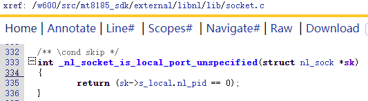

参考官方介绍文档 http://www.infradead.org/~tgr/libnl/doc/core.html#core_netlink_fundamentals


### 1. netlink

#### 1.1 创建netlink套接字创建

       #include <sys/types.h>         
       #include <sys/socket.h>
    
       int socket(int domain, int type, int protocol);
其中，

domain可以是AF_NETLINK或PF_NETLINK

type可以是SOCK_RAW或SOCK_DGRAM。

protocol指定netlink协议类型。定义在include/uapi/linux/netlink.h，可以自己在该文件中增加自定义的protocol，目前 netlink 协议族支持32种协议类型,内核使用了21中，如下：

```


#define NETLINK_ROUTE       0   // Routing/device hook ，用于设置和查询路由表等网络核心模块
#define NETLINK_UNUSED      1   /* Unused number                */
#define NETLINK_USERSOCK    2   /* Reserved for user mode socket protocols  */
#define NETLINK_FIREWALL    3   /* Unused number, formerly ip_queue     */
#define NETLINK_SOCK_DIAG   4   /* socket monitoring                */
#define NETLINK_NFLOG       5   /* netfilter/iptables ULOG */
#define NETLINK_XFRM        6   /* ipsec */
#define NETLINK_SELINUX     7   /* SELinux event notifications */
#define NETLINK_ISCSI       8   /* Open-iSCSI */
#define NETLINK_AUDIT       9   /* auditing */
#define NETLINK_FIB_LOOKUP  10
#define NETLINK_CONNECTOR   11
#define NETLINK_NETFILTER   12  /* netfilter subsystem */
#define NETLINK_IP6_FW      13
#define NETLINK_DNRTMSG     14  /* DECnet routing messages */
#define NETLINK_KOBJECT_UEVENT  15  // Kernel messages to userspace，用于uevent消息通信
#define NETLINK_GENERIC     16
/* leave room for NETLINK_DM (DM Events) */
#define NETLINK_SCSITRANSPORT   18  /* SCSI Transports */
#define NETLINK_ECRYPTFS    19
#define NETLINK_RDMA        20
#define NETLINK_CRYPTO      21  /* Crypto layer */

#define NETLINK_INET_DIAG   NETLINK_SOCK_DIAG

#define MAX_LINKS 32
```


#### 1.2 将netlink socket和本地地址绑定

       #include <sys/types.h> 
       #include <sys/socket.h>
    
       int bind(int sockfd, const struct sockaddr *addr, socklen_t addrlen);

sockfd是前面创建socket返回的fd，后面两个参数用于描述套接字地址及其长度，netlink socket地址结构体如下：

```
struct sockaddr_nl {
     __kernel_sa_family_t    nl_family; /* 固定取AF_NETLINK或者PF_NETLINK,无差别 */
     unsigned short    nl_pad;          /* 填充字段，取zero        */
     __u32          nl_pid;          /* port ID */
     __u32          nl_groups;       /* multicast groups mask ，用于指定多播组，每一个bit对应一个多播组，如果设置为0，表示不加入任何多播组 */
};
```

字段 nl_pid 可以是接收或发送消息的进程的 ID，如果希望内核处理消息或多播消息，就把该字段设置为 0，否则设置为处理消息的进程 ID。传递给 bind 函数的地址的 nl_pid 字段应当设置为本进程的进程 ID，这相当于 netlink socket 的本地地址。但是，对于一个进程的多个线程使用 netlink socket 的情况，字段 nl_pid 则可以设置为其它的值，如： pthread_self() << 16 | getpid()或其他唯一的随机值，因此字段 nl_pid 实际上未必是进程 ID,它只是用于区分不同的接收者或发送者的一个标识，只是可一般用进程ID标识而已，实际上用户可以根据自己需要设置该字段。


字段 nl_groups 用于指定多播组，bind 函数用于把调用进程加入到该字段指定的多播组，如果设置为 0，表示调用者不加入任何多播组。


#### 1.3 发送netlink消息

       #include <sys/types.h>
       #include <sys/socket.h>
    
       ssize_t sendmsg(int sockfd, const struct msghdr *msg, int flags);
       
    struct msghdr {
        void         *msg_name;       /* optional address */
        socklen_t     msg_namelen;    /* size of address */
        struct iovec *msg_iov;        /* scatter/gather array */
        size_t        msg_iovlen;     /* # elements in msg_iov */
        void         *msg_control;    /* ancillary data, see below */
        size_t        msg_controllen; /* ancillary data buffer len */
        int           msg_flags;      /* flags (unused) */
    };
    
    struct iovec
    {
        void __user *iov_base;    /* BSD uses caddr_t (1003.1g requires void *) */
        __kernel_size_t iov_len; /* Must be size_t (1003.1g) */
    };

发送netlink消息需要填充struct msghdr，然后调用标准socket通信API sendmsg来发送。


* 填充struct msghdr的msg_name和msg_namelen，即需要发送的远程地址

  ```
  struct msghdr msg;
  struct sockaddr_nl peer_addr;
  bzero(&peer_addr, sizeof(peer_addr));//port ID为0说明与内核通信,group为0说明单播
  peer_addr.nl_family = AF_NETLINK;
  msg.msg_name = (void *)&peer_addr;
  msg.msg_namelen = sizeof(peer_addr);
  ```


* 填充struct msghdr的msg_iov，即需要发送的内容

  netlink  message 的格式为struct nlmsghdr  + pad+ payload + pad，struct nlmsghdr如下：

  ```
  struct nlmsghdr
  {
  __u32 nlmsg_len; /* Length of message 即 sizeof(struct nlmsghdr)+align+data+align */
  __u16 nlmsg_type; /* Message type*/
  __u16 nlmsg_flags; /* Additional flags */
  __u32 nlmsg_seq; /* Sequence number */
  __u32 nlmsg_pid; /* Sending process PID */
  };
  具体怎样填充参考 http://www.infradead.org/~tgr/libnl/doc/core.html#core_netlink_fundamentals
  ```

  

  ```
  char info[] = "An example message";
  int buffer_len = NLMSG_SPACE(strlen(info));//struct nlmsghdr + pad + payload(即strlen(info)） + pad
  struct nlmsghdr nlhdr;
  nlhdr = (struct nlmsghdr *)malloc(buffer_len);
  
  //填充payload
  strcpy(NLMSG_DATA(nlhdr),info);
  
  //填充struct nlmsghdr
  #define MSG_SETCFG      0x11
  nlhdr->nlmsg_len = buffer_len; 
  nlhdr->nlmsg_type = MSG_SETCFG;//使用自定义的message type
  nlhdr->nlmsg_flags = NLM_F_APPEND;
  nlhdr->nlmsg_pid = getpid(); /* self pid */
  
  
  struct iovec iov;
  iov.iov_base = (void *)nlhdr;//iov_base指向的buffer中必须有且仅有一个完整的netlink frame
  iov.iov_len = nlh->nlmsg_len;
  msg.msg_iov = &iov;//msg_iov可以指向一个struct iovec数组
  msg.msg_iovlen = 1;//表示msg.msg_iov指向的struct iovec数组只有一个struct iovec结构体
  ```

一个struct msghdr的msg_iov可以指向多个struct iovec，一个struct iovec的iov_base只能指向一个完整的struct nlmsghdr+pad+payload1+pad这种组合


* 最后开始发送

  ```
  sendmsg(fd, &msg, 0);
  ```

  


#### 1.4 接收netlink消息 

接收与发送类似，直接参考demo。


#### 1.5 辅助netlink编程的一些宏

struct iovec中的iov_base指向的buffer中的netlink message 由struct nlmsghdr   +  pad+  payload + pad组成，其中payload 按照规范应尽可能地使用Protocol Header和Attributes的这种模式(上文为了简单并未使用)。Protocol Header与创建netlink套接字时指定的protocol和内核子系统实现有关，不同的protocol/内核子系统使用不同的Protocol Header，如果是其他自定义的protocol那么需要自己去定义Protocol Header或者不使用Protocol Header和Attributes的这种模式。


注意，最后的pad无论是放在payload后面还是payload中最后一个Attributes后面还是二者后面都放一个pad，最终整个netlink frame长度都相等。


常见的Protocol  header有这些种:

struct rtmsg
struct tcmsg
struct tcamsg
struct nfgenmsg
struct ifaddrmsg
struct ifinfomsg
struct ndmsg
struct ndtmsg
struct rtgenmsg
struct xfrm_usersa_info
struct xfrm_usersa_id
struct xfrm_userpoilcy_id


* 宏NLMSG_ALIGN(len)

  用于得到不小于len且4 byte对齐的最小数值。

```
#define NLMSG_ALIGNTO 4
#define NLMSG_ALIGN(len) ( ((len)+NLMSG_ALIGNTO-1) & ~(NLMSG_ALIGNTO-1) )
```


* 宏NLMSG_HDRLEN

  返回sizeof(struct nlmsghdr)+pad的长度

```
#define NLMSG_HDRLEN ((int) NLMSG_ALIGN(sizeof(struct nlmsghdr)))
```


* 宏NLMSG_LENGTH(len)

  用于计算payload长度为len时实际的消息总长度sizeof(struct nlmsghdr)+pad+payload。

```
#define NLMSG_LENGTH(len) ((len)+NLMSG_HDRLEN)
```


* 宏NLMSG_SPACE(len)

  返回payload长度为len时实际的消息总长度sizeof(struct nlmsghdr)+pad+payload+pad，struct nlmsghdr中的nlmsg_len也是指这个宏

```
#define NLMSG_SPACE(len) NLMSG_ALIGN(NLMSG_LENGTH(len))
```


* 宏NLMSG_DATA(nlh)

  用于通过某个struct nlmsghdr首地址nlh得到其payload首地址，即nlh+sizeof(struct nlmsghdr)+pad。

```
#define NLMSG_DATA(nlh) ((void*)(((char*)nlh) + NLMSG_LENGTH(0)))
```


* 宏NLMSG_NEXT(nlh,len)

  用于在buffer中从某一个struct nlmsghdr首地址得到下一个消息的struct nlmsghdr首地址，同时buffer剩余len也减少为剩余消息的总长度。

msg.msg_iov.iov_base 指向的buffer内可以有多个netlink frame,例如（header1+pad+payload1+pad)+ (header2+pad+payload2+pad) +...

NLMSG_NEXT(nlh,len)中的nlh指buffer中某个struct nlmsghdr的首地址，len是指buffer总长度除去nlh前面msg剩下的长度(即nlh所在frame和剩余frame的总长度)。执行NLMSG_NEXT(nlh,len)后整体返回的是一个指向nlh所在frame的下一个frame的struct nlmsghdr的首地址，且拥有副作用让len减少了。

```
#define NLMSG_NEXT(nlh,len) ((len) -= NLMSG_ALIGN((nlh)->nlmsg_len), /
(struct nlmsghdr*)(((char*)(nlh)) + NLMSG_ALIGN((nlh)->nlmsg_len)))
```


* 宏NLMSG_OK(nlh,len)

  nlh指buffer中某个struct nlmsghdr的首地址，len是指buffer总长度除去nlh及其前面msg剩下的长度，用于判断nlh后面是否还有netlink frame，如果以下三个条件同时满足则则返回1，否则返回0，该宏一般在接收netlink frame后在buffer中解析时使用：

  1.  len是否大于等于sizeof(struct nlmsghdr)

  2.  (nlh)->nlmsg_len否大于等于sizeof(struct nlmsghdr)

  3.  (nlh)->nlmsg_len是否小于等于 len

```
#define NLMSG_OK(nlh,len) ((len) >= (int)sizeof(struct nlmsghdr) && /
(nlh)->nlmsg_len >= sizeof(struct nlmsghdr) && /
(nlh)->nlmsg_len <= (len))
```


* 宏NLMSG_PAYLOAD(nlh,len)

  该宏用于返回payload的长度减去len后剩下的长度。一般在payload是Protocol Header和Attributes这种模式中使用。

```
#define NLMSG_PAYLOAD(nlh,len) ((nlh)->nlmsg_len - NLMSG_SPACE((len)))
```


#### 1.6 应用层demo

https://www.linuxjournal.com/article/8498?page=0,1


netlink套接字只能单播--单播通信和同一组播内互相通信，无论是收还是发。


* 初始化

```
int fd = socket(AF_NETLINK, SOCK_RAW, NETLINK_GENERIC);//通用 netlink 协议

//填充本地套接字并绑定，本地套接字地址用于配置当前进程中套接字的属性，类似于设置当地快递点的地址及身份
struct sockaddr_nl local_addr;
bzero(&local_addr, sizeof(local_addr));
local_addr.nl_family = AF_NETLINK;
local_addr.nl_pad = 0;
local_addr.nl_pid = getpid();//指定当地快递点的身份Port ID
local_addr.nl_groups = 0;//指定当地快递点是单播还是组播，如果是组播需要指定加入哪个组播
int ret = bind(fd, (struct sockaddr*) &local_addr, sizeof(local_addr));
```

* 发送

```
//填充peer_addr，该地址类似于目的地的快递地址
struct sockaddr_nl peer_addr;
bzero(&peer_addr, sizeof(peer_addr));//peer_addr.nl_pid为0表示目的地址是内核，peer_addr.nl_groups表示单播
peer_addr.nl_family = AF_NETLINK;

//分配并填充buffer
char * info = "An example message";
int buffer_len = NLMSG_SPACE( strlen(buffer) ); //sizof(struct nlmsghdr) + align + data_len + align
struct nlmsghdr nlhdr = (struct nlmsghdr *)malloc(buffer_len);
strcpy(NLMSG_DATA(nlhdr),info); //不使用header,直接拷贝到data字段中
nlhdr->nlmsg_len = buffer_len;
nlhdr->nlmsg_pid = getpid();
nlhdr->nlmsg_flags = 0;


//填充struct iovec
struct iovec iov;
iov.iov_base = (void *)nlhdr;
iov.iov_len = nlhdr->nlmsg_len;


//填充struct msghdr
struct msghdr msg;
memset(&msg, 0, sizeof(msg));
msg.msg_name = (void *)&(peer_addr);
msg.msg_namelen = sizeof(peer_addr);
msg.msg_iov = &iov;
msg.msg_iovlen = 1;


//发送，使用当地快递点(fd)把信息(msg.iov)发送到目的快递点(msg.msg_name)
sendmsg(fd, &msg, 0);
```

发送的时候能够知道一次要发送多长才是一个完整的netlink frame，因此iov需要指向一个buffer，该buffer中有且只有一个完整的netlink frame。


* 接收

```
#define MAX_BUFFER_LEN 1024
struct sockaddr_nl peer_addr;
struct msghdr msg;
struct iovec iov;
struct nlmsghdr *nlhdr = (struct nlmsghdr *)malloc(MAX_BUFFER_LEN);
iov.iov_base = (void *)nlhdr;
iov.iov_len = MAX_BUFFER_LEN;
msg.msg_name = (void *)&(peer_addr);
msg.msg_namelen = sizeof(peer_addr);
msg.msg_iov = &iov;
/* 虽然只接收一个套接字msg，但接收后iov_base指向的buffer中可以有多条netlink frame,这取决于发送端是否把多个netlink frame放入一个套接字进行发送，多netlink frame的结构被定义成这样：nlmsghdr1+align+data_len1+align  + nlmsghdr2+align+data_len2+align + ... */
msg.msg_iovlen = 1;
recvmsg(fd, &msg, 0); //recvmsg时iov和peer_addr将被填充
```


,注意，由于事先不知道需要接收的长度，如果iov.iov_len比较短那么接收后iov.iov_base指向的buffer中可能并不是一个完整的netlink frame，需要再次接收，然后把多次接收的合在一起进行解析，解析时使用NLMSG_OK宏判断某个netlink frame后面是否还有netlink frame，如果payload是Protocol Header和Attributes这种模式，还能使用NLMSG_PAYLOAD宏辅助解析。


### 2. libnl

推荐netlink套接字通信都使用libnl系列的库来进行而不是直接使用socket API操作netlink套接字，libnl把使用socket API操作netlink套接字的操作进行了一层封装。libnl使用方法参考官网文档详细介绍。

对于内核中常用的netlink protocol, 例如route,genl,nf，可以使用libnl-xxx，它们是对libnl更进一步的封装。

对于如果想直接操作netlink ，可以使用libnl。


struct nl_sock  用来描述某个netlink套接字及其相关信息，例如fd、nl_cb、  loacl/peer netlink套接字的地址(family port)、flag等

struct nl_cb   回调信息，用于描述从netlink接收到数据后的处理。


经典操作：

```
#include <netlink/netlink.h>

#include <netlink/socket.h>

#include <netlink/msg.h>


/*

 * This function will be called for each valid netlink message received

 * in nl_recvmsgs_default()

 */

static int my_func(struct nl_msg *msg, void *arg)

{

        return 0;

}


struct nl_sock *sk;


/* Allocate a new socket */

sk = nl_socket_alloc();


/*

 * Notifications do not use sequence numbers, disable sequence number

 * checking.

 */

nl_socket_disable_seq_check(sk);


/*

 * Define a callback function, which will be called for each notification

 * received

 */

nl_socket_modify_cb(sk, NL_CB_VALID, NL_CB_CUSTOM, my_func, NULL);


/* Connect to routing netlink protocol */

nl_connect(sk, NETLINK_ROUTE);


/* Subscribe to link notifications group */

nl_socket_add_memberships(sk, RTNLGRP_LINK, 0);


/*

 * Start receiving messages. The function nl_recvmsgs_default() will block

 * until one or more netlink messages (notification) are received which

 * will be passed on to my_func().

 */

while (1)

        nl_recvmsgs_default(sock);
```


#### 分配struct nl_sock

有两种方式，nl_socket_alloc_cb可以在分配struct nl_sock时传入struct nl_cb，nl_socket_alloc直接使用nl_cb_alloc(default_cb)创建一个缺省的struct nl_cb


​                                                 external/libnl/lib/socket.c


#### 创建绑定本地套接字


struct nl_sock中指定的本地套接字的port如果是0，则_nl_socket_is_local_port_unspecified返回1，前面__alloc_socket中使用calloc分配的struct nl_sock，因此sk->sk->s_local的port是0.




实际上绑定的本地地址的port并不是0，而是判断发现未指定port后生成一个随机port然后尝试绑定，如果绑定失败就再生成一个随机port然后再绑定，直到绑定成功或触发一些错误，来看下如何生成这个随机port:


struct nl_sock * sk，调完

```
sk = nl_socket_alloc();

nl_connect(sk, NETLINK_GENERIC);
```

之后sk有如下属性：


对与本地地址(struct sockaddr_nl):

sk->s_local.nl_family=AF_NETLINK

sk->s_local.nl_pid=ramdom

sk->s_local.nl_groups=0

对与目标地址(struct sockaddr_nl):

sk->s_peer.nl_family=AF_NETLINK

sk->s_peer.nl_pid=0

sk->s_peer.nl_groups=0

创建了一个套接字s_fd并绑定到了本地地址:

sk->s_fd=socket(AF_NETLINK,  SOCK_RAW,   NETLINK_GENERIC)


nl_send_auto()中把sk->s_local放到struct msghdr中的msg_name和msg_namelen，然后再调用sendmsg时传入struct msghdr。放入struct msghdr中的msg_name和msg_namelen用于指定发送的目标地址。


后续recvmsg不需要指定接收的目标地址


### 3.libnl-genl

针对NETLINK_GENERIC这个netlink协议定制的一个库，该库依赖libnl，经典用法参考external/wpa_supplicant_8/src/drivers/driver_nl80211.c   line1761，即wpa_driver_nl80211_init_nl_global函数


NETLINK_GENERIC 协议的netlink套接字在应用层指定需要通信地址时可以通过


libnl-genl库专门用来与内核中的GENERIC Netlink模块通信，在这个过程中并未改变sk->peer，因此最终还是在NETLINK_GENERIC 协议下发送单播数据给内核，内核的GENERIC Netlink模块绑定在了NETLINK_GENERIC 协议的如下地址：

local.nl_family=AF_NETLINK

local.nl_pid=0

local.nl_groups=0


因此所有从应用空间发往GENERIC Netlink模块的netlink帧都是单播数据。libnl可以用来往内核发单播和组播，只是在使用libnl-genl往内核的GENERIC Netlink模块发送数据时只使用单播数据。


来看下libnl-genl版本的创建绑定套接字：


https://blog.csdn.net/user_jiang/article/details/105861480

对于从user to kernel的通讯(由应用发起，内核来响应)，driver必须先向内核注册一个struct genl_family，并且注册一些cmd的处理函数。这些cmd是跟某个family关联起来的。注册family的时候我们可以让内核自动为这个family分配一个ID。每个family都有一个唯一的ID，其中ID号0x10是被内核的nlctrl family所使用。当注册成功以后，如果user program向某个family发送cmd，那么内核就会回调对应cmd的处理函数。对于user program，使用前，除了要创建一个socket并绑定地址以外，还需要先通过family的名字获取family的ID。有了family的ID以后，才能向该family发送cmd，整个过程中使用的是netlink单播。

对于从kernel to user的通讯(由内核发起，可能有也可能没有应用程序响应)，采用的是广播的形式，只要user program监听了，都能收到。但是同样的，user program在监听前，也必须先查询到family的ID，整个过程中使用的是netlink广播。


GENERIC Netlink模块中用如下属性来描述一个family：

family_name  family_id  group_name group_id


* 如果要订阅802.11模块中的广播，需要做如下操作：

已知family_name为"nl80211"，group_name为"scan"

1、调用genl_ctrl_resolve查询“nlctrl”这个family_name对应的family_id(nlctrl)。genl_ctrl_resolve是libnl_genl中已经封装好的函数。

2、首先使用family_id(nlctrl)向GENERIC Netlink模块的“nlctrl”的family发送数据查询family_name为"nl80211"的family的所有信息，在这些GENERIC Netlink模块里描述nl80211模块的信息中有family_name、 family_id、group_name、 group_id等等，找到需要加入的group_name对应的group_id。这一步libnl_genl中没有实现相关函数来进行，需要自行处理。

3、使用libnl_genl提供的nl_socket_add_membership函数来让sk->s_fd这个本地socket监听group_id，如此从就能本地socket接收到nl80211模块发出的广播。


external/wpa_supplicant_8/src/drivers/driver_nl80211.c 中的nl_get_multicast_id函数实现了第1步和第2步，如下：


