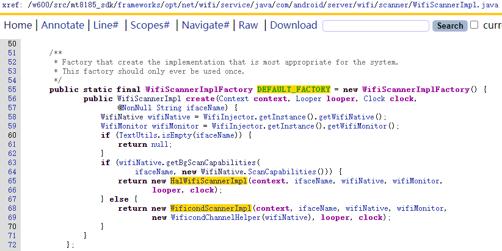
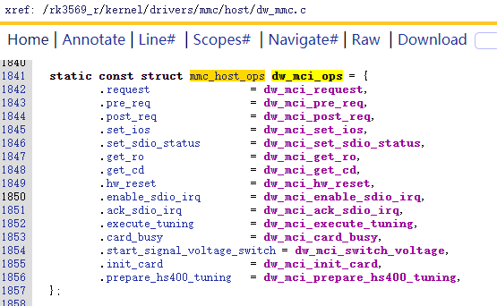

1. app进程

### 1.1使用WifiManager


```
WifiManager工具类：
android包中自带有WifiManager工具类，专门用于wifi管理：

import android.net.wifi.WifiManager;

取得WifiManager对象：
WifiManager mWifiManager = (WifiManager) context.getSystemService(Context.WIFI_SERVICE);
打开WIFI：
if (!mWifiManager.isWifiEnabled()) {
	mWifiManager.setWifiEnabled(true);
}
创建一个WIFI信息：
public WifiConfiguration CreateWifiInfo(String SSID, String Password,
			int Type) {
		WifiConfiguration config = new WifiConfiguration();
		config.allowedAuthAlgorithms.clear();
		config.allowedGroupCiphers.clear();
		config.allowedKeyManagement.clear();
		config.allowedPairwiseCiphers.clear();
		config.allowedProtocols.clear();
		config.SSID = "\"" + SSID + "\"";

		WifiConfiguration tempConfig = this.IsExsits(SSID);
		if (tempConfig != null) {
			mWifiManager.removeNetwork(tempConfig.networkId);
		}

		if (Type == 1) // WIFICIPHER_NOPASS
		{
			config.wepKeys[0] = "";
			config.allowedKeyManagement.set(WifiConfiguration.KeyMgmt.NONE);
			config.wepTxKeyIndex = 0;
		}
		if (Type == 2) // WIFICIPHER_WEP
		{
			config.hiddenSSID = true;
			config.wepKeys[0] = "\"" + Password + "\"";
			config.allowedAuthAlgorithms
					.set(WifiConfiguration.AuthAlgorithm.SHARED);
			config.allowedGroupCiphers.set(WifiConfiguration.GroupCipher.CCMP);
			config.allowedGroupCiphers.set(WifiConfiguration.GroupCipher.TKIP);
			config.allowedGroupCiphers.set(WifiConfiguration.GroupCipher.WEP40);
			config.allowedGroupCiphers
					.set(WifiConfiguration.GroupCipher.WEP104);
			config.allowedKeyManagement.set(WifiConfiguration.KeyMgmt.NONE);
			config.wepTxKeyIndex = 0;
		}
		if (Type == 3) // WIFICIPHER_WPA
		{
			config.preSharedKey = "\"" + Password + "\"";
			config.hiddenSSID = true;
			config.allowedAuthAlgorithms
					.set(WifiConfiguration.AuthAlgorithm.OPEN);
			config.allowedGroupCiphers.set(WifiConfiguration.GroupCipher.TKIP);
			config.allowedKeyManagement.set(WifiConfiguration.KeyMgmt.WPA_PSK);
			config.allowedPairwiseCiphers
					.set(WifiConfiguration.PairwiseCipher.TKIP);
			// config.allowedProtocols.set(WifiConfiguration.Protocol.WPA);
			config.allowedGroupCiphers.set(WifiConfiguration.GroupCipher.CCMP);
			config.allowedPairwiseCiphers
					.set(WifiConfiguration.PairwiseCipher.CCMP);
			config.status = WifiConfiguration.Status.ENABLED;
		}
		return config;
	}
这里只介绍第三个参数：Type。从代码中可以看出，Type有三个值，分别为1，2，3。WIFI热点是有加密的，加密方式包括：不加密，WEP，WPA三种，1、2、3就分别对应这三种加密方式，方法返回一个WIFI热点信息。

添加一个网络并连接：
public void addNetwork(WifiConfiguration wcg) {
		int wcgID = mWifiManager.addNetwork(wcg);
		boolean b = mWifiManager.enableNetwork(wcgID, true);
		System.out.println("a--" + wcgID);
		System.out.println("b--" + b);
	}
    具体的使用方式如下：

mWifiAdmin.addNetwork(mWifiAdmin.CreateWifiInfo(SSID, password, 3));

判断WIFI是否连接成功：
public int isWifiContected(Context context) {
		ConnectivityManager connectivityManager = (ConnectivityManager) context
				.getSystemService(Context.CONNECTIVITY_SERVICE);
		NetworkInfo wifiNetworkInfo = connectivityManager
				.getNetworkInfo(ConnectivityManager.TYPE_WIFI);
		
		Log.v(TAG, "isConnectedOrConnecting = " + wifiNetworkInfo.isConnectedOrConnecting());
		Log.d(TAG, "wifiNetworkInfo.getDetailedState() = " + wifiNetworkInfo.getDetailedState());
		if (wifiNetworkInfo.getDetailedState() == DetailedState.OBTAINING_IPADDR
				|| wifiNetworkInfo.getDetailedState() == DetailedState.CONNECTING) {
			return WIFI_CONNECTING;
		} else if (wifiNetworkInfo.getDetailedState() == DetailedState.CONNECTED) {
			return WIFI_CONNECTED;
		} else {
			Log.d(TAG, "getDetailedState() == " + wifiNetworkInfo.getDetailedState());
			return WIFI_CONNECT_FAILED;
		}
	}
关闭WIFI连接：
if (mWifiManager.isWifiEnabled()) {
	mWifiManager.setWifiEnabled(false);
}


开始WIFI扫描
mWifiManager.startScan()
获取WIFI扫描结果
mWifiManager.getWifiState()


获取当前已连接的wifi信息

WifiInfo info = mWifiManager.getConnectionInfo();
几乎和WifiConfiguration一样的，但是如果当前没有连接wifi的话，就会返回Null，它包括了SSID、networkId、BSSID的，切记一个问题：它的SSID是带双引号的，这点和ScanResult对象不一样


在高版本的安卓，普通APP无权限通过
mWifiManager.setWifiEnabled(true/false)来开启关闭wifi

也无权限在wifi开启的状态通过如下连接网络
WifiConfiguration config
config.xxx=
int networkid = mWifiManager.addNetwork(config);
mWifiManager.enableNetwork(networkid, true);

普通APP应该在通过使用intent打开Settings.Panel.ACTION_WIFI activity,
Intent panelIntent = new Intent(android.provider.Settings.Panel.ACTION_WIFI);
startActivityForResult(panelIntent,1);
参考https://developer.android.google.cn/about/versions/10/features#settings-panels
然后待用户在Settings.Panel.ACTION_WIFI activity中来打开关闭连接wifi
```


Activity  Service   BroadcastReceiver 


一个BroadcastReceiver 可注册多个intent action，action对应的每种intent 里面具有不同的extra data


WifiManager.WIFI_STATE_CHANGED_ACTION

```
"android.net.wifi.WIFI_STATE_CHANGED"
```


WifiManager.NETWORK_STATE_CHANGED_ACTION

```
"android.net.wifi.STATE_CHANGE"
此action的广播携带两个额外数据:
public class NetworkConnectChangedReceiver extends BroadcastReceiver{  
    @Override  
    public void onReceive(Context context, Intent intent) {  
    if (WifiManager.WIFI_STATE_CHANGED_ACTION.equals(intent.getAction())) {//这个监听wifi的打开与关闭，与wifi的连接无关  
            int wifiState = intent.getIntExtra(WifiManager.EXTRA_WIFI_STATE, 0);   
            LogTag.showTAG_e("WIFI状态", "wifiState"+wifiState);  
            switch (wifiState) {   
            case WifiManager.WIFI_STATE_DISABLED:   
                break;   
            case WifiManager.WIFI_STATE_DISABLING:   
                break;   
           //  
            }   
        }  
    // 这个监听wifi的连接状态即是否连上了一个有效无线路由，当上边广播的状态是WifiManager.WIFI_STATE_DISABLING，和WIFI_STATE_DISABLED的时候，根本不会接到这个广播。  
    // 在上边广播接到广播是WifiManager.WIFI_STATE_ENABLED状态的同时也会接到这个广播，当然刚打开wifi肯定还没有连接到有效的无线  
    if (WifiManager.NETWORK_STATE_CHANGED_ACTION.equals(intent.getAction())) {  
            Parcelable parcelableExtra = intent.getParcelableExtra(WifiManager.EXTRA_NETWORK_INFO);    
            if (null != parcelableExtra) {    
                NetworkInfo networkInfo = (NetworkInfo) parcelableExtra;   
                
                
                State          state         = networkInfo.getState();  
                boolean isConnected = state==networkInfo.State.CONNECTED;//当然，这边可以更精确的确定状态  
                
                
                DetailedState  detailedState = networkInfo.getDetailedState();
                boolean isConnected = detailedState==networkInfo.DetailedState.CONNECTED;
                
                
            }    
        }  
}
state和DetailedState是networkInfo中的枚举变量，具体取值如下：


75      public enum State {
76          CONNECTING, CONNECTED, SUSPENDED, DISCONNECTING, DISCONNECTED, UNKNOWN
77      }
78  
79      /**
80       * The fine-grained state of a network connection. This level of detail
81       * is probably of interest to few applications. Most should use
82       * {@link android.net.NetworkInfo.State State} instead.
83       *
84       * @deprecated See {@link NetworkInfo}.
85       */
86      @Deprecated
87      public enum DetailedState {
88          /** Ready to start data connection setup. */
89          IDLE,
90          /** Searching for an available access point. */
91          SCANNING,
92          /** Currently setting up data connection. */
93          CONNECTING,
94          /** Network link established, performing authentication. */
95          AUTHENTICATING,
96          /** Awaiting response from DHCP server in order to assign IP address information. */
97          OBTAINING_IPADDR,
98          /** IP traffic should be available. */
99          CONNECTED,
100          /** IP traffic is suspended */
101          SUSPENDED,
102          /** Currently tearing down data connection. */
103          DISCONNECTING,
104          /** IP traffic not available. */
105          DISCONNECTED,
106          /** Attempt to connect failed. */
107          FAILED,
108          /** Access to this network is blocked. */
109          BLOCKED,
110          /** Link has poor connectivity. */
111          VERIFYING_POOR_LINK,
112          /** Checking if network is a captive portal */
113          CAPTIVE_PORTAL_CHECK
114      }


networkinfo还有gettype方法判断当前网络是数据流量还是wifi
```


API29(android10)以后NetworkInfo被废弃，使用ConnectivityManager.NetworkCallback来监听网络变化

https://blog.csdn.net/u012834390/article/details/110136322

https://developer.android.google.cn/reference/android/net/ConnectivityManager.NetworkCallback?hl=en

使用 `ConnectivityManager#getNetworkCapabilities` or `ConnectivityManager#getLinkProperties`来判断是数据流量还是wifi。


WifiManager.SUPPLICANT_STATE_CHANGED_ACTION

```
"android.net.wifi.supplicant.STATE_CHANGE"
```


WifiManager.WIFI_CREDENTIAL_CHANGED_ACTION

```
"android.net.wifi.WIFI_CREDENTIAL_CHANGED"
```


WifiManager.WIFI_AP_STATE_CHANGED_ACTION

```
"android.net.wifi.WIFI_AP_STATE_CHANGED"
```


WifiManager.CONFIGURED_NETWORKS_CHANGED_ACTION

```
"android.net.wifi.CONFIGURED_NETWORKS_CHANGE"
```


WifiManager.RSSI_CHANGED_ACTION

```
"android.net.wifi.RSSI_CHANGED"
```


WifiManager.LINK_CONFIGURATION_CHANGED_ACTION

```
"android.net.wifi.LINK_CONFIGURATION_CHANGED"
```


NETWORK_IDS_CHANGED_ACTION

```
"android.net.wifi.NETWORK_IDS_CHANGED"
```


### 2.获取IWifiManager的AIDL proxy端接口


APP 进程创建完成后进程中有一个Application对象，若干个Activity和Service对象。他们都直接或间接派生自ContextWrapper类。

ContextWrapper类和ContextIml类都实现了Context接口。在ContextWrapper对象(Application对象、Activity和Service对象都是ContextWrapper对象)中有一个ContextIml对象。调用ContextWrapper对象Context接口中的各种方法时，这些方法内部就调用ContextWrapper对象中的ContextIml对象相应的Context接口。


ContextWrapper对象与ContextIml对象是一对一还是多对一还是多对多还需后续看代码。目前还不确定


ContextIml类中使用SystemServiceRegistry类，SystemServiceRegistry类在静态初始化块中调用了WifiFrameworkInitializer.registerServiceWrappers():

frameworks/base/core/java/android/app/SystemServiceRegistry.java

```
public final class SystemServiceRegistry {
...
static {
...
WifiFrameworkInitializer.registerServiceWrappers();
...
}
...
}
```


在WifiFrameworkInitializer.registerServiceWrappers方法中调用SystemServiceRegistry.registerContextAwareService将new出来的各种WifiXXXManager对象注册到SystemServiceRegistry类的哈希表中，new各种WifiXXXManager对象时需要传入一个对应的IWifiXXXManager对象，即binder通信的 proxy 对象：

frameworks/base/wifi/java/android/net/wifi/WifiFrameworkInitializer.java


ContextWrapper对象的getSystemService方法直接调用其内部ContextIml对象的getSystemService方法，参考

frameworks/base/core/java/android/app/ContextImpl.java


ContextIml对象的getSystemService中调用了SystemServiceRegistry类的getSystemService方法将先前注册到哈希表中的WifiXXXManager对象取出，之后使用WifiXXXManager对象就能进行wifi相关的操作。


取出的WifiXXXManager对象是其内部IWifiXXXManager类的wrapper，调用WifiXXXManager的各种方法最终都会调用到其内部IWifiXXXManager类的方法，而IWifiXXXManager类是AIDL的proxy端，最终通过binder通信调到framework中具体负责实现的服务。


```

72          SystemServiceRegistry.registerContextAwareService(
73                  Context.WIFI_SERVICE,
74                  WifiManager.class,
75                  (context, serviceBinder) -> {
76                      IWifiManager service = IWifiManager.Stub.asInterface(serviceBinder);
77                      return new WifiManager(context, service, getInstanceLooper());
78                  }
79          );
80          SystemServiceRegistry.registerStaticService(
81                  Context.WIFI_P2P_SERVICE,
82                  WifiP2pManager.class,
83                  serviceBinder -> {
84                      IWifiP2pManager service = IWifiP2pManager.Stub.asInterface(serviceBinder);
85                      return new WifiP2pManager(service);
86                  }
87          );
88          SystemServiceRegistry.registerContextAwareService(
89                  Context.WIFI_AWARE_SERVICE,
90                  WifiAwareManager.class,
91                  (context, serviceBinder) -> {
92                      IWifiAwareManager service = IWifiAwareManager.Stub.asInterface(serviceBinder);
93                      return new WifiAwareManager(context, service);
94                  }
95          );
96          SystemServiceRegistry.registerContextAwareService(
97                  Context.WIFI_SCANNING_SERVICE,
98                  WifiScanner.class,
99                  (context, serviceBinder) -> {
100                      IWifiScanner service = IWifiScanner.Stub.asInterface(serviceBinder);
101                      return new WifiScanner(context, service, getInstanceLooper());
102                  }
103          );
104          SystemServiceRegistry.registerContextAwareService(
105                  Context.WIFI_RTT_RANGING_SERVICE,
106                  WifiRttManager.class,
107                  (context, serviceBinder) -> {
108                      IWifiRttManager service = IWifiRttManager.Stub.asInterface(serviceBinder);
109                      return new WifiRttManager(context, service);
110                  }
111          );
112          SystemServiceRegistry.registerContextAwareService(
113                  Context.WIFI_RTT_SERVICE,
114                  RttManager.class,
115                  context -> {
116                      WifiRttManager wifiRttManager = context.getSystemService(WifiRttManager.class);
117                      return new RttManager(context, wifiRttManager);
118                  }
119          );


RttManager使用wifiRttManager，wifiRttManager使用IWifiRttManager，IWifiRttManager是binder proxy端


wifi涉及的主要AIDL接口
IWifiManager
IWifiP2pManager
IWifiAwareManager
IWifiRttManager
```


## 2. framework层服务进程

### WifiService服务注册

system_server调用startOtherServices创建AIDL服务时会创建WifiService服务对象并注册到systemManager。

```
private void startOtherServices(@NonNull TimingsTraceAndSlog t) {
......
248      private static final String WIFI_SERVICE_CLASS =
249              "com.android.server.wifi.WifiService";
......
1182              if (!isWatch) {
1183                  t.traceBegin("StartConsumerIrService");
1184                  consumerIr = new ConsumerIrService(context);
1185                  ServiceManager.addService(Context.CONSUMER_IR_SERVICE, consumerIr);
1186                  t.traceEnd();
1187              }
......
1535              if (context.getPackageManager().hasSystemFeature(
1536                      PackageManager.FEATURE_WIFI)) {
1537                  // Wifi Service must be started first for wifi-related services.
1538                  t.traceBegin("StartWifi");
1539                  mSystemServiceManager.startService(WIFI_SERVICE_CLASS);
1540                  t.traceEnd();
1541                  t.traceBegin("StartWifiScanning");
1542                  mSystemServiceManager.startService(
1543                          "com.android.server.wifi.scanner.WifiScanningService");
1544                  t.traceEnd();
1545              }
......
}
```


***WifiService对象在构造时首先分别new出来WifiContext、WifiInjector、WifiAsyncChannel对象，然后把三个对象作为参数new 了一个WifiServiceImpl对象***，其实现如下：

frameworks/opt/net/wifi/service/java/com/android/server/wifi/WifiService.java

```
34  public final class WifiService extends SystemService {
35  
36      private static final String TAG = "WifiService";
37      // Notification channels used by the wifi service.
38      public static final String NOTIFICATION_NETWORK_STATUS = "NETWORK_STATUS";
39      public static final String NOTIFICATION_NETWORK_ALERTS = "NETWORK_ALERTS";
40      public static final String NOTIFICATION_NETWORK_AVAILABLE = "NETWORK_AVAILABLE";
41  
42      private final WifiServiceImpl mImpl;
43      private final WifiContext mWifiContext;
44  
45      public WifiService(Context contextBase) {
46          super(contextBase);
47          mWifiContext = new WifiContext(contextBase);
48          WifiInjector injector = new WifiInjector(mWifiContext);
49          WifiAsyncChannel channel =  new WifiAsyncChannel(TAG);
50          mImpl = new WifiServiceImpl(mWifiContext, injector, channel);
51      }
       ...
}
```


### WifiInjector对象构造


new 一个SupplicantStaIfaceHal对象，然后将其作为参数new一个WifiNative对象。

```
public class WifiInjector {

99      private final WifiNative mWifiNative;

103      private final SupplicantStaIfaceHal mSupplicantStaIfaceHal;

172      public WifiInjector(WifiContext context) {

232          mSupplicantStaIfaceHal = new SupplicantStaIfaceHal(
233                  mContext, mWifiMonitor, mFrameworkFacade, wifiHandler, mClock, mWifiMetrics);
234          mHostapdHal = new HostapdHal(mContext, wifiHandler);
235          mWifiCondManager = (WifiNl80211Manager) mContext.getSystemService(
236                  Context.WIFI_NL80211_SERVICE);
237          mWifiNative = new WifiNative(
238                  mWifiVendorHal, mSupplicantStaIfaceHal, mHostapdHal, mWifiCondManager,
239                  mWifiMonitor, mPropertyService, mWifiMetrics,
240                  wifiHandler, new Random(), this);

389      }

}
```


### WifiNative对象

构造时将传入的SupplicantStaIfaceHal对象赋给内部成员变量mSupplicantStaIfaceHal。


WifiNative的setupInterfaceForClientInScanMode方法

frameworks/opt/net/wifi/service/java/com/android/server/wifi/WifiNative.java


WifiNative的startHal方法


WifiNative的startSupplicant方法


SupplicantStaIfaceHal的setupIface方法

frameworks/opt/net/wifi/service/java/com/android/server/wifi/SupplicantStaIfaceHal.java


SupplicantStaIfaceHal的setupIface方法


### WifiServiceImpl对象


frameworks/opt/net/wifi/service/java/com/android/server/wifi/WifiServiceImpl.java

```
public class WifiServiceImpl extends BaseWifiService {
...
294      public WifiServiceImpl(Context context, WifiInjector wifiInjector, AsyncChannel asyncChannel) {
295          mContext = context;
296          mWifiInjector = wifiInjector;
297          mClock = wifiInjector.getClock();
298  
299          mFacade = mWifiInjector.getFrameworkFacade();
300          mWifiMetrics = mWifiInjector.getWifiMetrics();
301          mWifiTrafficPoller = mWifiInjector.getWifiTrafficPoller();
302          mUserManager = mWifiInjector.getUserManager();
303          mCountryCode = mWifiInjector.getWifiCountryCode();
304          mClientModeImpl = mWifiInjector.getClientModeImpl();
305          mActiveModeWarden = mWifiInjector.getActiveModeWarden();
306          mScanRequestProxy = mWifiInjector.getScanRequestProxy();
307          mSettingsStore = mWifiInjector.getWifiSettingsStore();
308          mPowerManager = mContext.getSystemService(PowerManager.class);
309          mAppOps = (AppOpsManager) mContext.getSystemService(Context.APP_OPS_SERVICE);
310          mWifiLockManager = mWifiInjector.getWifiLockManager();
311          mWifiMulticastLockManager = mWifiInjector.getWifiMulticastLockManager();
312          mClientModeImplHandler = new ClientModeImplHandler(TAG,
313                  mWifiInjector.getAsyncChannelHandlerThread().getLooper(), asyncChannel);
314          mWifiBackupRestore = mWifiInjector.getWifiBackupRestore();
315          mSoftApBackupRestore = mWifiInjector.getSoftApBackupRestore();
316          mWifiApConfigStore = mWifiInjector.getWifiApConfigStore();
317          mWifiPermissionsUtil = mWifiInjector.getWifiPermissionsUtil();
318          mLog = mWifiInjector.makeLog(TAG);
319          mFrameworkFacade = wifiInjector.getFrameworkFacade();
320          mTetheredSoftApTracker = new TetheredSoftApTracker();
321          mActiveModeWarden.registerSoftApCallback(mTetheredSoftApTracker);
322          mLohsSoftApTracker = new LohsSoftApTracker();
323          mActiveModeWarden.registerLohsCallback(mLohsSoftApTracker);
324          mWifiNetworkSuggestionsManager = mWifiInjector.getWifiNetworkSuggestionsManager();
325          mDppManager = mWifiInjector.getDppManager();
326          mWifiThreadRunner = mWifiInjector.getWifiThreadRunner();
327          mWifiConfigManager = mWifiInjector.getWifiConfigManager();
328          mPasspointManager = mWifiInjector.getPasspointManager();
329          mWifiScoreCard = mWifiInjector.getWifiScoreCard();
330          mMemoryStoreImpl = new MemoryStoreImpl(mContext, mWifiInjector,
331                  mWifiScoreCard,  mWifiInjector.getWifiHealthMonitor());
332      }
...
}
```


frameworks/opt/net/wifi/service/java/com/android/server/wifi/BaseWifiService.java

```
public class BaseWifiService extends IWifiManager.Stub {

74      public long getSupportedFeatures() {
75          throw new UnsupportedOperationException();
76      }  
...
687      public void stopReconnectAndScan(int index, int period) {
688          throw new UnsupportedOperationException();
689      }
690  
}
 

```


WifiService 中new出来的 WifiServiceImpl 对象是IWifiManager  AIDL接口的实现端 。WifiServiceImpl派生自BaseWifiService，BaseWifiService派生自IWifiManager.Stub，在BaseWifiService类中只负责调用各个接口后抛出异常，WifiServiceImpl继承并重写这些方法后才有真正的实现。


从WifiServiceImpl的构造函数来看WifiServiceImpl其实最终通过构造时传进来的WifiInjector干活。


frameworks/opt/net/wifi/service/java/com/android/server/wifi/WifiInjector.java

```
75  public class WifiInjector {
...
172      public WifiInjector(WifiContext context) {
...
232          mSupplicantStaIfaceHal = new SupplicantStaIfaceHal(
233                  mContext, mWifiMonitor, mFrameworkFacade, wifiHandler, mClock, mWifiMetrics);
234          mHostapdHal = new HostapdHal(mContext, wifiHandler);
235          mWifiCondManager = (WifiNl80211Manager) mContext.getSystemService(
236                  Context.WIFI_NL80211_SERVICE);
237          mWifiNative = new WifiNative(
238                  mWifiVendorHal, mSupplicantStaIfaceHal, mHostapdHal, mWifiCondManager,
239                  mWifiMonitor, mPropertyService, mWifiMetrics,
240                  wifiHandler, new Random(), this);
...
287          mWifiConnectivityHelper = new WifiConnectivityHelper(mWifiNative);
...


}
```


在WifiInjector的构造函数中new 了SupplicantStaIfaceHal对象和HostapdHal对象，并将其作为构造参数来new WifiNative对象，然后使用WifiNative对象作为构造参数new出其他各个wfi管理对象：WifiConnectivityHelper、WifiNetworkSelector、PasspointManager、SarManager、WifiDiagnostics、LinkProbeManager、MboOceController、WifiHealthMonitor、ClientModeImpl、ActiveModeWarden、WifiLockManager、DppManager，之后WifiInjector对象的很多方法在WifiServiceImpl中被调用时就在方法中使用各种wifi管理对象，wifi管理对象最终还是通过WifiNative对象使用来使用SupplicantStaIfaceHal对象来跟底层wpa_supplicant交互。


在WifiNative使用SupplicantStaIfaceHal对象将wifi设置成连接模式时调用到了mSupplicantStaIfaceHal的setupIface方法:

frameworks/opt/net/wifi/service/java/com/android/server/wifi/WifiNative.java

```
public class WifiNative {
...
1097      public String setupInterfaceForClientInScanMode(
...
1131              if (!mSupplicantStaIfaceHal.setupIface(iface.name)) {
1132                  Log.e(TAG, "Failed to setup iface in supplicant on " + iface);
1133                  teardownInterface(iface.name);
1134                  mWifiMetrics.incrementNumSetupClientInterfaceFailureDueToSupplicant();
1135                  return null;
1136              }
...
1152      }
...
```


mSupplicantStaIfaceHal的setupIface方法调用addIfaceV1_1(ifaceName)，mSupplicantStaIfaceHal的addIfaceV1_1方法调用getSupplicantMockableV1_1().addInterface()，getSupplicantMockableV1_1调用getSupplicantMockable()，getSupplicantMockable方法调用了ISupplicant.getService()。

frameworks/opt/net/wifi/service/java/com/android/server/wifi/SupplicantStaIfaceHal.java

```
public class SupplicantStaIfaceHal {
...
392      private ISupplicantStaIface setupStaIface(@NonNull String ifaceName,
393              @NonNull ISupplicantIface ifaceHwBinder) throws RemoteException {
394          /* Prepare base type for later cast. */
395          ISupplicantStaIface iface = getStaIfaceMockable(ifaceHwBinder);
396  
397          /* try newer version first. */
398          if (trySetupStaIfaceV1_1(ifaceName, iface)) {
399              logd("Newer HAL is found, skip V1_0 remaining init flow.");
400              return iface;
401          }
402  
403          SupplicantStaIfaceHalCallback callback = new SupplicantStaIfaceHalCallback(ifaceName);
404          if (!registerCallback(iface, callback)) {
405              throw new RemoteException("Init StaIface V1_0 failed.");
406          }
407          /* keep this in a store to avoid recycling by garbage collector. */
408          mISupplicantStaIfaceCallbacks.put(ifaceName, callback);
409          return iface;
410      }


418      public boolean setupIface(@NonNull String ifaceName) {
419          final String methodStr = "setupIface";
420          if (checkSupplicantStaIfaceAndLogFailure(ifaceName, methodStr) != null) return false;
421          ISupplicantIface ifaceHwBinder;
422  
423          if (isV1_1()) {
424              ifaceHwBinder = addIfaceV1_1(ifaceName);
425          } else {
426              ifaceHwBinder = getIfaceV1_0(ifaceName);
427          }
428          if (ifaceHwBinder == null) {
429              Log.e(TAG, "setupIface got null iface");
430              return false;
431          }
432  
433          try {
434              ISupplicantStaIface iface = setupStaIface(ifaceName, ifaceHwBinder);
435              mISupplicantStaIfaces.put(ifaceName, iface);
436              com.mediatek.server.wifi.MtkWapi.setupMtkIface(ifaceName);
437              com.mediatek.server.wifi.MtkSupplicantStaIfaceHal.setupMtkIface(ifaceName);
438          } catch (RemoteException e) {
439              loge("setup StaIface failed: " + e.toString());
440              return false;
441          }
442  
443          return true;
444      }


508      private ISupplicantIface addIfaceV1_1(@NonNull String ifaceName) {
509          synchronized (mLock) {
510              ISupplicant.IfaceInfo ifaceInfo = new ISupplicant.IfaceInfo();
511              ifaceInfo.name = ifaceName;
512              ifaceInfo.type = IfaceType.STA;
513              Mutable<ISupplicantIface> supplicantIface = new Mutable<>();
514              try {
515                  getSupplicantMockableV1_1().addInterface(ifaceInfo,
516                          (SupplicantStatus status, ISupplicantIface iface) -> {
517                              if (status.code != SupplicantStatusCode.SUCCESS
518                                      && status.code != SupplicantStatusCode.FAILURE_IFACE_EXISTS) {
519                                  Log.e(TAG, "Failed to create ISupplicantIface " + status.code);
520                                  return;
521                              }
522                              supplicantIface.value = iface;
523                          });
524              } catch (RemoteException e) {
525                  Log.e(TAG, "ISupplicant.addInterface exception: " + e);
526                  handleRemoteException(e, "addInterface");
527                  return null;
528              } catch (NoSuchElementException e) {
529                  Log.e(TAG, "ISupplicant.addInterface exception: " + e);
530                  handleNoSuchElementException(e, "addInterface");
531                  return null;
532              }
533              return supplicantIface.value;
534          }
535      }


761      protected ISupplicant getSupplicantMockable() throws RemoteException, NoSuchElementException {
762          synchronized (mLock) {
763              ISupplicant iSupplicant = ISupplicant.getService();
764              if (iSupplicant == null) {
765                  throw new NoSuchElementException("Cannot get root service.");
766              }
767              return iSupplicant;
768          }
769      }
770  
771      protected android.hardware.wifi.supplicant.V1_1.ISupplicant getSupplicantMockableV1_1()
772              throws RemoteException, NoSuchElementException {
773          synchronized (mLock) {
774              android.hardware.wifi.supplicant.V1_1.ISupplicant iSupplicantDerived =
775                      android.hardware.wifi.supplicant.V1_1.ISupplicant.castFrom(
776                              getSupplicantMockable());
777              if (iSupplicantDerived == null) {
778                  throw new NoSuchElementException("Cannot cast to V1.1 service.");
779              }
780              return iSupplicantDerived;
781          }
782      }


797      protected ISupplicantStaIface getStaIfaceMockable(ISupplicantIface iface) {
798          synchronized (mLock) {
799              return ISupplicantStaIface.asInterface(iface.asBinder());
800          }
801      }
}
```


getSupplicantMockableV1_1()返回的是一个ISupplicant.Stub.Proxy对象，使用该hidl代理对象的addInterface方法相当于调用到了wpa_supplicant进程中Supplicant对象的addInterface方法。具体实现参考external/wpa_supplicant_8/wpa_supplicant/hidl/1.3/supplicant.cpp：

```
171  Return<void> Supplicant::addInterface(
172      const IfaceInfo& iface_info, addInterface_cb _hidl_cb)
173  {
174  	return validateAndCall(
175  	    this, SupplicantStatusCode::FAILURE_IFACE_INVALID,
176  	    &Supplicant::addInterfaceInternal, _hidl_cb, iface_info);
177  }
....
256  std::pair<SupplicantStatus, sp<ISupplicantIface>>
257  Supplicant::addInterfaceInternal(const IfaceInfo& iface_info)
258  {
....
307  	iface_params.ifname = iface_info.name.c_str();
308  	struct wpa_supplicant* wpa_s =
309  	    wpa_supplicant_add_iface(wpa_global_, &iface_params, NULL);
310  	if (!wpa_s) {
311  		return {{SupplicantStatusCode::FAILURE_UNKNOWN, ""}, {}};
312  	}
313  	// The supplicant core creates a corresponding hidl object via
314  	// HidlManager when |wpa_supplicant_add_iface| is called.
315  	return getInterfaceInternal(iface_info);
316  }
```

addInterface方法最终调用到了addInterfaceInternal方法，addInterfaceInternal方法调用wpa_supplicant_add_iface函数。wpa_supplicant_add_iface函数在ctrl_interface指定的目录下创建了一个unix socket套接字文件，并间接调用到HidlManager::registerInterface


external/wpa_supplicant_8/wpa_supplicant/hidl/1.3/hidl_manager.cpp

```
440  int HidlManager::registerInterface(struct wpa_supplicant *wpa_s)...
460  		if (addHidlObjectToMap<StaIface>(
461  			wpa_s->ifname,
462  			new StaIface(wpa_s->global, wpa_s->ifname),
463  			sta_iface_object_map_)) {
464  			wpa_printf(
465  			    MSG_ERROR,
466  			    "Failed to register STA interface with HIDL "
467  			    "control: %s",
468  			    wpa_s->ifname);
469  			return 1;
470  		}...}
```

HidlManager::registerInterface方法通过调用addHidlObjectToMap将new出来的一个StaIface对象放入Map中。

这一系列搞完后返回到addInterfaceInternal的return处调用getInterfaceInternal，getInterfaceInternal间接调用到HidlManager::getStaIfaceHidlObjectByIfname()从map中将StaIface对象取回并返回给JAVA。JAVA端调用getSupplicantMockableV1_1().addInterface()其实拿到的是StaIface对象的代理对象。


StaIface类派生自ISupplicantStaIface类，

external/wpa_supplicant_8/wpa_supplicant/hidl/1.3/sta_iface.h

```
class StaIface : public V1_3::ISupplicantStaIface
```

ISupplicantStaIface类派生自ISupplicantIface类，hardware/interfaces/wifi/supplicant/1.0/ISupplicantStaIface.hal

```
interface ISupplicantStaIface extends ISupplicantIface 
```


在SupplicantStaIfaceHal类的的setupIface方法中调完addIfaceV1_1，addIfaceV1_1首先通过hwServiceManager拿到ISupplicant代理对象，再通过ISupplicant代理对象调用addInterface拿到ISupplicantIface的代理对象（其实是ISupplicantStaIface的代理对象）后返回，setupIface方法接着再调用setupStaIface方法，setupStaIface方法调用getStaIfaceMockable将ISupplicantIface的代理对象转换成ISupplicantStaIface的代理对象，即wpa_supplicant中sta_iface对象的代理对象。


## 3 wificond

### 


## 4.android.hardware.wifi@1.x-service


## 5. wpa_supplicant


### 5.0 wpa_supplicant  hal文件中interface的关系


### 5.1 基本命令行参数及配置文件


```
1|console:/ #  cat /vendor/etc/init/android.hardware.wifi.supplicant-service.rc
service wpa_supplicant /vendor/bin/hw/wpa_supplicant \
    -O/data/vendor/wifi/wpa/sockets -dd \
    -g@android:wpa_wlan0
    #   we will start as root and wpa_supplicant will switch to user wifi
    #   after setting up the capabilities required for WEXT
    #   user wifi
    #   group wifi inet keystore
    interface android.hardware.wifi.supplicant@1.0::ISupplicant default
    interface android.hardware.wifi.supplicant@1.1::ISupplicant default
    interface android.hardware.wifi.supplicant@1.2::ISupplicant default
    interface android.hardware.wifi.supplicant@1.3::ISupplicant default
    interface vendor.mediatek.hardware.wifi.supplicant@2.0::ISupplicant default
    class main
    socket wpa_wlan0 dgram 660 wifi wifi
    disabled
    oneshot
```


```
console:/ #  cat /vendor/etc/wifi/wpa_supplicant.conf
ctrl_interface=wlan0
update_config=1
manufacturer=MediaTek Inc.
device_name=Wireless Client
model_name=MTK Wireless Model
model_number=1.0
serial_number=2.0
device_type=10-0050F204-5
os_version=01020300
config_methods=display push_button keypad
p2p_no_group_iface=1
driver_param=use_p2p_group_interface=1
hs20=1
pmf=1
wowlan_disconnect_on_deinit=1
```


```
console:/ # /vendor/bin/hw/wpa_supplicant -h
wpa_supplicant v2.10-devel-11
Copyright (c) 2003-2019, Jouni Malinen <j@w1.fi> and contributors

This software may be distributed under the terms of the BSD license.
See README for more details.

This product includes software developed by the OpenSSL Project
for use in the OpenSSL Toolkit (http://www.openssl.org/)

usage:
  wpa_supplicant [-BddhKLqqtvW] [-P<pid file>] [-g<global ctrl>] \
        [-G<group>] \
        -i<ifname> -c<config file> [-C<ctrl>] [-D<driver>] [-p<driver_param>] \
        [-b<br_ifname>] [-e<entropy file>] \
        [-o<override driver>] [-O<override ctrl>] \
        [-N -i<ifname> -c<conf> [-C<ctrl>] [-D<driver>] \
        [-m<P2P Device config file>] \
        [-p<driver_param>] [-b<br_ifname>] [-I<config file>] ...]

drivers:
  nl80211 = Linux nl80211/cfg80211
options:
  -b = optional bridge interface name
  -B = run daemon in the background
  -c = Configuration file
  -C = ctrl_interface parameter (only used if -c is not)
  -d = increase debugging verbosity (-dd even more)
  -D = driver name (can be multiple drivers: nl80211,wext)
  -e = entropy file
  -g = global ctrl_interface
  -G = global ctrl_interface group
  -h = show this help text
  -i = interface name
  -I = additional configuration file
  -K = include keys (passwords, etc.) in debug output
  -L = show license (BSD)
  -m = Configuration file for the P2P Device interface
  -N = start describing new interface
  -o = override driver parameter for new interfaces
  -O = override ctrl_interface parameter for new interfaces
  -p = driver parameters
  -P = PID file
  -q = decrease debugging verbosity (-qq even less)
  -t = include timestamp in debug messages
  -v = show version
  -W = wait for a control interface monitor before starting
example:
  wpa_supplicant -Dnl80211 -iwlan0 -c/etc/wpa_supplicant.conf

```


ls /data/vendor/wifi/wpa/sockets/


setprop  wifi.interface  wlan0 指定默认套接字/网卡接口，在-i参数未指定时生效


直接使用-g参数指定/dev/socket/wpa_wlan0 套接字文件路径及文件名，即socket的sun_path，sun_path = ctrl_interface + ifname

```
#file /dev/socket/wpa_wlan0
/dev/socket/wpa_wlan0: no such file or directory

#wpa_supplicant -g@android:wpa_wlan0  

#file /dev/socket/wpa_wlan0
/dev/socket/wpa_wlan0: socket

#wpa_cli  -g@android:wpa_wlan0
```


使用ctrl_interface属性指定socket套接字所在目录，使用ifname属性指定socket套接字文件名

```
//通过-C参数指定socket套接字所在目录的路径（使用-C了就不能使用-c指定配置文件），-i参数指定该目录下的socket套接字文件名
/vendor/bin/hw/wpa_supplicant -C /data/vendor/wifi/wpa/sockets -i wlan0

//通过-c指定wpa_supplicant.conf配置文件，配置文件中有ctrl_interface=/data/vendor/wifi/wpa/sockets  ifname=wlan0
wpa_supplicant -c /data/vendor/wifi/wpa/wpa_supplicant.conf

//使用-c指定wpa_supplicant.conf配置文件，配置文件中有ctrl_interface=/data/vendor/wifi/wpa/sockets，使用-i参数指定ifname套接字文件名
wpa_supplicant -c /data/vendor/wifi/wpa/wpa_supplicant.conf -i wlan0


wpa_cli  -p /data/vendor/wifi/wpa/sockets  -i wlan0


注意，-O选项可以覆盖-C指定的ctrl_interface或在-c指定的conf文件中的ctrl_interface，即可以通过-O指定ctrl_interface
```


```
wpa_cli   <-xx   <yyy>>   zzz
wpa_cli 将除-xx及-xx选项所需的yyy之外的剩余参数zzz都会通过unix套接字原封不动地通过ctrl_interface指定的目录下指定的unix套接字文件发给wpa_supplicant, wpa_supplicant监听这些套件字文件并做后续相应事件处理。
```


装载wifi驱动后得到的wlan0网卡要经过如下步骤后才能正常使用：

insmod  wifi-driver.ko   #执行成功后就能看到网卡名wlan0 

ip link set dev  wlan0 up  #或 ifconfig wlan0 up

wpa_cli   add_inface  wlan0  #成功后ctrl_interface指定的目录下就有wlan0（与网卡同名）套接字文件了

wpa_cli   -i wlan0  scan

wpa_cli   -i wlan0  scan_result

wpa_cli    -i wlan0 add_network  #在wlan0接口中添加网络编号,得到networkID  

wpa_cli    -i wlan0 set_network  networkID  xxxxx  #wifi热点名ssid、key_mgmt加密方式wpa/psk认证等，相当于配置文件中network={ ssid=xxx   psk=xxx    key_mgnt=xxx  ...}字段

wpa_cli    -i wlan0 select_network networkID  

wpa_cli    -i wlan0 enable_network   enable_network  networkID  

busybox udhcpc  -i wlan0 -q   #使用hdcp协议让DNS服务器分配ip，dhclient -i wlan0 功能与其类似

ip addr add XXX.XXX.XXX.XXX/24 dev wlan0 #将wlan0网卡的ip设置成DNS服务器分配的ip，ifconfig也行

#查询当前局域网的网关

#添加路由表

ip route <add/del/change/show>

ip route add default via 192.168.1.2 dev eth0

ip route add 192.168.10.0/24 via 192.168.5.100 dev eth0

ip route add  192.168.42.0/24   dev  eth0

ip route add  192.168.43.0/24   dev  wlan0

ip route add  < default  或者 0.0.0.0/0 >  via 192.168.43.1 dev  wlan0

ip route add  192.22.31.22/32  via  192.168.43.1 dev eth0  

ip route add  192.22.33.0/24  via  192.168.43.1 dev eth0  

ip route  del  < ip/mask >

ip route change 

配置DNS


```
184  	struct wpa_interface *ifaces, *iface;
185  	int iface_count, exitcode = -1;
186  	struct wpa_params params;
187  	struct wpa_global *global;

iface->confname =""/.../wpa_supplicnat.conf"
iface->ctrl_interface=
iface->ifname =


global->params.ctrl_interface = "@android:wpa_wlan0"
global->params.override_ctrl_interface="/data/vendor/wifi/wpa/sockets"
```


```
 echo ctrl_interface=/data/vendor/wifi/wpa/sockets > /data/meta_wpa_supplicant.conf
/vendor/bin/hw/wpa_supplicant -iwlan0 -Dnl80211 -c /data/meta_wpa_supplicant.conf &

	wpa_cli -i wlan0 add_network //增加网络号
	wpa_cli -i wlan0 set_network 1 ssid '"ZTE123"' //设置TP-LINK_5G    TP-LINK_E41CB0
	wpa_cli -i wlan0 set_network 1 key_mgmt "WPA-PSK" //设置加密方式
	wpa_cli -i wlan0 set_network 1 psk '"88888888"' //设置密码
	wpa_cli -i wlan0 enable_network 1 //使能该网络号
	wpa_cli -i wlan0 status //查看状态
	wpa_cli -i wlan0 add_network //获得新的网络编号
	
	wpa_cli -i wlan0 set_network 1 ssid '"ZTE123"' 
	wpa_cli -i wlan0 set_network 1 key_mgmt "WPA-PSK" 
	wpa_cli -i wlan0 set_network 1 psk '"88888888"' 
	wpa_cli -i wlan0 enable_network 1 

	wpa_cli -i wlan0 status
	wpa_cli -i wlan0 list_networks
	wpa_cli -i wlan0 select_network <网络编号>
	wpa_cli -i wlan0 add_network
	wpa_cli -i wlan0 remove_network <网络编号>
	wpa_cli -i wlan0 disable_network <网络编号>
	wpa_cli -i wlan0 enable_network <网络编号>
	wpa_cli -i wlan0 save_config
	wpa_cli -i wlan0 disconnect
	wpa_cli -i wlan0 reconnect
	
	
	std::string sUsername = "6418000265";
	std::string sPassword = "yzf2019**";
	std::string sSSID     = "zte_wlanap_uds_test118";
    int iNetworkID = 0;
	std::string sKeymgmt = "WPA-EAP";	// WPA2-GTC
	std::string sEapType = "PEAP_90";	// ZTE无线特别定义的
	std::string sCACert = "/usr/local/wpa_server/cert_ca.crt";
	std::string sClientCert = "/usr/local/wpa_server/cert_server.crt";
	std::string sPhase1 = "peaplabel=0";
	std::string sPhase2 = "auth=MSCHAPV2";
	std::string sPriority = "10";


/vendor/bin/hw/wpa_supplicant -C /data/vendor/wifi/wpa/sockets -iwlan0 -Dnl80211 &
    wpa_cli -i wlan0 add_network
    对应StaIface::addNetwork
    
	wpa_cli -i wlan0 set_network 0 ssid          '"zte_wlanap_sn_CS_h3c"' 
	对应StaNetwork::setSsid
	
	wpa_cli -i wlan0 set_network 0 key_mgmt        WPA-EAP 
	对应StaNetwork::setKeyMgmt    StaNetwork::setKeyMgmt_1_2   StaNetwork::setKeyMgmt_1_3
	
	wpa_cli -i wlan0 set_network 0 eap            PEAP_90
    对应StaNetwork::setEapMethod
    
    
    identity为二维码qrKey
	wpa_cli -i wlan0 set_network 0 identity       '"   "'
	对应StaNetwork::setEapIdentity
	
	wpa_cli -i wlan0 set_network 0 password      '"   "'
	对应StaNetwork::setEapPassword
	
	wpa_cli -i wlan0 set_network 0 ca_cert        '"/usr/local/wpa_server/cert_ca.crt"'
	对应StaNetwork::setEapCACert 
	
	wpa_cli -i wlan0 set_network 0 client_cert     '"/usr/local/wpa_server/cert_server.crt"'
	对应StaNetwork::setEapClientCert
	
	wpa_cli -i wlan0 set_network 0 phase1          '"peaplabel=0"'
	不完全对应StaNetwork::enableTlsSuiteBEapPhase1Param，都是设置的wpa_ssid->eap.phase1但值不同
	
	wpa_cli -i wlan0 set_network 0 phase2          '"auth=MSCHAPV2"'
	对应StaNetwork::setEapPhase2Method
	
    wpa_cli -i wlan0 set_network 0 priority        10
    没有对应的hidl接口
    
    wpa_cli -i wlan0 select_network 0
    对应StaNetwork::select
    
    wpa_cli -i wlan0 enable_network 0
    对应StaNetwork::enable
    
    wpa_cli -i wlan0 save_config
    sta没有对应的hidl接口，但p2p对应P2pIface::saveConfig
```


1、通过全局控unix套接字连接wlan0接口

wpa_cli  -g  /dev/socket/wpa_wlan0                   -i wlan0

wpa_cli  -g@android:wpa_wlan0                         -i wlan0

2、通过某个路径下的wlan0 unix套接字连接wlan0接口

wpa_cli -p  /data/vendor/wifi/wpa/sockets      -i wlan0


### 5.2 wpa_supplicant代码分析


全局控制unix套接字接口

/dev/socket/wpa_wlan0

可以通过该unix套接字发送INTERFACE_ADD命令来在ctrl_interface下创建ifname，即在/data/vendor/wifi/wpa/sockets/目录下创建wlan0  unix套接字文件，如果只是通过start wpa_supplicant来启动wpa_supplicant服务，在/data/vendor/wifi/wpa/sockets/下没有任何文件，如果通过UI打开wifi，来启动wpa_supplicant服务，在wpa_supplicant服务启动后发送INTERFACE_ADD在/data/vendor/wifi/wpa/sockets/下创建wlan0套接字接口文件。该接口主要用于增加或删除网络接口。


单一网卡(例如wlan0)的unix套接字控制接口

/data/vendor/wifi/wpa/sockets/wlan0

向该套接字发送


eap_peer_peap_register函数调用eap_peer_method_alloc函数分配一个struct eap_method结构体，并经过初始化后调用 eap_peer_method_register函数将struct eap_method结构体组成一个链表， 静态全局指针eap_methods 指向这个链表。


android.hardware.wifi.supplicant-service.rc中：

```
service wpa_supplicant /vendor/bin/hw/wpa_supplicant \
    -O/data/vendor/wifi/wpa/sockets -dd \
    -g@android:wpa_wlan0
    #   we will start as root and wpa_supplicant will switch to user wifi
    #   after setting up the capabilities required for WEXT
    #   user wifi
    #   group wifi inet keystore
    interface android.hardware.wifi.supplicant@1.0::ISupplicant default
    interface android.hardware.wifi.supplicant@1.1::ISupplicant default
    interface android.hardware.wifi.supplicant@1.2::ISupplicant default
    interface android.hardware.wifi.supplicant@1.3::ISupplicant default
    interface vendor.mediatek.hardware.wifi.supplicant@2.0::ISupplicant default
    class main
    socket wpa_wlan0 dgram 660 wifi wifi
    disabled
    oneshot
```

init进程在fork-exec  wpa_supplicant进程之前会在/dev/socket目录下创建wpa_wlan0    unix套接字文件，然后把套接字fd放到一个ANDROID_SOCKET_wpa_wlan0 环境变量中，fork-exec出的wpa_supplicant进程将继承fd和套接字。


wpa_supplicant_global_ctrl_iface_init函数中调用wpas_global_ctrl_iface_open_sock函数，wpas_global_ctrl_iface_open_sock函数调用android_get_control_socket函数。android_get_control_socket函数首先调用__android_get_control_from_env，使用-g命令行参数传进来的套接字名组合成ANDROID_SOCKET_wpa_wlan0字符串，再使用该字符串调用getenv从环境变量中拿到fd。拿到fd后在 android_get_control_socket函数中调用getsockname使用fd拿到套接字的sun_path，再查看与"/dev/socket"前缀和 -g传进来的"wpa_wlan0"套接字文件名是否匹配，如果成功返回到wpas_global_ctrl_iface_open_sock函数中将fd赋给priv->socks后再使用fcntl将套接字设为非阻塞模式，然后调用eloop_register_read_sock将套接字加入epoll事件队列，后续执行eloop_run时进行事件监听。当触发fd的可读事件时调用eloop_register_read_sock注册的wpa_supplicant_global_ctrl_iface_receive函数。


将套接字fd从ANDROID_SOCKET_wpa_wlan0 环境变量中取出，然后与-g命令行参数传进来的套接字名


tr.cook是BnHwSupplicant的智能指针，


```
main函数中的局部变量
struct wpa_supplicant *wpa_s 
struct wpa_interface  *ifaces
struct wpa_global     *global;
```


```
static struct eap_method *eap_methods;
external/wpa_supplicant_8/src/eap_peer/eap_methods.c
```


#### 5.2.1 初始化


#### 5.2.2 全局控制unix套接字事件处理

wpa_supplicant_global_ctrl_iface_receive


#### 5.2.3 hwbinder通信事件处理

##### 5.2.3.1 wpas_hidl_sock_handler


##### 5.2.3.2 oneway方法接口


hal文件  hardware/interfaces/wifi/supplicant/1.1/ISupplicant.hal

```
28 interface ISupplicant extends @1.0::ISupplicant {
...
58     /**
59      * Terminate the service.
60      * This must de-register the service and clear all state. If this HAL
61      * supports the lazy HAL protocol, then this may trigger daemon to exit and
62      * wait to be restarted.
63      */
64     oneway terminate();
65 };
```


代理端

out/soong/.intermediates/hardware/interfaces/wifi/supplicant/1.1/android.hardware.wifi.supplicant@1.1_genc++/gen/android/hardware/wifi/supplicant/1.1/SupplicantAll.cpp

```
::android::hardware::Return<void> BpHwSupplicant::terminate(){
    ::android::hardware::Return<void>  _hidl_out = ::android::hardware::wifi::supplicant::V1_1::BpHwSupplicant::_hidl_terminate(this, this);

    return _hidl_out;
}


::android::hardware::Return<void> BpHwSupplicant::_hidl_terminate(::android::hardware::IInterface *_hidl_this, ::android::hardware::details::HidlInstrumentor *_hidl_this_instrumentor) {
    #ifdef __ANDROID_DEBUGGABLE__
    bool mEnableInstrumentation = _hidl_this_instrumentor->isInstrumentationEnabled();
    const auto &mInstrumentationCallbacks = _hidl_this_instrumentor->getInstrumentationCallbacks();
    #else
    (void) _hidl_this_instrumentor;
    #endif // __ANDROID_DEBUGGABLE__
    ::android::ScopedTrace PASTE(___tracer, __LINE__) (ATRACE_TAG_HAL, "HIDL::ISupplicant::terminate::client");
    #ifdef __ANDROID_DEBUGGABLE__
    if (UNLIKELY(mEnableInstrumentation)) {
        std::vector<void *> _hidl_args;
        for (const auto &callback: mInstrumentationCallbacks) {
            callback(InstrumentationEvent::CLIENT_API_ENTRY, "android.hardware.wifi.supplicant", "1.1", "ISupplicant", "terminate", &_hidl_args);
        }
    }
    #endif // __ANDROID_DEBUGGABLE__

    ::android::hardware::Parcel _hidl_data;
    ::android::hardware::Parcel _hidl_reply;
    ::android::status_t _hidl_err;
    ::android::status_t _hidl_transact_err;
    ::android::hardware::Status _hidl_status;

    _hidl_err = _hidl_data.writeInterfaceToken(BpHwSupplicant::descriptor);
    if (_hidl_err != ::android::OK) { goto _hidl_error; }

    _hidl_transact_err = ::android::hardware::IInterface::asBinder(_hidl_this)->transact(11 /* terminate */, _hidl_data, &_hidl_reply, 1u /* oneway */);
    if (_hidl_transact_err != ::android::OK)
    {
        _hidl_err = _hidl_transact_err;
        goto _hidl_error;
    }

    #ifdef __ANDROID_DEBUGGABLE__
    if (UNLIKELY(mEnableInstrumentation)) {
        std::vector<void *> _hidl_args;
        for (const auto &callback: mInstrumentationCallbacks) {
            callback(InstrumentationEvent::CLIENT_API_EXIT, "android.hardware.wifi.supplicant", "1.1", "ISupplicant", "terminate", &_hidl_args);
        }
    }
    #endif // __ANDROID_DEBUGGABLE__

    return ::android::hardware::Return<void>();

_hidl_error:
    _hidl_status.setFromStatusT(_hidl_err);
    return ::android::hardware::Return<void>(_hidl_status);
}
```


```
代理端填充_hidl_data后调用
::android::hardware::IInterface::asBinder(_hidl_this)->transact(11 /* terminate */, _hidl_data, &_hidl_reply, 1u /* oneway */);
通过binder驱动发送出去之后并不读取 _hidl_reply直接返回
```

服务实现端

out/soong/.intermediates/hardware/interfaces/wifi/supplicant/1.1/android.hardware.wifi.supplicant@1.1_genc++/gen/android/hardware/wifi/supplicant/1.1/SupplicantAll.cpp

```
::android::status_t BnHwSupplicant::_hidl_terminate(
        ::android::hidl::base::V1_0::BnHwBase* _hidl_this,
        const ::android::hardware::Parcel &_hidl_data,
        ::android::hardware::Parcel *_hidl_reply,
        TransactCallback _hidl_cb) {
    #ifdef __ANDROID_DEBUGGABLE__
    bool mEnableInstrumentation = _hidl_this->isInstrumentationEnabled();
    const auto &mInstrumentationCallbacks = _hidl_this->getInstrumentationCallbacks();
    #endif // __ANDROID_DEBUGGABLE__

    ::android::status_t _hidl_err = ::android::OK;
    if (!_hidl_data.enforceInterface(BnHwSupplicant::Pure::descriptor)) {
        _hidl_err = ::android::BAD_TYPE;
        return _hidl_err;
    }

    atrace_begin(ATRACE_TAG_HAL, "HIDL::ISupplicant::terminate::server");
    #ifdef __ANDROID_DEBUGGABLE__
    if (UNLIKELY(mEnableInstrumentation)) {
        std::vector<void *> _hidl_args;
        for (const auto &callback: mInstrumentationCallbacks) {
            callback(InstrumentationEvent::SERVER_API_ENTRY, "android.hardware.wifi.supplicant", "1.1", "ISupplicant", "terminate", &_hidl_args);
        }
    }
    #endif // __ANDROID_DEBUGGABLE__

    ::android::hardware::Return<void> _hidl_ret = static_cast<ISupplicant*>(_hidl_this->getImpl().get())->terminate();

    (void) _hidl_cb;

    atrace_end(ATRACE_TAG_HAL);
    #ifdef __ANDROID_DEBUGGABLE__
    if (UNLIKELY(mEnableInstrumentation)) {
        std::vector<void *> _hidl_args;
        for (const auto &callback: mInstrumentationCallbacks) {
            callback(InstrumentationEvent::SERVER_API_EXIT, "android.hardware.wifi.supplicant", "1.1", "ISupplicant", "terminate", &_hidl_args);
        }
    }
    #endif // __ANDROID_DEBUGGABLE__

    _hidl_ret.assertOk();
    ::android::hardware::writeToParcel(::android::hardware::Status::ok(), _hidl_reply);

    return _hidl_err;
}
```


```
在服务端执行::android::hardware::Return<void> _hidl_ret = static_cast<ISupplicant*>(_hidl_this->getImpl().get())->terminate()调用具体实现的函数后 不需要填充_hidl_reply并通过调用_hidl_cb函数将_hidl_reply返回给代理端
::android::hardware::Return<void> _hidl_ret = static_cast<ISupplicant*>(_hidl_this->getImpl().get())->terminate();

    (void) _hidl_cb;
```

具体实现函数如下：


##### 5.2.3.3 generates(单个参数且能映射成C++基本类型，包括void类型)

hal文件

hardware/interfaces/wifi/supplicant/1.0/ISupplicant.hal

```
27 interface ISupplicant {
...
33   enum DebugLevel : uint32_t {
34     EXCESSIVE = 0,
35     MSGDUMP = 1,
36     DEBUG = 2,
37     INFO = 3,
38     WARNING = 4,
39     ERROR = 5
40   };
...
129   getDebugLevel() generates (DebugLevel level);
...
159 };
```

代理端

out/soong/.intermediates/hardware/interfaces/wifi/supplicant/1.0/android.hardware.wifi.supplicant@1.0_genc++/gen/android/hardware/wifi/supplicant/1.0/SupplicantAll.cpp

```
::android::hardware::Return<::android::hardware::wifi::supplicant::V1_0::ISupplicant::DebugLevel> BpHwSupplicant::getDebugLevel(){
    ::android::hardware::Return<::android::hardware::wifi::supplicant::V1_0::ISupplicant::DebugLevel>  _hidl_out = ::android::hardware::wifi::supplicant::V1_0::BpHwSupplicant::_hidl_getDebugLevel(this, this);

    return _hidl_out;
}


::android::hardware::Return<::android::hardware::wifi::supplicant::V1_0::ISupplicant::DebugLevel> BpHwSupplicant::_hidl_getDebugLevel(::android::hardware::IInterface *_hidl_this, ::android::hardware::details::HidlInstrumentor *_hidl_this_instrumentor) {
    #ifdef __ANDROID_DEBUGGABLE__
    bool mEnableInstrumentation = _hidl_this_instrumentor->isInstrumentationEnabled();
    const auto &mInstrumentationCallbacks = _hidl_this_instrumentor->getInstrumentationCallbacks();
    #else
    (void) _hidl_this_instrumentor;
    #endif // __ANDROID_DEBUGGABLE__
    ::android::ScopedTrace PASTE(___tracer, __LINE__) (ATRACE_TAG_HAL, "HIDL::ISupplicant::getDebugLevel::client");
    #ifdef __ANDROID_DEBUGGABLE__
    if (UNLIKELY(mEnableInstrumentation)) {
        std::vector<void *> _hidl_args;
        for (const auto &callback: mInstrumentationCallbacks) {
            callback(InstrumentationEvent::CLIENT_API_ENTRY, "android.hardware.wifi.supplicant", "1.0", "ISupplicant", "getDebugLevel", &_hidl_args);
        }
    }
    #endif // __ANDROID_DEBUGGABLE__

    ::android::hardware::Parcel _hidl_data;
    ::android::hardware::Parcel _hidl_reply;
    ::android::status_t _hidl_err;
    ::android::status_t _hidl_transact_err;
    ::android::hardware::Status _hidl_status;

    ::android::hardware::wifi::supplicant::V1_0::ISupplicant::DebugLevel _hidl_out_level;

    _hidl_err = _hidl_data.writeInterfaceToken(BpHwSupplicant::descriptor);
    if (_hidl_err != ::android::OK) { goto _hidl_error; }

    _hidl_transact_err = ::android::hardware::IInterface::asBinder(_hidl_this)->transact(5 /* getDebugLevel */, _hidl_data, &_hidl_reply, 0);
    if (_hidl_transact_err != ::android::OK)
    {
        _hidl_err = _hidl_transact_err;
        goto _hidl_error;
    }

    _hidl_err = ::android::hardware::readFromParcel(&_hidl_status, _hidl_reply);
    if (_hidl_err != ::android::OK) { goto _hidl_error; }

    if (!_hidl_status.isOk()) { return _hidl_status; }

    _hidl_err = _hidl_reply.readUint32((uint32_t *)&_hidl_out_level);
    if (_hidl_err != ::android::OK) { goto _hidl_error; }

    #ifdef __ANDROID_DEBUGGABLE__
    if (UNLIKELY(mEnableInstrumentation)) {
        std::vector<void *> _hidl_args;
        _hidl_args.push_back((void *)&_hidl_out_level);
        for (const auto &callback: mInstrumentationCallbacks) {
            callback(InstrumentationEvent::CLIENT_API_EXIT, "android.hardware.wifi.supplicant", "1.0", "ISupplicant", "getDebugLevel", &_hidl_args);
        }
    }
    #endif // __ANDROID_DEBUGGABLE__

    return ::android::hardware::Return<::android::hardware::wifi::supplicant::V1_0::ISupplicant::DebugLevel>(_hidl_out_level);

_hidl_error:
    _hidl_status.setFromStatusT(_hidl_err);
    return ::android::hardware::Return<::android::hardware::wifi::supplicant::V1_0::ISupplicant::DebugLevel>(_hidl_status);
}
```


```
代理端填充_hidl_data后调用
_hidl_transact_err = ::android::hardware::IInterface::asBinder(_hidl_this)->transact(5 /* getDebugLevel */, _hidl_data, &_hidl_reply, 0);
将数据发送给服务端，之后再调用
 _hidl_err = ::android::hardware::readFromParcel(&_hidl_status, _hidl_reply);
 阻塞等待服务端将_hidl_reply发回来，最后读取里面的值作为BpHwSupplicant::_hidl_getDebugLevel方法的返回值。
```


服务实现端

out/soong/.intermediates/hardware/interfaces/wifi/supplicant/1.0/android.hardware.wifi.supplicant@1.0_genc++/gen/android/hardware/wifi/supplicant/1.0/SupplicantAll.cpp

```
 ::android::status_t BnHwSupplicant::_hidl_getDebugLevel(
        ::android::hidl::base::V1_0::BnHwBase* _hidl_this,
        const ::android::hardware::Parcel &_hidl_data,
        ::android::hardware::Parcel *_hidl_reply,
        TransactCallback _hidl_cb) {
    #ifdef __ANDROID_DEBUGGABLE__
    bool mEnableInstrumentation = _hidl_this->isInstrumentationEnabled();
    const auto &mInstrumentationCallbacks = _hidl_this->getInstrumentationCallbacks();
    #endif // __ANDROID_DEBUGGABLE__

    ::android::status_t _hidl_err = ::android::OK;
    if (!_hidl_data.enforceInterface(BnHwSupplicant::Pure::descriptor)) {
        _hidl_err = ::android::BAD_TYPE;
        return _hidl_err;
    }

    atrace_begin(ATRACE_TAG_HAL, "HIDL::ISupplicant::getDebugLevel::server");
    #ifdef __ANDROID_DEBUGGABLE__
    if (UNLIKELY(mEnableInstrumentation)) {
        std::vector<void *> _hidl_args;
        for (const auto &callback: mInstrumentationCallbacks) {
            callback(InstrumentationEvent::SERVER_API_ENTRY, "android.hardware.wifi.supplicant", "1.0", "ISupplicant", "getDebugLevel", &_hidl_args);
        }
    }
    #endif // __ANDROID_DEBUGGABLE__

    ::android::hardware::wifi::supplicant::V1_0::ISupplicant::DebugLevel _hidl_out_level = static_cast<ISupplicant*>(_hidl_this->getImpl().get())->getDebugLevel();

    ::android::hardware::writeToParcel(::android::hardware::Status::ok(), _hidl_reply);

    _hidl_err = _hidl_reply->writeUint32((uint32_t)_hidl_out_level);
    if (_hidl_err != ::android::OK) { goto _hidl_error; }

_hidl_error:
    atrace_end(ATRACE_TAG_HAL);
    #ifdef __ANDROID_DEBUGGABLE__
    if (UNLIKELY(mEnableInstrumentation)) {
        std::vector<void *> _hidl_args;
        _hidl_args.push_back((void *)&_hidl_out_level);
        for (const auto &callback: mInstrumentationCallbacks) {
            callback(InstrumentationEvent::SERVER_API_EXIT, "android.hardware.wifi.supplicant", "1.0", "ISupplicant", "getDebugLevel", &_hidl_args);
        }
    }
    #endif // __ANDROID_DEBUGGABLE__

    if (_hidl_err != ::android::OK) { return _hidl_err; }
    _hidl_cb(*_hidl_reply);
    return _hidl_err;
}
```


```
调用具体实现函数
::android::hardware::wifi::supplicant::V1_0::ISupplicant::DebugLevel _hidl_out_level = static_cast<ISupplicant*>(_hidl_this->getImpl().get())->getDebugLevel();
将得到的返回值_hidl_out_level写入_hidl_reply
_hidl_err = _hidl_reply->writeUint32((uint32_t)_hidl_out_level);
调用_hidl_cb函数把_hidl_reply发送给代理端。这里的_hidl_cb函数类型是TransactCallback，它指向调用BnHwSupplicant::_hidl_getDebugLevel()时传入的匿名函数，即reply_callback
```


具体实现函数如下：


##### 5.2.3.4 generates(多个参数  或 不能映射成C++基本类型的单个参数)

hal文件

hardware/interfaces/wifi/supplicant/1.1/ISupplicant.hal

```
28 interface ISupplicant extends @1.0::ISupplicant {
29     /**
30      * Registers a wireless interface in supplicant.
31      *
32      * @param ifaceInfo Combination of the interface type and name(e.g wlan0).
33      * @return status Status of the operation.
34      *         Possible status codes:
35      *         |SupplicantStatusCode.SUCCESS|,
36      *         |SupplicantStatusCode.FAILURE_ARGS_INVALID|,
37      *         |SupplicantStatusCode.FAILURE_UNKNOWN|,
38      *         |SupplicantStatusCode.FAILURE_IFACE_EXISTS|
39      * @return iface HIDL interface object representing the interface if
40      *         successful, null otherwise.
41      */
42     addInterface(IfaceInfo ifaceInfo)
43         generates (SupplicantStatus status, ISupplicantIface iface);
...
65 };
```


代理端

out/soong/.intermediates/hardware/interfaces/wifi/supplicant/1.1/android.hardware.wifi.supplicant@1.1_genc++/gen/android/hardware/wifi/supplicant/1.1/SupplicantAll.cpp

```
::android::hardware::Return<void> BpHwSupplicant::addInterface(const ::android::hardware::wifi::supplicant::V1_0::ISupplicant::IfaceInfo& ifaceInfo, addInterface_cb _hidl_cb){
    ::android::hardware::Return<void>  _hidl_out = ::android::hardware::wifi::supplicant::V1_1::BpHwSupplicant::_hidl_addInterface(this, this, ifaceInfo, _hidl_cb);

    return _hidl_out;
}


::android::hardware::Return<void> BpHwSupplicant::_hidl_addInterface(::android::hardware::IInterface *_hidl_this, ::android::hardware::details::HidlInstrumentor *_hidl_this_instrumentor, const ::android::hardware::wifi::supplicant::V1_0::ISupplicant::IfaceInfo& ifaceInfo, addInterface_cb _hidl_cb) {
    #ifdef __ANDROID_DEBUGGABLE__
    bool mEnableInstrumentation = _hidl_this_instrumentor->isInstrumentationEnabled();
    const auto &mInstrumentationCallbacks = _hidl_this_instrumentor->getInstrumentationCallbacks();
    #else
    (void) _hidl_this_instrumentor;
    #endif // __ANDROID_DEBUGGABLE__
    ::android::ScopedTrace PASTE(___tracer, __LINE__) (ATRACE_TAG_HAL, "HIDL::ISupplicant::addInterface::client");
    #ifdef __ANDROID_DEBUGGABLE__
    if (UNLIKELY(mEnableInstrumentation)) {
        std::vector<void *> _hidl_args;
        _hidl_args.push_back((void *)&ifaceInfo);
        for (const auto &callback: mInstrumentationCallbacks) {
            callback(InstrumentationEvent::CLIENT_API_ENTRY, "android.hardware.wifi.supplicant", "1.1", "ISupplicant", "addInterface", &_hidl_args);
        }
    }
    #endif // __ANDROID_DEBUGGABLE__

    ::android::hardware::Parcel _hidl_data;
    ::android::hardware::Parcel _hidl_reply;
    ::android::status_t _hidl_err;
    ::android::status_t _hidl_transact_err;
    ::android::hardware::Status _hidl_status;

    _hidl_err = _hidl_data.writeInterfaceToken(BpHwSupplicant::descriptor);
    if (_hidl_err != ::android::OK) { goto _hidl_error; }

    size_t _hidl_ifaceInfo_parent;

    _hidl_err = _hidl_data.writeBuffer(&ifaceInfo, sizeof(ifaceInfo), &_hidl_ifaceInfo_parent);
    if (_hidl_err != ::android::OK) { goto _hidl_error; }

    _hidl_err = writeEmbeddedToParcel(
            ifaceInfo,
            &_hidl_data,
            _hidl_ifaceInfo_parent,
            0 /* parentOffset */);

    if (_hidl_err != ::android::OK) { goto _hidl_error; }

    _hidl_transact_err = ::android::hardware::IInterface::asBinder(_hidl_this)->transact(9 /* addInterface */, _hidl_data, &_hidl_reply, 0, [&] (::android::hardware::Parcel& _hidl_reply) {
        ::android::hardware::wifi::supplicant::V1_0::SupplicantStatus* _hidl_out_status;
        ::android::sp<::android::hardware::wifi::supplicant::V1_0::ISupplicantIface> _hidl_out_iface;


        _hidl_err = ::android::hardware::readFromParcel(&_hidl_status, _hidl_reply);
        if (_hidl_err != ::android::OK) { return; }

        if (!_hidl_status.isOk()) { return; }

        size_t _hidl__hidl_out_status_parent;

        _hidl_err = _hidl_reply.readBuffer(sizeof(*_hidl_out_status), &_hidl__hidl_out_status_parent,  const_cast<const void**>(reinterpret_cast<void **>(&_hidl_out_status)));
        if (_hidl_err != ::android::OK) { return; }

        _hidl_err = readEmbeddedFromParcel(
                const_cast<::android::hardware::wifi::supplicant::V1_0::SupplicantStatus &>(*_hidl_out_status),
                _hidl_reply,
                _hidl__hidl_out_status_parent,
                0 /* parentOffset */);

        if (_hidl_err != ::android::OK) { return; }

        {
            ::android::sp<::android::hardware::IBinder> _hidl_binder;
            _hidl_err = _hidl_reply.readNullableStrongBinder(&_hidl_binder);
            if (_hidl_err != ::android::OK) { return; }

            _hidl_out_iface = ::android::hardware::fromBinder<::android::hardware::wifi::supplicant::V1_0::ISupplicantIface,::android::hardware::wifi::supplicant::V1_0::BpHwSupplicantIface,::android::hardware::wifi::supplicant::V1_0::BnHwSupplicantIface>(_hidl_binder);
        }

        _hidl_cb(*_hidl_out_status, _hidl_out_iface);

        #ifdef __ANDROID_DEBUGGABLE__
        if (UNLIKELY(mEnableInstrumentation)) {
            std::vector<void *> _hidl_args;
            _hidl_args.push_back((void *)_hidl_out_status);
            _hidl_args.push_back((void *)&_hidl_out_iface);
            for (const auto &callback: mInstrumentationCallbacks) {
                callback(InstrumentationEvent::CLIENT_API_EXIT, "android.hardware.wifi.supplicant", "1.1", "ISupplicant", "addInterface", &_hidl_args);
            }
        }
        #endif // __ANDROID_DEBUGGABLE__

    });
    if (_hidl_transact_err != ::android::OK) {
        _hidl_err = _hidl_transact_err;
        goto _hidl_error;
    }

    if (!_hidl_status.isOk()) { return _hidl_status; }
    return ::android::hardware::Return<void>();

_hidl_error:
    _hidl_status.setFromStatusT(_hidl_err);
    return ::android::hardware::Return<void>(_hidl_status);
}
```


```
代理端在填充_hidl_data后调用_hidl_transact_err = ::android::hardware::IInterface::asBinder(_hidl_this)->transact(9 /* addInterface */, _hidl_data, &_hidl_reply, 0, [&] (::android::hardware::Parcel& _hidl_reply) { ... });额外传入了一个匿名函数指针记作A，_hidl_reply是A函数的参数，在A函数里面调用_hidl_err = ::android::hardware::readFromParcel(&_hidl_status, _hidl_reply);等待服务实现端将_hidl_reply发送过来，然后读取里面的数据尝试将其转换成SupplicantStatus类型的数据，再读取_hidl_reply的数据并尝试将其转换成BpHwSupplicantIface类型的数据，然后调用函数指针_hidl_cb(*_hidl_out_status, _hidl_out_iface)将二者返回。这里的_hidl_cb是addInterface_cb类型的函数指针，指向了调用BpHwSupplicant::_hidl_addInterface时传入的回调函数(记作B函数)。在B中可以将从服务实现端传入的_hidl_out_status, _hidl_out_iface参数进行保存。
```


服务实现端

out/soong/.intermediates/hardware/interfaces/wifi/supplicant/1.1/android.hardware.wifi.supplicant@1.1_genc++/gen/android/hardware/wifi/supplicant/1.1/SupplicantAll.cpp

```
::android::status_t BnHwSupplicant::_hidl_addInterface(
        ::android::hidl::base::V1_0::BnHwBase* _hidl_this,
        const ::android::hardware::Parcel &_hidl_data,
        ::android::hardware::Parcel *_hidl_reply,
        TransactCallback _hidl_cb) {
    #ifdef __ANDROID_DEBUGGABLE__
    bool mEnableInstrumentation = _hidl_this->isInstrumentationEnabled();
    const auto &mInstrumentationCallbacks = _hidl_this->getInstrumentationCallbacks();
    #endif // __ANDROID_DEBUGGABLE__

    ::android::status_t _hidl_err = ::android::OK;
    if (!_hidl_data.enforceInterface(BnHwSupplicant::Pure::descriptor)) {
        _hidl_err = ::android::BAD_TYPE;
        return _hidl_err;
    }

    ::android::hardware::wifi::supplicant::V1_0::ISupplicant::IfaceInfo* ifaceInfo;

    size_t _hidl_ifaceInfo_parent;

    _hidl_err = _hidl_data.readBuffer(sizeof(*ifaceInfo), &_hidl_ifaceInfo_parent,  const_cast<const void**>(reinterpret_cast<void **>(&ifaceInfo)));
    if (_hidl_err != ::android::OK) { return _hidl_err; }

    _hidl_err = readEmbeddedFromParcel(
            const_cast<::android::hardware::wifi::supplicant::V1_0::ISupplicant::IfaceInfo &>(*ifaceInfo),
            _hidl_data,
            _hidl_ifaceInfo_parent,
            0 /* parentOffset */);

    if (_hidl_err != ::android::OK) { return _hidl_err; }

    atrace_begin(ATRACE_TAG_HAL, "HIDL::ISupplicant::addInterface::server");
    #ifdef __ANDROID_DEBUGGABLE__
    if (UNLIKELY(mEnableInstrumentation)) {
        std::vector<void *> _hidl_args;
        _hidl_args.push_back((void *)ifaceInfo);
        for (const auto &callback: mInstrumentationCallbacks) {
            callback(InstrumentationEvent::SERVER_API_ENTRY, "android.hardware.wifi.supplicant", "1.1", "ISupplicant", "addInterface", &_hidl_args);
        }
    }
    #endif // __ANDROID_DEBUGGABLE__

    bool _hidl_callbackCalled = false;

    ::android::hardware::Return<void> _hidl_ret = static_cast<ISupplicant*>(_hidl_this->getImpl().get())->addInterface(*ifaceInfo, [&](const auto &_hidl_out_status, const auto &_hidl_out_iface) {
        if (_hidl_callbackCalled) {
            LOG_ALWAYS_FATAL("addInterface: _hidl_cb called a second time, but must be called once.");
        }
        _hidl_callbackCalled = true;

        ::android::hardware::writeToParcel(::android::hardware::Status::ok(), _hidl_reply);

        size_t _hidl__hidl_out_status_parent;

        _hidl_err = _hidl_reply->writeBuffer(&_hidl_out_status, sizeof(_hidl_out_status), &_hidl__hidl_out_status_parent);
        if (_hidl_err != ::android::OK) { goto _hidl_error; }

        _hidl_err = writeEmbeddedToParcel(
                _hidl_out_status,
                _hidl_reply,
                _hidl__hidl_out_status_parent,
                0 /* parentOffset */);

        if (_hidl_err != ::android::OK) { goto _hidl_error; }

        if (_hidl_out_iface == nullptr) {
            _hidl_err = _hidl_reply->writeStrongBinder(nullptr);
        } else {
            ::android::sp<::android::hardware::IBinder> _hidl_binder = ::android::hardware::getOrCreateCachedBinder(_hidl_out_iface.get());
            if (_hidl_binder.get() != nullptr) {
                _hidl_err = _hidl_reply->writeStrongBinder(_hidl_binder);
            } else {
                _hidl_err = ::android::UNKNOWN_ERROR;
            }
        }
        if (_hidl_err != ::android::OK) { goto _hidl_error; }

    _hidl_error:
        atrace_end(ATRACE_TAG_HAL);
        #ifdef __ANDROID_DEBUGGABLE__
        if (UNLIKELY(mEnableInstrumentation)) {
            std::vector<void *> _hidl_args;
            _hidl_args.push_back((void *)&_hidl_out_status);
            _hidl_args.push_back((void *)&_hidl_out_iface);
            for (const auto &callback: mInstrumentationCallbacks) {
                callback(InstrumentationEvent::SERVER_API_EXIT, "android.hardware.wifi.supplicant", "1.1", "ISupplicant", "addInterface", &_hidl_args);
            }
        }
        #endif // __ANDROID_DEBUGGABLE__

        if (_hidl_err != ::android::OK) { return; }
        _hidl_cb(*_hidl_reply);
    });

    _hidl_ret.assertOk();
    if (!_hidl_callbackCalled) {
        LOG_ALWAYS_FATAL("addInterface: _hidl_cb not called, but must be called once.");
    }

    return _hidl_err;
}
```


```
服务端调用
::android::hardware::Return<void> _hidl_ret = static_cast<ISupplicant*>(_hidl_this->getImpl().get())->addInterface(*ifaceInfo, [&](const auto &_hidl_out_status, const auto &_hidl_out_iface) { ... });额外传入了一个匿名函数记作C。
```


```
const auto& ret_pair = (obj->*work)(std::forward<Args>(args)...); 相当于调用了具体的实现函数Supplicant::addInterfaceInternal
接着从调用具体实现函数返回的ret_pair中取出SupplicantStatus类型的status对象和sp<ISupplicantIface>类型的ret_value对象(实际上ret_value指向的是一个ISupplicantStaIface对象，ISupplicantStaIface派生自ISupplicantIface)，然后将二者作为参数调用hidl_cb函数指针。hidl_cb其实指向了前面传入的匿名函数C，在匿名函数C中将传入的status写入_hidl_reply，然后使用传入的ret_value对象调用::android::sp<::android::hardware::IBinder> _hidl_binder = ::android::hardware::getOrCreateCachedBinder(_hidl_out_iface.get())得到一个sp<BnHwSupplicantIface>对象(实际指向的的是一个BnHwSupplicantStaIface对象)，然后将得到的sp<BnHwSupplicantIface>对象写入_hidl_reply，最后调用_hidl_cb(*_hidl_reply);将_hidl_reply返回给代理端，与前面一样，_hidl_cb的类型是TransactCallback，它指向调用BnHwSupplicant::_hidl_getDebugLevel()时传入的匿名函数，即在reply_callback：
```


#### 5.2.4 部分关键的hidl接口具体实现函数


##### 5.2.3.3 Supplicant::addInterfaceInternal


##### 5.2.3.4  StaIface::addNetworkInternal


##### 5.2.3.5  StaNetwork::setEapMethod


##### 5.2.3.6  StaNetwork::setSsid


StaNetwork::setKeyMgmt

StaNetwork::setKeyMgmt_1_2

StaNetwork::setKeyMgmt_1_3


## 6.app-frameworks-hal主线调用关系

### 6.1 打开wifi

#### 6.1.1 WifiManager.setWifiEnabled

WifiManager.getWifiState()

WifiManager.setWifiEnabled(true/false)   


WifiManager.setWifiEnabled()通过AIDL 调用到服务实现端WifiServiceImpl.setWifiEnabled():


WifiServiceImpl.setWifiEnabled()经过对APK权限检查后调用到ActiveModeWarden.wifiToggled()：


ActiveModeWarden.wifiToggled()调用WifiController.sendMessage()。
WifiController 继承StateMachine，
StateMachine类中包含SmHandler类，且StateMachine的sendMessage方法直接调用SmHandler类的sendMessage方法。
SmHandler继承Handler类，最终这里调用到了Handler.sendMessage向handlerThread线程的MessageQueue中放入一个Message。
之后一路返回，AIDL服务端负责实现的函数调用完毕。


#### 6.1.2 WifiController层次状态机
handlerThread线程专门用来对StateMachine进行状态切换。当MessageQueue不为空时从休眠中醒来，从MessageQueue中取出Message后调用Handler的handleMessage方法来处理。SmHandler重写了Handler的handleMessage方法：

StateMachine.SmHandler.handleMessage(Message msg)方法定义如下：


StateMachine.SmHandler.processMsg(Message msg)从当前状态往上向其父状态出发，不断调用它们的processMessage方法。


curStateInfo.state是WifiController内部当前所处状态，在WifiController层次状态机构造后，调用其重写的start方法启动层次状态机时

start方法会根据参数调用setInitialState将状态机的初始状态配置成DisabledState。


类关系：

DisabledState和EnabledState 都继承BaseState，BaseState继承State

DefaultState继承State


层次状态机状态关系见WifiController状态机的构造器：


由于curStateInfo.state是DefaultState，因此StateMachine.SmHandler.processMsg(Message msg)在循环中调用到了DefaultState.processMessage。DefaultState中没有定义processMessage方法，该方法继承自BaseState，BaseState.processMessage(Message msg)如下：


BaseState.processMessage(Message msg)调用的BaseState.processMessageFiltered(Message msg)方法是一个抽象方法，在

DisabledState中对其进行了重写实现：


DisabledState.processMessageFiltered()根据命令CMD_WIFI_TOGGLED做如下事情:

1、ActiveModeWarden.startClientModeManager()

​       十分重要，见下节分析。


2、StateMachine.SmHandler.transitionTo(EnableState)

​      切换WifiController层次状态机到EnableState状态


3、返回HANDLED

​      由于消息被处理，因此不用继续调用其父状态DefaultState状态的processMessage方法，之后一路返回，在StateMachine.SmHandler.handleMessage中调用完processMsg(msg)处理消息时进行了状态切换，后续调用StateMachine.SmHandler.performTransitions(State msgProcessedState, Message msg)时通调用invokeExitMethods(commonStateInfo)间接调用到DisabledState.exit()，通过调用invokeEnterMethods(stateStackEnteringIndex)调用到EnabledState.enter()。在调完后返回到StateMachine.SmHandler.handleMessage，然后一路返回，WifiController的HandlerThread处理线程处理完了当前Message,继续阻塞接收处理MessageQueue中的消息。

#### 6.1.3 ClientModeStateMachine层次状态机

***ActiveModeWarden.startClientModeManager()函数如下***：


startClientModeManager主要做三件事：

##### ***1、mWifiInjector.makeClientModeManager():***


ClientModeManager的构造器如下：


ClientModeStateMachine继承StateMachine，也是一个状态机，它有IdleState、StartedState、ScanOnlyModeState、ConnectModeState四个状态，查看器构造器，四个状态的***层次树继承关系***和***初始状态***如下：


addState后直接调用ClientModeStateMachine层次状态机的start方法开启动状态机，该方法继承自StateMachine，StateMachine.start()如下：


该方法直接调用StateMachine.SmHandler.completeConstruction()


obtainMessage是继承自Handler的方法，该方法创建并返回一个Message对象。sendMessageAtFrontOfQueue也是继承自Handler的方法，用来往HandlerThread线程的MessageQueue发送Message。


往HandlerThread线程收到Message后调用handleMessage方法：


handleMessage方法前面已经提及过，但这里由于Message是SM_INIT_CMD走第二个分支，调用invokeEnterMethods(0)来调用到ConnectModeState.IdleState.enter()。此外由于没有进行状态切换，后面的performTransitions()也什么都没做。


##### ***2、manager.start()***

使用makeClientModeManager创建ClientModeManager对象后，接着调用ClientModeManager.start方法：


此方法发送带有CMD_START命令的Message给ClientModeStateMachine层次状态机，ClientModeStateMachine层次状态机的HandlerThread线程从MessageQueue取出Message调用handleMessage进行处理，此时handleMessage走第一个分支调用processMsg进行处理。根据前面的分析，由于ClientModeStateMachine处于IdleState状态，因此processMsg会调用到ClientModeStateMachine.IdleState.processMessage(Message message)方法:


ClientModeStateMachine.IdleState.processMessage(Message message)调用了WifiNative.setupInterfaceForClientInScanMode()方法，该方法十分关键，见后续章节分析。接着调用transitionTo(mScanOnlyModeState)切换到ScanOnlyModeState状态。最终返回HANDLED说明Message已经被处理。返回到handleMessage中调完processMsg后继续调用performTransitions(State msgProcessedState, Message msg)，由于进行了状态切换，因此在performTransitions中会调到invokeExitMethods(commonStateInfo)和invokeEnterMethods(stateStackEnteringIndex)。由于状态树层次关系，invokeExitMethods这里相当于什么也没做，**invokeEnterMethods调用了ScanOnlyModeState.enter()**。然后一路返回继续监听MessageQueue，Message(CMD_START)处理完毕。


##### 3、ClientModeStateMachine.ScanOnlyModeState.enter()

这个方法最终向WifiScanningServiceImpl.WifiSingleScanStateMachine发送了一个Message(CMD_ENABLE)，用来使能扫描控制状态机。


##### 4、 AsyncChannel.sendMessage

AsyncChannel.sendMessage如下：


调用重载的sendMessage方法：


显然消息发往何处取决于mAsyncChannel对象内部Messenger类型的mDestMessenger对象被赋了什么值，mAsyncChannel是mWifiScanner对象的内部类，查看WifiScanner构造函数：


AsyncChannel.connect如下：


AsyncChannel.connect如下：


真相大白，mDestMessenger对象通过mWifiScanner对象构造时传入的IWifiScanner接口对象的getMessenger()方法获得。这个传入的IWifiScanner接口的对象其实是一个BpWifiScanningServiceImpl代理对象，通过AIDL与BnWifiScanningServiceImpl服务实现对象进行通信，他们都实现了IWifiScanner接口。BnWifiScanningServiceImpl.getMessenger如下：


**Messenger本身是一个AIDL interface，这里new 出了一个Messenger实现端，然后返回，在WifiScanner构造函数使用mService.getMessenger()其实就是使用代BpWifiScanningServiceImpl代理对象的getMessenger方法获得一个Messenger的代理对象，这个Messenger的代理对象的实现端在BnWifiScanningServiceImpl所在的进程中，且这个实现端构造时传入了一个ClientHandler类型的对象。ClientHandler是WifiScanningServiceImpl的内部类，ClientHandler继承自WifiHandler，WifiHandler继承Handler，ClientHandler重写了handleMessage(Message msg)方法。**

**根据Messenger的特性，当AsynChanel.sendMessage(CMD_ENABLE)发送Message(CMD_ENABLE)后，在ClientHandler的Looper所在线程中将调用ClientHandler的重写的handleMessage(Message msg)来处理消息：**  

frameworks/opt/net/wifi/service/java/com/android/server/wifi/scanner/WifiScanningServiceImpl.java

```
84     public class WifiScanningServiceImpl extends IWifiScanner.Stub {
......
246      private class ClientHandler extends WifiHandler {
......
252          @Override
253          public void handleMessage(Message msg) {
......
328              switch (msg.what) {
329                  case WifiScanner.CMD_ENABLE:
330                      Log.i(TAG, "Received a request to enable scanning, UID = " + msg.sendingUid);
331                      setupScannerImpls();
332                      mBackgroundScanStateMachine.sendMessage(Message.obtain(msg));
333                      mSingleScanStateMachine.sendMessage(Message.obtain(msg));
334                      mPnoScanStateMachine.sendMessage(Message.obtain(msg));
335                      break;
......
367              }
368          }
369      }
```

其中关键的是**setupScannerImpls()和mSingleScanStateMachine.sendMessage(Message.obtain(msg));**

##### 5、 WifiScanningServiceImpl.setupScannerImpls()


这个方法使用mScannerImplFactory.create创建一个WifiScannerImpl接口的对象，然后把这个对象放入mScannerImpls中，看WifiScanningServiceImpl的构造：


frameworks/opt/net/wifi/service/java/com/android/server/wifi/scanner/WifiScanningService.java


显然mScannerImplFactory是WifiScannerImpl.DEFAULT_FACTORY，再看WifiScannerImpl.DEFAULT_FACTORY：



暂且不论wifiNative.getBgScanCapabilities返回的是true还是false，HalWifiScannerImpl其实是对WificondScannerImpl对象的一个封装，即后续调用HalWifiScannerImpl对象的一些方法时其实都是通过HalWifiScannerImpl对象内部的一个WificondScannerImpl对象完成的，HalWifiScannerImpl和WificondScannerImpl都继承WifiScannerImpl抽象类。**因此，后续进行扫描时，从mScannerImpls取出的WifiScannerImpl类的子对象可以认为就是WificondScannerImpl对象。**


WifiSingleScanStateMachine收到Message(CMD_ENABLE)后从初始的DefaultState切换成了IdleState，注意，由于刚开始没有PendingScans,因此在IdleState.enter()中调用tryToStartNewScan时该方法直接return，与后续在扫描AP时不同。


##### 6、mSingleScanStateMachine.sendMessage(Message.obtain(msg));

WifiSingleScanStateMachine在构造初始化后处于DefaultState ，因此在这里处理Message(CMD_ENABLE):


处理很简单，直接切换到IdleState，根据层次状态机原理以及IdleState与DefaultState的层次关系，当调完DefaultState.processMessage(Message msg)后由于状态发送了变化会调用到IdleState.enter()：


IdleState.enter()直接调用WifiScanningServiceImpl.tryToStartNewScan()：


由于mPendingScans.size() == 0，因此直接返回。


##### 7、switchClientModeManagerRole(manager)

在startClientModeManager()中调用到了ActiveModeWarden.switchClientModeManagerRole(@NonNull ClientModeManager modeManager)：


根据前面分析，这里调用ClientModeManager.setRole(ActiveModeManager.ROLE_CLIENT_PRIMARY):


最终发送Message(CMD_SWITCH_TO_CONNECT_MODE)给ClientModeStateMachine层次状态机，ClientModeStateMachine层次状态机的HandlerThread线程继续从MessageQueue取出Message调用handleMessage进行处理，此时handleMessage走第一个分支调用processMsg进行处理。由于前面在处理Message(CMD_START)时已经把状态机的状态切换成ScanOnlyModeState，因此processMsg会调用到ClientModeStateMachine.ScanOnlyModeState.processMessage(Message message)方法:


显然ScanOnlyModeState.processMessage没法处理，返回NOT_HANDLED，然后processMsg会调用ScanOnlyModeState状态的父状态的processMessage方法进行处理，在ClientModeStateMachine层次状态机构造函数里面调用addState(mScanOnlyModeState, mStartedState)将ScanOnlyModeState的父状态设置成了StartedState状态，因此当ScanOnlyModeState.processMessage没法处理，返回NOT_HANDLED时processMsg会调用到StartedState.processMessage(Message message):


根据switch判断，StartedState.processMessage(Message message)可以处理Message(CMD_SWITCH_TO_CONNECT_MODE)，在其中调用了WifiNative.switchClientInterfaceToConnectivityMode(@NonNull String ifaceName)进行切换，如果成功调用则最后调用transitionTo(mConnectModeState)把ClientModeStateMachine状态机切换到ConnectModeState状态。WifiNative.switchClientInterfaceToConnectivityMode(@NonNull String ifaceName)十分重要，见后续章节分析。


##### 8、关闭wifi

在ClientModeManager的构造器除了把looper作为参数new了一个ClientModeStateMachine外还new了一个DeferStopHandler对象，DeferStopHandler派生自WifiHandler， WifiHandler继承自Handler，ClientModeStateMachine继承自StateMachine，StateMachine的内部类SmHandler继承自Handler，显然looper的HandlerThread处理线程将同时处理DeferStopHandler和SmHandler这两个Handler发过来的消息。

DeferStopHandler最终调用continueToStopWifi()来关闭wifi。


#### 6.1.4 setupInterfaceForClientInScanMode()

根据前面章节分析，ClientModeStateMachine层次状态机处理Message(CMD_START)的过程中会调用WifiNative.setupInterfaceForClientInScanMode（）方法


##### 1、startHal()

装载驱动，启动wpa_supplicant ，添加wpa_supplicant interface，获取驱动/模组信息，初始化成scan模式，wlan0 up


 wifi驱动装载

```
WIFI_MODULE

WIFI_DRIVER


WPA_SUPPLICANT_VERSION			:= VER_0_8_X
BOARD_WPA_SUPPLICANT_DRIVER	:= NL80211
BOARD_HOSTAPD_DRIVER				:= NL80211

BOARD_WPA_SUPPLICANT_PRIVATE_LIB
BOARD_HOSTAPD_PRIVATE_LIB
lib_driver_cmd_multi/lib_driver_cmd_qcom/lib_driver_cmd_mtk/lib_driver_cmd_bcmdhd_ampak/lib_driver_cmd_bcmdhd_usi/lib_driver_cmd_nl80211/lib_driver_cmd_rtl


WIFI_DRIVER_MODULE_PATH
WIFI_DRIVER_MODULE_NAME

hardware/interfaces/wifi/1.x/default/Android.mk
android.hardware.wifi@1.0-service


libwifi-hal.so
frameworks/opt/net/wifi/libwifi_hal/wifi_hal_common.cpp
wifi_load_driver


libwifi-hal-common-ext.so
wifi_load_driver_ext
```


##### 2、startSupplicant()


##### 3、mIfaceMgr.allocateIface


##### 4、createStaIface(iface)


##### 5、mWifiCondManager.setupInterfaceForClientMode


#### 6.1.5 switchClientInterfaceToConnectivityMode()

根据前面章节分析，ClientModeStateMachine层次状态机处理Message(CMD_SWITCH_TO_CONNECT_MODE)的过程中会调用WifiNative.switchClientInterfaceToConnectivityMode(@NonNull String ifaceName)方法

mtk把aosp中启动wpa_supplicant和创建wpa_supplicant interface的步骤被移动到了setupInterfaceForClientInScanMode


### 6.2 扫描AP

#### 6.2.1 WifiServiceImpl.startScan

WifiManager.startScan()通过AIDL调用到framework层服务实现端，WifiServiceImpl.startScan()如下：


WifiServiceImpl.startScan最主要调用WifiThreadRunner.call(），并传入了一个lambda表达式, WifiThreadRunner.call方法如下：


WifiThreadRunner.call()主要调用WifiThreadRunner.runWithScissors(@NonNull Handler handler, @NonNull Runnable r,long timeout)方法，调用时第二个参数又传入了一个lambda表达式，根据runWithScissors形参列表可知第二个参数是Runnable 对象，因此第二次传入的lambda表达式的结果是一个Runnable 对象，由此反推出call方法中supplier.get()的返回值必须是Runnable 对象，因此call的形参列表中的第一个参数需要传入的类型是Supplier\<Runnable\> ,由此继续反推出调用call是传入的第一个lambda表达式的结果是Runnable，因此相当于从上往下传入了一个Runnable对象（记作A匿名对象），该对象继承并重写了run方法，在run方法内执行ScanRequestProxy.startScan(callingUid, packageName)。


WifiThreadRunner.runWithScissors方法如下：


Looper是线程私有对象，该对象中有MessageQueue。

WifiThreadRunner.runWithScissors方法判断一下，BnWifiServiceImpl服务实现端所在线程的Looper，是否为WifiThreadRunner线程的handler中对应的handlerThread的Looper。显然这里不是同一个Looper,因此使用A匿名对象作为参数new一个BlockingRunnable对象，BlockingRunnable对象重写了run方法，并在run方法中调用A匿名对象的run()方法，然后把mDone设置成true。new BlockingRunnable对象后再把WifiThreadRunner线程的handler作为参数调用BlockingRunnable.postAndWait(Handler handler, long timeout)方法：


BlockingRunnable.postAndWait(Handler handler, long timeout)方法首先使用handler.post(this)向handler对应的handlerThread线程发送Message(callback=this)，其中this是指WifiThreadRunner这个Runnable对象，当handlerThread线程接收到MessageQueue后调用WifiThreadRunner这个Runnable对象重写的run()方法来处理消息：


而在WifiThreadRunner这个Runnable对象重写的run()方法又再次调用了WifiThreadRunner.runWithScissors方法，此次调用时由于Looper相等，直接调用A匿名对象的run()方法，待run()方法执行完毕后才返回true。


与此同时BnWifiServiceImpl线程调用完handler.post(this)发送完Message(callback=this)后接下来睡眠定时唤醒看mDone这个变量的值。当检测到为true时返回。

#### 6.2.2 ScanRequestProxy.startScan(int callingUid, String packageName)

经过前面的分析，A匿名对象的run()方法就是调用ScanRequestProxy.startScan(callingUid, packageName)，其实现如下：


主要调用了WifiScanner.startScan:


#### 6.2.3 WifiScanningServiceImpl.WifiSingleScanStateMachine

根据在打开wifi过程中对AsyncChanel的分析，将由某个线程从looper队列中把Message(CMD_START_SINGLE_SCAN)取出，然后调用到WifiScanningServiceImpl.ClientHandler.handleMessage(Message msg)来处理消息，ClientHandler的重写的handleMessage在处理Message(CMD_START_SINGLE_SCAN)时直接将其发送给了WifiScanningServiceImpl内部的WifiSingleScanStateMachine，WifiSingleScanStateMachine根据前面打开wifi流程的分析，现在处于IdleState，IdleState.processMessage无法处理，因此由其父状态DriverStartedState的processMessage进行处理，DriverStartedState.processMessage来处理，DriverStartedState.processMessage处理Message(CMD_START_SINGLE_SCAN)时先判断当前是否处于ScanningState状态，如果是则直接mPendingScans.addRequest，否则mPendingScans.addRequest后还要调用WifiScanningServiceImpl.tryToStartNewScan()。

frameworks/opt/net/wifi/service/java/com/android/server/wifi/scanner/WifiScanningServiceImpl.java

```
84     public class WifiScanningServiceImpl extends IWifiScanner.Stub {
......
246      private class ClientHandler extends WifiHandler {
......
252          @Override
253          public void handleMessage(Message msg) {
......
328              switch (msg.what) {
......
351                  case WifiScanner.CMD_START_SINGLE_SCAN:
352                  case WifiScanner.CMD_STOP_SINGLE_SCAN:
353                      mSingleScanStateMachine.sendMessage(Message.obtain(msg));
......
367              }
368          }
369      }
......
396      private WifiSingleScanStateMachine mSingleScanStateMachine;
......
626      class WifiSingleScanStateMachine extends StateMachine {
......
879          class DriverStartedState extends State {
......
892              @Override
893              public boolean processMessage(Message msg) {
......
896                  switch (msg.what) {
897                      case WifiScanner.CMD_ENABLE:
898                          // Ignore if we're already in driver loaded state.
899                          return HANDLED;
900                      case WifiScanner.CMD_START_SINGLE_SCAN:
......
939                              if (getCurrentState() == mScanningState) {
940                                  if (activeScanSatisfies(scanSettings)) {
941                                      mActiveScans.addRequest(ci, handler, workSource, scanSettings);
942                                  } else {
943                                      mPendingScans.addRequest(ci, handler, workSource, scanSettings);
944                                  }
945                              } else {
946                                  mPendingScans.addRequest(ci, handler, workSource, scanSettings);
947                                  tryToStartNewScan();
948                              }
......
961                  }
962              }
963          }
964  
965          class IdleState extends State {
......
971              @Override
972              public boolean processMessage(Message msg) {
973                  return NOT_HANDLED;
974              }
975          }
......
2678  }
```


WifiScanningServiceImpl.tryToStartNewScan()实现如下：

与前面打开wifi是通过IdleState.enter()调用tryToStartNewScan时不同，此时由于mPendingScans.addRequest，tryToStartNewScan不直接返回，而是去调用

WifiScanningServiceImpl.WifiSingleScanStateMachine.ScannerImplsTracker.startSingleScan(WifiNative.ScanSettings scanSettings)。


WifiScanningServiceImpl.WifiSingleScanStateMachine.ScannerImplsTracker.startSingleScan(WifiNative.ScanSettings scanSettings)主要是从mScannerImpls中取出WifiScannerImpl抽象类的子对象，根据前面打开wifi时的分析，可以认为该对象就是WificondScannerImpl对象，然后调用WificondScannerImpl对象的startSingleScan方法。

WifiScanningServiceImpl.WifiSingleScanStateMachine.ScannerImplsTracker.startSingleScan(WifiNative.ScanSettings scanSettings)实现如下：


WificondScannerImpl.startSingleScan() 主要调用WifiNative.scan

```
52  public class WificondScannerImpl extends WifiScannerImpl implements Handler.Callback {
......
145      @Override
146      public boolean startSingleScan(WifiNative.ScanSettings settings,
147              WifiNative.ScanEventHandler eventHandler) {
......
187                  success = mWifiNative.scan(
188                          getIfaceName(), settings.scanType, freqs, hiddenNetworkSSIDSet);
......
222      }
......
536  }
```

WifiNative.scan调用WifiCondManager.startScan


mWifiCondManager是WifiNl80211Manager 类型的对象，因此调用到了WifiNl80211Manager.startScan:

frameworks/base/wifi/java/android/net/wifi/nl80211/WifiNl80211Manager.java


WifiNl80211Manager.getScannerImpl如下：


前面打开wifi时，在setupInterfaceForClientInScanMode中调用了WifiCondManager.setupInterfaceForClientMode，在其中把一个IWifiScannerImpl代理对象放入了mWificondScanners中，这里调用getScannerImpl将其取出并调用IWifiScannerImpl代理对象的scan方法，IWifiScannerImpl代理对象的实现端在wificond进程中：


### 6.3 获取扫描结果

WifiManager.getScanResults()


###  6.4 连接AP

wpa_supplicant_req_scan


#### 6.3. framework配置相关参数，启动认证

WifiManager.addNetwork(WifiConfiguration  config);//返回networkid


WifiManager.enableNetwork(networkid, true);

WifiManager.connect()


WifiManager.getConnectionInfo();


SupplicantStaIfaceHal对象的connectToNetwork方法定义在：frameworks/opt/net/wifi/service/java/com/android/server/wifi/SupplicantStaIfaceHal.java


line 977  调用了 SupplicantStaIfaceHal的addNetworkAndSaveConfig方法来添加并配置一个网络，addNetworkAndSaveConfig方法在定义如下：frameworks/opt/net/wifi/service/java/com/android/server/wifi/SupplicantStaIfaceHal.java


line 915调用SupplicantStaIfaceHal的addNetwork来在StaIface中添加一个network，line 922调用SupplicantStaNetworkHal的saveWifiConfiguration方法配置新增的网络接口。


SupplicantStaNetworkHal的saveWifiConfiguration方法根据WifiConfiguration调用一系列的hidl接口向wpa_supplicant发送wifi网络配置数据，在467行调用了SupplicantStaNetworkHal的saveWifiEnterpriseConfig方法来把输**企业级**认证所需数据从WifiConfiguration传到wpa_supplicant，其定义如下：


**返回之后在SupplicantStaNetworkHal的saveWifiConfiguration方法中在line 475调用SupplicantStaNetworkHal的registerCallback方法注册回调对象，registerCallback方法调用StaNetwork的代理对象，真正实现在wpa_supplicant_8/wpa_supplicant/hidl/1.3/sta_network.cpp中的line 147行。向wpa_supplicant注册回调对象后当wpa_supplicant触发一些事件就会调用这些代理回调对象里的一些方法，回调对象具体实现在SupplicantStaNetworkHal的一个内部类**


**最后返回到SupplicantStaIfaceHal的connectToNetwork在line 1003 调用SupplicantStaNetworkHal的select方法来选择一个网络并开始认证流程。**


#### 6.3. wpa select network

SupplicantStaIfaceHal通过调用StaNetwork代理端的select方法调到了wpa_supplicant中的C++具体实现的select方法：


external/wpa_supplicant_8/wpa_supplicant/wpa_supplicant.c中定义了wpa_supplicant_select_network函数，wpa_supplicant_select_network函数经过一番判断最终如果有需要则调用wpa_supplicant_req_scan函数，第二和第三个参数传入的都是0。wpa_supplicant_req_scan函数如下：


wpa_supplicant_req_scan在epoll队列中注册了一个超时函数，其间隔为0，即待调用完wpa_supplicant_req_scan函数后回到epoll监听时wpa_supplicant_scan函数马上就能得到执行。

external/wpa_supplicant_8/wpa_supplicant/scan.c

```
855  static void wpa_supplicant_scan(void *eloop_ctx, void *timeout_ctx)
856  {
......
954  	if (connect_without_scan) {
955  		wpa_s->connect_without_scan = NULL;
956  		if (ssid) {
957  			wpa_printf(MSG_DEBUG, "Start a pre-selected network "
958  				   "without scan step");
959  			wpa_supplicant_associate(wpa_s, NULL, ssid);
960  			return;
961  		}
962  	}
......
1307  	ret = wpa_supplicant_trigger_scan(wpa_s, scan_params);
......
1338  }
```

***如果是第一次选择连接某个网络则需要调用wpa_supplicant_trigger_scan先触发一次扫描，之后就不用触发扫描直接调用wpa_supplicant_associate进行认证关联操作。***


wpas_trigger_scan_cb是一个回调函数

external/wpa_supplicant_8/wpa_supplicant/scan.c

```
182  static void wpas_trigger_scan_cb(struct wpa_radio_work *work, int deinit)
183  {
......
219  	ret = wpa_drv_scan(wpa_s, params);
......
270  }
```


addInterface的驱动初始化时wpa_s->driver指向了如下结构体：

scan2是函数指针，指向driver_nl80211_scan2。


因此wpa_drv_scan最终调用到了driver_nl80211_scan2函数：


external/wpa_supplicant_8/src/drivers/driver_nl80211_scan.c

```
323  int wpa_driver_nl80211_scan(struct i802_bss *bss,
324  			    struct wpa_driver_scan_params *params)
325  {
......
371  	ret = send_and_recv_msgs(drv, msg, NULL, NULL);
······
413  	eloop_cancel_timeout(wpa_driver_nl80211_scan_timeout, drv, drv->ctx);
414  	eloop_register_timeout(timeout, 0, wpa_driver_nl80211_scan_timeout,
415  			       drv, drv->ctx);
......
421  }
```


驱动回复数据后回调函数调用到do_process_drv_event函数来处理：

external/wpa_supplicant_8/src/drivers/driver_nl80211_event.c

```
2577  static void do_process_drv_event(struct i802_bss *bss, int cmd,
2578  				 struct nlattr **tb)
2579  {
......
2607  	switch (cmd) {
......
2632  	case NL80211_CMD_NEW_SCAN_RESULTS:
2633  		wpa_dbg(drv->ctx, MSG_DEBUG,
2634  			"nl80211: New scan results available");
2635  		if (drv->last_scan_cmd != NL80211_CMD_VENDOR)
2636  			drv->scan_state = SCAN_COMPLETED;
2637  		drv->scan_complete_events = 1;
2638  		if (drv->last_scan_cmd == NL80211_CMD_TRIGGER_SCAN) {
2639  			eloop_cancel_timeout(wpa_driver_nl80211_scan_timeout,
2640  					     drv, drv->ctx);
2641  			drv->last_scan_cmd = 0;
2642  		} else {
2643  			external_scan_event = 1;
2644  		}
2645  		send_scan_event(drv, 0, tb, external_scan_event);
2646  		break;
......
}
```


external/wpa_supplicant_8/src/drivers/driver_nl80211_event.c

```
1177  static void send_scan_event(struct wpa_driver_nl80211_data *drv, int aborted,
1178  			    struct nlattr *tb[], int external_scan)
1179  {
......
1249  	wpa_supplicant_event(drv->ctx, EVENT_SCAN_RESULTS, &event);
1250  }
```


external/wpa_supplicant_8/wpa_supplicant/events.c

```
4594  void wpa_supplicant_event(void *ctx, enum wpa_event_type event,
4595  			  union wpa_event_data *data)
4596  {
......
4719  	case EVENT_SCAN_RESULTS:
......
4738  		if (wpa_supplicant_event_scan_results(wpa_s, data))
4739  			break; /* interface may have been removed */

......
5413  }
```


external/wpa_supplicant_8/wpa_supplicant/events.c

```
1991  static int _wpa_supplicant_event_scan_results(struct wpa_supplicant *wpa_s,
1992  					      union wpa_event_data *data,
1993  					      int own_request, int update_only)
1994  {
......
2009  	scan_res = wpa_supplicant_get_scan_results(wpa_s,
2010  						   data ? &data->scan_info :
2011  						   NULL, 1);
......
2145  	return wpas_select_network_from_last_scan(wpa_s, 1, own_request);
......
2155  }
```


external/wpa_supplicant_8/wpa_supplicant/events.c

```
2158  static int wpas_select_network_from_last_scan(struct wpa_supplicant *wpa_s,
2159  					      int new_scan, int own_request)
2160  {
......
2179  	selected = wpa_supplicant_pick_network(wpa_s, &ssid);
......
2189  	if (selected) {
......
2207  		if (wpa_supplicant_connect(wpa_s, selected, ssid) < 0) {
2208  			wpa_dbg(wpa_s, MSG_DEBUG, "Connect failed");
2209  			return -1;
2210  		}
......
2219  	} else {
......
2301  	}
2302  	return 0;
2303  }
```


external/wpa_supplicant_8/wpa_supplicant/events.c

```
1661  int wpa_supplicant_connect(struct wpa_supplicant *wpa_s,
1662  			   struct wpa_bss *selected,
1663  			   struct wpa_ssid *ssid)
1664  {
......
1714  		wpa_supplicant_associate(wpa_s, selected, ssid);
......
1721  }
```


#### 6.3. wpa athenticate&&associate

external/wpa_supplicant_8/wpa_supplicant/wpa_supplicant.c

```
2118  void wpa_supplicant_associate(struct wpa_supplicant *wpa_s,
2119  			      struct wpa_bss *bss, struct wpa_ssid *ssid)
2120  {
......
2298  	if (radio_add_work(wpa_s, bss ? bss->freq : 0, "connect", 1,
2299  			   wpas_start_assoc_cb, cwork) < 0) {
2300  		os_free(cwork);
2301  	}
2302  }
```


external/wpa_supplicant_8/wpa_supplicant/wpa_supplicant.c

```
3388  static void wpas_start_assoc_cb(struct wpa_radio_work *work, int deinit)
3389  {
......
3777  	ret = wpa_drv_associate(wpa_s, &params);
......
3869  }
```


external/wpa_supplicant_8/src/drivers/driver_nl80211.c

```
6117  static int wpa_driver_nl80211_associate(
6118  	void *priv, struct wpa_driver_associate_params *params)
6119  {
......
6153  	msg = nl80211_drv_msg(drv, 0, NL80211_CMD_ASSOCIATE);
......
6181  	ret = send_and_recv_msgs_owner(drv, msg,
6182  				       get_connect_handle(drv->first_bss), 1,
6183  				       NULL, NULL);
......
6198  }
```


驱动回复数据后调用回调函数do_process_drv_event函数来处理NL80211_CMD_CONNECT事件：

external/wpa_supplicant_8/src/drivers/driver_nl80211_event.c

```
2577  static void do_process_drv_event(struct i802_bss *bss, int cmd,
2578  				 struct nlattr **tb)
2579  {
......
2607  	switch (cmd) {
......
2685  	case NL80211_CMD_CONNECT:
2686  	case NL80211_CMD_ROAM:
2687  		mlme_event_connect(drv, cmd,
2688  				   tb[NL80211_ATTR_STATUS_CODE],
2689  				   tb[NL80211_ATTR_MAC],
2690  				   tb[NL80211_ATTR_REQ_IE],
2691  				   tb[NL80211_ATTR_RESP_IE],
2692  				   tb[NL80211_ATTR_TIMED_OUT],
2693  				   tb[NL80211_ATTR_TIMEOUT_REASON],
2694  #ifdef CONFIG_MTK_COMMON
2695  				   tb[NL80211_ATTR_PORT_AUTHORIZED], NULL, NULL,
2696  #else
2697  				   NULL, NULL, NULL,
2698  #endif
2699  				   tb[NL80211_ATTR_FILS_KEK],
2700  				   NULL,
2701  				   tb[NL80211_ATTR_FILS_ERP_NEXT_SEQ_NUM],
2702  				   tb[NL80211_ATTR_PMK],
2703  				   tb[NL80211_ATTR_PMKID]);
2704  		break;
......
}
```


external/wpa_supplicant_8/src/drivers/driver_nl80211_event.c

```
213  static void mlme_event_assoc(struct wpa_driver_nl80211_data *drv,
214  			     const u8 *frame, size_t len, struct nlattr *wmm,
215  			     struct nlattr *req_ie)
216  {
......
290  	wpa_supplicant_event(drv->ctx, EVENT_ASSOC, &event);
291  }
```

经过判断如果成功认证关联则调用wpa_supplicant_event_assoc进行后续处理

external/wpa_supplicant_8/wpa_supplicant/events.c

```
4594  void wpa_supplicant_event(void *ctx, enum wpa_event_type event,
4595  			  union wpa_event_data *data)
4596  {
......
4642  	case EVENT_ASSOC:
......
4655  		wpa_supplicant_event_assoc(wpa_s, data);
......
5413  }
```


external/wpa_supplicant_8/wpa_supplicant/events.c

```
2987  static void wpa_supplicant_event_assoc(struct wpa_supplicant *wpa_s,
2988  				       union wpa_event_data *data)
2989  {


3273  }
```


#### 6.3. wpa-enterprise EAPOL-EAP-PEAP_90-GTC-TLV认证流程

struct wpa_supplicant   a

struct wpa_ssid               b
struct eap_peer_config  c


struct eap_sm                 d


struct eapol_sm              e


a->current_ssid  = b
b.eap = c

d->eapol_ctx = e
e->config = c


d->last_config = c


```
######TX SUPP_PAE -> CONNECTING   ,  packet type ==0x01, EAPOL-Start


  
######RX,packet type ==0x00 eapol-packet,   code=Request/Identity + null
######TX,packet type ==0x00 eapol-packet,   code=Response/Identity + qrKey


######RX,packet type ==0x00 eapol-packet,   code=Request/type=0x5a(PEAP_90), type data =0x20( SSL: Received packet - Flags 0x20)
######TX,packet type ==0x00 eapol-packet,   code=Response/type=0x5a(PEAP_90), type data= 明文  “客户”->“服务器”： handshake/client hello 


######RX,packet type ==0x00 eapol-packet,   code=Request/type=0x5a(PEAP_90), type data = 明文 “服务器”->“客户”：你好，我是服务器，这里是数字证书的内容(包含公钥)，请查收。 
######TX,packet type ==0x00 eapol-packet,   code=Response/type=0x5a(PEAP_90), type data=0x00 “客户”->“服务器”：OK，接下来向我证明你就是服务器


######RX,packet type ==0x00 eapol-packet,   code=Request/type=0x5a(PEAP_90), type data = 密文   “服务器”->“客户”：{一个随机字符串,即handshake/server hello}[私钥|RSA]
######TX,packet type ==0x00 eapol-packet,   code=Response/type=0x5a(PEAP_90), type data= 密文   “客户”->“服务器”：{我们后面的通信过程，用对称加密来进行，这里是对称加密算法类型和及密钥，请查收}[公钥|RSA]


######RX,packet type ==0x00 eapol-packet,   code=Request/type=0x5a(PEAP_90), type data = 密文   “服务器”->“客户”：{OK，收到对称加密算法的类型和对应的密钥}[密钥|对称加密算法]
######TX,packet type ==0x00 eapol-packet,   code=Response/type=0x5a(PEAP_90), type data=0x00   “客户”->“服务器”：OK，接下来开始第二阶段认证


######RX,packet type ==0x00 eapol-packet,   code=Request/type=0x5a(PEAP_90), type data = 密文   “服务器”->“客户”：{code=Request/type=1(Identity)  + null }[密钥|对称加密算法]
######TX,packet type ==0x00 eapol-packet,   code=Response/type=0x5a(PEAP_90), type data= 密文   “客户”->“服务器”：{code=Response/type=1(Identity)  + identity}[密钥|对称加密算法]


######RX,packet type ==0x00 eapol-packet,   code=Request/type=0x5a(PEAP_90), type data = 密文   “服务器”->“客户”：{code=Request/type=6(身份验证方法为GTC，Generic Token Card，通用令牌卡) + ? }[密钥|对称加密算法]
######TX,packet type ==0x00 eapol-packet,   code=Response/type=0x5a(PEAP_90), type data= 密文   “客户”->“服务器”：{code=Response/type=6(身份验证方法为GTC，Generic Token Card，通用令牌卡)  + identity + password}[密钥|对称加密算法]


######RX,packet type ==0x00 eapol-packet,   code=Request/type=0x5a(PEAP_90), type data = 密文   “服务器”->“客户”：{code=Request/type=33(EAP_TYPE_TLV) + T+L+pMessage }[密钥|对称加密算法]
######TX,packet type ==0x00 eapol-packet,   code=Response/type=0x5a(PEAP_90), type data=密文   “客户”->“服务器”：{code=Response/type=33(EAP_TYPE_TLV)  + 0x000000001(int,EAP_TLV_RESULT_SUCCESS)}[密钥|对称加密算法]


######RX,packet type ==0x00 eapol-packet,   code=Success


######RX,  packet type=0x03  EAPOL-Key, descriptor_type=2(表示EAPOL RSN Key), descriptor_body=ANonece, Individual
######TX,  packet type=0x03  EAPOL-Key, descriptor_type=2(表示EAPOL RSN Key), descriptor_body=SNonece, Individual， MIC


######RX,  packet type=0x03  EAPOL-Key, descriptor_type=2(表示EAPOL RSN Key),descriptor_body=Install GTK,Individual,MIC,Encrypted(GTK,IGTK)
######TX,  packet type=0x03  EAPOL-Key, descriptor_type=2(表示EAPOL RSN Key),descriptor_body=Individual，MIC
```


http://www.youdzone.com/signature.html


https://blog.csdn.net/ly131420/article/details/38400583


#### 6.3. wpa 4-way-handsheck && group handsheck


## 10 wifi驱动(rk平台)

platform_device/platform_drive


device_add

```
platform_device_register//1 (2) 3
mmc_host_add//1 2
device_create//1 2
mmc_add_card  //1 (2) 3


int device_add(struct device *dev) {

1、dev->parent   //parent必须不为空，用于在/sys/devices/${dev->parent}下面创建子设备

2、device_add_class_symlinks(dev);//dev->class，class可以为空，如果不为空则在/sys/class/${dev->class}下创建符号连接并指向在/sys/devices/${dev->parent}下创建的子设备。

3、bus_add_device(dev);//dev->bus，bus可以为空，如果不为空则在/sys/bus/${dev->bus}/devices/下创建符号连接并指向在/sys/devices/${dev->parent}下创建的子设备，并匹配dev->bus上的driver如果匹配则调用driver的probe。

}
```


### 10.1platform_device

根据/rk3569_r/kernel/drivers/mmc/host/Kconfig和/rk3569_r/kernel/drivers/mmc/host/Makefile

分别定义了如下config，并且对应在/rk3569_r/kernel/drivers/mmc/host/下要编译进内核的驱动模块文件有：

CONFIG_MMC_SDHCI=y
obj-y + = sdhci.o                                  
CONFIG_MMC_SDHCI_PLTFM=y
obj-y + = sdhci-pltfm.o
CONFIG_MMC_SDHCI_OF_ARASAN=y
obj-y + = sdhci-of-arasan.o

CONFIG_MMC_SDHCI_OF_DWCMSHC=y
obj-y + = sdhci-of-dwcmshc.o

CONFIG_MMC_DW=y
obj-y + = dw_mmc.o                                  

CONFIG_MMC_DW_PLTFM=y
obj-y + = dw_mmc-pltfm.o

CONFIG_MMC_DW_ROCKCHIP=y
obj-y + = dw_mmc-rockchip.o
obj-y + = rk_sdmmc_ops.o

CONFIG_MMC_CQHCI=y
obj-y + = cqhci.o


kernel/arch/arm64/boot/dts/rockchip/rk3568.dtsi

```
2122 	sdmmc2: dwmmc@fe000000 {
2123 		compatible = "rockchip,rk3568-dw-mshc",
2124 			     "rockchip,rk3288-dw-mshc";
2125 		reg = <0x0 0xfe000000 0x0 0x4000>;
2126 		interrupts = <GIC_SPI 100 IRQ_TYPE_LEVEL_HIGH>;
2127 		max-frequency = <150000000>;
2128 		clocks = <&cru HCLK_SDMMC2>, <&cru CLK_SDMMC2>,
2129 			 <&cru SCLK_SDMMC2_DRV>, <&cru SCLK_SDMMC2_SAMPLE>;
2130 		clock-names = "biu", "ciu", "ciu-drive", "ciu-sample";
2131 		fifo-depth = <0x100>;
2132 		resets = <&cru SRST_SDMMC2>;
2133 		reset-names = "reset";
2134 		status = "disabled";
2135 	};
......
2420 	sdmmc0: dwmmc@fe2b0000 {
2421 		compatible = "rockchip,rk3568-dw-mshc",
2422 			     "rockchip,rk3288-dw-mshc";
2423 		reg = <0x0 0xfe2b0000 0x0 0x4000>;
2424 		interrupts = <GIC_SPI 98 IRQ_TYPE_LEVEL_HIGH>;
2425 		max-frequency = <150000000>;
2426 		clocks = <&cru HCLK_SDMMC0>, <&cru CLK_SDMMC0>,
2427 			 <&cru SCLK_SDMMC0_DRV>, <&cru SCLK_SDMMC0_SAMPLE>;
2428 		clock-names = "biu", "ciu", "ciu-drive", "ciu-sample";
2429 		fifo-depth = <0x100>;
2430 		resets = <&cru SRST_SDMMC0>;
2431 		reset-names = "reset";
2432 		status = "disabled";
2433 	};
2434 
2435 	sdmmc1: dwmmc@fe2c0000 {
2436 		compatible = "rockchip,rk3568-dw-mshc",
2437 			     "rockchip,rk3288-dw-mshc";
2438 		reg = <0x0 0xfe2c0000 0x0 0x4000>;
2439 		interrupts = <GIC_SPI 99 IRQ_TYPE_LEVEL_HIGH>;
2440 		max-frequency = <150000000>;
2441 		clocks = <&cru HCLK_SDMMC1>, <&cru CLK_SDMMC1>,
2442 			 <&cru SCLK_SDMMC1_DRV>, <&cru SCLK_SDMMC1_SAMPLE>;
2443 		clock-names = "biu", "ciu", "ciu-drive", "ciu-sample";
2444 		fifo-depth = <0x100>;
2445 		resets = <&cru SRST_SDMMC1>;
2446 		reset-names = "reset";
2447 		status = "disabled";
2448 	};
```

设备树被解析后生成三个平台设备，对应

/sys/devices/platform/dwmmc@fe000000

/sys/devices/platform/dwmmc@fe2b0000

/sys/devices/platform/dwmmc@fe2c0000

三个平台设备compatible有一项为"rockchip,rk3288-dw-mshc"，与如下驱动匹配(调三次probe，每次调用时传入的struct platform_device *pdev指向不同的平台设备)：

kernel/drivers/mmc/host/dw_mmc-rockchip.c

```
392  static const struct of_device_id dw_mci_rockchip_match[] = {
393  	{ .compatible = "rockchip,rk2928-dw-mshc",
394  		.data = &rk2928_drv_data },
395  	{ .compatible = "rockchip,rk3288-dw-mshc",
396  		.data = &rk3288_drv_data },
397  	{},
398  };
......
464  static struct platform_driver dw_mci_rockchip_pltfm_driver = {
465  	.probe		= dw_mci_rockchip_probe,
466  	.remove		= dw_mci_rockchip_remove,
467  	.driver		= {
468  		.name		= "dwmmc_rockchip",
469  		.of_match_table	= dw_mci_rockchip_match,
470  		.pm		= &dw_mci_rockchip_dev_pm_ops,
471  	},
472  };
473  
474  module_platform_driver(dw_mci_rockchip_pltfm_driver);
......
```


在dw_mmc-rockchip驱动模块装载时调用到dw_mci_rockchip_probe

kernel/drivers/mmc/host/dw_mmc-rockchip.c


在dw_mci_rockchip_probe函数中调用到dw_mci_pltfm_register。dw_mci_pltfm_register是dw_mmc-pltfm驱动模块导出的函数符号，dw_mci_rockchip_probe和dw_mci_pltfm_register负责解析设备树中的部分信息并放入struct dw_mci结构体host。


dw_mci_pltfm_register最后调用到了dw_mci_probe，dw_mci_probe是dw_mmc驱动模块导出的符号：

/rk3569_r/kernel/drivers/mmc/host/dw_mmc.c

```
3305  int dw_mci_probe(struct dw_mci *host)
3306  {
......
3502  	/* We need at least one slot to succeed */
3503  	ret = dw_mci_init_slot(host);
......
3528  }
3529  EXPORT_SYMBOL(dw_mci_probe);
```

dw_mci_probe调用到了dw_mci_init_slot。


### 10.2 mmc_host

平台驱动把host子设备注册到平台设备之下，一个sdio/sd/mmc控制器对应一个host子设备。


/rk3569_r/kernel/drivers/mmc/host/dw_mmc.c

```
2902  static int dw_mci_init_slot(struct dw_mci *host)
2903  {
2904  	struct mmc_host *mmc;
2905  	struct dw_mci_slot *slot;
2906  	int ret;
2907  
2908  	mmc = mmc_alloc_host(sizeof(struct dw_mci_slot), host->dev);
2909  	if (!mmc)
2910  		return -ENOMEM;
2911  
2912  	slot = mmc_priv(mmc);
2913  	slot->id = 0;
2914  	slot->sdio_id = host->sdio_id0 + slot->id;
2915  	slot->mmc = mmc;
2916  	slot->host = host;
2917  	host->slot = slot;
2918  
2919  	mmc->ops = &dw_mci_ops;
......
2968  	ret = mmc_add_host(mmc);
......
2981  }
```


dw_mci_init_slot调用mmc_alloc_host分配一个mmc_host结构体mmc，并把mmc->private赋给struct dw_mci_slot *slot后进行初始化，mmc->ops指向了一个mmc_host_ops结构体。mmc_host_ops结构体中存放着大量mmc子系统core与host直接的操作接口函数，这些函数具体实现是操作SD/SDIO/MMC控制器的寄存器。这里的控制器使用的是

```
Rockchip specific extensions for Synopsys DW Memory Card Interface
```

即该控制器由Synopsys设计，Rockchip对其进行了一些定制化。




mmc_alloc_host在kernel/drivers/mmc/core/host.c定义：


mmc_alloc_host函数关键部分在

```
422  	host->class_dev.parent = dev;
423  	host->class_dev.class = &mmc_host_class;
......
434  	INIT_DELAYED_WORK(&host->detect, mmc_rescan);
435  	INIT_DELAYED_WORK(&host->sdio_irq_work, sdio_irq_work);
```

dev和class_dev是struct device结构体

**dev是前面dw_mmc-rockchip驱动匹配的那个平台设备的dev(即pdev->dev)，该设备由与驱动compatible匹配的设备树节点解析生成，在/sys/devices下对应节点/sys/devices/platform/dwmmc@xxxxxxxx，在/sys/class下没有对应节点，在/sys/bus下对应节点 /sys/bus/platform/devices/dwmmc@xxxxxxxx。**

mmc_host_class定义在kernel/drivers/mmc/core/host.c：


**返回到dw_mci_init_slot函数中，后续调用在mmc_add_host函数，在mmc_add_host函数中调用device_add函数时就会在/sys/devices/platform/dwmmc@xxxxxxxx/下创建${class_dev.name}节点，对应dev的子设备。此外还会在/sys/class/下创建${mmc_host_class.name}节点。且没有在/sys/bus下创建节点，因为class_dev.bus没有指定。**


mmc_add_host函数调完device_add后再调mmc_start_host函数：


mmc_start_host函数调用_mmc_detect_change函数：


_mmc_detect_change函数调用mmc_schedule_delayed_work函数：


mmc_schedule_delayed_work函数调用queue_delayed_work函数将host->detect加入system_freezable_wq队列。host->detect先前在mmc_alloc_host函数中进行了初始化，指定处理函数为mmc_rescan：

kernel/drivers/mmc/core/host.c

```
434  	INIT_DELAYED_WORK(&host->detect, mmc_rescan);
```

调用queue_delayed_work后，一方面一路返回到平台驱动程序的dw_mci_rockchip_probe执行完毕，另一方面负责处理system_freezable_wq队列中任务的内核kwoker线程就会取出host->detect，并将其作为参数调用里面的mmc_rescan函数。mmc_rescan如下：

/rk3569_r/kernel/drivers/mmc/core/core.c


mmc_rescan涉及如下函数：

mmc_claim_host(host);//尝试获得host子设备的使用全权
mmc_release_host(host);//释放host子设备
host->ops->xxx(yyy);//调用host子设备中的函数指针来配置硬件控制器的寄存器以实现某些功能。函数指针指向厂家实现的函数。

在for循环中以四个不同的频率作为参数调用mmc_rescan_try_freq函数，依次尝试几个给定频率扫卡，直至检测到mmc card的存在。


经实测，在RK平台上由于host->f_min的限制mmc_rescan_try_freq执行了两次，传入的第二个参数(频率)分别为400000,300000


mmc_rescan_try_freq函数十分关键，首先调用mmc_power_up扫卡初始化，随后按顺序判断卡是sdio/sd/mmc那种，然后再调用对应的mmc_attach_xxx函数进行处理：


mmc_power_up     sdmmc控制器的对应管脚初始化

sdio_reset                发送CMD52读取寄存器，修改

mmc_go_idle

mmc_send_if_cond

mmc_send_if_cond


/rk3569_r/kernel/drivers/mmc/core/core.c


### 10.3 mmc_card&&sdio_func

mmc_attach_sdio依次调用：

```
mmc_attach_bus
mmc_sdio_init_card
sdio_init_func
mmc_add_card
sdio_add_func
```


/rk3569_r/kernel/drivers/mmc/core/sdio.c


**mmc_attach_bus(host, &mmc_sdio_ops);**

负责注册回调函数集合到host->bus_ops


**mmc_sdio_init_card(host, rocr, NULL, 0);**

创建一个card设备，指定父设备为host，指定card设备的bus是mmc_bus_type总线。

/rk3569_r/kernel/drivers/mmc/core/sdio.c

```
566  static int mmc_sdio_init_card(struct mmc_host *host, u32 ocr,
567  			      struct mmc_card *oldcard, int powered_resume)
568  {
......
622  	card = mmc_alloc_card(host, NULL);
......
838  }
```


**sdio_init_func(host->card, i + 1);**

sdio_init_func函数很关键，它负责分配一个sdio_func结构体用于描述sdio设备，并对其进行初始化，主要函数如下：

```
sdio_alloc_func
sdio_read_fbr
sdio_read_func_cis
```


sdio_alloc_func负责分配一个sdio_func结构体并对func->dev.parent和func->dev.bus进行初始化


sdio_read_fbr负责读卡并初始化func->class


sdio_read_func_cis负责读卡并初始化func->vendor和func->device


**mmc_add_card(host->card);**

让前面指定的父设备、总线生效，即在/sys/devices/platform/dwmmc@fe2c0000/mmc_host/下创建对应card节点

/rk3569_r/kernel/drivers/mmc/core/bus.c

```
287  int mmc_add_card(struct mmc_card *card)
288  {
......
358  	ret = device_add(&card->dev);
......
365  }
```


**sdio_add_func(host->card->sdio_func[i]);**

/rk3569_r/kernel/drivers/mmc/core/sdio_bus.c


### 10.3 关系拓扑图


### 10.4 sdio bus


**sdio bus 注册:**


**sdio bus 匹配sdio驱动和sdio设备:**


sdio驱动和sdio设备在sdio总线上匹配的规则是：

1、sdio驱动可以包含多个sdio_device_id结构体，只要任意一个sdio_device_id结构体能够与sdio设备的sdio_func结构体匹配则驱动与设备匹配。

2、sdio_device_id结构体与sdio_func结构体中的class、vendor、device都匹配才算匹配。

3、如果sdio_device_id结构体的class、vendor、device为SDIO_ANY_ID则无论sdio_func结构体对应的那项属性是什么，该项属性必然匹配，否则就需要sdio_device_id结构体与sdio_func结构体的class、vendor、device对应相等则匹配。


### 10.5 sdio驱动


## 11 模组适配


frameworks/opt/net/wifi/libwifi_hal/Android.mk

```
BOARD_WLAN_DEVICE           :=  MediaTek

ifeq ($(BOARD_WLAN_DEVICE), MediaTek)
103   # support MTK WIFI HAL
104   LIB_WIFI_HAL := libwifi-hal-mt66xx


114 include $(CLEAR_VARS)
115 LOCAL_MODULE := libwifi-hal
116 LOCAL_PROPRIETARY_MODULE := true
117 LOCAL_CFLAGS := $(wifi_hal_cflags)
118 LOCAL_C_INCLUDES := $(LOCAL_PATH)/include
119 LOCAL_EXPORT_C_INCLUDE_DIRS := \
120     $(LOCAL_PATH)/include
121 LOCAL_EXPORT_HEADER_LIBRARY_HEADERS := libhardware_legacy_headers
122 LOCAL_HEADER_LIBRARIES := libhardware_legacy_headers
123 LOCAL_SHARED_LIBRARIES := \
124     libbase \
125     libcutils \
126     liblog \
127     libnl \
128     libutils \
129     librkwifi-ctrl \
130     $(VENDOR_LOCAL_SHARED_LIBRARIES)
131 LOCAL_SRC_FILES := \
132     driver_tool.cpp \
133     hal_tool.cpp
134 LOCAL_WHOLE_STATIC_LIBRARIES := $(LIB_WIFI_HAL) libwifi-hal-common
135 include $(BUILD_SHARED_LIBRARY)
```

 libwifi-hal.so由 libwifi-hal-mt66xx.a(模组厂商的)和libwifi-hal-common.a构成

android-hardware-wifi@1.x-service 使用 libwifi-hal.so


```
WPA_SUPPLICANT_VERSION      := VER_0_8_X

BOARD_HOSTAPD_DRIVER        := NL80211

BOARD_WPA_SUPPLICANT_DRIVER := NL80211

BOARD_WPA_SUPPLICANT_PRIVATE_LIB := lib_driver_cmd_mt66xx

BOARD_HOSTAPD_PRIVATE_LIB   := lib_driver_cmd_mt66xx
```

lib_driver_cmd_mt66xx是静态库

wpa_supplicant 在构建时需要BOARD_WPA_SUPPLICANT_PRIVATE_LIB指定的静态库模块

  


/vendor/etc/wifi/目录下

wpa-supplicant.conf

wpa-supplicant-overlay.conf

p2p-supplicant-overlay.conf


/vendor/firmware/目录下

firmware.bin（eg: mt7663_patch_e2_hdr.bin  WIFI_RAM_CODE_MT7663.bin）

driver_config_file(eg:   TxPwrLimit_MT76x3.dat  wifi_mt7661.cfg  )


wifi driver


sdio_device参考上一节


## 12、安卓消息处理


```
Message.java

Handler.java

Looper.java

HandlerThread.java


//创建线程处理函数之方式1

class MyHandlerThread extends Thread {

	private Looper mLooper  ;

	@Override
	public void run() {
		super.run();
		Looper.prepare();
		synchronized (this) {
			mLooper   =  Looper.myLooper();
			notifyAll();
		}
		Looper.loop();
	}

	public Looper getLooper() {
		if(!isAlive()) return null;
		synchronized (this) {
			while ( isAlive() && mLooper == null ) {
				try { wait(); } catch (InterruptedException e) {}
			}
		}
		return mLooper;
	}
}


MyHandlerThread mHandlerThread= new  MyHandlerThread();
mHandlerThread.start();


//创建线程处理函数之方式2
import android.os.HandlerThread；

HandlerThread  mHandlerThread = new HandlerThread("name")

mHandlerThread.start();


//发消息之方式1

Handler mHandler =new Handler(mHandlerThread .getLooper())

mHandler.post(new Runnable() {
	@Override
    public void run() {
		Log.d(TAG, "ssss");
    }
});


//发消息之方式2

Handler mHandler =new Handler(mHandlerThread .getLooper(), new Handler.Callback() {
	@Override
	public boolean handleMessage(Message msg) {
		Log.d(TAG, "AAAA");
	}
});


//Message msg = Handler.obtainMessage()
//Message msg = Message.obtain()
Message msg = new Message();


mHandler.sendMessage(msg);


消息处理线程mHandlerThread调用Looper的loop方法用于消息处理：
public static void loop() {
final Looper me = myLooper();
final MessageQueue queue = me.mQueue;
for (;;) {
   Message msg = queue.next();
   msg.target.dispatchMessage(msg);
}
msg.target其实就是在消息发送线程中创建的mHandler，相当于在消息处理是在调用mHandlerThread线程中调用mHandler的dispatchMessage方法来进行处理，Handler的dispatchMessage方法如下：
97      public void dispatchMessage(@NonNull Message msg) {
98          if (msg.callback != null) {
99              handleCallback(msg);
100          } else {
101              if (mCallback != null) {
102                  if (mCallback.handleMessage(msg)) {
103                      return;
104                  }
105              }
106              handleMessage(msg);
107          }
108      }
以下情况三选一：
1、调用Handler的handleCallback方法处理消息。
2、调用Handler的内部类mCallback的handleMessage来处理消息，即发消息之方式2中new Handler时传入了一个callback匿名对象(重写了handleMessage方法)
3、调用Handler的handleMessage方法来处理消息。即StateMachine的内部类SmHandler的做法。
```


