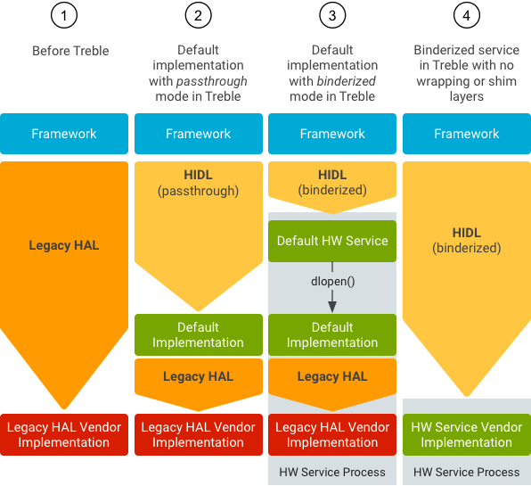

## 安卓hal层服务

### 1. 安卓 ir  HIDL创建操作步骤

mkdir -p hardware/interface/ir/1.0 

vim   hardware/interface/ir/1.0/type.hal  加入如下内容：

```
package android.hardware.ir@1.0;

struct ConsumerIrFreqRange {
    uint32_t min;
    uint32_t max;
};
```

vim   hardware/interface/ir/1.0/IConsumerIr.hal    加入如下内容：

```
package android.hardware.ir@1.0;

interface IConsumerIr {
    transmit(int32_t carrierFreq, vec<int32_t> pattern) generates (bool success);
    getCarrierFreqs() generates (bool success, vec<ConsumerIrFreqRange> ranges);
};
```

使用hidle-gen 生成 

hardware/interfaces/ir/1.0/default/IConsumerIr.cpp 

hardware/interfaces/ir/1.0/default/IConsumerIr.h

hardware/interfaces/ir/1.0/default/IConsumerIr.bp

```
halDir=ir
PACKAGE=android.hardware.${halDir}@1.0
LOC=hardware/interfaces/${halDir}/1.0/default/ 
hidl-gen -o $LOC -Lc++-impl -randroid.hardware:hardware/interfaces  -randroid.hidl:system/libhidl/transport $PACKAGE
hidl-gen -o $LOC -Landroidbp-impl -randroid.hardware:hardware/interfaces  -randroid.hidl:system/libhidl/transport $PACKAGE
```

执行./hardware/interfaces/update-makefiles.sh 生成 hardware/interfaces/ir/1.0/Android.bp

创建服务文件 touch hardware/interfaces/ir/1.0/default/service.cpp   hardware/interfaces/demo/1.0/default/android.hardware.ir@1.0-service.rc

最终整个源码目录结构如下：

```
$ tree hardware/interfaces/ir/1.0 
hardware/interfaces/ir/1.0
gonghj@zte:~/project/mtk8195/hardware/interfaces/ir/1.0$ tree .
.
├── Android.bp
├── default
│   ├── Android.bp
│   ├── android.hardware.ir@1.0-service.rc
│   ├── ConsumerIr.cpp
│   ├── ConsumerIr.h
│   └── service.cpp
├── IConsumerIr.hal
└── types.hal
```

接下来需要修改default下的所有文件：

vim hardware/interfaces/ir/1.0/default/ConsumerIr.h

```
#ifndef ANDROID_HARDWARE_IR_V1_0_IR_H
#define ANDROID_HARDWARE_IR_V1_0_IR_H

#include <android/hardware/ir/1.0/IConsumerIr.h>
#include <hardware/consumerir.h>
#include <hidl/MQDescriptor.h>
#include <hidl/Status.h>

namespace android {
namespace hardware {
namespace ir {
namespace V1_0 {
namespace implementation {

using ::android::hardware::ir::V1_0::ConsumerIrFreqRange;
using ::android::hardware::ir::V1_0::IConsumerIr;
using ::android::hardware::hidl_array;
using ::android::hardware::hidl_string;
using ::android::hardware::hidl_vec;
using ::android::hardware::Return;
using ::android::hardware::Void;
using ::android::sp;

struct ConsumerIr : public IConsumerIr {
    ConsumerIr(consumerir_device_t *device);
    // Methods from ::android::hardware::ir::V1_0::IConsumerIr follow.
    Return<bool> transmit(int32_t carrierFreq, const hidl_vec<int32_t>& pattern) override;
    Return<void> getCarrierFreqs(getCarrierFreqs_cb _hidl_cb) override;
private:
    consumerir_device_t *mDevice;
};

//选择直通模式，取消该行的注释,在android.hardware.ir@1.0-impl库中导出该符号
extern "C" IConsumerIr* HIDL_FETCH_IConsumerIr(const char* name);

}  // namespace implementation
}  // namespace V1_0
}  // namespace ir
}  // namespace hardware
}  // namespace android
```

vim hardware/interfaces/ir/1.0/default/ConsumerIr.cpp

```
#define LOG_TAG "ConsumerIrService"

#include <log/log.h>

#include <hardware/hardware.h>
#include <hardware/consumerir.h>

#include "ConsumerIr.h"

namespace android {
namespace hardware {
namespace ir {
namespace V1_0 {
namespace implementation {

ConsumerIr::ConsumerIr(consumerir_device_t *device) {
    mDevice = device;
}

// Methods from ::android::hardware::consumerir::V1_0::IConsumerIr follow.
Return<bool> ConsumerIr::transmit(int32_t carrierFreq, const hidl_vec<int32_t>& pattern) { //实现具体接口方法
    return mDevice->transmit(mDevice, carrierFreq, pattern.data(), pattern.size()) == 0;
}

Return<void> ConsumerIr::getCarrierFreqs(getCarrierFreqs_cb _hidl_cb) {                  //实现具体接口方法
    int32_t len = mDevice->get_num_carrier_freqs(mDevice);
    if (len < 0) {
        _hidl_cb(false, {});
        return Void();
    }

    consumerir_freq_range_t *rangeAr = new consumerir_freq_range_t[len];
    bool success = (mDevice->get_carrier_freqs(mDevice, len, rangeAr) >= 0);
    if (!success) {
        _hidl_cb(false, {});
        return Void();
    }

    hidl_vec<ConsumerIrFreqRange> rangeVec;
    rangeVec.resize(len);
    for (int32_t i = 0; i < len; i++) {
        rangeVec[i].min = static_cast<uint32_t>(rangeAr[i].min);
        rangeVec[i].max = static_cast<uint32_t>(rangeAr[i].max);
    }
    _hidl_cb(true, rangeVec);
    return Void();
}


IConsumerIr* HIDL_FETCH_IConsumerIr(const char * /*name*/) {                              //选择直通模式需要把该函数的注释取消
    consumerir_device_t *dev;
    const hw_module_t *hw_module = NULL;

    int ret = hw_get_module(CONSUMERIR_HARDWARE_MODULE_ID, &hw_module); //使用 legacy hal api 来dlopen legary hal xx.variant.so
    if (ret != 0) {
        ALOGE("hw_get_module %s failed: %d", CONSUMERIR_HARDWARE_MODULE_ID, ret);
        return nullptr;
    }
    ret = hw_module->methods->open(hw_module, CONSUMERIR_TRANSMITTER, (hw_device_t **) &dev);
    if (ret < 0) {
        ALOGE("Can't open consumer IR transmitter, error: %d", ret);
        return nullptr;
    }
    return new ConsumerIr(dev);
}

}  // namespace implementation
}  // namespace V1_0
}  // namespace ir
}  // namespace hardware
}  // namespace android
```

vim hardware/interfaces/ir/1.0/default/service.cpp   加入如下内容

```
#define LOG_TAG "android.hardware.ir@1.0-service"

#include <android/hardware/ir/1.0/IConsumerIr.h>
#include <hidl/LegacySupport.h>

using android::hardware::ir::V1_0::IConsumerIr;
using android::hardware::defaultPassthroughServiceImplementation;

int main() {
    return defaultPassthroughServiceImplementation<IConsumerIr>();
}
```

vim hardware/interfaces/ir/1.0/default/android.hardware.ir@1.0-service.rc  加入如下内容

```
service vendor.ir-hal-1-0 /vendor/bin/hw/android.hardware.ir@1.0-service
    interface android.hardware.ir@1.0::IConsumerIr default
    class hal
    user system
    group system
```

添加transport信息：vim /hardware/interface/ir/1.0/default/manifest_ir.xml

```
<manifest version="1.0" type="device">
     <hal format="hidl">
         <name>android.hardware.ir</name>
         <transport>hwbinder</transport>
         <version>1.0</version>
         <interface>
             <name>IConsumerIr</name>
             <instance>default</instance>
         </interface>
     </hal>
</manifest>
```

vim hardware/interfaces/ir/1.0/default/Android.bp

```
cc_library_shared {
    name: "android.hardware.ir@1.0-impl",
    defaults: ["hidl_defaults"],
    relative_install_path: "hw",
    proprietary: true,
    srcs: ["ConsumerIr.cpp"],
    shared_libs: [                    //本模块已经由工具生成，修改添加实现各种方法时所依赖的 库模块名 和 头文件路径
        "libhidlbase",
        "libhardware",
        "liblog",
        "libutils",
        "android.hardware.ir@1.0",
    ],
}

cc_binary {                           //本模块需要自己添加，最终编译出二进制可执行文件来创建服务、注册服务、监听请求提供服务
    relative_install_path: "hw",
    defaults: ["hidl_defaults"],
    name: "android.hardware.ir@1.0-service",
    proprietary: true,
    init_rc: ["android.hardware.ir@1.0-service.rc"],//指定rc文件
    vintf_fragments: ["manifest_ir.xml"],//指定服务描述文件
    srcs: ["service.cpp"],

    shared_libs: [
        "liblog",
        "libhardware",
        "libhidlbase",
        "libutils",
        "android.hardware.ir@1.0",
    ],

}
```

使用mmm -j50 hardware/interfaces/ir/1.0或全编译构建模块时还会生成如下cpp h文件：

```
out/soong/.intermediates/hardware/interfaces/ir/1.0/android.hardware.ir@1.0_genc++ $ tree
.
└── gen
    └── android
        └── hardware
            └── ir
                └── 1.0
                    ├── ConsumerIrAll.cpp
                    ├── ConsumerIrAll.cpp.d
                    └── types.cpp

out/soong/.intermediates/hardware/interfaces/ir/1.0/android.hardware.ir@1.0_genc++_headers $ tree
.
└── gen
    └── android
        └── hardware
            └── ir
                └── 1.0
                    ├── BnHwConsumerIr.h
                    ├── BpHwConsumerIr.h
                    ├── BsConsumerIr.h
                    ├── hwtypes.h
                    ├── IConsumerIr.h
                    ├── IConsumerIr.h.d
                    ├── IHwConsumerIr.h
                    └── types.h
```


### 2. server如何创建服务

在hardware/interfaces/ir/1.0/default/android.hardware.ir@1.0-service.rc中启动了android.hardware.ir@1.0-service进程，该进程由 hardware/interfaces/ir/1.0/default/service.cpp编译链接而成，首先看service.cpp：

```
using android::hardware::ir::V1_0::IConsumerIr;
using android::hardware::defaultPassthroughServiceImplementation;
int main() {
      return defaultPassthroughServiceImplementation<IConsumerIr>();
}
```

android::hardware命名空间中的defaultPassthroughServiceImplementation<> 模板函数声明在system/libhidl/transport/include/hidl/LegacySupport.h：

```
template <class Interface, class ExpectInterface = Interface>
 __attribute__((warn_unused_result)) status_t defaultPassthroughServiceImplementation(
         const std::string& name, size_t maxThreads = 1) {
     configureRpcThreadpool(maxThreads, true);
     status_t result = registerPassthroughServiceImplementation<Interface, ExpectInterface>(name);
 
     if (result != OK) {
         return result;
     }
 
     joinRpcThreadpool();
     return UNKNOWN_ERROR;
 }
 template <class Interface, class ExpectInterface = Interface>
 __attribute__((warn_unused_result)) status_t defaultPassthroughServiceImplementation(
         size_t maxThreads = 1) {
     return defaultPassthroughServiceImplementation<Interface, ExpectInterface>("default",
                                                                                maxThreads);
 }
```

configureRpcThreadpool 最终调用到 ProcessState 的 setThreadPoolConfiguration 方法，第一个参数用于设置当前进程用于 hwbinder 通信的最大线程数，第二个参数为true时hwbinder驱动不能再通过BR_SPAWN_LOOPER创建子线程。

模板函数重载，相当于最终调用到

```
status_t result = registerPassthroughServiceImplementation<IConsumerIr, IConsumerIr>(string("default"));
```

registerPassthroughServiceImplementation 函数模板声明在system/libhidl/transport/include/hidl/LegacySupport.h中：

```
template <class Interface, class ExpectInterface = Interface>
  __attribute__((warn_unused_result)) status_t registerPassthroughServiceImplementation(
          const std::string& name = "default") {
      return registerPassthroughServiceImplementation(Interface::descriptor,
                                                      ExpectInterface::descriptor, name);
  }
```

相当于最终调用到：

```
return registerPassthroughServiceImplementation(IConsumerIr::descriptor, IConsumerIr::descriptor, string("default"));
```

descriptor是IConsumerIr类的属性，在out/soong/.intermediates/hardware/interfaces/ir/1.0/android.hardware.ir@1.0_genc++/ConsumerIrAll.cpp中初始化如下：

```
const char* IConsumerIr::descriptor("android.hardware.ir@1.0::IConsumerIr");
```

故最终相当于调用android::hardware命名空间中的普通函数registerPassthroughServiceImplementation

```
return registerPassthroughServiceImplementation("android.hardware.ir@1.0::IConsumerIr","android.hardware.ir@1.0::IConsumerIr", string("default"));
```

android::hardware::registerPassthroughServiceImplementation 普通函数在：system/libhidl/transport/LegacySupport.cpp 中定义：

```
__attribute__((warn_unused_result)) status_t registerPassthroughServiceImplementation(
        const std::string& interfaceName, const std::string& expectInterfaceName,
        const std::string& serviceName) {
    return details::registerPassthroughServiceImplementation(
            interfaceName, expectInterfaceName,
            [](const sp<IBase>& service, const std::string& name) { 
                return details::registerAsServiceInternal(service, name);
            },
            serviceName);
}
```

相当于最终调用

```
details::registerPassthroughServiceImplementation(
            string("android.hardware.ir@1.0::IConsumerIr"), 
            string("android.hardware.ir@1.0::IConsumerIr"),
            funcPtr,
            string("default"));
```

funcPtr是如下匿名函数的指针：

    [](const sp<IBase>& service, const std::string& name) { 
                    return details::registerAsServiceInternal(service, name);
    }
android::hardware::details命名空间中的registerPassthroughServiceImplementation普通函数在system/libhidl/transport/LegacySupport.cpp 中定义：

```
 namespace details {
 __attribute__((warn_unused_result)) status_t registerPassthroughServiceImplementation(
         const std::string& interfaceName, const std::string& expectInterfaceName,
         RegisterServiceCb registerServiceCb, const std::string& serviceName) {
     sp<IBase> service =
             getRawServiceInternal(interfaceName, serviceName, true /*retry*/, true /*getStub*/);
 
      if (service == nullptr) {
          ALOGE("Could not get passthrough implementation for %s/%s.", interfaceName.c_str(),
                serviceName.c_str());
          return EXIT_FAILURE;
      }
      if (service->isRemote()) {
          ALOGE("Implementation of %s/%s is remote!", interfaceName.c_str(), serviceName.c_str());
          return EXIT_FAILURE;
      }
  
      std::string actualName;
      Return<void> result = service->interfaceDescriptor(
              [&actualName](const hidl_string& descriptor) { actualName = descriptor; });
      if (!result.isOk()) {
          ALOGE("Error retrieving interface name from %s/%s: %s", interfaceName.c_str(),
                serviceName.c_str(), result.description().c_str());
          return EXIT_FAILURE;
      }
      if (actualName != expectInterfaceName) {
          ALOGE("Implementation of %s/%s is actually %s, not a %s!", interfaceName.c_str(),
                serviceName.c_str(), actualName.c_str(), expectInterfaceName.c_str());
          return EXIT_FAILURE;
      }
  
      status_t status = registerServiceCb(service, serviceName);
    if (status == OK) {
        ALOGI("Registration complete for %s/%s.", interfaceName.c_str(), serviceName.c_str());
    } else {
        ALOGE("Could not register service %s/%s (%d).", interfaceName.c_str(), serviceName.c_str(),
              status);
    }

    return status;
}

}  // namespace details
```

details命名空间的registerPassthroughServiceImplementation中首先调用如下函数获取 ConsumerIr对象

```
sp<IBase> service = getRawServiceInternal(string("android.hardware.ir@1.0::IConsumerIr"), string("default"), true /*retry*/, true /*getStub*/);
```

getRawServiceInternal 函数有多重作用，当getStub为true时，不管transport属于什么模式，都通过getPassthroughServiceManager类dlopen打开android.hardware.ir@1.0-impl.so，在android.hardware.ir@1.0-impl.so中通过hw_get_module来dlopen legacy hal so库并调用里面的函数来创建ConsumerIr对象。getStub为false时则通过BpHwServiceManager对象从/system/manifest.xml和/vendor/manifest.xml文件中读取当前hidl服务的Transport类型是hwbinder、passthrough还是未知EMPTY，如果是hwbinder则通过BpServiceManager::get()获取到代理类对象BpHwConsumerIr(前提是BnHwConsumerIr已经成功注册)。

在system/libhidl/transport/ServiceManagement.cpp中定义：

```
762  sp<::android::hidl::base::V1_0::IBase> getRawServiceInternal(const std::string& descriptor,
763                                                               const std::string& instance,
764                                                               bool retry, bool getStub) {
765      using Transport = IServiceManager1_0::Transport;
766      sp<Waiter> waiter;
767  
768      sp<IServiceManager1_1> sm;
769      Transport transport = Transport::EMPTY;
770      if (kIsRecovery) {
771          transport = Transport::PASSTHROUGH;
772      } else {
773          sm = defaultServiceManager1_1();
774          if (sm == nullptr) {
775              ALOGE("getService: defaultServiceManager() is null");
776              return nullptr;
777          }
778          //读取xml文件获得服务类型是绑定式还是直通式。具体实现见Transport类型查询章节
779          Return<Transport> transportRet = sm->getTransport(descriptor, instance);
780  
781          if (!transportRet.isOk()) {
782              ALOGE("getService: defaultServiceManager()->getTransport returns %s",
783                    transportRet.description().c_str());
784              return nullptr;
785          }
786          transport = transportRet;
787      }
788  
789      const bool vintfHwbinder = (transport == Transport::HWBINDER);
790      const bool vintfPassthru = (transport == Transport::PASSTHROUGH);
791      const bool trebleTestingOverride = isTrebleTestingOverride();
792      const bool allowLegacy = !kEnforceVintfManifest || (trebleTestingOverride && kDebuggable);
793      const bool vintfLegacy = (transport == Transport::EMPTY) && allowLegacy;
794  
795      if (!kEnforceVintfManifest) {
796          ALOGE("getService: Potential race detected. The VINTF manifest is not being enforced. If "
797                "a HAL server has a delay in starting and it is not in the manifest, it will not be "
798                "retrieved. Please make sure all HALs on this device are in the VINTF manifest and "
799                "enable PRODUCT_ENFORCE_VINTF_MANIFEST on this device (this is also enabled by "
800                "PRODUCT_FULL_TREBLE). PRODUCT_ENFORCE_VINTF_MANIFEST will ensure that no race "
801                "condition is possible here.");
802          sleep(1);
803      }
804  
805      for (int tries = 0; !getStub && (vintfHwbinder || vintfLegacy); tries++) {
806          if (waiter == nullptr && tries > 0) {
807              waiter = new Waiter(descriptor, instance, sm);
808          }
809          if (waiter != nullptr) {
810              waiter->reset();  // don't reorder this -- see comments on reset()
811          }//绑定式服务，通过BpHwServiceManager来获得已经注册的BpHwConsumerIr
812          Return<sp<IBase>> ret = sm->get(descriptor, instance);
813          if (!ret.isOk()) {
814              ALOGE("getService: defaultServiceManager()->get returns %s for %s/%s.",
815                    ret.description().c_str(), descriptor.c_str(), instance.c_str());
816              break;
817          }
818          sp<IBase> base = ret;
819          if (base != nullptr) {
820              Return<bool> canCastRet =
821                  details::canCastInterface(base.get(), descriptor.c_str(), true /* emitError */);
822  
823              if (canCastRet.isOk() && canCastRet) {
824                  if (waiter != nullptr) {
825                      waiter->done();
826                  }
827                  return base; // still needs to be wrapped by Bp class.
828              }
829  
830              if (!handleCastError(canCastRet, descriptor, instance)) break;
831          }
832  
833          // In case of legacy or we were not asked to retry, don't.
834          if (vintfLegacy || !retry) break;
835  
836          if (waiter != nullptr) {
837              ALOGI("getService: Trying again for %s/%s...", descriptor.c_str(), instance.c_str());
838              waiter->wait(true /* timeout */);
839          }
840      }
841  
842      if (waiter != nullptr) {
843          waiter->done();
844      }
845      //因为 getStub=true 或 直通模式 主要是如下代码片段起作用：
846      if (getStub || vintfPassthru || vintfLegacy) {
847          const sp<IServiceManager1_0> pm = getPassthroughServiceManager();//获得的是PassthroughServiceManager对象
848          if (pm != nullptr) {
849              sp<IBase> base = pm->get(descriptor, instance).withDefault(nullptr);//获得的是ConsumerIr对象
850              if (!getStub || trebleTestingOverride) {
851                  base = wrapPassthrough(base);
852              }
853              return base;
854          }
855      }
856  
857      return nullptr;
858  }
```

getPassthroughServiceManager结构体声明定义及对象创建过程在system/libhidl/transport/ServiceManagement.cpp中：

```
341  struct PassthroughServiceManager : IServiceManager1_1 {
342      static void openLibs(
343          const std::string& fqName,
344          const std::function<bool /* continue */ (void* /* handle */, const std::string& /* lib */,
345                                                   const std::string& /* sym */)>& eachLib) {
346          //fqName looks like android.hardware.foo@1.0::IFoo
347          size_t idx = fqName.find("::");
348  
349          if (idx == std::string::npos ||
350                  idx + strlen("::") + 1 >= fqName.size()) {
351              LOG(ERROR) << "Invalid interface name passthrough lookup: " << fqName;
352              return;
353          }
354  
355          std::string packageAndVersion = fqName.substr(0, idx);
356          std::string ifaceName = fqName.substr(idx + strlen("::"));
357  
358          const std::string prefix = packageAndVersion + "-impl";
359          const std::string sym = "HIDL_FETCH_" + ifaceName;
360  
361          constexpr int dlMode = RTLD_LAZY;
362          void* handle = nullptr;
363  
364          dlerror(); // clear
365  
366          static std::string halLibPathVndkSp = android::base::StringPrintf(
367              HAL_LIBRARY_PATH_VNDK_SP_FOR_VERSION, details::getVndkVersionStr().c_str());
368          std::vector<std::string> paths = {
369              HAL_LIBRARY_PATH_ODM, HAL_LIBRARY_PATH_VENDOR, halLibPathVndkSp,
370  #ifndef __ANDROID_VNDK__
371              HAL_LIBRARY_PATH_SYSTEM,
372  #endif
373          };
374  
375  #ifdef LIBHIDL_TARGET_DEBUGGABLE
376          const char* env = std::getenv("TREBLE_TESTING_OVERRIDE");
377          const bool trebleTestingOverride = env && !strcmp(env, "true");
378          if (trebleTestingOverride) {
379              // Load HAL implementations that are statically linked
380              handle = dlopen(nullptr, dlMode);
381              if (handle == nullptr) {
382                  const char* error = dlerror();
383                  LOG(ERROR) << "Failed to dlopen self: "
384                             << (error == nullptr ? "unknown error" : error);
385              } else if (!eachLib(handle, "SELF", sym)) {
386                  return;
387              }
388          }
389  #endif
390  
391          for (const std::string& path : paths) {
392              std::vector<std::string> libs = findFiles(path, prefix, ".so");
393  
394              for (const std::string &lib : libs) {
395                  const std::string fullPath = path + lib;
396  
397                  if (kIsRecovery || path == HAL_LIBRARY_PATH_SYSTEM) {
398                      handle = dlopen(fullPath.c_str(), dlMode);
399                  } else {
400  #if !defined(__ANDROID_RECOVERY__) && defined(__ANDROID__)
401                      handle = android_load_sphal_library(fullPath.c_str(), dlMode);
402  #endif
403                  }
404  
405                  if (handle == nullptr) {
406                      const char* error = dlerror();
407                      LOG(ERROR) << "Failed to dlopen " << lib << ": "
408                                 << (error == nullptr ? "unknown error" : error);
409                      continue;
410                  }
411  
412                  if (!eachLib(handle, lib, sym)) {
413                      return;
414                  }
415              }
416          }
417      }
418  
419      Return<sp<IBase>> get(const hidl_string& fqName,
420                            const hidl_string& name) override {
421          sp<IBase> ret = nullptr;
422  
423          openLibs(fqName, [&](void* handle, const std::string &lib, const std::string &sym) {
424              IBase* (*generator)(const char* name);
425              *(void **)(&generator) = dlsym(handle, sym.c_str());
426              if(!generator) {
427                  const char* error = dlerror();
428                  LOG(ERROR) << "Passthrough lookup opened " << lib
429                             << " but could not find symbol " << sym << ": "
430                             << (error == nullptr ? "unknown error" : error);
431                  dlclose(handle);
432                  return true;
433              }
434  
435              ret = (*generator)(name.c_str());
436  
437              if (ret == nullptr) {
438                  dlclose(handle);
439                  return true; // this module doesn't provide this instance name
440              }
441  
442              // Actual fqname might be a subclass.
443              // This assumption is tested in vts_treble_vintf_test
444              using ::android::hardware::details::getDescriptor;
445              std::string actualFqName = getDescriptor(ret.get());
446              CHECK(actualFqName.size() > 0);
447              registerReference(actualFqName, name);
448              return false;
449          });
450  
451          return ret;
452      }
.....
554  };
555  
556  sp<IServiceManager1_0> getPassthroughServiceManager() {
557      return getPassthroughServiceManager1_1();
558  }
559  sp<IServiceManager1_1> getPassthroughServiceManager1_1() {
560      static sp<PassthroughServiceManager> manager(new PassthroughServiceManager());
561      return manager;
562  }
```

getPassthroughServiceManager是一个结构体，派生自IServiceManager1_0，在getPassthroughServiceManager中声明定义了get方法和openLibs方法。
getRawServiceInternal 中获得了getPassthroughServiceManager对象后接着调用getPassthroughServiceManager的get方法：

```
sp<IBase> base = pm->get(string("android.hardware.ir@1.0::IConsumerIr"), string("default")).withDefault(nullptr);
```

get方法在执行期间会调用openLibs方法并传入一个匿名函数指针。在 openLibs 方法中 根据传进来的 string("android.hardware.ir@1.0::IConsumerIr") 找到并dlopen打开 android.hardware.ir@1.0-impl.so 库得到句柄，然后调用匿名函数指针。在调用时将句柄作为第一个参数，so库的文件路径+名作为第二个参数，string(HIDL_FETCH_IConsumerIr)作为第三个参数。

在匿名函数中，首先使用dlsym根据字符串"HIDL_FETCH_IConsumerIr"找到符号对应的地址，然后将地址赋给 generator 函数指针后进行调用，相当于执行了 android.hardware.ir@1.0-impl.so 库中的 HIDL_FETCH_IConsumerIr 函数， 在HIDL_FETCH_IConsumerIr 函数中使用hw_get_module dlopen legacy hal so库，并使用dlsym字符串"HMI"找到符号对应的地址，并调用这个地址对应的函数。最终返回了一个 ConsumerIr 对象指针，ConsumerIr 对象的一些功能由 legacy hal so库来与底层/proc   /dev   /sys等节点交互。

ConsumerIr类派生自IConsumerIr类，IConsumerIr类派生自IBase类。sp\<IBase> ret 最终指向的是调用generator 函数指针返回得到的 ConsumerIr 对象。


### 3. server如何注册服务


一路返回，details命名空间的registerPassthroughServiceImplementation函数中调用调用getRawServiceInternal获取到ConsumerIr对象之后，
再将 ConsumerIr对象的智能指针service   作为第一个参数调用匿名函数指针, 第二个参数是string("default")：

```
sp<IBase> service = getRawServiceInternal(string("android.hardware.ir@1.0::IConsumerIr"), string("default"), true /*retry*/, true /*getStub*/);
...
status_t status = registerServiceCb(service, serviceName);//调用匿名函数指针
...
```

调用details::registerPassthroughServiceImplementation时传进来的匿名函数实现如下：

```
[](const sp<IBase>& service, const std::string& name) {
                  return details::registerAsServiceInternal(service, name);
},
```

details::registerAsServiceInternal在system/libhidl/transport/ServiceManagement.cpp中定义 ：

```
860 status_t registerAsServiceInternal(const sp<IBase>& service, const std::string& name) {
861      if (service == nullptr) {
862          return UNEXPECTED_NULL;
863      }
864  
865      sp<IServiceManager1_2> sm = defaultServiceManager1_2();
866      if (sm == nullptr) {
867          return INVALID_OPERATION;
868      }
869  
870      const std::string descriptor = getDescriptor(service.get());
871  
872      if (kEnforceVintfManifest && !isTrebleTestingOverride()) {
873          using Transport = IServiceManager1_0::Transport;
874          Transport transport = sm->getTransport(descriptor, name);
875  
876          if (transport != Transport::HWBINDER) {
877              LOG(ERROR) << "Service " << descriptor << "/" << name
878                         << " must be in VINTF manifest in order to register/get.";
879              return UNKNOWN_ERROR;
880          }
881      }
882  
883      bool registered = false;
884      Return<void> ret = service->interfaceChain([&](const auto& chain) {
885          registered = sm->addWithChain(name.c_str(), service, chain).withDefault(false);
886      });
887  
888      if (!ret.isOk()) {
889          LOG(ERROR) << "Could not retrieve interface chain: " << ret.description();
890      }
891  
892      if (registered) {
893          onRegistrationImpl(descriptor, name);
894      }
895  
896      return registered ? OK : UNKNOWN_ERROR;
897  }
```


在registerAsServiceInternal中首先调用defaultServiceManager1_2函数获得BpHwServiceManager 对象：

defaultServiceManager1_2在system/libhidl/transport/ServiceManagement.cpp中定义：

```
sp<IServiceManager1_2> defaultServiceManager1_2() {
    using android::hidl::manager::V1_2::BnHwServiceManager;
    using android::hidl::manager::V1_2::BpHwServiceManager;
    
    static std::mutex gDefaultServiceManagerLock;
    static sp<IServiceManager1_2> gDefaultServiceManager;
 
    {
        std::lock_guard<std::mutex> _l(gDefaultServiceManagerLock);
        if (gDefaultServiceManager != nullptr) {
            return gDefaultServiceManager;
        }
        //1.检查hwbinder的节点是否存在，如果不存在说明不支持hwbinder
        if (access("/dev/hwbinder", F_OK|R_OK|W_OK) != 0) {
            // HwBinder not available on this device or not accessible to
            // this process.
            return nullptr;
        }
        //2.等待属性"hwservicemanager.ready" 变为true，表明hwservicemanager已经启动好
        waitForHwServiceManager();
 
        while (gDefaultServiceManager == nullptr) {
            //3.拿到HwServiceManager的代理对象
            gDefaultServiceManager =
                fromBinder<IServiceManager1_2, BpHwServiceManager, BnHwServiceManager>(
                    ProcessState::self()->getContextObject(nullptr));
            if (gDefaultServiceManager == nullptr) {
                LOG(ERROR) << "Waited for hwservicemanager, but got nullptr.";
                sleep(1);
            }
        }
    }
 
    return gDefaultServiceManager;
}
```

执行fromBinder<IServiceManager1_2, BpHwServiceManager, BnHwServiceManager>()前，先执行ProcessState::self()->getContextObject(nullptr) 在

system/libhwbinder/ProcessState.cpp中，定义：

```
99  sp<IBinder> ProcessState::getContextObject(const sp<IBinder>& /*caller*/)
100  {
101      return getStrongProxyForHandle(0); //传入handle = 0, HwServiceManager的handle就为0
102  }
...
270  sp<IBinder> ProcessState::getStrongProxyForHandle(int32_t handle)
271  {
272      sp<IBinder> result;
273  
274      AutoMutex _l(mLock);
275  
276      handle_entry* e = lookupHandleLocked(handle);
277  
278      if (e != nullptr) {
279          // We need to create a new BpHwBinder if there isn't currently one, OR we
280          // are unable to acquire a weak reference on this current one.  See comment
281          // in getWeakProxyForHandle() for more info about this.
282          IBinder* b = e->binder;
283          if (b == nullptr || !e->refs->attemptIncWeak(this)) {
284              b = new BpHwBinder(handle);
285              e->binder = b;
286              if (b) e->refs = b->getWeakRefs();
287              result = b;
288          } else {
289              // This little bit of nastyness is to allow us to add a primary
290              // reference to the remote proxy when this team doesn't have one
291              // but another team is sending the handle to us.
292              result.force_set(b);
293              e->refs->decWeak(this);
294          }
295      }
296  
297      return result;
298  }
```

相当于调用

```
fromBinder<IServiceManager1_2, BpHwServiceManager, BnHwServiceManager>(new BpHwBinder(handle))
```

fromBinder函数模板在system/libhidl/transport/ServiceManagement.cpp中声明：

```
template <typename IType, typename ProxyType, typename StubType>
sp<IType> fromBinder(const sp<IBinder>& binderIface) {
    using ::android::hidl::base::V1_0::IBase;
    using ::android::hidl::base::V1_0::BnHwBase;
 
    if (binderIface.get() == nullptr) {
        return nullptr;
    }
    
    if (binderIface->localBinder() == nullptr) {
    /*这里传入的binderIface 其中的Binder对象为 new BpHwBinder(0)，这是一个remote的Binder，这里的ProxyType是BpHwServiceManager  所以返回一个new BpHwServiceManager() */
        return new ProxyType(binderIface);
    }
    sp<IBase> base = static_cast<BnHwBase*>(binderIface.get())->getImpl();
    if (details::canCastInterface(base.get(), IType::descriptor)) {
        StubType* stub = static_cast<StubType*>(binderIface.get());
        return stub->getImpl();
    } else {
        return nullptr;
    }
}
```

最终fromBinder    new  BpHwServiceManager(new BpHwBinder(handle=0)) 对象并返回，即defaultServiceManager1_2函数返回了一个  BpHwServiceManager 对象智能指针对象。


在details::registerAsServiceInternal中调用fromBinder 后将返回的对象智能指针赋给sm，之后调用 ConsumerIr 的 interfaceChain方法，并传入匿名函数： 

```
Return<void> ret = service->interfaceChain([&](const auto& chain) {
                       registered = sm->addWithChain(name.c_str(), service, chain).withDefault(false);
                   });
```

ConsumerIr 的interfaceChain方法继承自其父类IBase，在out/soong/.intermediates/system/libhidl/transport/base/1.0/android.hidl.base@1.0_genc++/gen/android/hidl/base/1.0/ BaseAll.cpp  中定义：

```
const char* IBase::descriptor("android.hidl.base@1.0::IBase");//静态成员变量static const char* descriptor初始化

...省略部分代码...

::android::hardware::Return<void> IBase::interfaceChain(interfaceChain_cb _hidl_cb){
    _hidl_cb({
        ::android::hidl::base::V1_0::IBase::descriptor,
    });
    return ::android::hardware::Void();
}
```

最终相当于调用了匿名函数，在匿名函数中调用 BpHwServiceManager 的 addWithChain 方法，第一个参数是 ”default“ 字符串首地址 , 第二个参数是ConsumerIr 对象的智能指针，第三个参数是"android.hidl.base@1.0::IBase"字符串的首地址。addWithChain 方法在out/soong/.intermediates/system/libhidl/transport/manager/1.2/android.hidl.manager@1.2_genc++/gen/android/hidl/manager/1.2/ServiceManagerAll.cpp  中定义：

```
::android::hardware::Return<bool> BpHwServiceManager::addWithChain(
const ::android::hardware::hidl_string& name, 
const ::android::sp<::android::hidl::base::V1_0::IBase>& service,
const ::android::hardware::hidl_vec<::android::hardware::hidl_string>& chain )  {
   ::android::hardware::Return<bool>  _hidl_out = ::android::hidl::manager::V1_2::BpHwServiceManager::_hidl_addWithChain(this, this, name, service, chain);
    return _hidl_out;
}


::android::hardware::Return<bool> BpHwServiceManager::_hidl_addWithChain(
::android::hardware::IInterface *_hidl_this, 
::android::hardware::details::HidlInstrumentor *_hidl_this_instrumentor,
const ::android::hardware::hidl_string& name,
const ::android::sp<::android::hidl::base::V1_0::IBase>& service,
const ::android::hardware::hidl_vec<::android::hardware::hidl_string>& chain ) {
  
  ...省略向发往HwServiceManager进程的数据包中填充数据的代码和无关代码 ...
  
    if (service == nullptr) {
        _hidl_err = _hidl_data.writeStrongBinder(nullptr);
    } else {
        ::android::sp<::android::hardware::IBinder> _hidl_binder = ::android::hardware::getOrCreateCachedBinder(service.get());
        if (_hidl_binder.get() != nullptr) {
            _hidl_err = _hidl_data.writeStrongBinder(_hidl_binder);
        } else {
            _hidl_err = ::android::UNKNOWN_ERROR;
        }
    }
 
 ...省略向发往HwServiceManager进程的数据包中填充数据的代码和无关代码 ...

    ::android::hardware::ProcessState::self()->startThreadPool();//创建子线程监听解析执行相关服务
 
    _hidl_transact_err = ::android::hardware::IInterface::asBinder(_hidl_this)->transact(12 /* addWithChain */, _hidl_data, &_hidl_reply, 0);
...省略后续判断HwServiceManager的回复及进行处理的代码...
}

 
    //4.启动一个线程池
    ::android::hardware::ProcessState::self()->startThreadPool();
    //5.调用BpHwBinder::transact()，asBinder转换过程，参考下图
    //_hidl_this 指的是 BpHwServiceManager，通过asBinder转换为传输层面的BpHwBinder对象，其实就是取出BpHwServiceManager的成员变量mRemote的值
    _hidl_err = ::android::hardware::IInterface::asBinder(_hidl_this)->transact(12 /* addWithChain */, _hidl_data, &_hidl_reply);
    if (_hidl_err != ::android::OK) { goto _hidl_error; }

```

BpHwServiceManager::addWithChain 调用  BpHwServiceManager::_hidl_addWithChain ，在 _hidl_addWithChain  方法中调用了 ::android::hardware::getOrCreateCachedBinder(service.get()),   service.get() 返回的是 ConsumerIr对象的地址。

getOrCreateCachedBinder在 system/libhidl/transport/HidlBinderSupport.cpp 中定义：

```
233  sp<IBinder> getOrCreateCachedBinder(::android::hidl::base::V1_0::IBase* ifacePtr) {
...
243      std::string descriptor = details::getDescriptor(ifacePtr);
...
256          auto func = details::getBnConstructorMap().get(descriptor, nullptr);//得到插桩函数地址
...
264          sBnObj = sp<IBinder>(func(static_cast<void*>(ifacePtr)));//调用插桩函数得到BnHwConsumerIr
...
271      return sBnObj;
272  }
```

details::getDescriptor(IBase* interface) 在system/libhidl/transport/HidlTransportUtils.cpp中定义：

```
58  std::string getDescriptor(IBase* interface) {
...
63      std::string myDescriptor{};
64      auto ret = interface->interfaceDescriptor([&](const hidl_string &types) {
65          myDescriptor = types.c_str();
66      });
67      ret.isOk(); // ignored, return empty string if not isOk()
68      return myDescriptor;
69  }
```

interface-> interfaceDescriptor相当于调用ConsumerIr的interfaceDescriptor方法，并传入匿名函数指针，interfaceDescriptor在

out/soong/.intermediates/hardware/interfaces/ir/1.0/android.hardware.ir@1.0_genc++/gen/android/hardware/ir/1.0/ConsumerIrAll.cpp  中定义：

```
const char* IConsumerIr::descriptor("android.hardware.ir@1.0::IConsumerIr");//静态成员函数初始化。

...省略部分内容...

::android::hardware::Return<void> IConsumerIr::interfaceDescriptor(interfaceDescriptor_cb _hidl_cb){
    _hidl_cb(::android::hardware::ir::V1_0::IConsumerIr::descriptor);
    return ::android::hardware::Void();
}
```

最终details::getDescriptor返回的是"android.hardware.ir@1.0::IConsumerIr"字符串首地址。


相当于 getOrCreateCachedBinder 中接下来进行了如下调用：

details::getBnConstructorMap().get(new string ("android.hardware.ir@1.0::IConsumerIr"), nullptr);

getBnConstructorMap()在 system/libhidl/transport/Static.cpp 中定义：

```
46  BnConstructorMap& getBnConstructorMap() {
47      static BnConstructorMap& map = *new BnConstructorMap();
48      return map;
49  }
```

在system/libhidl/transport/include/hidl/Static.h中有：

```
using BnConstructorMap = ConcurrentMap<std::string, std::function<sp<IBinder>(void*)>>;
```

在system/libhidl/transport/include/hidl/ConcurrentMap.h中有：

```
template<typename K, typename V>
26  class ConcurrentMap {
27  private:
28      using size_type = typename std::map<K, V>::size_type;
29      using iterator = typename std::map<K, V>::iterator;
30      using const_iterator = typename std::map<K, V>::const_iterator;
31  
32  public:
33      void set(K &&k, V &&v) {
34          std::unique_lock<std::mutex> _lock(mMutex);
35          mMap[std::forward<K>(k)] = std::forward<V>(v);
36      }
37  
38      // get with the given default value.
39      const V &get(const K &k, const V &def) const {
40          std::unique_lock<std::mutex> _lock(mMutex);
41          const_iterator iter = mMap.find(k);
42          if (iter == mMap.end()) {
43              return def;
44          }
45          return iter->second;
46      }
....
88     private:
89      mutable std::mutex mMutex;
90      std::map<K, V> mMap;
```

因此 创建了BnConstructorMap对象，并调用其get方法使用descriptor 来从 mMap 中取出  创建 BnHwConsumerIr对象的匿名函数的地址。匿名函数的地址在main函数执行前被放入了mMap 中：

out/soong/.intermediates/hardware/interfaces/ir/1.0/android.hardware.ir@1.0_genc++/gen/android/hardware/ir/1.0/ConsumerIrAll.cpp  ： 

```
/*
__attribute__((constructor)) 不是标准C++，他是GCC的一种扩展属性函数。constructor属性使得函数在执行进入main（）之前被自动调用。static_constructor具有constructor 属性，在service.cpp的main函数执行之前会调用static_constructor函数，static_constructor调用details::getBnConstructorMap()创建BnConstructorMap对象，并调用BnConstructorMap的set方法，匿名函数指针是set方法的第一个参数。在set方法中调用该匿名函数指针放入 mMap 中。
*/

__attribute__((constructor)) static void static_constructor() {
    ::android::hardware::details::getBnConstructorMap().set(IConsumerIr::descriptor,
            [](void *iIntf) -> ::android::sp<::android::hardware::IBinder> {
                return new BnHwConsumerIr(static_cast<IConsumerIr *>(iIntf));
            });
    ::android::hardware::details::getBsConstructorMap().set(IConsumerIr::descriptor,
            [](void *iIntf) -> ::android::sp<::android::hidl::base::V1_0::IBase> {
                return new BsConsumerIr(static_cast<IConsumerIr *>(iIntf));
            });
}
```


一路返回到getOrCreateCachedBinder中，获得 创建BnHwConsumerIr对象的匿名函数的地址赋给func函数指针后再调用func指针。

ConsumerIr 是调用 匿名函数时传的参数：

```
 sBnObj = sp<IBinder>(func(static_cast<void*>(ifacePtr)));
```

相当于：

```
 sBnObj = sp<IBinder>( new BnHwConsumerIr(ConsumerIr对象的智能指针对象) );
```


接着返回到_hidl_addWithChain函数中，将 BnConsumerIr 的智能指针对象与其他数据打包，最后通过发给 HwServiceManager进程来注册服务：

```
_hidl_transact_err = ::android::hardware::IInterface::asBinder(_hidl_this)->transact(12 /* addWithChain */, _hidl_data, &_hidl_reply, 0);
```

_hidl_this是  BpHwServiceManager 对象的指针，BpHwServiceManager 派生自BpInterface\<HwServiceManager> ,  BpInterface\<HwServiceManager>派生自IHwServiceManager，IInterface，和BpHwRefBase。其中IInterface类在 system/libhwbinder/IInterface.cpp中定义了asBinder方法：

```
34  sp<IBinder> IInterface::asBinder(const IInterface* iface)
35  {
36      if (iface == nullptr) return nullptr;
37      return const_cast<IInterface*>(iface)->onAsBinder();
38  }
```

BpInterface\<INTERFACE> 的 onAsBinder方法在system/libhwbinder/include/hwbinder/IInterface.h声明：

```
40  template<typename INTERFACE>
41  class BpInterface : public INTERFACE, public IInterface, public BpHwRefBase
42  {
43  public:
44      explicit                    BpInterface(const sp<IBinder>& remote);
45      virtual IBinder*            onAsBinder();
46  };
47  
48  // ----------------------------------------------------------------------
49  
50  // ----------------------------------------------------------------------
51  // No user-serviceable parts after this...
52  
53  
54  template<typename INTERFACE>
55  inline BpInterface<INTERFACE>::BpInterface(const sp<IBinder>& remote)
56      : BpHwRefBase(remote)
57  {
58  }
59  
60  template<typename INTERFACE>
61  inline IBinder* BpInterface<INTERFACE>::onAsBinder()
62  {
63      return remote();
64  }
```

BpHwRefBase 的 remote方法在system/libhwbinder/include/hwbinder/Binder.h中声明：

```
91  class BpHwRefBase : public virtual RefBase
92  {
93  protected:
94      explicit                BpHwRefBase(const sp<IBinder>& o);
95      virtual                 ~BpHwRefBase();
96      virtual void            onFirstRef();
97      virtual void            onLastStrongRef(const void* id);
98      virtual bool            onIncStrongAttempted(uint32_t flags, const void* id);
99  
100  public:
101      inline  IBinder*        remote() const          { return mRemote; }
102  
103  private:
104                              BpHwRefBase(const BpHwRefBase& o);
105      BpHwRefBase&              operator=(const BpHwRefBase& o);
106  
107      IBinder* const          mRemote;
108      RefBase::weakref_type*  mRefs;
109      std::atomic<int32_t>    mState;
110  };
```

因此::android::hardware::IInterface::asBinder(_hidl_this)返回了一个BpHwBinder对象，其中handle=0，也就是在前面的defaultServiceManager1_2 中通过调用ProcessState::self()->getContextObject(nullptr) 获得的那个BpHwBinder对象。

最终通过BpHwBinder对象的 transact方法将打包好的数据(其中有指向BnHwConsumerIr对象的智能指针对象)发给HwServiceManager进程来注册服务。


### 3. server如何监听解析执行服务

#### 3.1 子线程

在调用BpHwBinder(handle=0)的transact方法注册服务前有：

```
::android::hardware::ProcessState::self()->startThreadPool();
```

ProcessState::self() 返回一个ProcessState对象的智能指针对象，ProcessState对象是单例，每个进程只有一个，ProcessState对象在构造时打开/dev/hwbinder设备驱动文件接口。ProcessStated的startThreadPool方法调用了spawnPooledThread方法，在spawnPooledThread方法中创建PoolThread对象，PoolThread对象由Thread派生，之后调用 PoolThread的run方法启动这个线程并返回， 在子线程中调用threadLoop方法，调用IPCThreadState::self()->joinThreadPool()，见system/libhwbinder/ProcessState.cpp：

```
49  class PoolThread : public Thread
50  {
51  public:
52      explicit PoolThread(bool isMain)
53          : mIsMain(isMain)
54      {
55      }
56  
57  protected:
58      virtual bool threadLoop()
59      {
60          IPCThreadState::self()->joinThreadPool(mIsMain);
61          return false;
62      }
63  
64      const bool mIsMain;
65  };
66  
67  sp<ProcessState> ProcessState::self()
68  {
69      Mutex::Autolock _l(gProcessMutex);
70      if (gProcess != nullptr) {
71          return gProcess;
72      }
73      gProcess = new ProcessState(DEFAULT_BINDER_VM_SIZE);
74      return gProcess;
75  }
...
146  void ProcessState::startThreadPool()
147  {
148      AutoMutex _l(mLock);
149      if (!mThreadPoolStarted) {
150          mThreadPoolStarted = true;
151          if (mSpawnThreadOnStart) {
152              spawnPooledThread(true);
153          }
154      }
155  }
...
351  void ProcessState::spawnPooledThread(bool isMain)
352  {
353      if (mThreadPoolStarted) {
354          String8 name = makeBinderThreadName();
355          ALOGV("Spawning new pooled thread, name=%s\n", name.string());
356          sp<Thread> t = new PoolThread(isMain);
357          t->run(name.string());
358      }
359  }
...
403  static int open_driver()
404  {
405      int fd = open("/dev/hwbinder", O_RDWR | O_CLOEXEC);
406      if (fd >= 0) {
407          int vers = 0;
408          status_t result = ioctl(fd, BINDER_VERSION, &vers);
409          if (result == -1) {
410              ALOGE("Binder ioctl to obtain version failed: %s", strerror(errno));
411              close(fd);
412              fd = -1;
413          }
414          if (result != 0 || vers != BINDER_CURRENT_PROTOCOL_VERSION) {
415            ALOGE("Binder driver protocol(%d) does not match user space protocol(%d)!", vers, BINDER_CURRENT_PROTOCOL_VERSION);
416              close(fd);
417              fd = -1;
418          }
419          size_t maxThreads = DEFAULT_MAX_BINDER_THREADS;
420          result = ioctl(fd, BINDER_SET_MAX_THREADS, &maxThreads);
421          if (result == -1) {
422              ALOGE("Binder ioctl to set max threads failed: %s", strerror(errno));
423          }
424      } else {
425          ALOGW("Opening '/dev/hwbinder' failed: %s\n", strerror(errno));
426      }
427      return fd;
428  }
429  
430  ProcessState::ProcessState(size_t mmap_size)
431      : mDriverFD(open_driver())
432      , mVMStart(MAP_FAILED)
433      , mThreadCountLock(PTHREAD_MUTEX_INITIALIZER)
434      , mThreadCountDecrement(PTHREAD_COND_INITIALIZER)
435      , mExecutingThreadsCount(0)
436      , mMaxThreads(DEFAULT_MAX_BINDER_THREADS)
437      , mStarvationStartTimeMs(0)
438      , mManagesContexts(false)
439      , mBinderContextCheckFunc(nullptr)
440      , mBinderContextUserData(nullptr)
441      , mThreadPoolStarted(false)
442      , mSpawnThreadOnStart(true)
443      , mThreadPoolSeq(1)
444      , mMmapSize(mmap_size)
445      , mCallRestriction(CallRestriction::NONE)
446  {
447      if (mDriverFD >= 0) {
448          // mmap the binder, providing a chunk of virtual address space to receive transactions.
449          mVMStart = mmap(nullptr, mMmapSize, PROT_READ, MAP_PRIVATE | MAP_NORESERVE, mDriverFD, 0);
450          if (mVMStart == MAP_FAILED) {
451              // *sigh*
452              ALOGE("Mmapping /dev/hwbinder failed: %s\n", strerror(errno));
453              close(mDriverFD);
454              mDriverFD = -1;
455          }
456      }
457  
458  #ifdef __ANDROID__
459      LOG_ALWAYS_FATAL_IF(mDriverFD < 0, "Binder driver could not be opened. Terminating.");
460  #endif
461  }
```

#### 3.2 主线程

在defaultPassthroughServiceImplementation 调用registerPassthroughServiceImplementation<Interface, ExpectInterface>(name);

注册完服务后接下来调用了joinRpcThreadpool()，joinRpcThreadpool在system/libhidl/transport/HidlTransportSupport.cpp中定义：

    35  void joinRpcThreadpool() {
    36      // TODO(b/32756130) this should be transport-dependent
    37      joinBinderRpcThreadpool();
    38  }
    ...
    284  void joinBinderRpcThreadpool() {
    285      LOG_ALWAYS_FATAL_IF(!gThreadPoolConfigured,
    286                          "HIDL joinRpcThreadpool without calling configureRpcThreadPool.");
    287      IPCThreadState::self()->joinThreadPool();
    288  }

显然不管是3.1中的子线程还是3.2中的主线程，最终都是调用到了IPCThreadState::self()->joinThreadPool()，IPCThreadState的self方法首先判断是否有存储线程私有数据的key，如果没有则创建一个，然后从key中取出数据，如果能够取出IPCThreadState对象则直接返回该对象，如果取出的为空则 new IPCThreadState再返回。在IPCThreadState的构造函数中会将本对象的指针放入线程私有数据key中，见system/libhwbinder/IPCThreadState.cpp：

```
277  static pthread_mutex_t gTLSMutex = PTHREAD_MUTEX_INITIALIZER;
278  static std::atomic<bool> gHaveTLS = false;
279  static pthread_key_t gTLS = 0;
280  static std::atomic<bool> gShutdown = false;
281  
282  IPCThreadState* IPCThreadState::self()
283  {
284      if (gHaveTLS.load(std::memory_order_acquire)) {
285  restart:
286          const pthread_key_t k = gTLS;
287          IPCThreadState* st = (IPCThreadState*)pthread_getspecific(k);
288          if (st) return st;
289          return new IPCThreadState;
290      }
291  
292      // Racey, heuristic test for simultaneous shutdown.
293      if (gShutdown.load(std::memory_order_relaxed)) {
294          ALOGW("Calling IPCThreadState::self() during shutdown is dangerous, expect a crash.\n");
295          return nullptr;
296      }
297  
298      pthread_mutex_lock(&gTLSMutex);
299      if (!gHaveTLS.load(std::memory_order_relaxed)) {
300          int key_create_value = pthread_key_create(&gTLS, threadDestructor);
301          if (key_create_value != 0) {
302              pthread_mutex_unlock(&gTLSMutex);
303              ALOGW("IPCThreadState::self() unable to create TLS key, expect a crash: %s\n",
304                      strerror(key_create_value));
305              return nullptr;
306          }
307          gHaveTLS.store(true, std::memory_order_release);
308      }
309      pthread_mutex_unlock(&gTLSMutex);
310      goto restart;
311  }
...
436  status_t IPCThreadState::getAndExecuteCommand()
437  {
...
459          result = executeCommand(cmd);
...
490  }
...
548  void IPCThreadState::joinThreadPool(bool isMain)
549  {
550      LOG_THREADPOOL("**** THREAD %p (PID %d) IS JOINING THE THREAD POOL\n", (void*)pthread_self(), getpid());
551  
552      mOut.writeInt32(isMain ? BC_ENTER_LOOPER : BC_REGISTER_LOOPER);
553  
554      status_t result;
555      mIsLooper = true;
556      do {
557          processPendingDerefs();
558          // now get the next command to be processed, waiting if necessary
559          result = getAndExecuteCommand();
560  
561          if (result < NO_ERROR && result != TIMED_OUT && result != -ECONNREFUSED && result != -EBADF) {
562              LOG_ALWAYS_FATAL("getAndExecuteCommand(fd=%d) returned unexpected error %d, aborting",
563                    mProcess->mDriverFD, result);
564          }
565  
566          // Let this thread exit the thread pool if it is no longer
567          // needed and it is not the main process thread.
568          if(result == TIMED_OUT && !isMain) {
569              break;
570          }
571      } while (result != -ECONNREFUSED && result != -EBADF);
572  
573      LOG_THREADPOOL("**** THREAD %p (PID %d) IS LEAVING THE THREAD POOL err=%d\n",
574          (void*)pthread_self(), getpid(), result);
575  
576      mOut.writeInt32(BC_EXIT_LOOPER);
577      mIsLooper = false;
578      talkWithDriver(false);
579  }
...
771  IPCThreadState::IPCThreadState()
772      : mProcess(ProcessState::self()),
773        mServingStackPointer(nullptr),
774        mStrictModePolicy(0),
775        mLastTransactionBinderFlags(0),
776        mIsLooper(false),
777        mIsPollingThread(false),
778        mCallRestriction(mProcess->mCallRestriction) {
779      pthread_setspecific(gTLS, this);
780      clearCaller();
781      mIn.setDataCapacity(256);
782      mOut.setDataCapacity(256);
783  }
...
1053  status_t IPCThreadState::executeCommand(int32_t cmd)
1054  {
1055      BHwBinder* obj;
1056      RefBase::weakref_type* refs;
1057      status_t result = NO_ERROR;
1058      switch ((uint32_t)cmd) {
...
1132          case BR_TRANSACTION:
1133          {
...
1201              if (tr.target.ptr) {
1202                  // We only have a weak reference on the target object, so we must first try to
1203                  // safely acquire a strong reference before doing anything else with it.
1204                  if (reinterpret_cast<RefBase::weakref_type*>(
1205                          tr.target.ptr)->attemptIncStrong(this)) {
1206                      error = reinterpret_cast<BHwBinder*>(tr.cookie)->transact(tr.code, buffer,
1207                              &reply, tr.flags, reply_callback);
1208                      reinterpret_cast<BHwBinder*>(tr.cookie)->decStrong(this);
1209                  } else {
1210                      error = UNKNOWN_TRANSACTION;
1211                  }
1212  
1213              } else {
1214                  error = the_context_object->transact(tr.code, buffer, &reply, tr.flags, reply_callback);
1215              }
...
1249          }
1250          break;
...
1281      }
1282  
...
1288  }
```

因此IPCThreadState为线程独有，每个线程最多只能有一个。IPCThreadState的joinThreadPool方法中有一个do while循环，在该循环中不断地监听接收，解析接收到的数据，然后调用 getAndExecuteCommand方法处理并回复数据。在getAndExecuteCommand方法中调用executeCommand方法，在executeCommand方法switch中进行判断，如果是BR_TRANSACTION事件则将通过hwbinder通信接受的的数据包中的cookie字段中的地址强制转换成BHwBinder*指针，这个地址其实就是前面注册服务时BnHwComsumerIr对象的地址，BnHwComsumerIr派生自BHwBinder。然后使用BHwBinder指针调用transact方法，见system/libhwbinder/Binder.cpp：

```
108  status_t BHwBinder::transact(
109      uint32_t code, const Parcel& data, Parcel* reply, uint32_t flags, TransactCallback callback)
110  {
111      data.setDataPosition(0);
112  
113      status_t err = NO_ERROR;
114      switch (code) {
115          default:
116              err = onTransact(code, data, reply, flags,
117                      [&](auto &replyParcel) {
118                          replyParcel.setDataPosition(0);
119                          if (callback != nullptr) {
120                              callback(replyParcel);
121                          }
122                      });
123              break;
124      }
125  
126      return err;
127  }
```

BHwBinder::transact方法里面调用onTransact方法，这个方法在BnHwComsumerIr中实现:

out/soong/.intermediates/hardware/interfaces/ir/1.0/android.hardware.ir@1.0_genc++/gen/android/hardware/ir/1.0/ConsumerIrAll.cpp

```
::android::status_t BnHwConsumerIr::_hidl_transmit(
        ::android::hidl::base::V1_0::BnHwBase* _hidl_this,
        const ::android::hardware::Parcel &_hidl_data,
        ::android::hardware::Parcel *_hidl_reply,
        TransactCallback _hidl_cb) {
...忽略从hwbinder驱动接收到的数据包中读取数据的过程...
    bool _hidl_out_success = static_cast<IConsumerIr*>(_hidl_this->getImpl().get())->transmit(carrierFreq, *pattern);
...忽略从回复数据的过程...
}

::android::status_t BnHwConsumerIr::_hidl_getCarrierFreqs(
        ::android::hidl::base::V1_0::BnHwBase* _hidl_this,
        const ::android::hardware::Parcel &_hidl_data,
        ::android::hardware::Parcel *_hidl_reply,
        TransactCallback _hidl_cb) {
...忽略从hwbinder驱动接收到的数据包中读取数据的过程...
    ::android::hardware::Return<void> _hidl_ret = static_cast<IConsumerIr*>(_hidl_this->getImpl().get())->getCarrierFreqs([&](const auto &_hidl_out_success, const auto &_hidl_out_ranges) {
...忽略从回复数据的过程...
}

::android::status_t BnHwConsumerIr::onTransact(
        uint32_t _hidl_code,
        const ::android::hardware::Parcel &_hidl_data,
        ::android::hardware::Parcel *_hidl_reply,
        uint32_t _hidl_flags,
        TransactCallback _hidl_cb) {
    ::android::status_t _hidl_err = ::android::OK;

    switch (_hidl_code) {
        case 1 /* transmit */:
        {
            _hidl_err = ::android::hardware::ir::V1_0::BnHwConsumerIr::_hidl_transmit(this, _hidl_data, _hidl_reply, _hidl_cb);
            break;
        }

        case 2 /* getCarrierFreqs */:
        {
            _hidl_err = ::android::hardware::ir::V1_0::BnHwConsumerIr::_hidl_getCarrierFreqs(this, _hidl_data, _hidl_reply, _hidl_cb);
            break;
        }

        default:
        {
            return ::android::hidl::base::V1_0::BnHwBase::onTransact(
                    _hidl_code, _hidl_data, _hidl_reply, _hidl_flags, _hidl_cb);
        }
    }

    if (_hidl_err == ::android::UNEXPECTED_NULL) {
        _hidl_err = ::android::hardware::writeToParcel(
                ::android::hardware::Status::fromExceptionCode(::android::hardware::Status::EX_NULL_POINTER),
                _hidl_reply);
    }return _hidl_err;
}
```

在onTransact方法中根据不同的_hidl_code来调用不同的函数接口，在具体的函数接口比如 \_hidl_transmit和 \_hidl_getCarrierFreqs中，首先将从binder驱动收到的数据读出，然后调用BnHwConsumerIr的getImpl方法得到ComsumerIr的智能指针对象， 再调用ComsumerIr的智能指针对象的get()方法获得ComsumerIr对象的地址，然后使用这个地址调用ComsumerIr中实现的真正的 transmit 和getCarrierFreqs 接口函数。调用完毕后再将结果通过hwbinder返回给client。

out/soong/.intermediates/hardware/interfaces/ir/1.0/android.hardware.ir@1.0_genc++_headers/gen/android/hardware/ir/1.0/BnHwConsumerIr.h

```
struct BnHwConsumerIr : public ::android::hidl::base::V1_0::BnHwBase {
...
    ::android::sp<IConsumerIr> getImpl() { return _hidl_mImpl; }
...
};
```

在BnHwConsumerIr构造时会将ComsumerIr对象的智能指针对象赋给_hidl_mImpl，因此这里返回的是ComsumerIr对象的智能指针对象。


 关于对代理端回复\_hidl_reply，BnHwConsumerIr::\_hidl_transmit则是如下的三种模型的第二种，BnHwConsumerIr::\_hidl_getCarrierFreqs则是不调用::android::hardware::getOrCreateCachedBinder(_hidl_out_iface.get())不返回接口的第三种模型：


### 4. 类关系


### 5. hal的模型




1、framework层的进程直接使用hw_get_module来dlopen  legacy hal so库。


2、framework层的进程通过使用getRawServiceInternal，第四个参数getStub传入false，且xml文件中服务的transport类型为passthrough，最终dlopen android.hardware.ir@1.0-impl.so，执行里面HIDL_FETCH_IConsumerIr函数，在HIDL_FETCH_IConsumerIr函数中调用hw_get_module来dlopen  legacy hal so库，并执行里面的HMI函数来获得CunsumerIr对象。


3、framework层的client进程使用通过调用

getRawServiceInternal，第四个参数getStub传入false，且xml文件中服务的transport类型为hwbinder，此时得到的是BpHwCunsumerIr对象。hal层server进程使用getRawServiceInternal第四个参数getStub传入true，最终dlopen android.hardware.ir@1.0-impl.so，执行里面HIDL_FETCH_IConsumerIr函数，在HIDL_FETCH_IConsumerIr函数中调用hw_get_module来dlopen  legacy hal so库，并执行里面的HMI函数来获得CunsumerIr对象。


4、framework层的client进程使用getRawServiceInternal，第四个参数getStub传入false，且xml文件中服务的transport类型为hwbinder，此时得到的是BpHwCunsumerIr对象。hal层server进程不使用getRawServiceInternal，直接new一个CunsumerIr对象。


### 6. 编写第四种模型的hal

前面操作步骤与第1节的描述相似，不同之处有：

1、在实现具体方法时在cpp文件不需要取消HIDL_FETCH_ICunsumerIr函数实现的注释，在h文件不需要取消HIDL_FETCH_ICunsumerIr函数声明导出符号的注释

2、在生成的cpp文件中添加构造函数，在生成的h文件中声明构造函数，在构造函数中打开驱动节点/sys  /dev  /proc，如果是第三章模式的hal构造函数可以加也可以不加，驱动节点在HIDL_FETCH_ICunsumerIr函数中打开。

3、server.cpp中不调用defaultPassthroughServiceImplementation 直接configureRpcThreadpool (2,true)设置hwbinder，再 new   CunsumerIr服务，然后创建子线程监听处理执行服务::android::hardware::ProcessState::self()->startThreadPool()，然后CunsumerIr.registerAsService注册服务（registerAsService中调用::android::hardware::details::registerAsServiceInternal(this, serviceName)来注册服务），最后主线程监听处理执行服务joinRpcThreadpool()。

4、Android.bp 在构建 server服务二进制可执行文件时需要链接 android.hardware.ir@1.0-impl.so因为 new   CunsumerIr时这个服务在android.hardware.ir@1.0-impl.so中。

5、实现接口时不需要走原来的hw_get_module来dlopen  legacy hal，而是直接读写/proc /dev   /sys 下的节点。


###  7. 查询服务的Transport类型

https://blog.csdn.net/marshal_zsx/article/details/80293194

out/soong/.intermediates/system/libhidl/transport/manager/1.0/android.hidl.manager@1.0_genc++/gen/android/hidl/manager/1.0/ServiceManagerAll.cpp

BpHwServiceManager的getTransport方法通过hwbinder跨进程通信找到BnHwServiceManager对象中的ServiceManager对象，然后调用其getTransport方法

system/hwservicemanager/ServiceManager.cpp

```
414  Return<ServiceManager::Transport> ServiceManager::getTransport(const hidl_string& fqName,
415                                                                 const hidl_string& name) {
416      using ::android::hardware::getTransport;
417  
418      if (!mAcl.canGet(fqName, getBinderCallingContext())) {
419          return Transport::EMPTY;
420      }
421  
422      switch (getTransport(fqName, name)) {
423          case vintf::Transport::HWBINDER:
424               return Transport::HWBINDER;
425          case vintf::Transport::PASSTHROUGH:
426               return Transport::PASSTHROUGH;
427          case vintf::Transport::EMPTY:
428          default:
429               return Transport::EMPTY;
430      }
431  }
```


system/hwservicemanager/Vintf.cpp

```
39  vintf::Transport getTransport(const std::string &interfaceName, const std::string &instanceName) {
40      FQName fqName;
41  
42      if (!FQName::parse(interfaceName, &fqName)) {
43          LOG(ERROR) << __FUNCTION__ << ": " << interfaceName
44                     << " is not a valid fully-qualified name.";
45          return vintf::Transport::EMPTY;
46      }
47      if (!fqName.hasVersion()) {
48          LOG(ERROR) << __FUNCTION__ << ": " << fqName.string()
49                     << " does not specify a version.";
50          return vintf::Transport::EMPTY;
51      }
52      if (fqName.name().empty()) {
53          LOG(ERROR) << __FUNCTION__ << ": " << fqName.string()
54                     << " does not specify an interface name.";
55          return vintf::Transport::EMPTY;
56      }
57  
58      vintf::Transport tr = getTransportFromManifest(fqName, instanceName,
59              vintf::VintfObject::GetFrameworkHalManifest());
60      if (tr != vintf::Transport::EMPTY) {
61          return tr;
62      }
63      tr = getTransportFromManifest(fqName, instanceName,
64              vintf::VintfObject::GetDeviceHalManifest());
65      if (tr != vintf::Transport::EMPTY) {
66          return tr;
67      }
68  
69      LOG(INFO) << __FUNCTION__ << ": Cannot find entry " << fqName.string() << "/" << instanceName
70                << " in either framework or device manifest.";
71      return vintf::Transport::EMPTY;
72  }
```


system/libvintf/VintfObject.cpp


### 8. 修改谷歌定义的安卓hal接口


```
. build/envsetup.sh
lunch <product_name>


hashNum=`hidl-gen -L hash -r android.hardware:hardware/interfaces -r android.hidl:system/libhidl/transport android.hardware.wifi.supplicant@1.0::ISupplicantStaNetworkCallback`


sed -i "/android.hardware.wifi.supplicant@1.0::ISupplicantStaNetworkCallback/s/^.*$/${hashNum}/g" hardware/interfaces/current.txt


sudo dpkg-reconfigure dash  选择No,把/bin/sh切换成bash

./development/vndk/tools/header-checker/utils/create_reference_dumps.py  -l android.hardware.wifi.supplicant@1.0 -product ${TARGET_PRODUCT}
./development/vndk/tools/header-checker/utils/create_reference_dumps.py  -l android.hardware.wifi.supplicant@1.1 -product ${TARGET_PRODUCT}
./development/vndk/tools/header-checker/utils/create_reference_dumps.py  -l android.hardware.wifi.supplicant@1.2 -product ${TARGET_PRODUCT}
./development/vndk/tools/header-checker/utils/create_reference_dumps.py  -l android.hardware.wifi.supplicant@1.3 -product ${TARGET_PRODUCT}

其中TARGET_PRODUCT就是product_name，即lunch选择的产品名，需要根据实际进行替换，不带userdebug、eng
```


### 9. 代理端获取服务及服务实现进程启动


在hidl生成的IConsumerIr.h中声明了getService方法及默认参数:

```
    static ::android::sp<IConsumerIr> getService(const std::string &serviceName="default", bool getStub=false);
    /**
     * Deprecated. See getService(std::string, bool)
     */
    static ::android::sp<IConsumerIr> getService(const char serviceName[], bool getStub=false)  { std::string str(serviceName ? serviceName : "");      return getService(str, getStub); }
    /**
     * Deprecated. See getService(std::string, bool)
     */
    static ::android::sp<IConsumerIr> getService(const ::android::hardware::hidl_string& serviceName, bool getStub=false)  { std::string str(serviceName.c_str());      return getService(str, getStub); }
    /**
     * Calls getService("default", bool). This is the recommended instance name for singleton services.
     */
    static ::android::sp<IConsumerIr> getService(bool getStub) { return getService("default", getStub); }
```

在IConsumerIrAll.cpp中实现了一个getService方法：

```
::android::sp<IConsumerIr> IConsumerIr::getService(const std::string &serviceName, const bool getStub) {
    return ::android::hardware::details::getServiceInternal<BpHwConsumerIr>(serviceName, true, getStub);
}
```

getServiceInternal模板函数声明在system/libhidl/transport/include/hidl/HidlTransportSupport.h

```
159  template <typename BpType, typename IType = typename BpType::Pure,
160            typename = std::enable_if_t<std::is_same<i_tag, typename IType::_hidl_tag>::value>,
161            typename = std::enable_if_t<std::is_same<bphw_tag, typename BpType::_hidl_tag>::value>>
162  sp<IType> getServiceInternal(const std::string& instance, bool retry, bool getStub) {
163      using ::android::hidl::base::V1_0::IBase;
164  
165      sp<IBase> base = getRawServiceInternal(IType::descriptor, instance, retry, getStub);
166  
167      if (base == nullptr) {
168          return nullptr;
169      }
170  
171      if (base->isRemote()) {
172          // getRawServiceInternal guarantees we get the proper class
173          return sp<IType>(new BpType(getOrCreateCachedBinder(base.get())));
174      }
175  
176      return IType::castFrom(base);
177  }
```


getRawServiceInternal函数的定义前面已经提过，在system/libhidl/transport/ServiceManagement.cpp：

```
762  sp<::android::hidl::base::V1_0::IBase> getRawServiceInternal(const std::string& descriptor,
763                                                               const std::string& instance,
764                                                               bool retry, bool getStub) {
765      using Transport = IServiceManager1_0::Transport;
766      sp<Waiter> waiter;
767  
768      sp<IServiceManager1_1> sm;
769      Transport transport = Transport::EMPTY;
770      if (kIsRecovery) {
771          transport = Transport::PASSTHROUGH;
772      } else {
773          sm = defaultServiceManager1_1();
774          if (sm == nullptr) {
775              ALOGE("getService: defaultServiceManager() is null");
776              return nullptr;
777          }
778  
779          Return<Transport> transportRet = sm->getTransport(descriptor, instance);
780  
781          if (!transportRet.isOk()) {
782              ALOGE("getService: defaultServiceManager()->getTransport returns %s",
783                    transportRet.description().c_str());
784              return nullptr;
785          }
786          transport = transportRet;
787      }
788  
789      const bool vintfHwbinder = (transport == Transport::HWBINDER);
790      const bool vintfPassthru = (transport == Transport::PASSTHROUGH);
791      const bool trebleTestingOverride = isTrebleTestingOverride();
792      const bool allowLegacy = !kEnforceVintfManifest || (trebleTestingOverride && kDebuggable);
793      const bool vintfLegacy = (transport == Transport::EMPTY) && allowLegacy;
794  
795      if (!kEnforceVintfManifest) {
796          ALOGE("getService: Potential race detected. The VINTF manifest is not being enforced. If "
797                "a HAL server has a delay in starting and it is not in the manifest, it will not be "
798                "retrieved. Please make sure all HALs on this device are in the VINTF manifest and "
799                "enable PRODUCT_ENFORCE_VINTF_MANIFEST on this device (this is also enabled by "
800                "PRODUCT_FULL_TREBLE). PRODUCT_ENFORCE_VINTF_MANIFEST will ensure that no race "
801                "condition is possible here.");
802          sleep(1);
803      }
804  
805      for (int tries = 0; !getStub && (vintfHwbinder || vintfLegacy); tries++) {
806          if (waiter == nullptr && tries > 0) {
807              waiter = new Waiter(descriptor, instance, sm);
808          }
809          if (waiter != nullptr) {
810              waiter->reset();  // don't reorder this -- see comments on reset()
811          }
812          Return<sp<IBase>> ret = sm->get(descriptor, instance);
813          if (!ret.isOk()) {
814              ALOGE("getService: defaultServiceManager()->get returns %s for %s/%s.",
815                    ret.description().c_str(), descriptor.c_str(), instance.c_str());
816              break;
817          }
818          sp<IBase> base = ret;
819          if (base != nullptr) {
820              Return<bool> canCastRet =
821                  details::canCastInterface(base.get(), descriptor.c_str(), true /* emitError */);
822  
823              if (canCastRet.isOk() && canCastRet) {
824                  if (waiter != nullptr) {
825                      waiter->done();
826                  }
827                  return base; // still needs to be wrapped by Bp class.
828              }
829  
830              if (!handleCastError(canCastRet, descriptor, instance)) break;
831          }
832  
833          // In case of legacy or we were not asked to retry, don't.
834          if (vintfLegacy || !retry) break;
835  
836          if (waiter != nullptr) {
837              ALOGI("getService: Trying again for %s/%s...", descriptor.c_str(), instance.c_str());
838              waiter->wait(true /* timeout */);
839          }
840      }
841  
842      if (waiter != nullptr) {
843          waiter->done();
844      }
845  
846      if (getStub || vintfPassthru || vintfLegacy) {
847          const sp<IServiceManager1_0> pm = getPassthroughServiceManager();
848          if (pm != nullptr) {
849              sp<IBase> base = pm->get(descriptor, instance).withDefault(nullptr);
850              if (!getStub || trebleTestingOverride) {
851                  base = wrapPassthrough(base);
852              }
853              return base;
854          }
855      }
856  
857      return nullptr;
858  }
```

注意，这里调用getRawServiceInternal时就不是前面走直通模式了，使用hwServiceManager的代理端，通过hwServiceManager服务读取 /systerm/etc/vintf/  下和   /vendor/etc/vintf/ 下的xml文件查找要获取服务的transport类型，得知为hwbinder（由第一节中创建xml文件中指定），因此不走直通而是通过使用hwServiceManager的代理端的get方法，hwServiceManager服务端的get方法真正实现如下：

system/hwservicemanager/ServiceManager.cpp

```
246  static void tryStartService(const std::string& fqName, const std::string& name) {
247      using ::android::base::SetProperty;
248  
249      // The "happy path" here is starting up a service that is configured as a
250      // lazy HAL, but we aren't sure that is the case. If the service doesn't
251      // have an 'interface' entry in its .rc file OR if the service is already
252      // running, then this will be a no-op. So, for instance, if a service is
253      // deadlocked during startup, you will see this message repeatedly.
254      LOG(INFO) << "Since " << fqName << "/" << name
255                << " is not registered, trying to start it as a lazy HAL.";
256  
257      std::thread([=] {
258          (void)SetProperty("ctl.interface_start", fqName + "/" + name);
259      }).detach();
260  }
261  
262  // Methods from ::android::hidl::manager::V1_0::IServiceManager follow.
263  Return<sp<IBase>> ServiceManager::get(const hidl_string& hidlFqName,
264                                        const hidl_string& hidlName) {
265      const std::string fqName = hidlFqName;
266      const std::string name = hidlName;
267  
268      if (!mAcl.canGet(fqName, getBinderCallingContext())) {
269          return nullptr;
270      }
271  
272      HidlService* hidlService = lookup(fqName, name);
273      if (hidlService == nullptr) {
274          tryStartService(fqName, name);
275          return nullptr;
276      }
277  
278      sp<IBase> service = hidlService->getService();
279      if (service == nullptr) {
280          tryStartService(fqName, name);
281          return nullptr;
282      }
283  
284      // Let HidlService know that we handed out a client. If the client drops the service before the
285      // next time handleClientCallbacks is called, it will still know that the service had been handed out.
286      hidlService->guaranteeClient();
287      forEachExistingService([&] (HidlService *otherService) {
288          if (otherService != hidlService && interfacesEqual(service, otherService->getService())) {
289              otherService->guaranteeClient();
290          }
291          return true;
292      });
293  
294      // This is executed immediately after the binder driver confirms the transaction. The driver
295      // will update the appropriate data structures to reflect the fact that the client now has the
296      // service this function is returning. Nothing else can update the HidlService at the same
297      // time. This will run before anything else can modify the HidlService which is owned by this
298      // object, so it will be in the same state that it was when this function returns.
299      hardware::addPostCommandTask([hidlService] {
300          hidlService->handleClientCallbacks(false /* isCalledOnInterval */, 1 /*knownClientCount*/);
301      });
302  
303      return service;
304  }
```


第一节rc文件中service没有disabled，ConsumerIr hal服务在开机就会在system_server中启动然后向hwService_Manager注册，这里调用lookup方法查找已经注册的服务肯定是直接能够获得并返回。


如果是其他的一些lazy hal service，例如wpa_supplicant的rc文件中服务都被disabled：

```
1|console:/ #  cat /vendor/etc/init/android.hardware.wifi.supplicant-service.rc
service wpa_supplicant /vendor/bin/hw/wpa_supplicant \
    -O/data/vendor/wifi/wpa/sockets -dd \
    -g@android:wpa_wlan0
    #   we will start as root and wpa_supplicant will switch to user wifi
    #   after setting up the capabilities required for WEXT
    #   user wifi
    #   group wifi inet keystore
    interface android.hardware.wifi.supplicant@1.0::ISupplicant default
    interface android.hardware.wifi.supplicant@1.1::ISupplicant default
    interface android.hardware.wifi.supplicant@1.2::ISupplicant default
    interface android.hardware.wifi.supplicant@1.3::ISupplicant default
    interface vendor.mediatek.hardware.wifi.supplicant@2.0::ISupplicant default
    class main
    socket wpa_wlan0 dgram 660 wifi wifi
    disabled
    oneshot
```


因为开机未自启，lookup找不到则调用 tryStartService(fqName, name)函数尝试启动这个要找的服务。在tryStartService中通过设置系统属性，属性的key为”ctl.interface_start“，值为

“android.hardware.wifi.supplicant@1.x::ISupplicant/default”   版本号具体取决于传进来的值，总之会与rc文件中service的某项interface属性匹配。init进收到临时系统属性ctl.interface_start后将其与rc文件中的interface进行对比，如果匹配就去启动对应的服务，这些服务启动后会注册hal服务到hwServiceManager，这样就能获取到服务了。


这也就是所谓的lazy hal service，当系统中第一次获取时才会去启动hal服务，而非开机后全程在运行，动态生命周期参考

https://source.android.google.cn/devices/architecture/hal/dynamic-lifecycle?hl=zh-cn


### 10. hal文件中的oneway 和generates

#### 10.1 oneway 

##### 10.1.1 hal文件

hardware/interfaces/wifi/supplicant/1.1/ISupplicant.hal

```
28 interface ISupplicant extends @1.0::ISupplicant {
...
58     /**
59      * Terminate the service.
60      * This must de-register the service and clear all state. If this HAL
61      * supports the lazy HAL protocol, then this may trigger daemon to exit and
62      * wait to be restarted.
63      */
64     oneway terminate();
65 };
```


#####  10.1.2 代理端

out/soong/.intermediates/hardware/interfaces/wifi/supplicant/1.1/android.hardware.wifi.supplicant@1.1_genc++/gen/android/hardware/wifi/supplicant/1.1/SupplicantAll.cpp

```
::android::hardware::Return<void> BpHwSupplicant::terminate(){
    ::android::hardware::Return<void>  _hidl_out = ::android::hardware::wifi::supplicant::V1_1::BpHwSupplicant::_hidl_terminate(this, this);

    return _hidl_out;
}


::android::hardware::Return<void> BpHwSupplicant::_hidl_terminate(::android::hardware::IInterface *_hidl_this, ::android::hardware::details::HidlInstrumentor *_hidl_this_instrumentor) {
    #ifdef __ANDROID_DEBUGGABLE__
    bool mEnableInstrumentation = _hidl_this_instrumentor->isInstrumentationEnabled();
    const auto &mInstrumentationCallbacks = _hidl_this_instrumentor->getInstrumentationCallbacks();
    #else
    (void) _hidl_this_instrumentor;
    #endif // __ANDROID_DEBUGGABLE__
    ::android::ScopedTrace PASTE(___tracer, __LINE__) (ATRACE_TAG_HAL, "HIDL::ISupplicant::terminate::client");
    #ifdef __ANDROID_DEBUGGABLE__
    if (UNLIKELY(mEnableInstrumentation)) {
        std::vector<void *> _hidl_args;
        for (const auto &callback: mInstrumentationCallbacks) {
            callback(InstrumentationEvent::CLIENT_API_ENTRY, "android.hardware.wifi.supplicant", "1.1", "ISupplicant", "terminate", &_hidl_args);
        }
    }
    #endif // __ANDROID_DEBUGGABLE__

    ::android::hardware::Parcel _hidl_data;
    ::android::hardware::Parcel _hidl_reply;
    ::android::status_t _hidl_err;
    ::android::status_t _hidl_transact_err;
    ::android::hardware::Status _hidl_status;

    _hidl_err = _hidl_data.writeInterfaceToken(BpHwSupplicant::descriptor);
    if (_hidl_err != ::android::OK) { goto _hidl_error; }

    _hidl_transact_err = ::android::hardware::IInterface::asBinder(_hidl_this)->transact(11 /* terminate */, _hidl_data, &_hidl_reply, 1u /* oneway */);
    if (_hidl_transact_err != ::android::OK)
    {
        _hidl_err = _hidl_transact_err;
        goto _hidl_error;
    }

    #ifdef __ANDROID_DEBUGGABLE__
    if (UNLIKELY(mEnableInstrumentation)) {
        std::vector<void *> _hidl_args;
        for (const auto &callback: mInstrumentationCallbacks) {
            callback(InstrumentationEvent::CLIENT_API_EXIT, "android.hardware.wifi.supplicant", "1.1", "ISupplicant", "terminate", &_hidl_args);
        }
    }
    #endif // __ANDROID_DEBUGGABLE__

    return ::android::hardware::Return<void>();

_hidl_error:
    _hidl_status.setFromStatusT(_hidl_err);
    return ::android::hardware::Return<void>(_hidl_status);
}
```


```
代理端填充_hidl_data后调用
::android::hardware::IInterface::asBinder(_hidl_this)->transact(11 /* terminate */, _hidl_data, &_hidl_reply, 1u /* oneway */);
通过binder驱动发送出去之后并不读取 _hidl_reply直接返回
```

##### 10.1.3 服务实现端

out/soong/.intermediates/hardware/interfaces/wifi/supplicant/1.1/android.hardware.wifi.supplicant@1.1_genc++/gen/android/hardware/wifi/supplicant/1.1/SupplicantAll.cpp

```
::android::status_t BnHwSupplicant::_hidl_terminate(
        ::android::hidl::base::V1_0::BnHwBase* _hidl_this,
        const ::android::hardware::Parcel &_hidl_data,
        ::android::hardware::Parcel *_hidl_reply,
        TransactCallback _hidl_cb) {
    #ifdef __ANDROID_DEBUGGABLE__
    bool mEnableInstrumentation = _hidl_this->isInstrumentationEnabled();
    const auto &mInstrumentationCallbacks = _hidl_this->getInstrumentationCallbacks();
    #endif // __ANDROID_DEBUGGABLE__

    ::android::status_t _hidl_err = ::android::OK;
    if (!_hidl_data.enforceInterface(BnHwSupplicant::Pure::descriptor)) {
        _hidl_err = ::android::BAD_TYPE;
        return _hidl_err;
    }

    atrace_begin(ATRACE_TAG_HAL, "HIDL::ISupplicant::terminate::server");
    #ifdef __ANDROID_DEBUGGABLE__
    if (UNLIKELY(mEnableInstrumentation)) {
        std::vector<void *> _hidl_args;
        for (const auto &callback: mInstrumentationCallbacks) {
            callback(InstrumentationEvent::SERVER_API_ENTRY, "android.hardware.wifi.supplicant", "1.1", "ISupplicant", "terminate", &_hidl_args);
        }
    }
    #endif // __ANDROID_DEBUGGABLE__

    ::android::hardware::Return<void> _hidl_ret = static_cast<ISupplicant*>(_hidl_this->getImpl().get())->terminate();

    (void) _hidl_cb;

    atrace_end(ATRACE_TAG_HAL);
    #ifdef __ANDROID_DEBUGGABLE__
    if (UNLIKELY(mEnableInstrumentation)) {
        std::vector<void *> _hidl_args;
        for (const auto &callback: mInstrumentationCallbacks) {
            callback(InstrumentationEvent::SERVER_API_EXIT, "android.hardware.wifi.supplicant", "1.1", "ISupplicant", "terminate", &_hidl_args);
        }
    }
    #endif // __ANDROID_DEBUGGABLE__

    _hidl_ret.assertOk();
    ::android::hardware::writeToParcel(::android::hardware::Status::ok(), _hidl_reply);

    return _hidl_err;
}
```


```
在服务端执行::android::hardware::Return<void> _hidl_ret = static_cast<ISupplicant*>(_hidl_this->getImpl().get())->terminate()调用具体实现的函数后 不需要填充_hidl_reply并通过调用_hidl_cb函数将_hidl_reply返回给代理端
::android::hardware::Return<void> _hidl_ret = static_cast<ISupplicant*>(_hidl_this->getImpl().get())->terminate();

    (void) _hidl_cb;
```

具体实现函数如下：


#### 10.2 generates(单个参数且能映射成C++基本类型，包括void类型)

##### 10.2.1 hal文件

hardware/interfaces/wifi/supplicant/1.0/ISupplicant.hal

```
27 interface ISupplicant {
...
33   enum DebugLevel : uint32_t {
34     EXCESSIVE = 0,
35     MSGDUMP = 1,
36     DEBUG = 2,
37     INFO = 3,
38     WARNING = 4,
39     ERROR = 5
40   };
...
129   getDebugLevel() generates (DebugLevel level);
...
159 };
```

##### 10.2.2 代理端

out/soong/.intermediates/hardware/interfaces/wifi/supplicant/1.0/android.hardware.wifi.supplicant@1.0_genc++/gen/android/hardware/wifi/supplicant/1.0/SupplicantAll.cpp

```
::android::hardware::Return<::android::hardware::wifi::supplicant::V1_0::ISupplicant::DebugLevel> BpHwSupplicant::getDebugLevel(){
    ::android::hardware::Return<::android::hardware::wifi::supplicant::V1_0::ISupplicant::DebugLevel>  _hidl_out = ::android::hardware::wifi::supplicant::V1_0::BpHwSupplicant::_hidl_getDebugLevel(this, this);

    return _hidl_out;
}


::android::hardware::Return<::android::hardware::wifi::supplicant::V1_0::ISupplicant::DebugLevel> BpHwSupplicant::_hidl_getDebugLevel(::android::hardware::IInterface *_hidl_this, ::android::hardware::details::HidlInstrumentor *_hidl_this_instrumentor) {
    #ifdef __ANDROID_DEBUGGABLE__
    bool mEnableInstrumentation = _hidl_this_instrumentor->isInstrumentationEnabled();
    const auto &mInstrumentationCallbacks = _hidl_this_instrumentor->getInstrumentationCallbacks();
    #else
    (void) _hidl_this_instrumentor;
    #endif // __ANDROID_DEBUGGABLE__
    ::android::ScopedTrace PASTE(___tracer, __LINE__) (ATRACE_TAG_HAL, "HIDL::ISupplicant::getDebugLevel::client");
    #ifdef __ANDROID_DEBUGGABLE__
    if (UNLIKELY(mEnableInstrumentation)) {
        std::vector<void *> _hidl_args;
        for (const auto &callback: mInstrumentationCallbacks) {
            callback(InstrumentationEvent::CLIENT_API_ENTRY, "android.hardware.wifi.supplicant", "1.0", "ISupplicant", "getDebugLevel", &_hidl_args);
        }
    }
    #endif // __ANDROID_DEBUGGABLE__

    ::android::hardware::Parcel _hidl_data;
    ::android::hardware::Parcel _hidl_reply;
    ::android::status_t _hidl_err;
    ::android::status_t _hidl_transact_err;
    ::android::hardware::Status _hidl_status;

    ::android::hardware::wifi::supplicant::V1_0::ISupplicant::DebugLevel _hidl_out_level;

    _hidl_err = _hidl_data.writeInterfaceToken(BpHwSupplicant::descriptor);
    if (_hidl_err != ::android::OK) { goto _hidl_error; }

    _hidl_transact_err = ::android::hardware::IInterface::asBinder(_hidl_this)->transact(5 /* getDebugLevel */, _hidl_data, &_hidl_reply, 0);
    if (_hidl_transact_err != ::android::OK)
    {
        _hidl_err = _hidl_transact_err;
        goto _hidl_error;
    }

    _hidl_err = ::android::hardware::readFromParcel(&_hidl_status, _hidl_reply);
    if (_hidl_err != ::android::OK) { goto _hidl_error; }

    if (!_hidl_status.isOk()) { return _hidl_status; }

    _hidl_err = _hidl_reply.readUint32((uint32_t *)&_hidl_out_level);
    if (_hidl_err != ::android::OK) { goto _hidl_error; }

    #ifdef __ANDROID_DEBUGGABLE__
    if (UNLIKELY(mEnableInstrumentation)) {
        std::vector<void *> _hidl_args;
        _hidl_args.push_back((void *)&_hidl_out_level);
        for (const auto &callback: mInstrumentationCallbacks) {
            callback(InstrumentationEvent::CLIENT_API_EXIT, "android.hardware.wifi.supplicant", "1.0", "ISupplicant", "getDebugLevel", &_hidl_args);
        }
    }
    #endif // __ANDROID_DEBUGGABLE__

    return ::android::hardware::Return<::android::hardware::wifi::supplicant::V1_0::ISupplicant::DebugLevel>(_hidl_out_level);

_hidl_error:
    _hidl_status.setFromStatusT(_hidl_err);
    return ::android::hardware::Return<::android::hardware::wifi::supplicant::V1_0::ISupplicant::DebugLevel>(_hidl_status);
}
```


```
代理端填充_hidl_data后调用
_hidl_transact_err = ::android::hardware::IInterface::asBinder(_hidl_this)->transact(5 /* getDebugLevel */, _hidl_data, &_hidl_reply, 0);
将数据发送给服务端，之后再调用
 _hidl_err = ::android::hardware::readFromParcel(&_hidl_status, _hidl_reply);
 阻塞等待服务端将_hidl_reply发回来，最后读取里面的值作为BpHwSupplicant::_hidl_getDebugLevel方法的返回值。
```


##### 10.2.3 服务实现端

out/soong/.intermediates/hardware/interfaces/wifi/supplicant/1.0/android.hardware.wifi.supplicant@1.0_genc++/gen/android/hardware/wifi/supplicant/1.0/SupplicantAll.cpp

```
 ::android::status_t BnHwSupplicant::_hidl_getDebugLevel(
        ::android::hidl::base::V1_0::BnHwBase* _hidl_this,
        const ::android::hardware::Parcel &_hidl_data,
        ::android::hardware::Parcel *_hidl_reply,
        TransactCallback _hidl_cb) {
    #ifdef __ANDROID_DEBUGGABLE__
    bool mEnableInstrumentation = _hidl_this->isInstrumentationEnabled();
    const auto &mInstrumentationCallbacks = _hidl_this->getInstrumentationCallbacks();
    #endif // __ANDROID_DEBUGGABLE__

    ::android::status_t _hidl_err = ::android::OK;
    if (!_hidl_data.enforceInterface(BnHwSupplicant::Pure::descriptor)) {
        _hidl_err = ::android::BAD_TYPE;
        return _hidl_err;
    }

    atrace_begin(ATRACE_TAG_HAL, "HIDL::ISupplicant::getDebugLevel::server");
    #ifdef __ANDROID_DEBUGGABLE__
    if (UNLIKELY(mEnableInstrumentation)) {
        std::vector<void *> _hidl_args;
        for (const auto &callback: mInstrumentationCallbacks) {
            callback(InstrumentationEvent::SERVER_API_ENTRY, "android.hardware.wifi.supplicant", "1.0", "ISupplicant", "getDebugLevel", &_hidl_args);
        }
    }
    #endif // __ANDROID_DEBUGGABLE__

    ::android::hardware::wifi::supplicant::V1_0::ISupplicant::DebugLevel _hidl_out_level = static_cast<ISupplicant*>(_hidl_this->getImpl().get())->getDebugLevel();

    ::android::hardware::writeToParcel(::android::hardware::Status::ok(), _hidl_reply);

    _hidl_err = _hidl_reply->writeUint32((uint32_t)_hidl_out_level);
    if (_hidl_err != ::android::OK) { goto _hidl_error; }

_hidl_error:
    atrace_end(ATRACE_TAG_HAL);
    #ifdef __ANDROID_DEBUGGABLE__
    if (UNLIKELY(mEnableInstrumentation)) {
        std::vector<void *> _hidl_args;
        _hidl_args.push_back((void *)&_hidl_out_level);
        for (const auto &callback: mInstrumentationCallbacks) {
            callback(InstrumentationEvent::SERVER_API_EXIT, "android.hardware.wifi.supplicant", "1.0", "ISupplicant", "getDebugLevel", &_hidl_args);
        }
    }
    #endif // __ANDROID_DEBUGGABLE__

    if (_hidl_err != ::android::OK) { return _hidl_err; }
    _hidl_cb(*_hidl_reply);
    return _hidl_err;
}
```


```
调用具体实现函数
::android::hardware::wifi::supplicant::V1_0::ISupplicant::DebugLevel _hidl_out_level = static_cast<ISupplicant*>(_hidl_this->getImpl().get())->getDebugLevel();
将得到的返回值_hidl_out_level写入_hidl_reply
_hidl_err = _hidl_reply->writeUint32((uint32_t)_hidl_out_level);
调用_hidl_cb函数把_hidl_reply发送给代理端。这里的_hidl_cb函数类型是TransactCallback，它指向调用BnHwSupplicant::_hidl_getDebugLevel()时传入的匿名函数，即reply_callback
```


具体实现函数如下：


#### 10.3 generates(多个参数  或 不能映射成C++基本类型的单个参数)

##### 10.3.1 hal文件

hardware/interfaces/wifi/supplicant/1.1/ISupplicant.hal

```
28 interface ISupplicant extends @1.0::ISupplicant {
29     /**
30      * Registers a wireless interface in supplicant.
31      *
32      * @param ifaceInfo Combination of the interface type and name(e.g wlan0).
33      * @return status Status of the operation.
34      *         Possible status codes:
35      *         |SupplicantStatusCode.SUCCESS|,
36      *         |SupplicantStatusCode.FAILURE_ARGS_INVALID|,
37      *         |SupplicantStatusCode.FAILURE_UNKNOWN|,
38      *         |SupplicantStatusCode.FAILURE_IFACE_EXISTS|
39      * @return iface HIDL interface object representing the interface if
40      *         successful, null otherwise.
41      */
42     addInterface(IfaceInfo ifaceInfo)
43         generates (SupplicantStatus status, ISupplicantIface iface);
...
65 };
```


##### 10.3.2 代理端

out/soong/.intermediates/hardware/interfaces/wifi/supplicant/1.1/android.hardware.wifi.supplicant@1.1_genc++/gen/android/hardware/wifi/supplicant/1.1/SupplicantAll.cpp

```
::android::hardware::Return<void> BpHwSupplicant::addInterface(const ::android::hardware::wifi::supplicant::V1_0::ISupplicant::IfaceInfo& ifaceInfo, addInterface_cb _hidl_cb){
    ::android::hardware::Return<void>  _hidl_out = ::android::hardware::wifi::supplicant::V1_1::BpHwSupplicant::_hidl_addInterface(this, this, ifaceInfo, _hidl_cb);

    return _hidl_out;
}


::android::hardware::Return<void> BpHwSupplicant::_hidl_addInterface(::android::hardware::IInterface *_hidl_this, ::android::hardware::details::HidlInstrumentor *_hidl_this_instrumentor, const ::android::hardware::wifi::supplicant::V1_0::ISupplicant::IfaceInfo& ifaceInfo, addInterface_cb _hidl_cb) {
    #ifdef __ANDROID_DEBUGGABLE__
    bool mEnableInstrumentation = _hidl_this_instrumentor->isInstrumentationEnabled();
    const auto &mInstrumentationCallbacks = _hidl_this_instrumentor->getInstrumentationCallbacks();
    #else
    (void) _hidl_this_instrumentor;
    #endif // __ANDROID_DEBUGGABLE__
    ::android::ScopedTrace PASTE(___tracer, __LINE__) (ATRACE_TAG_HAL, "HIDL::ISupplicant::addInterface::client");
    #ifdef __ANDROID_DEBUGGABLE__
    if (UNLIKELY(mEnableInstrumentation)) {
        std::vector<void *> _hidl_args;
        _hidl_args.push_back((void *)&ifaceInfo);
        for (const auto &callback: mInstrumentationCallbacks) {
            callback(InstrumentationEvent::CLIENT_API_ENTRY, "android.hardware.wifi.supplicant", "1.1", "ISupplicant", "addInterface", &_hidl_args);
        }
    }
    #endif // __ANDROID_DEBUGGABLE__

    ::android::hardware::Parcel _hidl_data;
    ::android::hardware::Parcel _hidl_reply;
    ::android::status_t _hidl_err;
    ::android::status_t _hidl_transact_err;
    ::android::hardware::Status _hidl_status;

    _hidl_err = _hidl_data.writeInterfaceToken(BpHwSupplicant::descriptor);
    if (_hidl_err != ::android::OK) { goto _hidl_error; }

    size_t _hidl_ifaceInfo_parent;

    _hidl_err = _hidl_data.writeBuffer(&ifaceInfo, sizeof(ifaceInfo), &_hidl_ifaceInfo_parent);
    if (_hidl_err != ::android::OK) { goto _hidl_error; }

    _hidl_err = writeEmbeddedToParcel(
            ifaceInfo,
            &_hidl_data,
            _hidl_ifaceInfo_parent,
            0 /* parentOffset */);

    if (_hidl_err != ::android::OK) { goto _hidl_error; }

    _hidl_transact_err = ::android::hardware::IInterface::asBinder(_hidl_this)->transact(9 /* addInterface */, _hidl_data, &_hidl_reply, 0, [&] (::android::hardware::Parcel& _hidl_reply) {
        ::android::hardware::wifi::supplicant::V1_0::SupplicantStatus* _hidl_out_status;
        ::android::sp<::android::hardware::wifi::supplicant::V1_0::ISupplicantIface> _hidl_out_iface;


        _hidl_err = ::android::hardware::readFromParcel(&_hidl_status, _hidl_reply);
        if (_hidl_err != ::android::OK) { return; }

        if (!_hidl_status.isOk()) { return; }

        size_t _hidl__hidl_out_status_parent;

        _hidl_err = _hidl_reply.readBuffer(sizeof(*_hidl_out_status), &_hidl__hidl_out_status_parent,  const_cast<const void**>(reinterpret_cast<void **>(&_hidl_out_status)));
        if (_hidl_err != ::android::OK) { return; }

        _hidl_err = readEmbeddedFromParcel(
                const_cast<::android::hardware::wifi::supplicant::V1_0::SupplicantStatus &>(*_hidl_out_status),
                _hidl_reply,
                _hidl__hidl_out_status_parent,
                0 /* parentOffset */);

        if (_hidl_err != ::android::OK) { return; }

        {
            ::android::sp<::android::hardware::IBinder> _hidl_binder;
            _hidl_err = _hidl_reply.readNullableStrongBinder(&_hidl_binder);
            if (_hidl_err != ::android::OK) { return; }

            _hidl_out_iface = ::android::hardware::fromBinder<::android::hardware::wifi::supplicant::V1_0::ISupplicantIface,::android::hardware::wifi::supplicant::V1_0::BpHwSupplicantIface,::android::hardware::wifi::supplicant::V1_0::BnHwSupplicantIface>(_hidl_binder);
        }

        _hidl_cb(*_hidl_out_status, _hidl_out_iface);

        #ifdef __ANDROID_DEBUGGABLE__
        if (UNLIKELY(mEnableInstrumentation)) {
            std::vector<void *> _hidl_args;
            _hidl_args.push_back((void *)_hidl_out_status);
            _hidl_args.push_back((void *)&_hidl_out_iface);
            for (const auto &callback: mInstrumentationCallbacks) {
                callback(InstrumentationEvent::CLIENT_API_EXIT, "android.hardware.wifi.supplicant", "1.1", "ISupplicant", "addInterface", &_hidl_args);
            }
        }
        #endif // __ANDROID_DEBUGGABLE__

    });
    if (_hidl_transact_err != ::android::OK) {
        _hidl_err = _hidl_transact_err;
        goto _hidl_error;
    }

    if (!_hidl_status.isOk()) { return _hidl_status; }
    return ::android::hardware::Return<void>();

_hidl_error:
    _hidl_status.setFromStatusT(_hidl_err);
    return ::android::hardware::Return<void>(_hidl_status);
}
```


```
代理端在填充_hidl_data后调用_hidl_transact_err = ::android::hardware::IInterface::asBinder(_hidl_this)->transact(9 /* addInterface */, _hidl_data, &_hidl_reply, 0, [&] (::android::hardware::Parcel& _hidl_reply) { ... });额外传入了一个匿名函数指针记作A，_hidl_reply是A函数的参数，在A函数里面调用_hidl_err = ::android::hardware::readFromParcel(&_hidl_status, _hidl_reply);等待服务实现端将_hidl_reply发送过来，然后读取里面的数据尝试将其转换成SupplicantStatus类型的数据，再读取_hidl_reply的数据并尝试将其转换成BpHwSupplicantIface类型的数据，然后调用函数指针_hidl_cb(*_hidl_out_status, _hidl_out_iface)将二者返回。这里的_hidl_cb是addInterface_cb类型的函数指针，指向了调用BpHwSupplicant::_hidl_addInterface时传入的回调函数(记作B函数)。在B中可以将从服务实现端传入的_hidl_out_status, _hidl_out_iface参数进行保存。
```


##### 10.3.3 服务实现端

out/soong/.intermediates/hardware/interfaces/wifi/supplicant/1.1/android.hardware.wifi.supplicant@1.1_genc++/gen/android/hardware/wifi/supplicant/1.1/SupplicantAll.cpp

```
::android::status_t BnHwSupplicant::_hidl_addInterface(
        ::android::hidl::base::V1_0::BnHwBase* _hidl_this,
        const ::android::hardware::Parcel &_hidl_data,
        ::android::hardware::Parcel *_hidl_reply,
        TransactCallback _hidl_cb) {
    #ifdef __ANDROID_DEBUGGABLE__
    bool mEnableInstrumentation = _hidl_this->isInstrumentationEnabled();
    const auto &mInstrumentationCallbacks = _hidl_this->getInstrumentationCallbacks();
    #endif // __ANDROID_DEBUGGABLE__

    ::android::status_t _hidl_err = ::android::OK;
    if (!_hidl_data.enforceInterface(BnHwSupplicant::Pure::descriptor)) {
        _hidl_err = ::android::BAD_TYPE;
        return _hidl_err;
    }

    ::android::hardware::wifi::supplicant::V1_0::ISupplicant::IfaceInfo* ifaceInfo;

    size_t _hidl_ifaceInfo_parent;

    _hidl_err = _hidl_data.readBuffer(sizeof(*ifaceInfo), &_hidl_ifaceInfo_parent,  const_cast<const void**>(reinterpret_cast<void **>(&ifaceInfo)));
    if (_hidl_err != ::android::OK) { return _hidl_err; }

    _hidl_err = readEmbeddedFromParcel(
            const_cast<::android::hardware::wifi::supplicant::V1_0::ISupplicant::IfaceInfo &>(*ifaceInfo),
            _hidl_data,
            _hidl_ifaceInfo_parent,
            0 /* parentOffset */);

    if (_hidl_err != ::android::OK) { return _hidl_err; }

    atrace_begin(ATRACE_TAG_HAL, "HIDL::ISupplicant::addInterface::server");
    #ifdef __ANDROID_DEBUGGABLE__
    if (UNLIKELY(mEnableInstrumentation)) {
        std::vector<void *> _hidl_args;
        _hidl_args.push_back((void *)ifaceInfo);
        for (const auto &callback: mInstrumentationCallbacks) {
            callback(InstrumentationEvent::SERVER_API_ENTRY, "android.hardware.wifi.supplicant", "1.1", "ISupplicant", "addInterface", &_hidl_args);
        }
    }
    #endif // __ANDROID_DEBUGGABLE__

    bool _hidl_callbackCalled = false;

    ::android::hardware::Return<void> _hidl_ret = static_cast<ISupplicant*>(_hidl_this->getImpl().get())->addInterface(*ifaceInfo, [&](const auto &_hidl_out_status, const auto &_hidl_out_iface) {
        if (_hidl_callbackCalled) {
            LOG_ALWAYS_FATAL("addInterface: _hidl_cb called a second time, but must be called once.");
        }
        _hidl_callbackCalled = true;

        ::android::hardware::writeToParcel(::android::hardware::Status::ok(), _hidl_reply);

        size_t _hidl__hidl_out_status_parent;

        _hidl_err = _hidl_reply->writeBuffer(&_hidl_out_status, sizeof(_hidl_out_status), &_hidl__hidl_out_status_parent);
        if (_hidl_err != ::android::OK) { goto _hidl_error; }

        _hidl_err = writeEmbeddedToParcel(
                _hidl_out_status,
                _hidl_reply,
                _hidl__hidl_out_status_parent,
                0 /* parentOffset */);

        if (_hidl_err != ::android::OK) { goto _hidl_error; }

        if (_hidl_out_iface == nullptr) {
            _hidl_err = _hidl_reply->writeStrongBinder(nullptr);
        } else {
            ::android::sp<::android::hardware::IBinder> _hidl_binder = ::android::hardware::getOrCreateCachedBinder(_hidl_out_iface.get());
            if (_hidl_binder.get() != nullptr) {
                _hidl_err = _hidl_reply->writeStrongBinder(_hidl_binder);
            } else {
                _hidl_err = ::android::UNKNOWN_ERROR;
            }
        }
        if (_hidl_err != ::android::OK) { goto _hidl_error; }

    _hidl_error:
        atrace_end(ATRACE_TAG_HAL);
        #ifdef __ANDROID_DEBUGGABLE__
        if (UNLIKELY(mEnableInstrumentation)) {
            std::vector<void *> _hidl_args;
            _hidl_args.push_back((void *)&_hidl_out_status);
            _hidl_args.push_back((void *)&_hidl_out_iface);
            for (const auto &callback: mInstrumentationCallbacks) {
                callback(InstrumentationEvent::SERVER_API_EXIT, "android.hardware.wifi.supplicant", "1.1", "ISupplicant", "addInterface", &_hidl_args);
            }
        }
        #endif // __ANDROID_DEBUGGABLE__

        if (_hidl_err != ::android::OK) { return; }
        _hidl_cb(*_hidl_reply);
    });

    _hidl_ret.assertOk();
    if (!_hidl_callbackCalled) {
        LOG_ALWAYS_FATAL("addInterface: _hidl_cb not called, but must be called once.");
    }

    return _hidl_err;
}
```


```
服务端调用
::android::hardware::Return<void> _hidl_ret = static_cast<ISupplicant*>(_hidl_this->getImpl().get())->addInterface(*ifaceInfo, [&](const auto &_hidl_out_status, const auto &_hidl_out_iface) { ... });额外传入了一个匿名函数记作C。
```


```
const auto& ret_pair = (obj->*work)(std::forward<Args>(args)...); 相当于调用了具体的实现函数Supplicant::addInterfaceInternal
接着从调用具体实现函数返回的ret_pair中取出SupplicantStatus类型的status对象和sp<ISupplicantIface>类型的ret_value对象(实际上ret_value指向的是一个ISupplicantStaIface对象，ISupplicantStaIface派生自ISupplicantIface)，然后将二者作为参数调用hidl_cb函数指针。hidl_cb其实指向了前面传入的匿名函数C，在匿名函数C中将传入的status写入_hidl_reply，然后使用传入的ret_value对象调用::android::sp<::android::hardware::IBinder> _hidl_binder = ::android::hardware::getOrCreateCachedBinder(_hidl_out_iface.get())得到一个sp<BnHwSupplicantIface>对象(实际指向的的是一个BnHwSupplicantStaIface对象)，然后将得到的sp<BnHwSupplicantIface>对象写入_hidl_reply，最后调用_hidl_cb(*_hidl_reply);将_hidl_reply返回给代理端，与前面一样，_hidl_cb的类型是TransactCallback，它指向调用BnHwSupplicant::_hidl_getDebugLevel()时传入的匿名函数，即在reply_callback：
```


### 11. 类型映射

https://blog.csdn.net/shift_wwx/article/details/86531179


