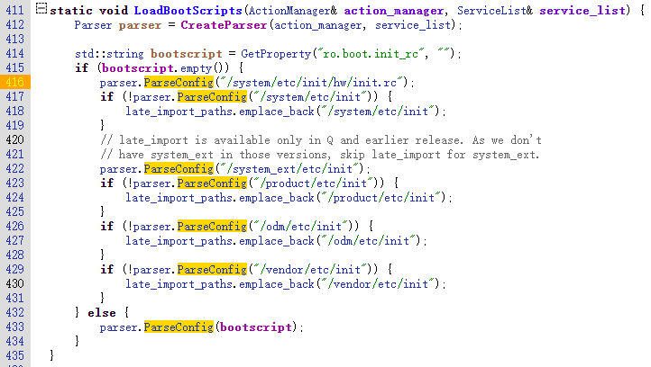
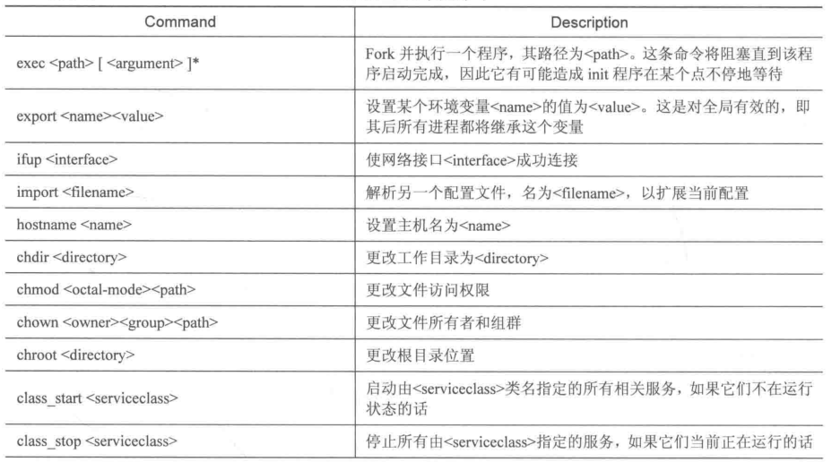
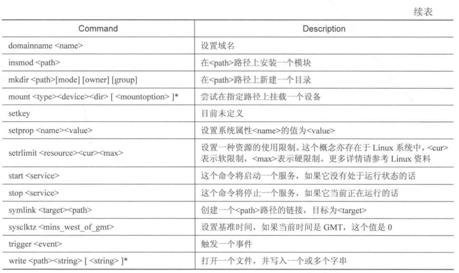
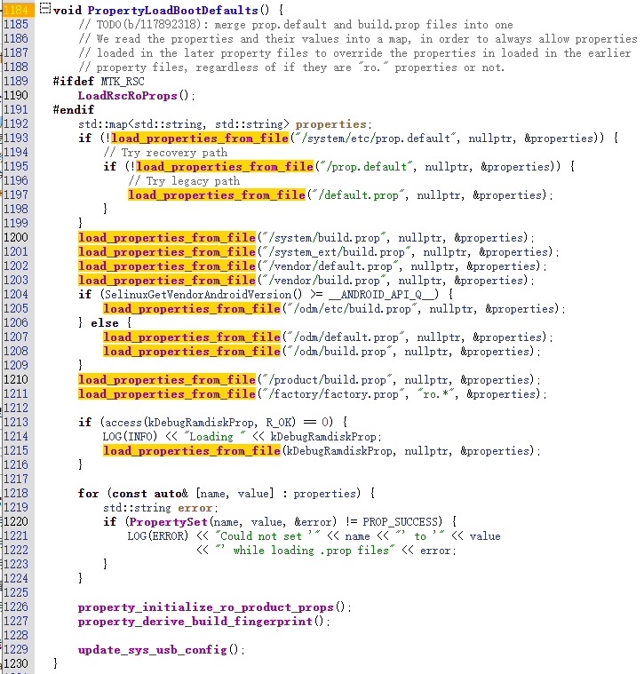

# 1 、rc启动脚本

## 1.1 rc文件读取及解析


​                            system/core/init/init.cpp




init进程会读取并解析如下几个关键路径下的所有rc文件:

* /system/etc/init/hw/init.rc

* /system/etc/init/   如果需要把rc放到这个目录下，则需要在android.mk编译模块时使用LOCAL_INIT_RC。该目录下的所有rc文件都会被init读取并解析。

* /vendor/etc/init/  如果需要把rc放到这个目录下，则除了在android.mk编译模块时使用LOCAL_INIT_RC外，还需要使用LOCAL_PROPRIETARY_MODULE := true 或LOCAL_VENDOR_MODULE  := true  。该目录下的所有rc文件都会被init读取并解析。


除此之外，init进程还会解析如下rc文件：

* /system/etc/init/hw/xxx.rc，在LOCAL_INIT_RC基础之上还指定了LOCAL_MODULE_RELATIVE_PATH := hw, 则rc文件编译后被放入 /system/etc/init/hw/。但 init进程并不加载/system/etc/init/hw/下的所有rc文件，只加载通过LOCAL_INIT_RC指定的rc文件。
* /vendor/etc/init/hw/xxx.rc，如果指定了LOCAL_INIT_RC，还指定了LOCAL_PROPRIETARY_MODULE和LOCAL_VENDOR_MODULE二者之一等于true，在此基础之上还指定了LOCAL_MODULE_RELATIVE_PATH := hw, 则rc文件编译后被放入 /vendor/etc/init/hw/。但 init进程并不加载/vendor/etc/init/hw/下的所有rc文件，只加载通过LOCAL_INIT_RC指定的rc文件。


## 1.2 rc文件之service


```
service <name> <excutable_file_full_pathname> [ < argument > ]
    <option>
    <option>
    <option>
    ...
```

常见option有：

* disabled 服务默认都会通过init进程执行class_start \<serviceclass\>来启动，加上disable后就不启动。

* oneshot 该服务只执行一次，进程退出后不再拉起

* onrestart <\command\>    该服务重启时进行的操作

* critical 该服务进程重启四次都失败后就重启整个系统

* class  \<serviceclass\>  常见的serviceclass有core，main，default，late_start，charger，hal，early_hal，如果没有指定该选项则默认为class default。

* socket   \<name\>   \<type\>  \<privilige\>  \<user\>  \<group\> ,例如  wpa_wlan0 dgram 660 wifi wifi

* interface

* user \<username\> ,如未指定该选项则默认是root

* group \<groupname1\>  \<groupname2\>  ...

* seclabel   设置selinux   label域，即安全上下文关于selinux可以参考 https://events.static.linuxfound.org/sites/events/files/slides/abs2014_seforandroid_smalley.pdf，已知有如下安全上下文：

  u:object_r:init:s0

  u:r:vendor_init:s0

  u:object_r:init_exec:s0


## 1.2 rc文件之action


```
on <trigger>
    <command1>
    <command2>
    <command3>
    ...
```

常见trigger：

* on \< early-init / init / early-fs / fs / post-fs / early-boot / boot \>

* on property:\<key\>=\<value\>              当系统属性\<key\>=\<value\>时触发

* on device-\<add/remove>-\<path\>     当path下添加/删除设备节点时触发

* on service-exited-\<name\>    当指定的服务\<name\>退出时触发


注意，这里的command不是shell命令，而是init内置的命令，配置环境相关的command相当于配置了init进程的环境变量，之后fork出的任何进程都将继承，如下：






此外安卓系统还提供了一些类似的shell命令，例如start、stop、setprop、chmod、chown、insmod、mkdir等等。


init.rc文件或其他rc文件中一般都有定义如下command用来启动属于该serviceclass的所有service：

class_start core

class_start main

class_start default

class_start late_start

class_start charger

class_start hal

class_start early_hal


## 1.3 rc文件之import

rc文件中可以使用import关键字来引入其他rc文件，可以使用系统属性变量

```
import /init.environ.rc
import /init.${ro.hardware}.rc
```


## 1.4 demo

```

service service_mtklog_open  /vendor/bin/mtklog_ctl.sh open
    class main
    user root
    group root
    oneshot
    seclabel u:object_r:vendor_file:s0
    disabled

service service_mtklog_close  /vendor/bin/mtklog_ctl.sh close
    class main
    user root
    group root
    oneshot
    seclabel u:object_r:init:s0
    disabled

on property:persist.mtklog.enable=1
    start service_mtklog_open

on property:persist.mtklog.enable=0
    stop service_mtklog_close
```


# 2、系统属性

## 2.1 设置/获取系统属性的方法

* JAVA android.os包Systemproperties类的set/get方法

  frameworks/base/core/java/android/os/SystemProperties.java

  ```
  android.os.Systemproperties.set(@NonNull String key, @Nullable String val)
  android.os.Systemproperties.get  get方法有很多重载的版本
  Systemproperties类set/get方法的底层调用libcutils的native函数。
  ```

* libcutils.so库

```
int property_set(const char* key, const char* value)
int property_get(const char* key, char* value)
property_set/get 其实是对bionic C库中__system_property_set/get的封装
```


* libc.so   bionic

  #include <sys/system_properties.h>

  PROP_VALUE_MAX 

  PROP_NAME_MAX
 ```
int __system_property_set(const char* key, const char* value)
int __system_property_get(const char* key, char* value)
底层通过unix套接字向init进程发送数据
 ```

* shell 
```
setprop  
getprop
start
stop
```

* init rc command
```
setprop  
start
stop
```


## 2.2 通过设置系统属性来启动/停止rc文件中定义的service

带有disable选项的rc服务可以通过如下方式来启动：

```
android.os.Systemproperties.set("ctl.start", "service_name")

property_set("ctl.start", "service_name");

__system_property_set("ctl.start", "service_name");

setprop  ctl.start   "service_name"

start        "service_name"
```


## 2.3 init进程对系统属性的处理

​      init进程在启动时会读取如下文件中的系统属性，并把他们写入共享内存：

​            system/core/init/property_service.cpp



除此之外，设置以“persist.”开头的特殊系统属性时会将其写入/data/property/persistent_properties文件，开机时也会读取该文件中的系统属性，并将其写入共享内存。


init进程启动后阻塞监听unix套接字。其他由init进程fork出的子进程，使用bionic C库的\_\_system_property_set时发送系统属性key-value到init进程监听的unix套接字，init进程读取后发现如果的系统属性key是ctl.start或ctl.stop，此时未把其值写入共享内存，而是对rc文件中定义的service执行相关操作，如果是其他则写入共享内存。其他由init进程fork出的子进程使用bionic C库的__system_property_get获取系统属性时则直接读取共享内存中的属性即可。


共享内存所有进程都能读取，但只有init进程能写入。


## 2.4 分类

* 按照系统属性是否有特殊用途分为特殊系统属性与普通系统属性：

  除了以下系统属性，其他的都为普通系统属性：

  属性名称以"ro."开头，那么这个属性被视为只读属性。一旦设置，属性值不能改变
  属性名称以"persist."开头，当设置这个属性时，其值也将写入/data/property/persistent_properties
  属性名称以"net."开头，当设置这个属性时，"net.change"属性将会自动修改,用于记录最新被修改的以net.开头的属性
  属性"ctrl.start"和"ctrl.stop"是用来启动和停止服务，这种属性不写入共享内存，设置后读取仍然为空


* 按照重启是否丢失分为永久/临时系统属性:

​        即在init进程启动时和启动后如果读取的prop文件中拥有的属性为永久系统属性，否则就是临时系统属性。显然"persist."开头的特殊系统属性是永久系统属性，它可以在系统运行其间增删或修改，而其他永久系统属性一般都是在构建系统镜像时确定了(并非指其值是多少确定了，而是指永久系统属性有哪些确定了，在系统运行其间除了"ro."开头的系统属性，其他的系统属性值都能修改)。


