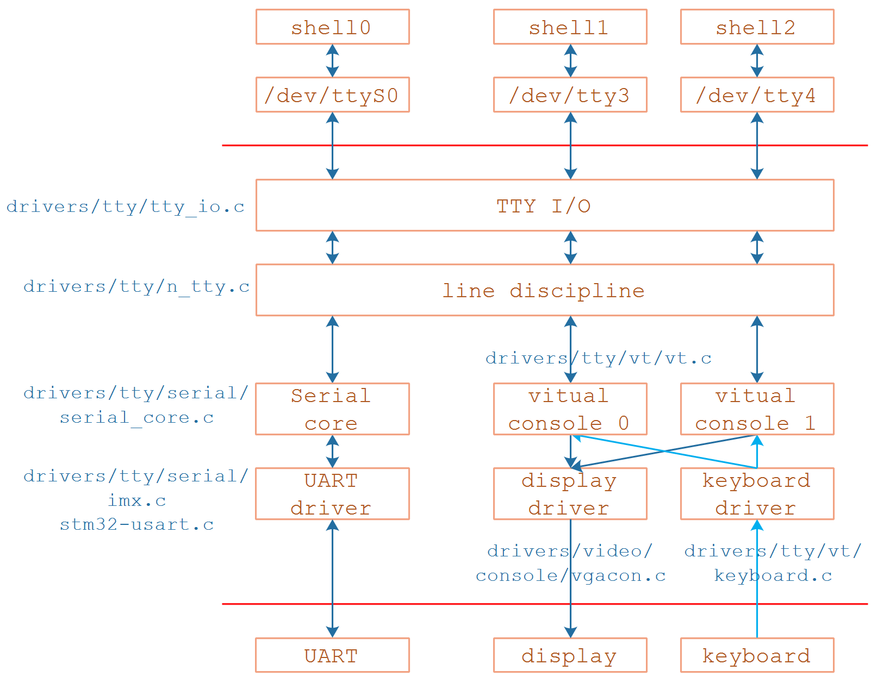

# 框架


发送：




# 应用程序到行规程

应用程序open/read/write /dev/ttyXXX会调用到内核的这里:


```
tty_open
    // 如果设备节点是(5,0)也就是/dev/tty, 表示当前TTY
    // 对于普通串口, 第一次open时必定失败
    tty = tty_open_current_tty(device, filp);

	// 第一次open串口时走这个分支
	if (!tty)
        // 通过driver来open tty，就是找到tty_driver，然后分配/设置tty_struct
		tty = tty_open_by_driver(device, inode, filp);
				// 1. 先找到对应的tty_driver
				driver = tty_lookup_driver(device, filp, &index);

				// 2. 如果曾经open过，会有对应的tty_struct
				tty = tty_driver_lookup_tty(driver, filp, index);

				// 3. 第1打开这个串口时肯定没有对应的tty_struct
                //    所以使用下面的函数初始化设备
				tty = tty_init_dev(driver, index);
							// 3.1 分配tty_strct
							tty = alloc_tty_struct(driver, idx);
										tty_ldisc_init(tty)
											tty->ldisc = tty_ldisc_get(tty, N_TTY);#缺省使用N_TTY行规程
										tty->ops = driver->ops;
							
							// 3.2 安装tty: 也就是driver->ttys[tty->index] = tty;
							retval = tty_driver_install_tty(driver, tty);

							// 3.3 调用行规程的open函数, 过于复杂，不分析
							//     n_tty.c中的n_tty_open函数
							retval = tty_ldisc_setup(tty, tty->link);


	......
    
    // ops是tty_operations类型
    // 对于串口ops就是serial_core.c中的uart_ops
    // uart_open
	if (tty->ops->open)
		retval = tty->ops->open(tty, filp);
	else
		retval = -ENODEV;
```


把tty->ldisc设置成N_TTY行规程后，后续的tty_read/tty_write最终会调用N_TTY行规程的read/write:


```
n_tty_read主要从N_TTY行规程内部的buffer读数据，数据来源参考后续芯片原厂串口驱动到行规程.

n_tty_write，它最终会调用tty->ops->write
tty是struct tty_struct
tty->ops是struct tty_operations,在open时把tty->ops指向了这里：
```


# 串口接收到行规程


#### 数据源头: 中断

##### IMX6ULL
文件：`drivers\tty\serial\imx.c`

函数：`imx_rxint`

```c
imx_rxint
    // 读取硬件状态
    // 得到数据
    // 在对应的uart_port中更新统计信息, 比如sport->port.icount.rx++;
    
    // 把数据存入tty_port里的tty_buffer
    tty_insert_flip_char(port, rx, flg)
    
    // 通知行规程来处理
    tty_flip_buffer_push(port);
    	tty_schedule_flip(port);
			queue_work(system_unbound_wq, &buf->work); // 使用工作队列来处理
				// 对应flush_to_ldisc函数
```


##### STM32MP157
  文件：`drivers\tty\serial\stm32-usart.c`

  函数：`stm32_usart_threaded_interrupt`

```c
stm32_usart_threaded_interrupt
    stm32_usart_receive_chars(port, true);
		// 通过DMA方式得到数据
		stm32_usart_receive_chars_dma(port);
			stm32_usart_push_buffer_dma(port, dma_size);
				// 把数据存入tty_port里的tty_buffer
				dma_count = tty_insert_flip_string(ttyport, dma_start, dma_size);
				// 更新统计信息
				port->icount.rx += dma_count;

		// 通知行规程来处理
		tty_flip_buffer_push(tport);
            tty_schedule_flip(port);
                queue_work(system_unbound_wq, &buf->work); // 使用工作队列来处理
                    // 对应flush_to_ldisc函数
```


# 在第三方驱动模块中使用原厂串口驱动

在第三方内核模块中，可先注册一个行规程，然后打开原厂串口驱动注册的tty设备，把默认的N_TTY替换成自己实现的行规程就能Hock原厂串口驱动的输入输出:

```
#define N_DEVELOPMENT	29	/* Manual out-of-tree testing */


//提供receive_buf2 hock原厂串口驱动的接收
//不提供write使得应用程序再使用这个tty节点进行write发送时tty_write直接返回-EIO
static struct tty_ldisc_ops ttyio_ldisc_ops = {
	.owner          = THIS_MODULE,
	.magic          = TTY_LDISC_MAGIC,
	.name           = "speakup_ldisc",
	.open           = ttyio_ldisc_open,
	.close          = ttyio_ldisc_close,
	.receive_buf2	= ttyio_receive_buf2,
};

if (tty_register_ldisc(N_DEVELOPMENT, &spk_ttyio_ldisc_ops)){
	pr_error("speakup: Failed to register ldisc\n");
}


dev_t dev_no;
tty_dev_name_to_number("ttyS0", &dev_no);

int ret = 0;
struct tty_struct *tty;
struct ktermios tmp_termios;
tty = tty_kopen(dev_no);//相当于调用了tty_open
if (IS_ERR(tty))
	return PTR_ERR(tty);

if (tty->ops->open)
	ret = tty->ops->open(tty, NULL);
else
	ret = -ENODEV;

if (ret) {
	tty_unlock(tty);
	return ret;
}

clear_bit(TTY_HUPPED, &tty->flags);

get_termios(tty, &tmp_termios);
down_read(&tty->termios_rwsem);
tmp_termios = tty->termios;
up_read(&tty->termios_rwsem);
// 配置无奇偶校验
tmp_termios.c_cflag &= ~(PARENB | PARODD);
// 配置1个停止位
tmp_termios.c_cflag &= ~CSTOPB;
// 配置8个数据位
tmp_termios.c_cflag &= ~CSIZE;
tmp_termios.c_cflag |= CS8;
// 禁用软件流控制
tmp_termios.c_iflag &= ~(IXON | IXOFF);
//使能 CTS/RTS 硬件流控
tmp_termios.c_cflag |= CRTSCTS;
//设置修改后的终端配置
tty_set_termios(tty, &termios);


tty_unlock(tty);

ret = tty_set_ldisc(tty, N_DEVELOPMENT);//设置成其他的行规程
if (ret)
	pr_err("speakup: Failed to set N_SPEAKUP on tty\n");

return ret;
```

为避免冲突，选用内核中没使用的预留的N_DEVELOPMENT作为ldisc索引