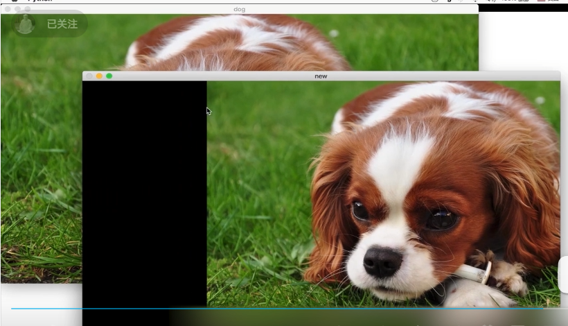
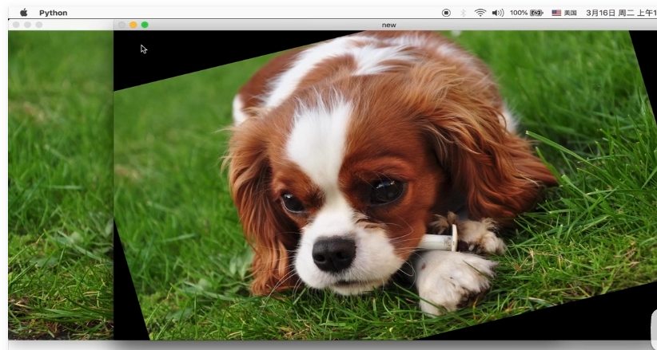

python -m pip config get global.index-url

python -m pip config set global.index-url https://pypi.tuna.tsinghua.edu.cn/simple

python -m pip config set global.index-url https://pypi.python.org/simple


python -m pip --version

python -m  pip install pip==21.0.1

python -m pip install --upgrade pip


python -m pip install  --upgrade numpy matlotlib opencv-python

python -m pip install  --upgrade numpy matlotlib opencv-python


# 缩放


# 平移变换

```
将像素点所在的位置（x,y）视为一个竖直的向量，将其左乘一个矩阵实现平移变换，x方向平移tx个单位，方向平移ty个单位，得到新的向量(x',y')即为变换后的向量，翻译过来就是变换后的像素点坐标。

[x']   [1  0  tx]   [x]
[y'] = [0  1  ty] * [y]

import cv2
import numpy as np
dog = cv2.imread('dog.jpeg')
h,w,ch = dog.shape
M = np.float32([[1,0,tx], [0,1,ty]])	
new = cv2.warpAffine(dog, M, (w,h))
cv2.imshow('dog',dog)
cv2.imshow('new',new)
cv2.waiteKey(0)
```





# 旋转变换

getRotationMaxtrix2D(center, angle, scale)

center旋转中心点

angle逆时针旋转角度

scale缩放比例，1.0表示不缩放,不改变图片本身大小，只是内容进行缩放，如果超过原有图片尺寸，则超过部分的内容丢失，如果小于图片本身尺寸，则用黑色0填充，如果想改变新图片的尺寸，则需要借助warpAffine的第三个参数

```
import cv2
import numpy as np
dog = cv2.imread('dog.jpeg')
h,w,ch = dog.shape
M = cv2.getRotationMaxtrix2D((w/2, h/2), 15, 1.0)
new = cv2.warpAffine(dog, M,  (int(w/2), int(h/2))
cv2.imshow('dog',dog)
cv2.imshow('new',new)
cv2.waiteKey(0)
```





# 三点变换

通过不在一条直线上的三点进行变换


# 滤波


高通滤波、低通滤波、均值滤波和高斯滤波是常用的图像处理滤波技术，它们在滤波操作时的特点和效果有所不同。

1. 低通滤波（Low-pass Filtering）: 低通滤波器允许低频信号通过，并抑制高频信号。它是一种平滑滤波器，主要用于去除图像中的噪声和细节，使图像变得模糊。常见的低通滤波器有均值滤波和高斯滤波。

- 均值滤波 (Mean Filtering)：对图像中的每个像素取周围邻域像素的平均值作为输出像素的值。它简单、计算快速，但对于滤除噪声以外的图像细节也会产生模糊效果。
- 高斯滤波 (Gaussian Filtering)：使用高斯函数作为权重来平滑图像，与前面提到的高斯滤波相同。由于高斯函数的特性，它能更好地保留图像的细节，并且可以根据需要调整权重系数，从而实现不同程度的平滑效果。

1. 高通滤波（High-pass Filtering）： 高通滤波器允许高频信号通过，并抑制低频信号。它对边缘和细节进行增强，可以用于图像锐化和边缘检测。

常见的高通滤波器包括：

- 拉普拉斯滤波 (Laplacian Filtering)：通过计算像素与其邻域像素的差异来增强图像中的边缘和细节。它可以提取图像中的高频信息，但往往会引入噪声。
- Sobel 滤波器 (Sobel Filtering)：通过计算图像中每个像素点的梯度值，突出显示图像中的边缘。

总结起来，低通滤波主要用于平滑图像、去除噪声；高通滤波主要用于图像增强、边缘检测；而均值滤波和高斯滤波是低通滤波器的具体实现方式，其中高斯滤波具有更好的平滑效果和细节保留能力。不同的滤波器可以根据具体需求选择使用。


# 形态学


## 全局二值化


## 局部二值化


## 腐蚀


## 膨胀


## 开运算

 腐蚀 + 膨胀   去除字符外部的噪点


## 闭运算

 膨胀 +  腐蚀  去除字符内部的噪点


## 形态学梯度

 原图 - 腐蚀 得到被腐蚀的边缘


## 顶帽运算

原图 - 开运算 得到字符外部的噪点(也有可能是有用信息，但尺寸比较小)


## 黑帽运算

原图 - 闭运算 得到符内部的噪点(也有可能是有用信息，但尺寸比较小)