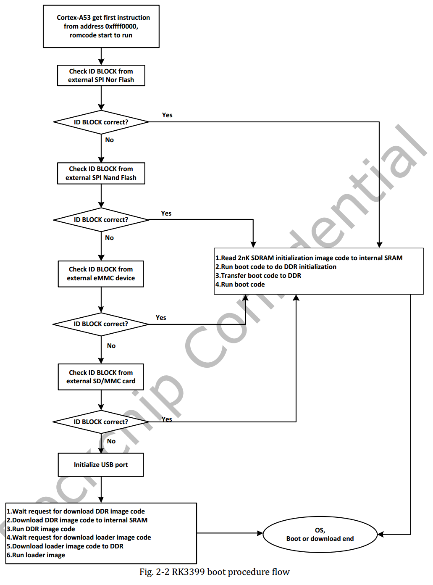
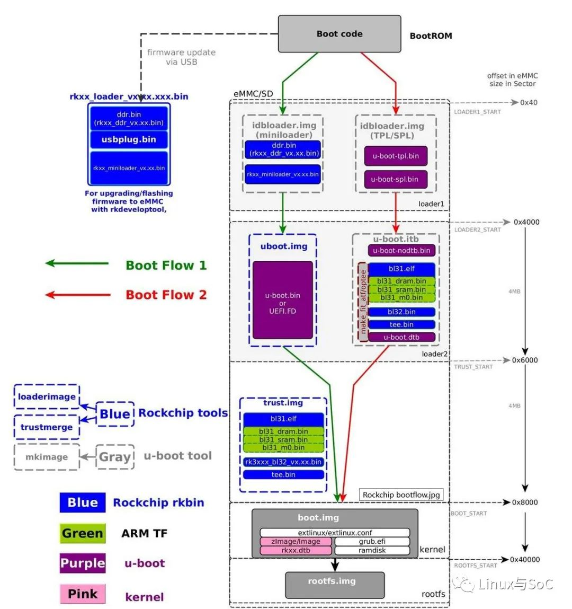

## 1.Download source code
radxa$ echo "export REPO_URL='https://mirrors.tuna.tsinghua.edu.cn/git/git-repo/'" >> ~/.bashrc
radxa$ source ~/.bashrc
radxa$ curl https://mirrors.tuna.tsinghua.edu.cn/git/git-repo -o /tmp/repo
radxa$ sudo cp /tmp/repo /usr/local/bin/repo
radxa$ sudo chmod +x /usr/local/bin/repo
radxa$ repo init -u https://gitee.com/ghjiee/rk3568.git -b Android11_Radxa_rk11 -m rockchip-r-release.xml
radxa$ repo sync -d --no-tags -j4

## 2.Use all-in-one build script
  radxa:rock-android11 $ source build/envsetup.sh            
  radxa:rock-android11 $ lunch rk3568_rock_3a_r-userdebug           # for Rock 3A
  radxa:rock-android11 $ ./build.sh -UACKup

## 3.Step by step Build
  ### 3.1 Setup board environment # for Rock 3A
  radxa:rock-android11 $ export PRODUCT_NAME="rk3568_rock_3a_r"
  radxa:rock-android11 $ export PRODUCT_UBOOT_CONFIG="radxa_rock_3a_toybrick"
  radxa:rock-android11 $ export PRODUCT_KERNEL_CONFIG="rockchip_defconfig"
  radxa:rock-android11 $ export PRODUCT_KERNEL_DTS="rk3568-rock-3a"

  ### 3.2 Build u-boot   The generated images are idbloader.img , and uboot.img
  radxa:rock-android11 $ cd u-boot
  radxa:rock-android11/u-boot $ make clean
  radxa:rock-android11/u-boot $ make mrproper
  radxa:rock-android11/u-boot $ make distclean
  radxa:rock-android11/u-boot $ ./make.sh ${PRODUCT_UBOOT_CONFIG}
  radxa:rock-android11 $ cd -

  ### 3.3 Building kernel
  radxa:rock-android11 $ cd kernel
  radxa:rock-android11/kernel $ ADDON_ARGS="CC=../prebuilts/clang/host/linux-x86/clang-r383902b/bin/clang LD=../prebuilts/clang/host/linux-x86/clang-r383902b/bin/ld.lld"
  radxa:rock-android11/kernel $ make clean
  radxa:rock-android11/kernel $ make $ADDON_ARGS ARCH=arm64 ${PRODUCT_KERNEL_CONFIG}
  radxa:rock-android11/kernel $ make $ADDON_ARGS ARCH=arm64 ${PRODUCT_KERNEL_DTS}.img -j$(nproc)
  radxa:rock-android11 $ cd -

  ### 3.4 Building AOSP
  radxa:rock-android11 $ source build/envsetup.sh
  radxa:rock-android11 $ lunch ${PRODUCT_NAME}-userdebug
  radxa:rock-android11 $ make -j$(nproc)

  ### 3.5 Make images
  radxa:rock-android11 $ rm -rf rockdev
  radxa:rock-android11 $ ln -s RKTools/linux/Linux_Pack_Firmware/rockdev .
  radxa:rock-android11 $ ./mkimage.sh

  ### 3.6 Pack Image
  radxa:rock-android11 $ cd rockdev
  radxa:rock-android11/rockdev $ rm -rf Image
  radxa:rock-android11/rockdev $ ln -s Image-${PRODUCT_NAME} Image

  ### 3.7 RkUpdate Image  The images under rockdev/ are `update.img`
  radxa:rock-android11/rockdev $ ./mkupdate_rk356x.sh

  ### 3.8 gpt Image
  radxa:rock-android11/rockdev $ ./android-gpt.sh

  

## 4. Install
SD card + gpt img + balenaEtcher
RKDevTool.exe  write android images to emmc by usb

## 5. boot

https://wiki.radxa.com/Rock3/Android11
https://wiki.radxa.com/Rock3/dev/usb-install
https://wiki.radxa.com/Rock3/install/microSD

https://wiki.radxa.com/Rock3/hardware/rock3a-gpio

J15
pin1外                                    pin2中          pin3里                
FSPI_CLK/FLASH_ALE   +     GND   +   SARADC_VIN0_KEY/RECOVERY

J4
pin1                      pin2
eMMC_CLKOUT/FLASH_DQS     GND

### 5.1 boot devices  select

选择启动的存储器:
1.spi nand flash boot  全部悬空
2.emmc boot            把FSPI_CLK/FLASH_ALE接地,或者spi nand flash中的镜像校验失败
3.sd boot              在上一条的基础之上再把eMMC_CLKOUT/FLASH_DQS接地,或者emmc中的镜像校验失败
4.usb boot(maskroot)   在上一条的基础之上,不插sd卡或sd卡中的镜像校验失败。

### 5.2 boot mode select(RK自己搞的一套preloader才支持)

选择启动模式:
从存储器读取preloader后执行preloader，preloader根据SARADC_VIN0_KEY/RECOVERY选择是进行正常启动还是切换到loader模式。
preloader分为好几种：

rkxx_loader_vxxx.xxx.bin

idbloader.img(rkxx_ddr_vx.xx.bin,  rkxx_miniloader_vx.xx.bin)

idbloader.img(u-boot-tpl.bin,  u-boot-spl.bin)

以下是RK自己搞的一套preloader：

rockdev/Image-rk356x_rock_3a_r/MiniLoaderAll.bin就是u-boot/rk356x_spl_loader_v1.11.112.bin，u-boot/rk356x_spl_loader_v1.11.112.bin由u-boot/tools/boot_merger工具根据rkbin/RKBOOT/RK3568MINIALL.ini配置文件制作而成，配置文件中指定使用如下文件来生成rk356x_spl_loader_v1.11.112.bin  :

rkbin/bin/rk35/rk3568_ddr_1560MHz_v1.11.bin    用来初始化DDR

rkbin/bin/rk35/rk356x_usbplug_v1.14.bin               用来进入loader模式后与PC工具交互

rkbin/bin/rk35/rk356x_spl_v1.12.bin                        用来加载镜像

以下是开源方案的preloader：

u-boot/tpl/u-boot-tpl.bin     用来初始化DDR

u-boot/spl/u-boot-spl.bin    用来加载镜像

以下是rk3399上的preloader，idbloader.img(miniloader)就是MiniLoaderAll.bin，稍微不同的是在rk3568上MiniLoaderAll.bin还有usbplug.bin

https://cloud.tencent.com/developer/article/1571935

启动方案分为3种：

1：maskrom + MiniLoaderAll.bin   。

2:  某种存储介质 + MiniLoaderAll.bin + uboot.img/UEFI  。默认使用的是这种方式

3:  某种存储介质 +  + idbloader.img(u-boot-tpl.bin,  u-boot-spl.bin)   +   u-boot.itb  。执行u-boot/make.sh时指定--tpl和--spl参数后编译出的idbloader.img才是使用u-boot/tpl/u-boot-tpl.bin和u-boot/spl/u-boot-spl.bin来构建的。

编译完后最终镜像一般在rockdev/Image-rk356x_rock_3a_r目录下，但 u-boot.itb在此路径 u-boot/fit/u-boot.itb并未拷贝过去。

